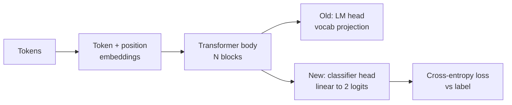
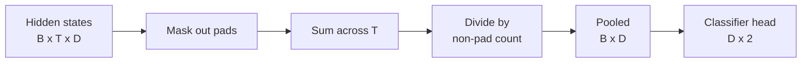
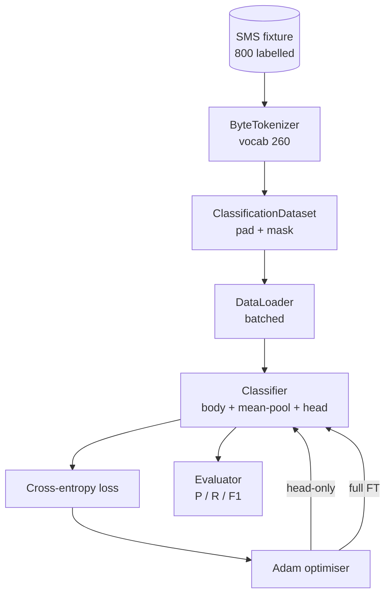

# 石课38: 分类器 按头调整 微调 分类器 结业

> B轨的第一颗结石. 预训练的语言模型是一个自我注意的块, 当你想要垃圾和肉时,头脑是错误的,但身体基本上是正确的. 这一课将头部撕裂,将两类线性层粘贴到合并的表示上, 评估是精确,回忆,F1在一个持久的分区. 你会知道每个策略都能给你带来什么,

> **【中文解读】**本节是实现分类微调的综合项目.


**Type:** Build | **类型:** Build
**Languages:** Python (torch, numpy) | **语言:** Python (torch, numpy)
**Prerequisites:** Phase 19 lessons 30-37 (NLP LLM track: tokenizer, embedding table, attention block, transformer body, pre-training loop, checkpointing, generation, perplexity) | **前置知识:** Phase 19 lessons 30-37 (NLP LLM track: tokenizer, embedding table, attention block, transformer body, pre-training loop, checkpointing, generation, perplexity)

>  前置B9/20号号号号号号号号号号号号号号号号号号号号号号号号号号号号号号号号号号号号号号号号号号号号号号号号号号号号号号号号号号号号号号号号号号号号号号号号号号号号号号号号号号号号号号号号号号号号号号号号号号号号号号号号号号号号号号号号号号号号号号号号号号号号号号号号号号号号号号号号号号号号号号号号号号号号号号号号号号号号号号号号号号号号号号号号号号号号号号号号号号号号号号号号号号号号号号号号号号号号号号号号号号号号号号号号号号号号号号号号号号号号号号号号号号号号号号号号号号号号号号号号号号号号号号号号号号号号号号号号号号号号号号号号号号号号号号号号号号号号号号号号号号号号号号号号号号号号号号号号号号号号号号号号号号号号号号号号号号号号号号号号号号号号号号号号号号号号号号号号号号号号号号号号号号号号号号号号号号号号号号号号号号号号号号号号号号号号号号号号号号号号号号号号号号号号号号号号号号号号号号号号号号号号号号号号号号号号号号号号号号号号号号号号号号号号号号号号号号号号号号号号号号号号号号号号号号号号号号号号号号号号号号号号号号号号号号号号号号号号号号号号号号号号号号号号号号号号号号号号号号号号
>  分类器微调 = "把 LM 变成分类器"──预训 LM 主体对,但预测头错──撕掉 LM头,粘两层线性分类器到池化表示──两种训练策略:仅最终层对全量微调──评估精度/召回/F1──
**Time:** ~90 minutes | **时间:** ~90 minutes

## 学习目标

- 换一个语言模型头换一个分类头,而不需要重新启动机器.
  中文翻译:不重新启动身体,用分类头取代语言模型头.
- 实施两种训练模式:体 (仅用于头部) 和完全细调,共享一个训练循环.
  中文翻译:实施两个训练模式:冷身体 (仅用头) 和完全细调,共享一个训练循环.
- 建立一个知情的数据管道, 填充,掩盖填充,
  中文翻译:建立一个知情的数据管道,将填充,掩盖填充,并汇集注意力输出.
- 计算精度,回忆,F1和从原始记录中进行混矩阵.
  中文翻译:计算精度,回忆,F1,并从原始logits中进行混矩阵.
- 参数数量,训练时间和头部空间之间的差异.
  中文翻译:参数数数量,训练时间和头部间的交易理由.

## 问题问题

> **【中文解读】**预训的语言模型是一个自注意块堆,末端是标志 预测头. 当你需要垃圾邮件分类时,头是错误的,但主体大部分是对的.

> **【拓展：LLM 分类微调的实际应用】**使用LLM 进行分类调微调已经成为行业标准.`transformers`库中 `AutoModelForSequenceClassification`在生产中,BERT风格编码器 (如DeBERTa-v3) 在分类任务中仍然具有竞争力:参数更少,推理更快.LLM的优势在于少样本泛化800个样本足以微调一个通用LLM,但可能不足以从头脑训练专用分类器.输出头将最后一个隐藏状态投射到1000代币词汇.你现在有800个标记或垃圾邮件的短信,你想要一个二进制分类器.三个选择存在.

错误的选择是从零开始训练一个新的分类器,使用800个例子.预训练模型的体格已经编码了有用的结构:词的身份,位置,简单的随机.

> 错误的选择是从零开始训练一个新的分类器,使用800个例子.预训练模型的体格已经编码了有用的结构:词的身份,位置,简单的随机.


只有头部训练是快速的,几乎是免费的,并且很少用这些小数据过度训练. 完全细调是慢的,可以在小数据上过度调整,但在下游域从预训练体中漂移时达到更高的精度.

> 只有头部训练是快速的,几乎是免费的,并且很少用这些小数据过度训练. 完全细调是慢的,可以在小数据上过度调整,但在下游域从预训练体中漂移时达到更高的精度.


这一课是建立两者,所以你可以在同一器件上比较它们.

> 本课构建该契约.


## 概念的概念



模型是一个函数`f_theta(tokens) -> hidden_states`头部是一个功能`g_phi(hidden) -> logits`换头意味着保持`theta`并且更换`g_phi`身体的参数是最昂贵的部分.头部是一个单一的线性层.

> 模型是一个函数`f_theta(tokens) -> hidden_states`头部是一个功能`g_phi(hidden) -> logits`换头意味着保持`theta`并且更换`g_phi`身体的参数是最昂贵的部分.头部是一个单一的线性层.


两个可训练的参数组是重要的:

- `theta`按注意力块的数万个重量.
  翻译: 中文`theta`按注意力块的数万个重量.
- `phi`子的头`hidden_dim * num_classes`体重加上偏见.
  翻译: 中文`phi`子的头`hidden_dim * num_classes`体重加上偏见.

在只对头进行训练时,你计算了梯度.`phi`并且将它们对抗.`theta`皮托奇让你设置`requires_grad=False`优化器只能看到头部,身体就会结.

> 在头部训练中,你计算了梯度`phi`并且将它们对抗.`theta`皮托奇让你设置`requires_grad=False`优化器只能看到头部,身体就会结.


在完全细调中,你让梯度回流整个堆.身体的重量漂移到符合分类目标. 遗忘小数据的风险是灾难性的:身体的预训练会被过度的噪音冲洗.

> 在完整的细调中,你让梯度回流整个堆.身体的重量漂移到符合分类目标. 风险是灾难性的忘记小数据:身体的预训练被过度适合的噪音冲洗.


## 汇集问题

> **【中文解读】**分类器需要一个向量表示整个序列,而不是每个代币一个向量――三种常见选择:平均值池化(加权平均,最简单稳定)  CLS 池化(BERT方式,需要预训练 CLS代币) 末代币 池化(GPT 分类器方式) ・本课使用带显着注意力掩盖加权的平均值池化――

类别器需要一个向量,而不是一个向量.

> 一个分类器需要一个向量,而不是一个向量.


- **Mean pool**平均测量,按注意力面具的重量,
  翻译: 中文**Mean pool**平均测量,按注意力面具的重量,
- **CLS pool**预备一个特殊的代币,只使用其输出.
  翻译: 中文**CLS pool**预备一个特殊的代币,只使用其输出.
- **Last-token pool**接不到的代币是GPT类分类器所做的.
  翻译: 中文**Last-token pool**接不到的代币是GPT类分类器所做的.

这一课使用了中值聚合和明确的注意力面具权重. 它是最简单的,在序列长度上提供了稳定的信号,并且不需要预训练 CLS 代币.

> 这个课程使用了明确的注意力面具权重的中共化. 它是最简单的,在序列长度上提供了稳定的信号,并且不需要预训练 CLS 代币.




## 数据

通过确定性生成400个垃圾邮件和400个腿的SMS信息.`code/main.py`发电机使用固定种子,选择模板,替换插槽填充器,发出长度为5至25个代币之间的信息.实际数据集有噪音.

> 八百个短信,平衡400个垃圾邮件和400个,以确定性生成在 `代码/主.


测试组分为80/20:640列车,测试160. 分裂是层次的,因此测试组保持50/50平衡.一个已知平衡的延伸组允许精度和回忆被读取为诚实的数字.

> 测试组分为80/20:640列车,160测试. 分裂是层次的,因此测试组保持50/50平衡.一个已知平衡的延伸组允许精度和回忆被读取为诚实的数字.


## 标准

双式分类,类1作为正类 (垃圾邮件). 计数为:

> 双向分类,类1是正分类 (垃圾邮件).


- `TP`预测的垃圾邮件,是垃圾邮件.
  翻译: 中文`TP`预测的垃圾邮件,是垃圾邮件.
- `FP`预测的垃圾邮件是肉.
  翻译: 中文`FP`预测的垃圾邮件是肉.
- `FN`预测的子,是垃圾邮件.
  翻译: 中文`FN`预测的子,是垃圾邮件.
- `TN`预测的子,是子.
  翻译: 中文`TN`预测的子,是子.

标题的三个指标:

- `precision = TP / (TP + FP)`在标记的垃圾邮件中,实际上是多少?
  翻译: 中文`precision = TP / (TP + FP)`在标记的垃圾邮件中,实际上是多少?
- `recall = TP / (TP + FN)`实际的垃圾邮件中,模型旗的比例是多少?
  翻译: 中文`recall = TP / (TP + FN)`实际的垃圾邮件中,模型旗的比例是多少?
- `F1 = 2 * P * R / (P + R)`两者之间的和平均值.
  翻译: 中文`F1 = 2 * P * R / (P + R)`两者之间的和平均值.

模拟图为两种训练模式的模拟图.

> 模拟模拟模拟模拟模拟模拟模拟模拟模拟模拟模拟模拟模拟模拟模拟模拟模拟模拟模拟模拟模拟模拟模拟模拟模拟模拟模拟模拟模拟模拟模拟模拟模拟模拟模拟模拟模拟模拟模拟模拟模拟模拟模拟模拟模拟模拟模拟模拟模拟模拟模拟模拟模拟模拟模拟模拟模拟模拟模拟模拟模拟模拟模拟模拟模拟模拟模拟模拟模拟模拟模拟模拟模拟模拟模拟模拟模拟模拟模拟模拟模拟模拟模拟模拟模拟模拟模拟模拟模拟模拟模拟模拟模拟模拟模拟模拟模拟模拟模拟模拟模拟模拟模拟模拟模拟模拟模拟模拟模拟模拟模拟模拟模拟模拟模拟模拟模拟模拟模拟模拟模拟模拟模拟模拟模拟模拟模拟模拟模拟模拟模拟模拟模拟模拟模拟模拟模拟模拟模拟模拟模拟模拟模拟模拟模拟模拟模拟模拟模拟模拟模拟模拟模拟模拟模拟模拟模拟模拟模拟模拟模拟模拟模拟模拟模拟模拟模拟模拟模拟模拟模拟模拟模拟模拟模拟模拟模拟模拟模拟模拟模拟模拟模拟模拟模拟模拟模拟模拟模拟模拟模拟模拟模拟模拟模拟模拟模拟模拟模拟模拟模拟模拟模拟模拟模拟模拟模拟模拟模拟模拟模拟模拟模拟模拟模拟模拟模拟模拟模拟模拟模拟模拟模拟模拟模拟模拟模拟模拟模拟模拟模拟模拟模拟模拟模拟模拟模拟模拟模拟模拟模拟模拟模拟模拟模拟模拟模拟模拟模拟模拟模拟模拟模拟模拟模


## 建筑,建筑
```figure
cap-classifier-head-swap
```

## 建筑



机器是一个故意微小的变压器:词汇260,隐藏64,4个头,2个块,最大序列32. 它足够小,可以训练两个模式在CPU上90秒内融合.它不是在课中预训练的;相反,它是`pretrain_quick`帮助者在同一器件的文本上进行了五次LM训练,以给身体一个非微不足道的起点. 这使得课程保持自有.

> 机体是一个故意微小的变压器:词汇260,隐藏64,4头,2块,最大序列32. 它足够小,可以训练两个模式在90秒内在CPU上融合.它不是在课中预训练;相反,它是`pretrain_quick`帮助者在同一器件的文本上进行了五次LM训练,以给身体一个非微不足道的起点. 这使得课程保持自有.


## 你会建造什么

实施是一个`main.py`加上一个试验模块 (`code/tests/test_main.py`)

> 实现是其中一个`main.py`加上一个试验模块 (`code/tests/test_main.py`翻译)


1. `ByteTokenizer`图片字节到身份证,保留一个pad身份证.
2. `Block`转换器块,多头注意力和输送前置层.
3. `LMBody`标志 + 位置嵌入式加上一个堆块. 返回隐藏状态.
4. `MeanPool`: 按重量平均在序列轴上.
5. `Classifier`身体,池,线性头. 身体在各种政权中都是相同的.
6. `freeze_body`其他`unfreeze_body`转换`requires_grad`身体参数.
7. `train_classifier`接受模型和可用于任何参数组的优化器.
8. `evaluate`: 运行测试集,并返回`Metrics(precision, recall, f1, confusion)`现在,我们要去.
9. `run_demo`预训练身体,然后训练和评估头部,然后完整,打印了两份报告,

## 为什么比较是重要的

> **【拓展：参数高效微调 (PEFT)】**仅训练头和全模型微调是两个极端.中间地带包括:(1) LoRA (Hu et al., 2021):在每个线性层旁添加低排分解矩阵,仅训练这些矩阵(通常 < 1% 参数);(2) 预写调整:在每个层前添加可学习的前代币;(3) 适配器:在每个层插入小型瓶网络.LoRA 已成为事实标准,被LLaMA、Mistral、Stable Diffusion等广泛采用.

只有头部的模式通常训练得更快,更优雅.在这个装置上,你通常看到准确度接近0.9和回忆接近0.85在二十个时代的头部训练后.完全的细节调整需要大约三倍的时间,并且在随机种子上都会降落在几点内.

> 只有头部的训练通常更快,更优雅. 在这个装置上,你通常看到准确度接近0.9和回忆接近0.85在二十个时代的头部训练后. 完全的细调需要大约三倍的时间,并且在随机种子上都会降落在几点内.


课程不选胜者.它教你读取数字和成本.在800个例子和一个小体上,只有一头才是正确的选择.在80,000个例子和一个更大的体上,完整的细节调整开始付出代价.从这个课程中你取出的合同是API:相同`train_classifier`函数处理了两个,而转换是一个调用.

> 课程不选赢家.它教你读取数字和成本.在800个例子和一个小体上,只有一头才是正确的选择.在80,000个例子和一个更大的体上,完整的细节调整开始付出代价.从这个课程中你取出的合同是API:相同`train_classifier`函数处理了两个,而转换是一个调用.


## 实现目标

- 加入第三种模式,只能解最后一个块,这有时被称为部分细调. 它成本低于完整的FT,并且只能学习更多.
  中文翻译:添加第三个模式,只解最后一个块.这有时被称为部分细调.它成本低于全额FT,并且只学习更多.
- 增加学习率调度器.头部上的可西因时间表加上身体上的较小的常量率是常见的生产设置.
  中文翻译:添加学习率调度器.头部上的可西因时间表加上身体上的较小的常数率是常见的生产设置.
- 换成一个学习的注意力池:一个学习的查询的小注意力层. 这通常比较长的序列中平均的注意力池.
  中文翻译:用学习注意力池代替平均聚合力:一个学习查询的小注意力层.这通常超过较长的序列的平均聚合力.

执行给你,测试合同,数字是你的.

> 实践给你,测试合同,数字是你推的.

