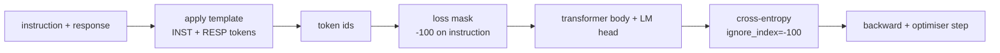
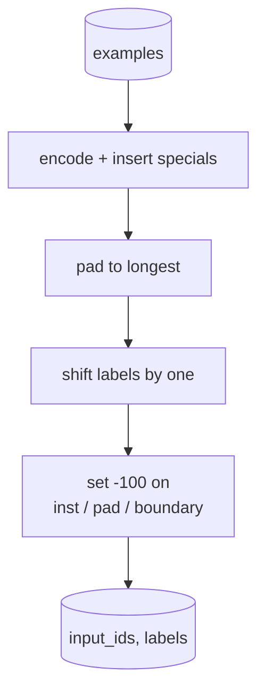
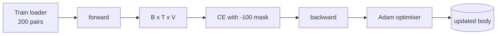

# 石课39:指令调整由监督调整

> 预训练的基模型可以延长一个序列,但不能遵循指令. 监督的细节调整是最小的改变, 问题是,你只想把损失计算在响应上,而不是指令上. 这一课构建了Alpaca式SFT循环,具有自定义的集函数,以掩盖指令令标记.`ignore_index=-100`通过精确匹配,对待了200个指令-响应对,

> **【中文解读】**本节是综合项目 实现指令微调SFT.


**Type:** Build | **类型:** Build
**Languages:** Python (torch, numpy) | **语言:** Python (torch, numpy)
**Prerequisites:** Phase 19 lessons 30-37 (NLP LLM track: tokenizer, embedding table, attention block, transformer body, pre-training loop, checkpointing, generation, perplexity) | **前置知识:** Phase 19 lessons 30-37 (NLP LLM track: tokenizer, embedding table, attention block, transformer body, pre-training loop, checkpointing, generation, perplexity)

>  前置B10/20号轨道.
>  SFT = "教会 LM 听指令"――基础模型能续写但不能跟随指令――阿尔帕卡风格 SFT:(指令,期望回复) 对训练主体预测回复代币――关键技巧:损失只算回复不算指令(使用`ignore_index=-100`掩码) ・200条 指示回复训练+精确匹配 评估。
**Time:** ~90 minutes | **时间:** ~90 minutes

## 学习目标

- 格式化对应指示数据,以单个因果序列,并使用明确的边界代码.
  中文翻译:将命令-响应数据组合成一个单个因果序列,并使用明确的边界代码.
- 建立一个掩盖指令代币的集合函数,以便交叉值只计算响应代币.
  中文翻译:构建一个掩盖指示令牌的集合函数,以便交叉缩只计算响应令牌.
- 训练一个小的变体体在SFT目标下,看评估指标的移动.
  中文翻译:在SFT目标下训练一个小的变压器体,并观察评估测量运动.
- 实现贪和温度样本生成,尊重响应开始界限.
  中文翻译:执行贪和温度样本的生成,尊重响应开始界限.
- 计算生成的完成量上的确切匹配.
  中文翻译:计算生成的完成量.

## 问题问题

> **【中文解读】**基座模型在"下一个代币预测"上训练,不知道什么是指令――给它"法国的首都是什么?",它会继续问问或发明新句子――SFT的修改是将指令响应格式化为带边界代币的因果序列,但仅在响应代币上计算损失指令代币的目标位置设置.`-100`(`ignore_index`),贡献零梯度和零损失.

> **【拓展：SFT 数据集与对齐研究】**艾尔帕卡 (斯坦福, 2023) 使用GPT-3.5 生成的 52K 指令响应对,开创了"自我指导" (Self-Instruct) 范式――LIMA (Meta, 2023) 证明只需要1000个高质量的示例就能训练出竞争力强的模型――多利 (Databricks) 和开放助手提供开源SFT 数据集――现代SFT通常使用聊天模板ChatML、ChatML-Legacy、LLaMA聊天等),支持多轮对话――失掩码(本课的核心技巧) 在所有框架中都是标准实践――展示它链`"What is the capital of France?"`模型有语言,但没有格式合同.

任何培训例都会成为一个单一的序列,有三个区域:

> 任何训练例都会变成一个单一的序列,有三个区域:


```text
<INST> What is the capital of France? <RESP> The capital of France is Paris.
```

边界代币是训练时间保留的特殊代币.`<RESP>`基本模型的下一个标志目标仍然适用;它只是在一个体积上训练,每个例子都有这个形状.

> 模型学习了所有后面的东西.`<RESP>`基本模型的下一个标志目标仍然适用;它只是在一个体积上训练,每个例子都有这个形状.


但是有一个问题.如果你把整个序列输入到尼拉交叉缩损失中,你就训练模型来预测指示符号.

> 但有一个问题.


## 概念的概念

> **【中文解读】**信息技术技术技术技术技术技术技术技术技术技术技术技术技术技术技术技术技术技术技术技术技术技术技术技术技术技术技术技术技术技术技术技术技术技术技术技术技术技术技术技术技术技术技术技术技术技术技术技术技术技术技术技术技术技术技术技术技术技术技术技术技术技术技术技术技术技术技术技术技术技术技术技术技术技术技术技术技术技术技术技术技术技术技术技术技术技术技术技术技术技术技术技术技术技术技术技术技术技术技术技术技术技术技术技术技术技术技术技术技术技术技术技术技术技术技术技术技术技术技术技术技术技术技术技术技术技术技术技术技术技术技术技术技术技术技术技术技术技术技术技术技术技术技术技术技术技术技术技术技术技术技术技术技术技术技术技术技术技术技术技术技术技术技术技术技术技术技术技术技术技术技术技术技术技术技术技术技术技术技术技术技术技术技术技术技术技术技术技术技术技术技术技术技术技术技术技术技术技术技术技术技术技术技术技术技术技术技术技术技术技术技术技术技术技术技术技术技术技术技术技术技术技术技术技术技术技术技术技术技术技术技术技术技术技术技术技术技术技术技术技术技术技术技术技术技术技术技术技术技术技术技术技术技术技术技术技术技术技术技术技术技术技术技术技术技术技术技术技术技术技术技术技术技术技术技术技术技术技术技术技术技术技术技术技术技术技术技术技术技术技术技术技术技术技术技术技术技术技术技术技术技术技术技术技术技术技术技术技术技术技术技术技术技术技术技术技术技术技术技术技术技术技术技术技术技术技术技术技术技术技术技术技术技术技术技术技术技术技术技术技术技术技术技术技术技术技术技术技术技术技术技术技术技术技术技术技术技术技术技术技术技术技术技术技术技术技术技术技术技术技术技术技术技术技术技术技术技术技术技术技术技术技术技术技术技术技术技术 技术技术技术技术技术技术技术技术技术技术技术技术技术技术技术技术技术技术 技术技术技术 技术技术技术技术技术技术 技术技术技术技术 技术技术技术技术技术技术 技术 技术 技术 技术 技术 技术 技术 技术 技术 技术 技术 技术 技术 技术 技术 技术 技术 技术 技术 技术 技术 技术 技术 技术 技术 技术 技术 技术 技术 技术 技术 技术 技术 技术 技术 技术 技术 技术 技术 



`ignore_index`是一个特征`torch.nn.functional.cross_entropy`任何目标位置等于`ignore_index`光的定制是:`-100`结合函数构建两个子,例如: `input_ids`其他类型的类型`labels`(本文的副本)`input_ids`通过 `-100`)

> `ignore_index`是火的特征.


模型在前进传递过程中看到整个序列;注意力可以关注指示. 损失只会计算响应代币. 这正是你想要的:指示条件,预测响应.

> 输出时,输出时,输出时,输出时,输出时,输出时,输出时,输出时,输出时,输出时,输出时,输出时,输出时,输出时,输出时,输出时,输出时,输出时,输出时,输出时,输出时,输出时,输出时,输出时,输出时,输出时,输出时,输出时,输出时,输出时,输出时,输出时,输出时,输出时,输出时,输出时,输出时,输出时,输出时,输出时,输出时,输出时,输出时,输出时,输出时,输出时,输出时,输出时,输出时,输出时,输出时,输出时,输出时,输出时,输出时,输出时,输出时,输出时,输出时,输出时,输出时,输出时,输出时,输出时,输出时,输出时,输出时,输出时,输出时,输出时,输出时.


## 数据

> **【拓展：SFT 数据质量的重要性】**利马 (Meta, 2023) 的核心发现是"数据质量比数量更重要"1000个精心标记的实例训练模型,在人类评估中优于使用52K自动生成数据训练的阿尔帕卡.本课程的200个确定性生成样本涵盖了6种任务类型.事实答,算术,列表提取,摘要,代码,定义),每个任务的难度梯度从简单到复杂.生产级SFT数据集通常需要10K-100K高质量样本,数据清洗是重重重的前置和重重重步骤.

通过确定性生成200个指示响应对`main.py`它们涵盖六种任务类型:

> 通过确定性生成200个指示响应对`main.py`它们涵盖了六种任务类型:


- 实事单次投射 (X项资本)
  中文翻译:实际单次射击 (X的资本)
- 算术
  中文翻译:算法
- 清单提取
  中文翻译:列表提取
- 一句总结
  中文翻译:一句总结
- 代码 (打印,排序)
  中文翻译:代码 (打印,排序)
- 定义
  中文翻译:定义

每个任务都有一个模板的指示和确定性反应.这是故意简单的.精确匹配很脆弱,课程使用一个固定,正确答案是一个特定字符串.真正的SFT数据集需要模糊的指标;原则是相同的.

> 每个任务都有一个模板的说明和确定性反应.这是故意简单的.精确匹配很脆弱,课程使用一个固定,正确答案是一个特定字符串.真正的SFT数据集需要模糊的指标;原则是相同的.


测试集包括所有六种任务类型,以便每类别可报告精确匹配.

> 分为160列车,40测试.测试集涵盖了所有六种任务类型,因此每个类别可以报告精确匹配.


## 标记和接

标记器是字节级别的,有三个保留的特点:

- `INST_ID = 256`标志着教学区的开始.
  翻译: 中文`INST_ID = 256`标志着教学区的开始.
- `RESP_ID = 257`标志着指令和响应之间的界限.
  翻译: 中文`RESP_ID = 257`标志着指令和响应之间的界限.
- `PAD_ID = 258`:适用于变长批量.
  翻译: 中文`PAD_ID = 258`:适用于变长批量.

序列是`[INST] inst_bytes [RESP] resp_bytes [PAD]*`聚合函数:

> 序列是`[INST] inst_bytes [RESP] resp_bytes [PAD]*`结函数:(翻译)


1. 标志着每一个例子.
2. 入每一个分组中的例子,
3. 建筑物`labels``input_ids`转移到一个 (因果性LM目标),其中:
   - 指示区域被取代为 `-100`现在,我们要去.
     中文翻译:指令区域被取代为 `-100`现在,我们要去.
   - 填充区域被取代为`-100`现在,我们要去.
     中文翻译:灌区域被取代为`-100`现在,我们要去.
   - 其他`RESP_ID`边界位置本身被取代为 `-100`(你不训练模型来预测边界标志;它预测下面的情况).
     中文翻译: `RESP_ID`边界位置本身被取代为 `-100`(你不训练模型来预测边界标志;它预测下面的情况).



转变是标准的因果技巧:位置`i`其他`input_ids`预测位置`i+1`现在,`labels[i] = input_ids[i+1]`面具在转移后应用于右位置.

> 转变是标准的因果技巧:位置`i`其他`input_ids`预测位置`i+1`现在,`labels[i] = input_ids[i+1]`面具在转移后应用于右位置.


## 培训



循环是标准的 PyTorch SFT循环.亚当,学习速度在3e-4到1e-3,这个装置上有十到二十个时代,没有安排器.模型足够小 (96,2块隐藏,最大长度64) 训练到两个分钟内在CPU上融合.

> 循环是标准的 PyTorch SFT循环.亚当,学习速度在3e-4到1e-3,这个装置上有十到二十个时代,没有安排器.模型足够小 (隐藏96,2块,最大长度64) 训练到两个分钟内在CPU上融合.


每五个时代,循环在持久的集合上进行了微小的评估通过,并打印出精确匹配.观看精确匹配从0.0在时代一到15时代的0.85是课程的回报:你可以看到模型同时学习格式和答案.

> 每个第五个时代,循环在持久的集合上进行了微小的评估通过,并打印出精确匹配.观看精确匹配从0.0在时代一到15时代的0.85是课程的回报:你可以看到模型同时学习格式和答案.


## 世代

在评估时,模型得到了指令前.`[INST] inst_bytes [RESP]`并且生成代币,直到:

> 在评估时,模型得到了指令前.`[INST] inst_bytes [RESP]`并且生成代币,直到:(翻译)


- 序列达到`max_len`其他
  中文翻译:序列达到`max_len`其他
- 模型发出特殊的停止数:连续两次句子结束字节 (`.`现在`!`现在`?`)
  中文翻译:模型发出了特殊的停止法:连续两次句子结束字节 (`.`现在`!`现在`?`)

课程中,有贪的解码加上可选的温度样本器.精确匹配使用贪,因为温度会使得测量量量量是固态的.实际系统通常采样,然后模糊地判断;那管道是课程 41.

> 本课附带一个模拟语言模型.


## 精确匹配的评估

准确匹配是最严格的文本指标.预测响应字符串是正常化的 (小字母,条纹白空,崩双空) 和与参考响应相比,是正常化的.指标是1或0例如.总数是平均值.

> 精确匹配是最严格的文本指标.


实际的SFT管道与代币级 F1 (课 41) 和评审模型补充了精确匹配.精确匹配仍然有用,因为它是明确的;如果它说0.7,正是70%的测试说明产生了字符的黄金响应字符.

> 实际的SFT管道与代币级F1 (课 41) 和法官模型的完整匹配.

```figure
cc-sft-loss-mask
```

## 你会建造什么

实施是一个`main.py`另外还有一些检查.

1. `InstructionTokenizer`编码命令前置或一个完整的对.
2. `make_dataset`产生的200个对在六个任务类型,一个固定的种子.
3. `SFTDataset`收益`(input_ids, labels)`面具已经准备好了.
4. `sft_collate`动态填充,构建批量度,集成`-100`在指令和位上.
5. `TinyGPT`:变压器机体加上绑定或解锁的LM头.
6. `train_sft`通过"SFT循环"进行一次性评估.
7. `generate`:因果解码从一个前,贪或采样,停止的法.
8. `exact_match`标准化字符串比较,回报率浮动`[0, 1]`现在,我们要去.
9. `run_demo`分析,按类别打印分类,成功的结果是零的.

## 为什么面具很重要

> **【中文解读】**没有掩码,损失将指示令也作为目标,模型学习预测令――这浪费模型容量重建用户总提供的输入,且响应损失在梯度和中占比较小的指令令令令令令令令号数通常比响应令令),有效学习率低于预期――掩码不是色,而是目标函数本身――

没有面具,损失将指令令作为目标. 模型学会预测指令. 这是一个不同的目标,以两种方式产生了更糟糕的模式. 首先,模型容量是浪费的, 其次,响应损失在梯度总数中较小,因为指令令比大多数批量响应令牌更多;优化器对你关心的部分的有效学习率低于你预期的. 面具不是抛光,而是目标.

> 不使用面具,损失将指令令作为目标. 模型学会预测指令. 这是一个不同的目标,以两种方式产生了更糟糕的模式. 首先,模型容量是浪费的, 其次,响应损失在梯度总数中较小,因为指令令比大多数批量响应令牌更多;优化器对你关心的部分的有效学习率低于你预期的. 面具不是抛光,而是目标.


## 实现目标

- 增加学习速度升温,然后出现骨质衰退.
  中文翻译:增加学习率升温,然后出现了阴性衰变.SFT对 LR比预训练更敏感.
- 补充每代币损失记录,并绘制损失曲线在训练中.`<RESP>`后期由实际答案代币主导.
  中文翻译:加每个代币损失记录,并绘制了损失曲线在训练中.`<RESP>`后期由实际答案代币主导.
- 扩展到BLEU-1或 chrF. 精确匹配低估了产生相同答案的表达式模型.
  中文翻译:将评估扩展到BLEU-1或 chrF. 精确匹配低估了产生相同答案的表达式.
- 添加一个多轮格式化的聊天模板,并使用包括后续的设置训练.
  中文翻译:添加多轮格式化的聊天模板,并训练一个包含后续的设置.

实现给你提供格式合约,面具和循环. 从基模型到指令追随器的客观变化是一个集函数.

> 实现给你格式合约,面具和循环. 从基模型到指令跟随器的目标变化是一个集合函数.

