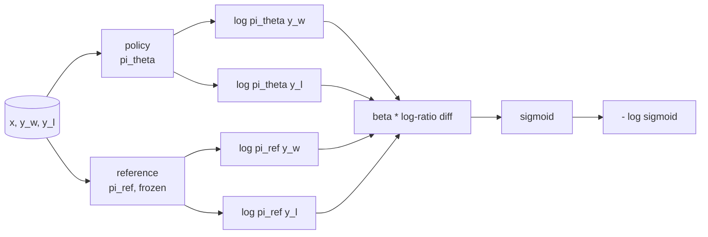
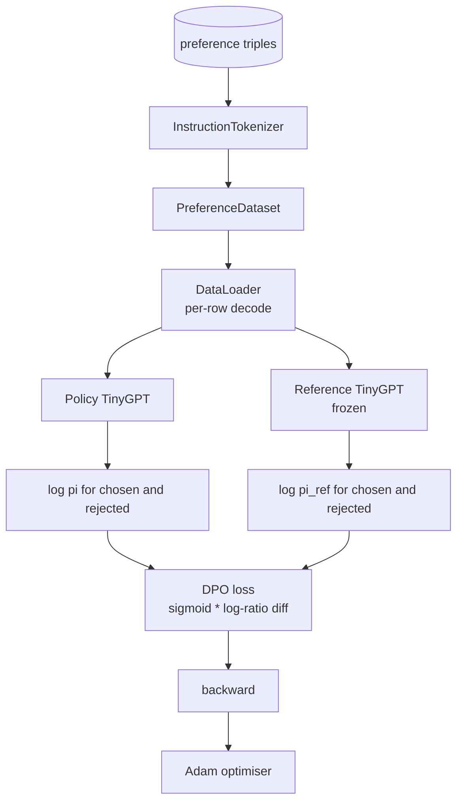

# 直接偏好 优化 结业

> 奖励模型和PPO是经典的RLHF堆. 投资者将这些积分分分成一个监督损失, 这一课从奖励差异身份中提取了DPO损失,运输了一个工作参考模型加上政策模型,计算每个代币日志概率,并训练一个小变压器在选择和拒绝完成的偏好固定. 测试将损失数学和梯度方向固定在脚本上,

> **【中文解读】**本节是综合项目从零实现DPO (直接偏好优化)


**Type:** Build | **类型:** Build
**Languages:** Python (torch, numpy) | **语言:** Python (torch, numpy)
**Prerequisites:** Phase 19 lessons 30-37 (NLP LLM track: tokenizer, embedding table, attention block, transformer body, pre-training loop, checkpointing, generation, perplexity) | **前置知识:** Phase 19 lessons 30-37 (NLP LLM track: tokenizer, embedding table, attention block, transformer body, pre-training loop, checkpointing, generation, perplexity)

>  前置轨B 11/20。参考阶段10·08(DPO 基础) +阶段18·03(DPO 家族)。
>  DPO = "RLHF 的捷径"──经典 RLHF=奖励模型+PPO(复杂);DPO=单一监督损失直接对偏好对训练──从奖励差恒等式推导DPO损失,建参考模型+策略模型,计算每代币日志-检查,在小变压器上训练偏好固定──
**Time:** ~90 minutes | **时间:** ~90 minutes

## 学习目标

- 根据"日志比分差异"的标志性,将DPO损失推移到隐含的奖励.
  中文翻译:将DPO损失作为一个标记比分差异的导向,并将其连接到隐含的奖励.
- 建立一个参考模型+政策模型对,包括一个结的参考和一个可训练的政策.
  中文翻译:建立一个参考模型+政策模型对,使用一个结结冰的参考和可训练的政策.
- 在两种模型中计算序列级日志概率,掩盖提示令牌.
  中文翻译:在两种模型中计算序列级日志概率,掩盖提示令牌.
- 培训政策`(prompt, chosen, rejected)`随着这个过程,我们可以看到,
  中文翻译:培训政策`(prompt, chosen, rejected)`随着这个过程,我们可以看到,
- 记行为与损失数学,梯度标志和参考不变的测试.
  中文翻译:Pin行为与损失数学,梯度标志和参考不变的测试.

> **【中文解读】**根据""的定义,DPO将RLHF 堆 (奖励模型+PPO) 缩小为单一的监督损失,直接在偏好对上训练策略. 本课从奖励差恒等式推导DPO 损失,构建参考模型+策略模型对,计算代币对数概率,在小型变压器上使用偏好数据训练.

## 问题问题

> **【中文解读】**标准化技术模型可以跟随指令,但输出质量参差不齐――你有一个偏好对:对同一提示,人工标记一个为选择,一个为拒绝――经典的RLHF管线是两阶段的训练奖励模型+PPO优化策略),成本高且复杂――DPO将两阶段折叠为单一监督损失:不需要显式奖励模型,不需要PPO,KL 束成闭式推导中――

> **【拓展：DPO 在生产中的应用】**已成为对齐训练的主流选择――Meta的LLaMA-2聊天使用RLHF(PPO),但LLaMA-3转向DPO──Mistral的混合-8x7B-Instruct 使用DPO──Zephyr (HuggingFace) 使用DPO在Mistral-7B上微调──与RLHF相比,DPO的优势:(1) 不需要奖励模型(省一个完整的训练管线;;(2) 训练更稳定不依赖于政策采样;;(3) 码量减少──IPO (Azar et al., 2024) 和 KTO (Ethayaraj et al., 2024) 是DPO的变化. 你还有一个小数据集, 偏好对:为了同一个提示, 人类标记了一个完成作为选择和另一个拒绝.

经典的RLHF答案是一个两阶段的管道. 训练一个奖励模型根据偏好. 优化与奖励的政策与PPO. 这有所效果,但昂贵:PPO期间记忆中的两个模型,KL控制保持政策接近参考,奖励模型脆弱时奖励黑客.

> 经典的RLHF答案是一个两阶段的管道. 训练一个奖励模型根据偏好. 优化与奖励的政策与PPO. 这有所效果,但昂贵:PPO期间记忆中的两个模型,KL控制保持政策接近参考,奖励模型脆弱时奖励黑客.


报价模式从未明确存在.政策直接训练在偏好对,与明确的KL处罚对SFT参考.相同的最佳解决方案在布拉德利-特里偏好模型下,更少的代码.

> 监督管理局将两个阶段取代一个监督损失.


## 概念的概念

> **【中文解读】**通过 KL 约束下的最佳策略闭式解,奖励 r 可以使用策略与参考模型的日志-试验差距来表示.

开始从布拉德利-特里模型.`x`两次完成`y_w`选择`y_l`现在,我们需要一个人来看看.`y_w`是

> 开始从布拉德利-特里模型.


```text
P(y_w > y_l | x) = sigmoid( r(x, y_w) - r(x, y_l) )
```

在哪里`r`的是隐藏的奖励函数.`r`根据偏好,然后培训一个政策`pi`实现最大限度`r`配有 KL :

> 在哪里`r`是一个隐藏的奖励函数.


```text
max_pi   E_{x, y~pi} [ r(x, y) ] - beta * KL(pi || pi_ref)
```

根据DPO衍生法,最佳政策`pi*`根据本目标, 已关闭形式`r`其他:

> 根据DPO衍生法,最佳政策`pi*`根据本目标, 已关闭形式`r`翻译:


```text
pi*(y | x) = (1/Z(x)) * pi_ref(y | x) * exp( r(x, y) / beta )
```

重新安排`r`其他:

```text
r(x, y) = beta * ( log pi*(y | x) - log pi_ref(y | x) ) + beta * log Z(x)
```

其他`log Z(x)`两个词是相同的`y_w`其他`y_l`(这取决于`x`没有`y`),因此在计算偏好差异时,它会取消:

> `log Z(x)`两个词是相同的`y_w`其他`y_l`(这取决于`x`没有`y`),因此在计算偏好差异时,它会取消:


```text
r(x, y_w) - r(x, y_l) = beta * ( log pi_theta(y_w|x) - log pi_ref(y_w|x)
                                - log pi_theta(y_l|x) + log pi_ref(y_l|x) )
```

替换为布拉德利-特里的西格莫ид,并取消对优先对的负记录概率:

> 取代为布拉德利-特里的标志性,并取消对偏好对的负记录概率:(翻译)


```text
L_DPO(theta) = - E_{(x, y_w, y_l)} [
  log sigmoid( beta * ( log pi_theta(y_w|x) - log pi_ref(y_w|x)
                       - log pi_theta(y_l|x) + log pi_ref(y_l|x) ) )
]
```

这就是损失.它是一个单个尺度上的sigmoid,例如,由四个日记概率计算.没有单独的奖励模型.没有PPO.没有KL术语在损失中;KL约束被烤成闭式衍生.

> 这个是损失.它是一个单个尺度上的sigmoid,例如,由四个日记概率计算.没有单独的奖励模型.没有PPO.没有KL术语在损失中;KL约束被烤成闭式衍生.




## 渐变的标志

炼前,请检查智力.`log pi_theta(y_w | x)`其他:

> 炼前,请检查智力.`log pi_theta(y_w | x)`翻译:


```text
d L_DPO / d log pi_theta(y_w | x) = - beta * (1 - sigmoid(z))
```

在哪里`z`对于所有人来说,这是负的.`z`增加政策的选择完成的日志概率,减少损失.`log pi_theta(y_l | x)`培训推动选民上升和被拒绝下降. 参考是结的,它不会移动.

> 在哪里`z`对于西格莫伊德,这是一个论点.


## 数据

> **【拓展：偏好数据收集与 DPO 变体】**本课的12个偏好三元组是教育性简化――生产级DPO需要数万到数十万个偏好对应――数据来源:1) 人类标记(人类的HH-RLHF 数据集);2) AI反(RLAIF,使用GPT-4标记);3) 隐式反(KTO只需要二进制好/坏标签,不需要进行比较) ――UltraFeedback (Cui et al., 2024) 提供64K指令偏好数据,常是开源社区最有用的DPO训练数据――

两个偏好三倍的船,每个是`(prompt, chosen, rejected)`选择的完成是短暂的和精确的.被拒绝的是单词的,非主题的,或错误的.对涵盖相同的任务家庭的课程39 (资本,算术,列表),所以一个从SFT基础开始的政策有一个合理的起点.

> 十二个优先级三倍的课程.


设置是故意小的.DPO在生产中的数万对上工作;这里,问题是,损失数学和循环在一个小数据集上运行端到端,而选与拒绝的日志检查差距明显增加.

> 实际上,在一个小数据集上,损失数学和循环运行端到端,而选与拒绝的日志检查差距显著增加.


## 参考不变

执行DPO必须仔细处理参考模型.参考模型是固定的SFT模型.必须具有三个特性:

> 一个DPO实现必须仔细处理参考模型.参考模型是SFT模型结.三个属性必须保持:


- 参考参数从来没有收到梯度.
  中文翻译:参考参数从来没有收到梯度.
- 参考日志的概率从来没有在时代之间变化.
  中文翻译:参考日志概率在时代之间永远不会改变.
- 政策从与参考的权重相同.`theta`是参考文献加上已知更新;将政策作为参考文献的副本启动是明确的开始.)
  中文翻译:政策从参考的重量开始.`theta`是参考文献加上已知更新;将政策作为参考文献的副本启动是明确的开始.)

执行通过:

- 封装参考文献`torch.no_grad()`在前进的通行过程中.
  中文翻译:将引用包裹在`torch.no_grad()`在前进的通行过程中.
- 设置`requires_grad=False`在每个参考参数上.
  中文翻译:设置`requires_grad=False`在每个参考参数上.
- 通过`policy.load_state_dict(reference.state_dict())`在参考文件的构建之后.
  中文翻译:通过 构建政策`policy.load_state_dict(reference.state_dict())`在参考文件的构建之后.

## 建筑,建筑
```figure
cap-dpo-preference
```

## 建筑



模型是39课中使用的TinyGPT (仅用于解码,因果,字节标记).参考和政策共享架构;政策的权重从训练中的参考中漂移,而参考保持固定.

> 参考和政策共享架构;政策的权重从训练中的参考中漂移,而参考保持固定.


## 你会建造什么

实施是一个`main.py`另外还有一些检查.

1. `InstructionTokenizer`字节标记器`INST`其他`RESP`特殊的东西,与39课一样.
2. `TinyGPT`只有解码器变压器. 同样的形状,就像第39课,所以即使你跳过第39课,课程是自主.
3. `make_preferences`返回12个`(prompt, chosen, rejected)`两倍.
4. `sequence_log_prob`: 给模型,一个快速预写和一个完成,返回了完成后的下一个代码日志概率的总和 (没有快速位置贡献).
5. `dpo_loss`根据四个记录概率,`beta`返回每例损失数和记录的隐含奖励三角形.
6. `train_dpo`根据政策和参考计算选项和拒绝日志测试,应用损失,并步骤亚当.
7. `evaluate_margins`:在任何时候返回该政策中所选的平均拒绝日志概率差距.
8. `run_demo`根据预训练的小量,从一个小的预训练中构建参考和政策,复制重量,30步的列车,打印每步的损失和利率,并从零出发成功.

## 为什么DPO工作

> **【中文解读】**在Bradley-Terry中,DPO 在偏好模型下与RLHF 数学等价.隐式奖励r(x,y) =beta * (log pi(y 便x) - log pi_ref(y 便x)) 从偏好中可识别到差差一个 x 的函数,后者在差分中抵消――KL 约束是结构强制的:策略偏离参考使日比 增长,sigmoid 和抑制梯度,防止策略跑太远――参考模型是安全网.

根据布拉德利-特里偏好模型,DPO在数学上相当于RLHF,直到奖励的参数化.`r(x, y) = beta * (log pi(y|x) - log pi_ref(y|x))`能从偏好到函数来识别`x`关闭形式政策允许您跳过明确的奖励模式.`pi`其他`pi_ref`度是你的安全网. 度是你的安全网.

> 在布拉德利-特里偏好模型下,DPO在数学上相当于RLHF,直到奖励的参数化.


## 实现目标

- 添加长度正常化到日志概率总数:按完成长度划分.长度偏差是已知的DPO故障模式,模型优先选择更短的完成,因为其日志概率在绝对数目中更大.
  中文翻译:将长度正常化添加到日志概率总数:按完成长度划分.长度偏差是已知的DPO失败模式,模型优先选择更短的完成,因为其日志概率在绝对上是更大.
- 增加IPO变量损失:将sigmoid + log替换为 `(z - 1)^2`测量器的相似性.
  中文翻译:添加IPO变量损失:用 替换sigmoid + log`(z - 1)^2`测量器的相似性.
- 添加一个标签滑滑参数,该参数将硬选择的拒绝标签与统一的0.5之间进行交互.
  中文翻译:添加一个标签滑滑参数,它将硬选择的拒绝标签与统一的0.5 之间进行交互.
- 取代参考模型以更小的更便宜的模型 (知识蒸味).
  中文翻译:用更小的更便宜的模型取代参考.

运行给你输出,参考不变,训练循环.数学是课程.代码使数学具体.

> 运行给你输出,参考不变,训练循环.数学是课程.代码使数学具体.

