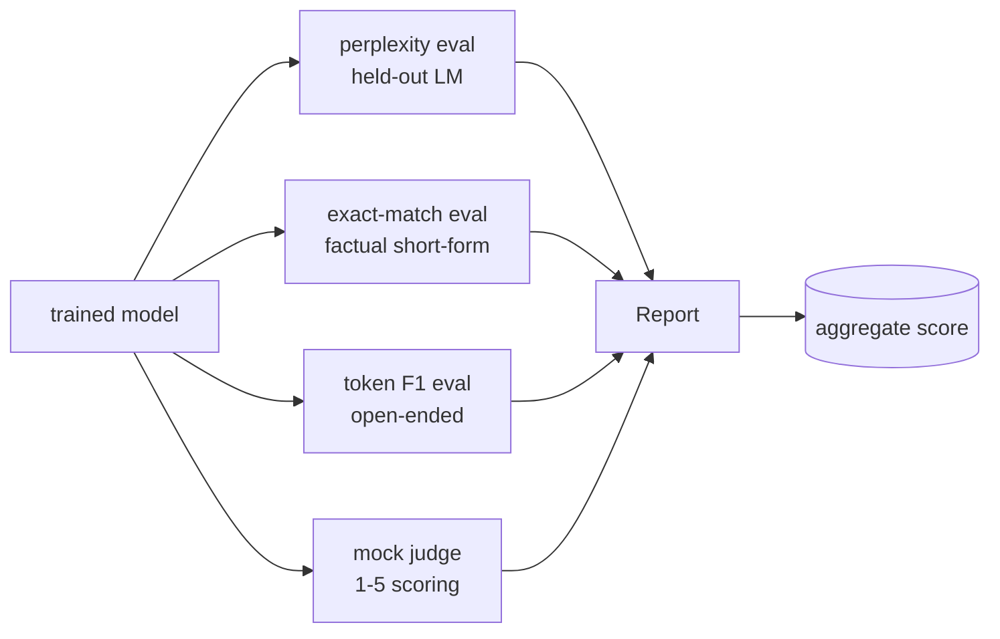
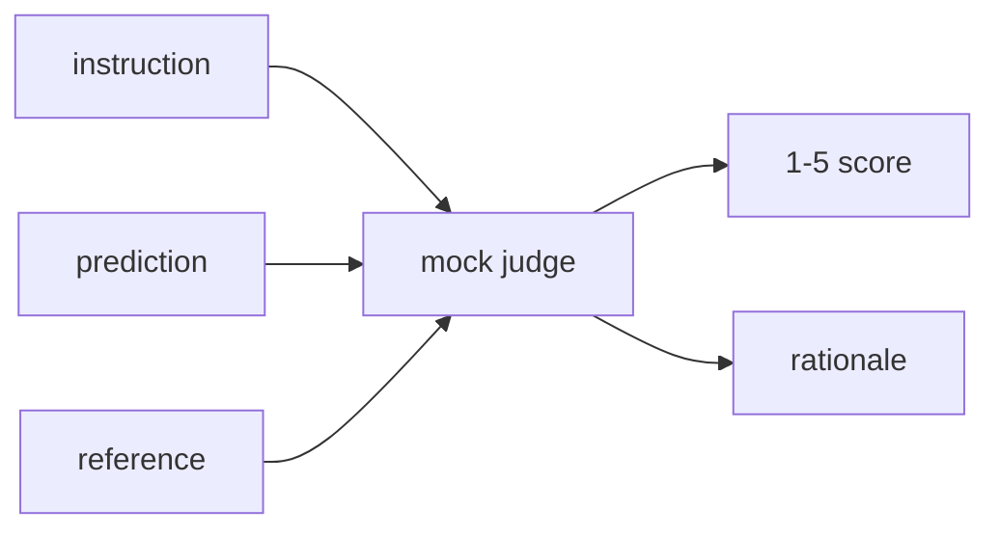
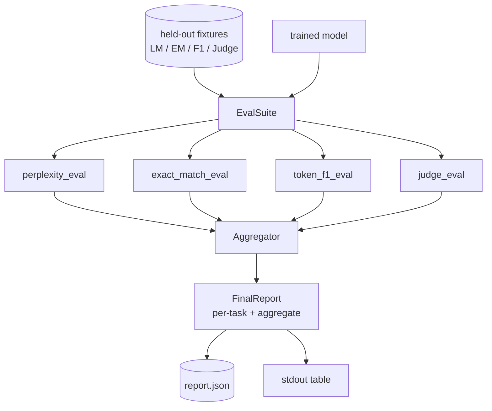

# 石课41: 完整的评估管道

> 训练是你可以通过损失曲线监测的部分. 评估是你必须设计的部分. 这一课构建了一个统一的评估管道,采用任何训练有素的语言模型,运行四种异质的评估,将结果汇集成每项任务报告, 四项评估涵盖了每个运输模型所需的尺寸:语言建模 (困难),短形正确性 (准确匹配),开放形式相似性 (F1标志),以及质量评分 (评判).

> **【中文解读】**本节是人工智能工程的综合实战项目,集成前面学到的技术和方法.


**Type:** Build | **类型:** Build
**Languages:** Python (torch, numpy) | **语言:** Python (torch, numpy)
**Prerequisites:** Phase 19 lessons 30-37 (NLP LLM track: tokenizer, embedding table, attention block, transformer body, pre-training loop, checkpointing, generation, perplexity) | **前置知识:** Phase 19 lessons 30-37 (NLP LLM track: tokenizer, embedding table, attention block, transformer body, pre-training loop, checkpointing, generation, perplexity)

>  前置B 12/20──LLM 评估综合──
> 评估管线 = "训练的反面"――训练能用损失曲线监控;评估必须设计――四维评估覆盖每个上线模型所需:语言建模(困惑度) +短答正确性(精确匹配) +开放相似性(标志 F1) +定性评分(法官)――本地嘲笑LLM作为法官 让循环无网跑――
**Time:** ~90 minutes | **时间:** ~90 minutes

## 学习目标

- 计算一个微小的变压器上的隐形代币计算.
  中文翻译:在一个小变压器上计算出置的困难.
- 执行一个准确的匹配评估,
  中文翻译:在短形式的事实提示上执行精确匹配评估.
- 计算预测和参考字符串之间的代币级 F1 标准化.
  中文翻译:通过正常化计算预测和参考字符串之间的代币级别F1.
- 建立一个地方的假法师作为法官,以1-5的比例评分模型的结果.
  中文翻译:建立一个当地假装的法官法师,以1-5的比例评分模型结果.
- 总结四项评估成一个重量化报告,每项任务分类.
  中文翻译:将四个评估组合成一个重量化报告,每项任务分类.

> **【中文解读】**评估流水线是模型开发不可缺少的部分. 本课构建统一的评估管线:困惑度 (困惑度) 语言建模质量 (语言建模质量) 精确匹配 (短答案正确性) 标F1 (开放式相似性) 和本地模拟的LLM作为法官 (定性评分) .

## 问题问题

> **【中文解读】**单一指标永远无法完整描述语言模型――困惑度衡量语言分布适合但不回答问题能力――精确匹配要求完全相同的字符串但惩罚正确释义――F1符号 容忍释义但被词汇重叠欺骗――LLM-as-judge 捕捉定性维度但昂贵且随机――本课程构建包含四种评估统一线,每个覆盖其他指标遗漏的维度――

> **【拓展：LM 评估生态】**拥抱脸的`lm-eval-harness`(本课第 49 课题) 是社区标准评估框架,支持200多项任务.EleutherAI的LM评估套件使用类似任务指标聚合架构.Open LLM Leaderboard使用六项核心基准.ARC、HellaSwag、MMLU、TruthfulQA、Winogrande、GSM8K) 排名模型.LLM作为法官 (如GPT-4法官) 在MT-Bench 和Chatbot Arena中广泛使用,但存在位置偏差和冗长偏差等已知. 精确匹配显示模型是否产生金弦,但惩罚正确的句子. 符号F1允许抛词,但被词汇重叠与错误的内容所欺骗. 法律法官的法学法学具有质量维度,但成本高昂,

实际上你想要的管道有四个.每个评估涵盖一个其他缺失的维度.每个测量都运行在一个不同的数据小组上,以该指标的形状.最终报告显示每个任务的数字并肩和总数,这样一个评论者可以一眼看看模型正在做什么交易.

> 实际上你想要的管道有四个.每个评估涵盖一个其他缺失的维度.每个运行在一个不同的数据小组,以这个指标的形状.最终报告显示每个任务的数字并肩和总数,所以一个评论者可以一眼看模型正在做什么交易.


这一课将这条管道,从头到尾,建立在一个文件中.

## 概念的概念



每个 eval 是从 `(model, dataset) -> EvalResult`结果包含了测量值,每例的检查细节,以及集体名称. 管道组合它们,并设置一个配置,说明哪些评估要运行以及如何权重它们.

> 每个个是从`(model, dataset) -> EvalResult`结果包含了测量值,每例的检查细节,以及集体名称. 管道组合它们,并设置一个配置,说明哪些评估要运行以及如何权重它们.


## 困惑,正确计算

> **【中文解读】**困惑度是`exp(每个 token 平均负对数似然)`△两个陷: 1) 平均值必须在实际代币位置上计算 (),否则困惑度看起来比实际好; 2) 模型在位置上预测位置 i+1的代币,偏一错虽然损失 仍然可以训练但指标变得无意义.`-log p(token)`和标记计数,最后除了总计数,比分数量平均困惑度更为数值稳定.

困惑是`exp(mean negative log-likelihood per token)`实施有两个陷:

> 困惑是`exp(mean negative log-likelihood per token)`实施有两个陷:(翻译)


- 平均值必须是实际的代币位置,而不是批量 * 序列.
  中文翻译:平均值必须在实际代币位置上,而不是批量 *序列上.
- 模型预测下一个代币,所以在位置上.`i`预测标志在位置`i+1`失败仍然是流动的,但指标变得毫无意义.
  中文翻译:模型预测下一个代币,所以在位置上登录`i`预测标志在位置`i+1`失败仍然是流动的,但指标变得毫无意义.

评估计算每批量的总量`-log p(token)`通过不pad的位置和每批的代币数量,然后在最后分开. 这比平均每批的困难 (低于短序列的重量) 更安全,并且符合教科书的定义.

> 评估每批量计算的总量`-log p(token)`通过不pad的位置和每批的代币数量,然后在最后分开. 这比平均每批的困难 (低于短序列的重量) 更安全,并且符合教科书的定义.


## 完全匹配,与规范化

带在比较之前将预测和参考都正常化:

> 在比较之前,HArness将预测和参考都正常化:(翻译)


- 简字母.
  简单的字母.
- 周围的白色空间.
  中文翻译:周围的白色空间.
- 内部白空的崩将运行到一个空间.
  中文翻译:内部白空的崩运行到一个空间.
- 落后终端分分 (`.`现在`!`现在`?`) 如果双方仅因分别.
  中文翻译:落后终端分分 (`.`现在`!`现在`?`) 如果双方仅因分别.

规范化使得精确匹配在实践中有用.`"Paris"`确实是对的,一个说`"Paris."`们也在说`"  paris  "`标准化后,答案仍然需要相同的字符串.

> 规范化使得精确匹配在实践中具有有用性.


## 标志 F1,正确的方向

代币F1是通过代币袋计算的精度和召回的和平均值.

> 代币F1是指指数包的精度和回忆的和平均值.


1. 规范预测和参考 (与精确匹配相同的规则).
2. 分成每个代币列表 (白色空间代币化).
3. 计算多组交叉点.
4. 精度 = `intersection_count / len(pred_tokens)`提醒 = `intersection_count / len(ref_tokens)`1=和平均值.

如果预测和参考都是空的,F1是1 (空格匹配).如果只有一个空的,F1是0.这个模式匹配SQuAD评估参考,并产生稳定的数字跨句子.

> 如果预测和参考都空,F1是1 (空格匹配).如果只有一个空,F1是0.这个模式匹配SQuAD评估参考,并产生稳定的数字跨句子.


## 地方假法师作为法官

> **【中文解读】**真正的判断者是API背后的前沿模型. 本课的假判断者是确定性评分器:归结预测等于归结. 参考5分,标志 F1 >=0.8得4分,以此类推. 接口与真实判断者. 同样,替换一个函数即可切换.

> **【拓展：LLM-as-Judge 的实践与偏差】**在聊天机场 (LMSYS) 中,LLM-as-judge被用于人类偏好标记的替代品.

实际法官是一个API背后的边界模型.对于这个课程,法官必须在线运行.假法官是一个确定性得分符,接收指令,模型的预测和参考,并返回一个分数.`{1, 2, 3, 4, 5}`评分规则是明确的:

> 一个真实法官是API背后的边界模型.对于这个课程,法官必须在线运行.假法官是一个确定性得分者,接收指令,模型的预测和参考,并返回一个分数.`{1, 2, 3, 4, 5}`评分规则是明确的:


- 如果正常预测等于正常参考.
  中文翻译:5如果正常预测等于正常引用.
- 4,如果预测和参考之间的F1符号至少为0.8.
  中文翻译:4如果预测和参考之间的F1符号至少为0.8.
- 如果F1标志是3`[0.5, 0.8)`现在,我们要去.
  中文翻译:3如果F1是标志的`[0.5, 0.8)`现在,我们要去.
- 如果F1标志是`[0.2, 0.5)`现在,我们要去.
  中文翻译:2如果代币F1是中`[0.2, 0.5)`现在,我们要去.
- 否则,
  中文翻译:1否则.

这不是一个真正的判断者,但它有正确的接口. 通过更改一个函数来更换一个真正的模型. 管道不关心.

> 这不是一个真正的判断者,但它有正确的接口. 通过更改一个函数,更换一个真正的模型. 管道不关心.




## 总结

总体是标准化评估分数的权重平均值.`[0, 1]`其他:

> 总体是标准化评估分数的权重平均值.`[0, 1]`翻译:


- 乱:正常化`1 / (1 + log(perplexity))`图为1的复杂性,图为1的复杂性,图为0的无限性.
  中文翻译:困惑:正常化`1 / (1 + log(perplexity))`图为1的复杂性,图为1的复杂性,图为0的无限性.
- 已有.`[0, 1]`现在,我们要去.
  中文翻译:精确匹配:已经进入了`[0, 1]`现在,我们要去.
- 标志 F1: 已经进入了`[0, 1]`现在,我们要去.
  中文翻译:F1代码已经进了`[0, 1]`现在,我们要去.
- 评委:分为5.
  中文翻译:法官:分为5.

权重可以配置.默认混合是0.2的困难度,0.3的精确匹配,0.3的代币F1,0.2的评判.权重的选择是产品的决定;课程暴露了按,所以你可以实验.

> 体重可以配置.


## 建筑,建筑
```figure
cg-eval-quadrant
```

## 建筑



其他`EvalSuite`每个个评估是一个自由函数,`(model, tokenizer, dataset, config)`返回一个`EvalResult`现在,我们要去.`Aggregator`测试程序打印表,写出一个JSON副本,下游CI可以摄入.

> `EvalSuite`每个个评估是一个自由函数,`(model, tokenizer, dataset, config)`返回一个`EvalResult`现在,我们要去.`Aggregator`测试程序打印表,写出一个JSON副本,下游CI可以摄入.


## 你会建造什么

实施是一个`main.py`另外还有一些检查.

1. `TinyGPT`课程包括了38-40课程中的相同的解码器架构,因此课程独立.
2. `InstructionTokenizer`通过 INST/ RESP/ PAD 专项的字节标记器.
3. 设置四个装置:一个LM体,一个EM组,一个F1组,一个评审组.
4. `perplexity_eval`收益`EvalResult`具有杂性值和每代币损失的历史图.
5. `exact_match_eval`报告中,每例的 EM 记录均值.
6. `token_f1_eval`:返回F1代号平均值和每例记录.
7. `mock_judge`其他`judge_eval`平均分数在整个集中.
8. `Aggregator.normalise`标准化规则:
9. `Aggregator.aggregate`:重量平均和汇总报告.
10. `run_demo`简单地训练一个小模型,运行四个评估,打印报告表,写JSON,成功的结果是零.

## 阅读报告

报告有三个层.顶部是总分数.下面是每期的四个数字.下面是诊断的每例分数.一个失败的CI运行通常需要总分,但一个追逐回归的评论家希望每例分数,以查看模型错了哪些输入.

> 报告有三个层.顶部是总分数.下面是每期的四个数字.下面是诊断的每例分数.一个失败的CI运行通常需要总分,但一个追逐回归的评论家希望每例分数,以查看模型错了哪些输入.


 JSON 排放器使用稳定键,以便一个CI仪表板可以绘制版本中的趋势线. 漂亮的打印表是为了训练运行后观察终端的人.

> 简单的打印表是为了让人在训练后着终端.


## 实现目标

- 添加校准评估:模型的软max概率是否与其准确性相匹配?
  中文翻译:添加校准评估:模型的软max概率是否与其准确性相匹配?
- 添加强度评估:每例标记一个扰乱 (typo, paraphrase, distractor) 并报告每次扰乱的度量下降.
  中文翻译:添加强度评估:每一个例子都用一个扰乱 (typo, paraphrase, distractor) 标签,并报告每一个扰乱的度量下降.
- 替换一个HTTP调用背后的假定法官用一个真实模型.函数签名不会改变.
  中文翻译:将假定法官取代为 HTTP 调用背后的真实模型.
- 增加每任务的体重学习:不要固定体重,而是将体重调整到目标优先顺序.
  中文翻译:每任务重量学习:不要固定重量,而是将重量调整到目标偏好顺序.

实际的评估管道上层了更多的维度;模式保持不变:每个评估一个函数,一个集成器,一个报告.

> 实际的评估管道上层了更多的维度;模式保持不变:每个评估一个函数,一个聚合器,一个报告.

