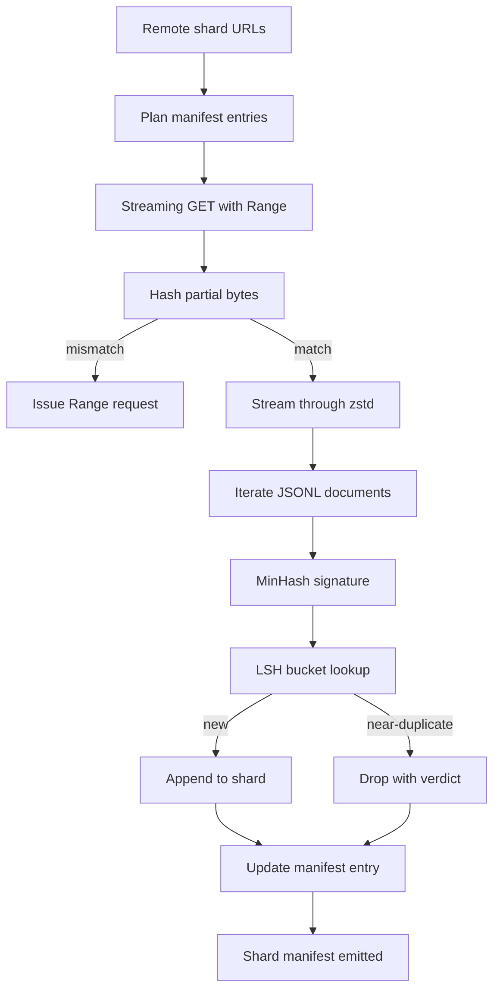

# 现在,我们在线观看

> 训练语言模型的开始是第一步前进之前. 身体必须登陆磁盘, 解压缩, 减复, 并且可以地址, 简历故事已经完成, 这一课构建了一个流媒体下载器, 拉压缩的碎片, 通过Zstandard飞行中解压缩, 通过 MinHash加上本地敏感的哈希,

> **【中文解读】**本节是人工智能工程的综合实战项目,集成前面学到的技术和方法.


**Type:** Build | **类型:** Build
**Languages:** Python | **语言:** Python
**Prerequisites:** Phase 19 lessons 30-37 | **前置知识:** Phase 19 lessons 30-37

>  前置轨B 13/20──预训练工程实践轨C 第1节──
>  大语料下载器 = "数据工程的开始"――训练模型远远远于第一次前向传播语料必须落盘,解压,去重,可寻址,且断点续传在网络中断时已设计好――流式下载+Z标准 实时解压+MinHash+LSH 近重复纹+分片表――
**Time:** ~90 minutes | **时间:** ~90 minutes

## 学习目标

- 通过远程传输`urllib`缩,缩,缩,缩,缩,缩,缩,缩,缩,缩,缩,缩,缩,缩,缩,缩,缩,缩,缩,缩,缩,缩,缩,缩,缩,缩,缩,缩,缩,缩,缩,缩,缩,缩,缩,缩,缩,缩,缩,缩,缩,缩,缩,缩,缩,缩,缩,缩,缩,缩,缩,缩,缩,缩,缩,缩,缩,缩,缩,缩,缩,缩,缩,缩,缩,缩,缩,缩,缩,缩,缩,缩,缩,缩,缩,缩,缩,缩,缩,缩,缩,缩,缩,缩,缩,缩,缩,缩,缩,缩,缩,缩,缩,缩,缩,缩,缩,缩,缩,缩,缩,缩,`zstandard`没有缓冲整个文件在内存.
  中文翻译: 通过远程流动截图`urllib`缩,缩,缩,缩,缩,缩,缩,缩,缩,缩,缩,缩,缩,缩,缩,缩,缩,缩,缩,缩,缩,缩,缩,缩,缩,缩,缩,缩,缩,缩,缩,缩,缩,缩,缩,缩,缩,缩,缩,缩,缩,缩,缩,缩,缩,缩,缩,缩,缩,缩,缩,缩,缩,缩,缩,缩,缩,缩,缩,缩,缩,缩,缩,缩,缩,缩,缩,缩,缩,缩,缩,缩,缩,缩,缩,缩,缩,缩,缩,缩,缩,缩,缩,缩,缩,缩,缩,缩,缩,缩,缩,缩,缩,缩,缩,缩,缩,缩,缩,缩,缩,缩,`zstandard`没有缓冲整个文件在内存.
- 通过发出HTTP恢复部分下载`Range`要求对验证的字节抵消.
  中文翻译:通过发行HTTP恢复部分下载`Range`要求对验证的字节抵消.
- 建立一个每份文件的MINHASH签名,然后用LSH它,
  中文翻译:每份文件建立一个 MinHash 签名,然后将其用 LSH 起来,以便几乎的副本碰撞.
- 发出内容哈希,字节大小,文件数量和裁决的分片说明.
  中文翻译:发出内容哈希,字节大小,文件数量和裁决的碎片表.

## 问题问题

> **【中文解读】**训练语言模型远在第一次前向传播之前就开始了――语料必须下载到磁盘,解压,重量,可寻址,并且必须在网络上下载,在4% 时开之前就已经解决了――两种必须从一开始就设计出好的失败模式:部分下载,重复文件移除――断点续传是HTTP范围 请求问题,重复是MinHash + LSH 签名问题――

> **【拓展：大规模语料下载实践】**共同爬是最大的公开网络爬取数据集,每次爬取约20-40TB的压缩数据.红色Pajama-V2 (Together Computer) 从共同爬取了超过30亿代币,使用CCNet管线进行语言识别和质量过.该文件 (EleutherAI) 是825GB的精选语料,整合了GitHub,ArXiv,Wikipedia等来源.C4 (Colossal Clean Crawled Corpus) 是T5训练数据,约750GB. 下载数据集通常需要多线程断分,连续传输和片验. 百分之99你已经重写了循环三次. 首先,你必须设计的两个失败是部分下载简历和重复文件删除. 两者都有已知解决方案;因为管道开始为一线,两者都经常被跳过.`requests.get`让它生长牙.

简历是一个HTTP问题.服务器必须尊重`Range`如果代码和文件差距甚至是1字节,恢复下载会写垃圾,并且体积会以只有在代码化过程中出现的方式被破坏.

> 简历是一个HTTP问题.


排版是一个签名问题. 精确的hash排版缺失了近于排版:同一维基百科文章显示有三个不同的单元脚本,相同的代码文件具有不同的许可标题,同一博客帖子每个链接都有跟踪参数. 微软和LSH以线性成本捕获这些. 成本是每份文件一个签名和每份签名一个桶查找.

> 减倍是一个签名问题.


## 概念的概念



### 流媒体`urllib`

标准图书馆`urllib.request.urlopen`返回一个文件像的对象.`zstandard.ZstdDecompressor().stream_reader`通过解压缩器,字节从网络流入文档代码器,而不会在内存中实现压缩的碎片或解压缩的碎片.唯一的内存成本是线路缓冲器,当前文档的 MinHash 签名和LSH 指数.

> 标准图书馆`urllib.request.urlopen`返回一个文件像的对象.`zstandard.ZstdDecompressor().stream_reader`通过解压缩器,字节从网络流入文档代码器,而不会在内存中实现压缩的碎片或解压缩的碎片.唯一的内存成本是线路缓冲器,当前文档的 MinHash 签名和LSH 指数.


### 简历`Range`

下载器每块文件写出两个文件:`.partial.json`检查站,检查站记录`verified_bytes`现在`expected_size`现在`sha256_prefix`(计算在第一个`verified_bytes`在启动时,下载器读取检查点,重新计算`sha256_prefix`如果哈希错误,则部分被丢弃,下载从字节零重新启动.沉默的腐败是不可能的,因为验证的字节被检查,而不是假设.

> 下载器每块文件写两个文件: 块本身和一个`.partial.json`检查站,检查站记录`verified_bytes`现在`expected_size`现在`sha256_prefix`(计算在第一个`verified_bytes`在启动时,下载器读取检查点,重新计算`sha256_prefix`如果哈希错误,则部分被丢弃,下载从字节零重新启动.沉默的腐败是不可能的,因为验证的字节被检查,而不是假设.


### 和LSH

> **【中文解读】**根据文档的说法,集合是文本的 shingle(重叠n-gram) ⋅签名是 k 个最小哈希值──LSH 将 k 个分量分为 b 个带(每条带 r 行),两个文档至少在一个带 碰撞的概率为`1 - (1 - s^r)^b`典型语料重复使用 k=128, b=32, r=4,值约 s=0.8──

据MinHash估计,在固定空间中两个集合的Jaccard相似性.对于一个文档,集合是其文本的带 (重叠的n-克拉).`k`两个文件具有Jaccard相似性 `s`没有任何可能.`s`任何单一的签名部分都得以达成一致.

> 据MinHash估计,固定空间中的两个集合的Jaccard相似性.


 LSH 然后组合了`k`组件`b`频段`r`排列,每个行,`k = b * r`两份文件至少在一个带中碰撞,`1 - (1 - s^r)^b`值值的值`s`你调音了`(b, r)`典型的体积减产的门值是`s = 0.8`通过LSH研究文献来获取`k = 128`现在`b = 32`现在`r = 4`现在,我们要去.

>  LSH 然后组合了`k`组件`b`频段`r`排列,每个行,`k = b * r`现在,我们要去.


### 作为合同的碎片表

只有下载器的可持续输出是表格. 文件表包含每个分片的URL,解压缩字节数量,文件数量,除除除后的独特文件数量,以及最后的分片文件的 sha256. 后游代币化读取表格,而不是目录列表. 如果一个碎片缺失或其sha256是错误的,说明书告诉下一个阶段拒绝开始. 文件表是"数据下载"和"数据下载和可验证"之间的决定边缘.

> 下载器唯一持久的输出是表格. 文件表包含每个分片的URL,解压缩字节数量,文件数量,除除除后的独特文件数量,以及最后的分片文件的 sha256. 后游代币化读取表格,而不是目录列表. 如果一个碎片缺失或其sha256是错误的,说明书告诉下一个阶段拒绝开始. 文件表是"数据下载"和"数据下载和可验证"之间的决定边缘.


## 动手构建
```figure
cap-corpus-downloader
```

## 建立它

`code/main.py`执行:

- `ShardPlanner`- 阅读一个分片URL列表并生成计划的表格输入.
  翻译: 中文`ShardPlanner`- 阅读一个分片URL列表并生成计划的表格输入.
- `StreamingDownloader`- 开启一个`urllib`随选的流量`Range`文件的编写,更新文件.`.partial.json`在每一个部分检查点,并验证了简历上的 Sha256 序列.
  翻译: 中文`StreamingDownloader`- 开启一个`urllib`随选的流量`Range`文件的编写,更新文件.`.partial.json`在每一个部分检查点,并验证了简历上的 Sha256 序列.
- `ZstdDocIterator`- 将文件类型的流程卷入`zstandard.ZstdDecompressor`并且每行产生一个文件.
  翻译: 中文`ZstdDocIterator`- 将文件类型的流程卷入`zstandard.ZstdDecompressor`并且每行产生一个文件.
- `MinHasher`- 产生了`k`- 用固定式种类的字符串的组件签名.
  翻译: 中文`MinHasher`- 产生了`k`- 用固定式种类的字符串的组件签名.
- `LSHIndex`- 根据乐队的签名,报告碰撞.
  翻译: 中文`LSHIndex`- 根据乐队的签名,报告碰撞.
- `Dedup`- 结合哈希器和索引来标记每个文件`keep`或`near_duplicate`配合的碎片身份证.
  翻译: 中文`Dedup`- 结合哈希器和索引来标记每个文件`keep`或`near_duplicate`配合的碎片身份证.
- `ManifestWriter`- 收集每股统计数据,并写`manifest.json`现在,我们要去.
  翻译: 中文`ManifestWriter`- 收集每股统计数据,并写`manifest.json`现在,我们要去.

文件的底部的一个演示,构建了一个小型的合成体,`zstandard`通过一个`file://`查看下面的文件,

> 文件的底部的一个示例构建了一个小型的合成体在磁盘上,`zstandard`通过一个`file://`查看下面的文件,


运行它:

```bash
python3 code/main.py
```

脚本从零开始,打印一个显而易见的概述.

## 生产模式

> **【拓展：语料去重对模型质量的影响】**李等人 (2022) 的研究表明,训练数据中的重复会导致模型记忆特定序列,降低泛化能力并增加隐私泄露风险.GPT-3论文报告使用近似精确重复.

**Checkpoint before write.**其他`.partial.json`必须是`fsync`否则电源损失会逆转顺序:磁盘上的碎字节,检查点没有它们,下一个简历认为它有较少的验证字节,复制后音字节破坏了文件.检查点先,然后写.这是与写前日志相同的纪律.

**Sharded LSH index.**整个体积上单个LSH指数不适合200GB尺度的RAM.将LSH指数按第一个带哈希分区,存储在磁盘上的分区,并只查看新签名将登陆的分区.成本是每份文件读取额外的磁盘;优势是LSH指数不再是硬件内存上限.

**Tombstone, not delete.**丢弃的复制文件将被记录在公开文件中,并有判决.`near_duplicate`删除这些文件会失去复制文件和其持有者之间的联系. 墓碑将保留审计轨迹,

**Per-shard sha256 in the manifest, plus a manifest sha256.**简单的内容是哈希的.下游阶段在信任每分片的输入之前验证了简单的哈希.没有了这个简单的内容是沉默的攻击表面:一个可以编辑一个文件的攻击者可以破坏整个管道.

## 用它使用方法

生产模式:

- **Resume on every CI run.**导航运行器是短暂的. 下载器每次运行都必须承担一个新磁盘,`--cache-dir`是一流的旗.
  翻译: 中文**Resume on every CI run.**导航运行器是短暂的. 下载器每次运行都必须承担一个新磁盘,`--cache-dir`是一流的旗.
- **Dedup before tokenization.**代币化是昂贵的.在同一文件上运行两次是相同的损失曲线的两倍.
  翻译: 中文**Dedup before tokenization.**代币化是昂贵的.在同一文件上运行两次是相同的损失曲线的两倍.
- **Manifest as merge gate.**训练运行从一个固定的提交中读取表格 sha256.一个新的数据集版本需要一个新的表格提交.代码和数据之间的联系是 git,而不是民间.
  翻译: 中文**Manifest as merge gate.**训练运行从一个固定的提交中读取表格 sha256.一个新的数据集版本需要一个新的表格提交.代码和数据之间的联系是 git,而不是民间.

## 发射上线

`outputs/skill-corpus-downloader.md`实际项目中,将描述下载器的URL,检查点目录的布局,`(k, b, r)`现在,我们需要一个新的版本,

> `输出/技能体下载器.


## 练习题

1. 添加一个`--shingle-width`标记并测量 dedup判决在宽度 3, 5, 9 变化.
2. 通过嗅到魔术字节,将 gzip 支持添加到 zstd 旁边.下载器不应该要求调用者指定代码.
3. 添加一个`--resume-only`通过 IC 帮助一个运行免于意外重新拉200GB.
4. 移动LSH指数到架子或SQLite文件,测量吞吐量与内存变量.
5. 添加一个表格 sha256 检查启动.如果磁盘上的表格与表格哈希不同意,下载器应该无法关闭`manifest.lock`现在,我们要去.

## 关键词 关键词

| Term | What people say | What it actually means |
|------|-----------------|------------------------|
| Shard | "A file" | A self-contained slice of the corpus with its own sha256, used as the unit of resume and dedup |
| MinHash signature | "Fingerprint" | A `k`-component sketch of a set, where each component is the minimum of one independent hash over the set |
| LSH band | "Bucket" | A group of `r` signature components used as a single bucket key for collision detection |
| Verified bytes | "Resume offset" | Bytes on disk whose sha256 prefix matches the checkpoint; the only safe offset to resume from |
| Manifest | "The index" | The single durable record of what the downloader produced, including content hashes |

## 继续阅读 继续阅读

- [RFC 7233](https://datatracker.ietf.org/doc/html/rfc7233)-  HTTP 范围请求,简历协议
- [Zstandard format specification](https://datatracker.ietf.org/doc/html/rfc8478)- 框架格式使流式解压安全
- [MinHash](https://en.wikipedia.org/wiki/MinHash)- 这课中使用的签名家庭
- [Locality-sensitive hashing](https://en.wikipedia.org/wiki/Locality-sensitive_hashing)- 减值门背后的带有权制度
- 19 · 43阶段 - HDF5代币化体,下载器提供了
  中文翻译:阶段19 · 43 - HDF5标记化体,下载器提供了
- 19 · 44阶段 - - 运动体上的可西斯时间表
  中文翻译:阶段19 · 44 - - 运动体上的可西因时间表
- 19 · 45 阶段 - 消耗时间表的AMP循环
  中文翻译:阶段19 · 45 - 消耗时间表的AMP循环
