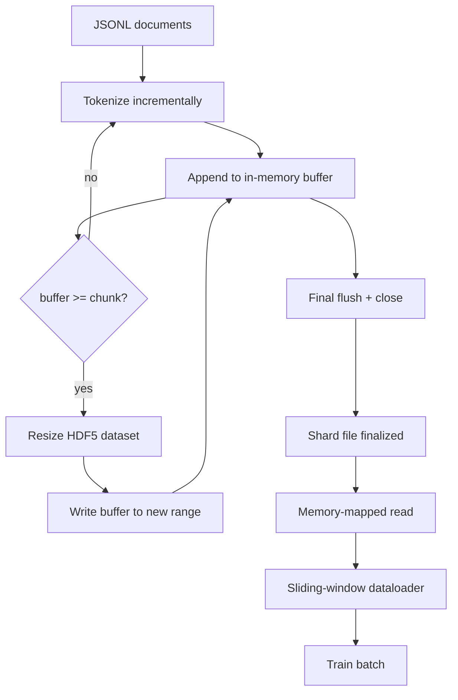

# 语料 HDF5 标记化体

> 导演可以以线路速度流动. 磁盘上的JSONL不能存活16个数据加载器工作者. 具有可变化,成片整数数据集的 HDF5确实是这样的. 这一课将流通标记化构建成可变大小的 HDF5 数据集,在多个文件中分断写,在训练时间内内存地图读取,以及一个滑动窗口数据加载器,以正确包装生成固定长度的序列.

> **【中文解读】**本节是人工智能工程的综合实战项目,集成前面学到的技术和方法.


**Type:** Build | **类型:** Build
**Languages:** Python | **语言:** Python
**Prerequisites:** Phase 19 lessons 30-37 | **前置知识:** Phase 19 lessons 30-37

>  前置轨B 14/20──轨C 第2节──
>  HDF5代币化语料 = "训练数据的航空餐车"――JSONL 在 16 个数据加载工作者 下不住――HDF5 可调整大小+分块整数数据集可以――流式代币化→可调整 HDF5→多文件分片写→训练时内存映射读→滑动窗口数据加载器 输出固定长度打包序列──
**Time:** ~90 minutes | **时间:** ~90 minutes

## 学习目标

- 通过确定性分量,将文件流入可变化HDF5整数数据集.
  中文翻译:将文件流入可变化HDF5整数数据集,使用确定性分量.
- 通过多个 HDF5 文件将写作分成碎片,使故障局限,并行性是可能的.
  中文翻译:将写作分开多个HDF5文件,使故障有限,并行性是可能的.
- 通过HDF5的页面缓存支持的分块布局来读取代码,以便数据加载器只在批量时间复制到批量缓冲器中.
  中文翻译:通过HDF5的页面缓存支持的分块布局重新阅读代币,以便数据加载器只在批量时间复制到批量缓冲器中.
- 执行一个滑窗数据加载器,以明确的包装规则发出固定长度的训练序列.
  中文翻译:实现一个滑窗数据加载器,它会发出固定长度的训练序列,并有明确的包装规则.

## 问题问题

> **【中文解读】**现代 LLM 训练以每秒数十万样本的速度读取代码,跨数十名工人. JSONL 在磁盘上无法存活第一张冷缓存页面缺失: JSON 解析慢,文档边界不可寻找,随时访问需要扫描文件.`tokens[start:stop]`切片,HDF5从页面缓存拷贝到NumPy 数组,成本只一次开放 fd 和每块 过渡一次系统调用.

> **【拓展：大规模训练数据格式对比】**简单但随机访问慢; 包装列存储压缩好但不适合代币流; HDF5随机访问快但生态较窄; 记忆图缩写 最快但需要连续内存――MosaicML (现数据) 使用MDS (Mosaic Data Silo) 格式――HuggingFace的`datasets`库使用Apache Arrow 内存格式配合内存映射――Meta 的LLaMA 训练使用自定义的二进制代币格式――LLM-foundry (MosaicML) 支持JSONL、Parquet 和 MDS 之间的无转换――磁盘上的JSONL在第一个冷缓存错误页面上死亡:JSON解析器缓慢,文档边界无法地址,寻求"样本4.217.884"需要扫描文件. 即使是压缩得很好,Parquet也不适合,因为教练不想要列,它想要一个平坦的代币流,

HDF5是合适的,因为它提供了一个零碎,可变化,仅整数的数据集,其零件在读取时是页面缓存友好的.`tokens[3,200,000 : 3,200,8192]`根据 HDF5 的数据,该文件的数据库将被转换为一个新分配的 NumPy 阵列.

> HDF5是合适的,因为它提供了一个零碎,可变量,仅整数的数据集,


构建问题是让写作方诚实. 易于滥用可变化数据集:一次写一份文件,HDF5文件被碎片化到无法使用. 写出所有文件,一个尺寸,一个过程死亡会失去整个碎片. 适当的纪律是缓冲,然后扩展, 缓冲尺寸与块尺寸相匹配,

> 构建问题是让写作方诚实. 易于滥用可变化数据集:一次写一份文件,HDF5文件被碎片化到无法使用. 写出所有文件,一个尺寸,一个过程死亡会失去整个碎片. 适当的纪律是缓冲,然后扩展, 缓冲尺寸与块尺寸相匹配,


## 概念的概念



### 适量化 HDF5 完成正确

创建标记数据集`maxshape=(None,)`并且是固定的`chunks=(chunk_size,)`通过在长度数Py阵列中缓冲代币来编写收入`chunk_size`当缓冲器填充时,数据集的尺寸将变为精确的`chunk_size`在最后的部分范围中,残余缓冲被写入最后的部分范围.除了最后一个,除了读者被要求在记录的时间中切断的,每个写作都是连接的和分别的.`token_count`在碎片的HDF5属性中.

> 创建代码数据集`maxshape=(None,)`并且是固定的`chunks=(chunk_size,)`通过在长度数Py阵列中缓冲代币来编写收入`chunk_size`当缓冲器填充时,数据集的尺寸将变为精确的`chunk_size`在最后的部分范围中,残余缓冲被写入最后的部分范围.除了最后一个,除了读者被要求在记录的时间中切断的,每个写作都是连接的和分别的.`token_count`在碎片的HDF5属性中.


### 碎片的写字

管道并行写分片:从19期课42中的每个输入分片产生一个HDF5输出分片.`shards.json`根据指标的数据,每个分片,文件路径,代币数量,文件数量,以及代币的 sha256.`shards.json`计算全球抵消和验证数据库.

> 一个单个HDF5文件是单个失败点.管道并行写出分片:从19期课42中的每个输入分片产生一个HDF5输出分片.`shards.json`根据指标的数据,每个分片,文件路径,代币数量,文件数量,以及代币的 sha256.`shards.json`计算全球抵消和验证数据库.


### 记忆图阅读

> **【中文解读】**训练时每个工人以`swmr=True`模式打开 HDF5 文件,请求`tokens[start:stop]`△HDF5的分块布局使热块成为页缓存支持的读取──工人不物化整个文件:切片被拷贝到数据加载器的批量缓冲器,然后拷贝到粘贴内存 训练张量──热路径每块 过渡一次系统调用,其余全部是 RAM 访问──

在培训期间,每个员工在 `swmr=True`模式和要求`tokens[start:stop]`HDF5 的零件布局使得当零件热时,该页面被缓存支持. 工作者从来没有实现整个文件:该片段被复制到数据加载器的批量缓冲器中,然后数据加载器在批量时间复制到固定内存训练子中. 热路每零件过渡时有一个系统调用;其余的一切都是RAM访问.

> 在培训期间,每个员工在 `swmr=True`模式和要求`tokens[start:stop]`现在,我们要去.


### 滑窗数据加载器

数据加载器是唯一知道训练序列长度的阶段. 它在全球代币流中选择一个随机启动指数,读`window_size + 1`代币和回报`(input, target) = (tokens[:-1], tokens[1:])`文件界限不被强制执行:一个窗口可以跨越两个文件,`boundary_token_id`模型学习使用分隔器.这是标准的包装规则;也是初学者忘记的规则,最终有一个8%,训练边界代币和92%自然文本的体积.

> 数据加载器是唯一知道训练序列长度的阶段. 它在全球代币流中选择一个随机启动指数,读`window_size + 1`代币和回报`(input, target) = (tokens[:-1], tokens[1:])`文件界限不被强制执行:一个窗口可以跨越两个文件,`boundary_token_id`模型学习使用分隔器.这是标准的包装规则;也是初学者忘记的规则,最终有一个8%,训练边界代币和92%自然文本的体积.


## 动手构建
```figure
cc-hdf5-corpus
```

## 建立它

`code/main.py`执行:

- `Tokenizer`对于演示,一个足够好的字节级确定性代币.`encode(text) -> list[int]`其他`vocab_size`现在,我们要去.
  翻译: 中文`Tokenizer`对于演示,一个足够好的字节级确定性代币.`encode(text) -> list[int]`其他`vocab_size`现在,我们要去.
- `HDF5ShardWriter`- 打开可变量整数数据集,缓冲代币到分片大小,重新大小并以固定大小的步骤写,记录`token_count`其他`sha256`像HDF5属性在接近.
  翻译: 中文`HDF5ShardWriter`- 打开可变量整数数据集,缓冲代币到分片大小,重新大小并以固定大小的步骤写,记录`token_count`其他`sha256`像HDF5属性在接近.
- `ShardedTokenizationPipeline`- 代输入文件,将它们转向编写器,并发出一个`shards.json`标记
  翻译: 中文`ShardedTokenizationPipeline`- 代输入文件,将它们转向编写器,并发出一个`shards.json`标记
- `MmapTokenStore`- 打开碎片文件用于内存映射的读取,计算全球偏移,暴露一个单个`get_slice(start, stop)`果.
  翻译: 中文`MmapTokenStore`- 打开碎片文件用于内存映射的读取,计算全球偏移,暴露一个单个`get_slice(start, stop)`果.
- `SlidingWindowDataloader`- 从全球流量中随机选择窗户,并产生收益`(input_ids, target_ids)`编号阵列.
  翻译: 中文`SlidingWindowDataloader`- 从全球流量中随机选择窗户,并产生收益`(input_ids, target_ids)`编号阵列.

文件底部的演示程序构建了一个小的内存体,将其分成两个片段,通过内存地图打开它们,运行数据加载器10批次,

> 文件底部的一个示范构建了一个小的内存体,将其分成两个片段,通过内存地图打开它们,运行数据加载器10批次,并打印每批次的形状和检查数量.


运行它:

```bash
python3 code/main.py
```

脚本从零开始,打印批量检查.

## 生产模式

> **【拓展：HDF5 在 AI 训练中的使用】**在深度学习中悠久历史. 在LLM训练中,Cerebras系统使用HDF5存储训练数据以利用其高效的I/O.HDF5的SWMR模式允许训练时在线写入新数据.

**Chunk size equals the typical read.**训练师说`window_size + 1`设置HDF5部分为倍数`window_size`错误的块将吞吐量减半,因为每个样本都触及了两个块.

**Token count in attributes, not in the dataset.**数据集的后部部分可能部分满,因为部分尺寸不划分文档边界.`token_count`没有这样的读者走出了结尾,进入零加密代币,模型学会了预测零.

**Sharded sha256 with parallel verification.**每个碎片都在代币字节上有自己的 sha256. 训练师可以在训练开始之前并行验证所有碎片. 一个错误的 sha256 失败于早跑,不是在16小时后的时代3

**`swmr=True` on both sides, with `libver="latest"` on the writer.**单字母多读器模式要求字母开启`libver="latest"`创建每一个数据集,然后设置`file.swmr_mode = True`之后,作家必须打电话.`dataset.flush()`读者工作者 (开启`swmr=True`) 查看一致的数据.`libver="latest"`结构变化后启用SWMR是"文件锁定"故障的常见来源.

## 用它使用方法

生产模式:

- **One HDF5 per source shard.**下载器 (课 42) 每个URL发出一个片段;标记 (本课) 每个源片段发出一个 HDF5. 1:1映射使恢复和部分故障恢复很无关.
  翻译: 中文**One HDF5 per source shard.**下载器 (课 42) 每个URL发出一个片段;标记 (本课) 每个源片段发出一个 HDF5. 1:1映射使恢复和部分故障恢复很无关.
- **Boundary token id.**边界令牌是代码符号词汇的一部分,是数据加载器注入的唯一令牌.如果模型应该忽略该令牌,训练损失会掩盖边界令牌;否则它会学习使用它作为序列分离器.
  翻译: 中文**Boundary token id.**边界令牌是代码符号词汇的一部分,是数据加载器注入的唯一令牌.如果模型应该忽略该令牌,训练损失会掩盖边界令牌;否则它会学习使用它作为序列分离器.
- **`shards.json` as the source of truth.**添加一个新的分片意味着写出HDF5,计算其sha256,并添加一个输入. 训练师在启动时读取文件,从来没有触及目录列表.
  翻译: 中文**`shards.json` as the source of truth.**添加一个新的分片意味着写出HDF5,计算其sha256,并添加一个输入. 训练师在启动时读取文件,从来没有触及目录列表.

## 发射上线

`outputs/skill-hdf5-tokenized-corpus.md`如何描述哪个代币器供应管道,哪个块尺寸匹配训练师的窗口,`shards.json`如何将数据加载人员分为文件. 这一课将引擎转载.

> `输出/技能-hdf5-托克化-体.


## 练习题

1. 添加一个`--compression gzip`标记到 HDF5 写字器,并测量在演示表上的吞吐量成本. 捍卫所选择的默认.
2. 加入一个确定性种子到滑动窗口数据加载器,并验证两个运行相同的种子产生的相同批量.
3. 添加一个`--validate`通过阅读每个碎片,重新计算 sha256 的代币,`shards.json`CI应该在训练开始之前检查这个.
4. 进行数据加载量比较, 按分量等于窗口大小的, 半个, 两倍. 报告页面缓存效果.
5. 添加一个`--max-document-tokens`为了避免在读取时决定, 应该采取行动.

## 关键词 关键词

| Term | What people say | What it actually means |
|------|-----------------|------------------------|
| Resizable dataset | "Append-only" | An HDF5 dataset with `maxshape=(None,)` that grows via `resize` calls in chunk-sized strides |
| Chunked layout | "How HDF5 stores it" | Fixed-size on-disk pages that the kernel can memory-map and the dataloader can read contiguously |
| `swmr` mode | "Read-while-write" | Single-Writer-Multiple-Reader mode that lets dataloader workers share the file safely |
| Shard index | "shards.json" | The durable index of all token shards with offsets and content hashes |
| Sliding window | "Training sample" | A fixed-length slice of the global token stream that the trainer pairs with its shift-by-one target |

## 继续阅读 继续阅读

- [HDF5 chunking documentation](https://support.hdfgroup.org/documentation/hdf5/latest/hdf5_chunking.html)- 这一课使用的数据集的零碎,可变量格式布局
- [h5py user guide](https://docs.h5py.org/en/stable/)- 对于 HDF5 的Python绑定
- [NumPy memory mapping](https://numpy.org/doc/stable/reference/generated/numpy.memmap.html)- 读取侧原始的HDF5通过h5py暴露
- 阶段19 · 42 - 输出本课标示的下载器
  中文翻译:阶段19 · 42 - - 这个课程的输出是标记的下载器
- 阶段19 · 44 - 消耗这个数据加载器的可西斯时间表
  中文翻译:阶段19 · 44 - 消耗这个数据加载器的可西因时间表
- 19 · 45 阶段 - 完成训练阶段的AMP循环
  中文翻译:阶段19 · 45 - 完成训练阶段的AMP循环
