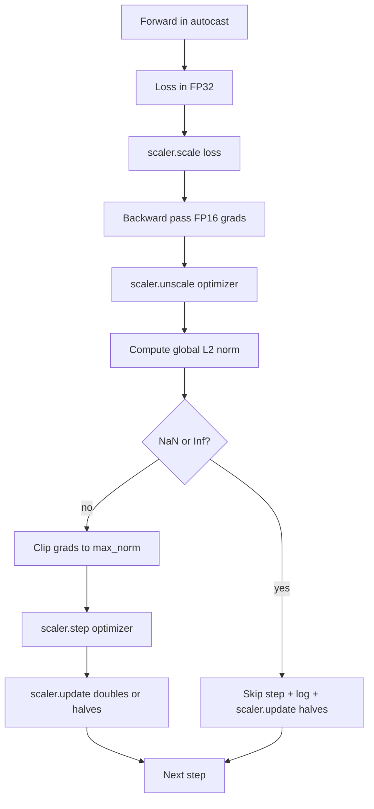

# 渐进式剪辑和混合精度

> 优化器和前课的时间表假设梯度是正常的. 他们通常不会. 只有一个坏批量可以使梯度标准增加三个级别. 混合精密训练通过在损失侧引入FP16过来加大这一点. 这一课构建了生产训练无法运输的两个安全带:降梯切割到配置的全球L2标准,以及混合精度循环,

> **【中文解读】**本节是综合项目,实现梯度剪裁和混合精度训练.


**Type:** Build | **类型:** Build
**Languages:** Python | **语言:** Python
**Prerequisites:** Phase 19 lessons 30-37 | **前置知识:** Phase 19 lessons 30-37

>  前置 轨迹B 16/20──轨迹C 第4节──
>  梯度剪+AMP = "训练的安全带"――生产训练离不开两个:梯度剪(全局 L2 范数) +混合精度(自动播放+级别Scaler 检测 NaN/Inf 干净跳过+记录尺度因子) ――单坏批量 能让梯度范数 3 个数量级,FP16 会放大溢出――
**Time:** ~90 minutes | **时间:** ~90 minutes

## 学习目标

- 计算全球L2标准在所有设置参数梯度和剪辑时超过配置的门.
  中文翻译:计算全球L2标准在所有参数梯度和剪辑时超过配置的门.
- 装一个训练步骤在自动除一个 GradScaler,这样FP16前后的传递存活过度.
  中文翻译:在自动装中装训练步骤加上GradScaler,以便FP16前后和后后的传输能够存活.
- 检测损失或梯度中NAN和INF,跳过优化步骤,并记录跳过.
  中文翻译:在损失或梯度中检测NaN和Inf,跳过优化器步骤,并记录跳过.
- 报道格拉德斯卡勒的扩展因素每一步,以便一个长时间的跳跃序列立即可见.
  中文翻译:每一步都报告GradScaler的扩展因子,以便立即看到长时间的跳跃序列.

## 问题问题

> **【中文解读】**训练中单批次梯度范数可能暴三个数量级――混合精度训练(FP16) 加剧了这个问题FP16的指数范围狭窄,梯度溢出变为inf,传播为NaN,最终导致所有权重变为NaN――解决方案是两个安全带:全局L2范数剪裁和GradScaler自动缩放――正确的操作顺序是:规模损失 -> 倒退 -> 不规模剪辑 -> 步骤 -> 更新,任何其他顺序都会导致静默错误循环――

> **【拓展：混合精度训练在 LLM 中的标准实践】**在NVIDIA的Megatron-LM框架中,GradScaler的缩放因子通常从2^16开始,在训练过程中动态调整.

训练昨天的运行, 产生损失曲线, 犯罪者是单一批量,其梯度标准为4,200, 没有切断,优化器应用一个步骤,重新设置模型在前一个小时中所做的每一个学习. 随着全球L2剪辑在1.0标准,同一个批量贡献单位标准更新;损失保持其趋势线;运行存活.

> 一个昨天的训练跑得清晰,产生了垂直的损失曲线, 犯罪者是单一批量,其梯度标准为4,200, 没有切断,优化器应用一个步骤,重新设置模型在前一个小时中所做的每一个学习. 随着全球L2剪辑在1.0标准,同一个批量贡献单位标准更新;损失保持其趋势线;运行存活.


通过计算前进传输和FP16中大部分后退传输,混合精密训练将吞吐量推高2-3倍. 成本是FP16的指数范围很窄. 在FP16中过的典型梯度以inf进行评估,该梯度通过后续层进行扩散为NaN,在下一个优化步骤中将每个重量设定为NaN. 通过在回转之前乘以一个大的扩展因子,并将梯度分为在优化步骤之前的同一个因子来解决这个问题. 如果任何梯度是Inf或NaN在不计时时,尺度仪跳过步骤并将尺度因子减半;如果前N步骤是清洁的,尺度仪将该因子翻倍. 在训练过程中,该因素发现了FP16范围允许的最高值.

> 通过计算前进传输和FP16中大部分后退传输,混合精密训练将吞吐量推高2-3倍.


按下下列列列表: 按下列列表: 按下列列表: 按下列列表: 按下列列表: 按下列表:`scaler.scale(loss).backward()`现在`scaler.unscale_(optimizer)`现在`clip_grad_norm_`现在`scaler.step(optimizer)`现在`scaler.update()`任何其他命令都会产生一个然破碎的循环.

> 按GradScaler的操作顺序是: 按GradScaler的操作顺序是:`scaler.scale(loss).backward()`现在`scaler.unscale_(optimizer)`现在`clip_grad_norm_`现在`scaler.step(optimizer)`现在`scaler.update()`任何其他命令都会产生一个然破碎的循环.


## 概念的概念



### 全球L2标准

> **【中文解读】**全局L2范数是所有参数梯度拼接后的欧几里得范数,而不是单个参数范数――PyTorch的`clip_grad_norm_`返回剪裁前的范数,用于诊断"我们是否在每一步剪裁"――训练语言模型时,剪裁值`max_norm = 1.0`是现代默认值 过大允许危险批次通过,过小导致噪音损失曲线.

全球L2标准是连接梯度向量的尤克利德标准,而不是每参数标准. PyTorch将此实现为`torch.nn.utils.clip_grad_norm_(parameters, max_norm)`函数返回预剪辑标准,以便课程可以记录自然和剪辑值,这是"我们在每一步剪辑"诊断所必需的.

> 总体L2标准是连接梯度向量的尤克利德标准,而不是每参数标准. PyTorch 实现这一标准为`torch.nn.utils.clip_grad_norm_(parameters, max_norm)`函数返回预剪辑标准,以便课程可以记录自然和剪辑值,这是"我们在每一步剪辑"诊断所必需的.


### 机器和GradScaler

`torch.amp.autocast(device_type)`是16财年FP中选择性运行可资格的运营 (大多数matmul类运营) 的环境管理者. `torch.amp.GradScaler(device_type)`测试的结果是: 测试的结果是: 测试的结果是: 测试的结果是: 测试的结果是: 测试的结果是: 测试的结果是: 测试的结果是: 测试的结果是: 测试的结果是: 测试的结果是: 测试的结果是: 测试的结果是: 测试的结果是: 测试的结果是: 测试的结果是: 测试的结果是: 测试的结果是: 测试的结果是: 测试的结果是: 测试的结果是: 测试的结果是: 测试的结果是: 测试的结果是: 测试的结果是:

> 火.


课程使用CPU自动cast,因为这是CI运行的;同样的模式通过改变将文字转移到CUDA`device_type="cpu"`为了`device_type="cuda"`CPU上的GradScaler是一个 (CPU自动播放器已经默认运行在BF16中,不需要损失扩展),但课程包括调用站点,因此线程与GPU循环相同.

> 课程使用CPU自动播放,因为这是CI运行的;同样的模式通过改变将文字转移到CUDA`device_type="cpu"`为了`device_type="cuda"`CPU上的GradScaler是一个 (CPU自动播放器已经默认运行在BF16中,不需要损失扩展),但课程包括调用站点,因此线程与GPU循环相同.


### 检测NAN和inf

> **【中文解读】**/Inf 检测在两个位置进行:1) 损失本身在后退前用`torch.isfinite`检查Inf/NaN 损失不产生有效梯度,直接跳过;2)`scaler.unscale_`后扫描非缩放梯度中的inf/NaN――两次检查覆盖了前向传播和反向传播的两种失败模式――

首先,损失本身是通过检查的.`torch.isfinite`由于在下列列列表中,在下列列列表中,`scaler.unscale_(optimizer)`课程扫描未测量的梯度`has_non_finite_grad(...)`两个检查一起涵盖前进通过和后退通过故障模式.

> 首先,损失本身是通过检查的.`torch.isfinite`由于在下列列列表中,在下列列列表中,`scaler.unscale_(optimizer)`课程扫描未测量的梯度`has_non_finite_grad(...)`两个检查一起涵盖前进通过和后退通过故障模式.


### 扩展因素诊断

> **【中文解读】**缩放因子是 GradScaler 的内部状态――健康训练中因子以2次的次上升至和和和和和和和和和和和和和和和和和和.

> **【拓展：梯度裁剪与缩放因子的协同调试】**在GPT-3规模训练中,Meta 和 OpenAI的工程师通过监测 GradScaler 缩放因子变化率来检测训练不稳定.如果缩放因子在一个时期内下降超过8倍,通常意味着学习率过高或数据中存在异常批量.

度因素是 GradScaler 的内部状态.`scaler.get_scale()`运行的健康运行显示了扩展因子在两强度上升,直到它接近`2^17`或`2^18`错误运行显示高值和低值之间的波动因素,这是一个信号,表明模型的梯度有时在范围内,有时不.

> 测量量量是GradScaler内部状态.`scaler.get_scale()`运行的健康运行显示了扩展因子在两强度上升,直到它接近`2^17`或`2^18`错误运行显示高值和低值之间的波动因素,这是一个信号,表明模型的梯度有时在范围内,有时不.


## 动手构建
```figure
grad-clip-monitor
```

## 建立它

`code/main.py`执行:

- `clip_global_l2_norm`- 一个包裹`torch.nn.utils.clip_grad_norm_`返回视频前和视频后的标准.
  翻译: 中文`clip_global_l2_norm`- 一个包裹`torch.nn.utils.clip_grad_norm_`返回视频前和视频后的标准.
- `has_non_finite_grad`- 扫描度的辅助器.
  翻译: 中文`has_non_finite_grad`- 扫描度的辅助器.
- `AmpTrainState`- 包装一个模型,一个`AdamW`显示一个 度,一个 度,一个 自動播放器.`step(inputs, targets)`通过缩,扩展和跳转NaN管道.
  翻译: 中文`AmpTrainState`- 包装一个模型,一个`AdamW`显示一个 度,一个 度,一个 自動播放器.`step(inputs, targets)`通过缩,扩展和跳转NaN管道.
- `StepLog`其他`SkipLog`- 结构化每步记录.
  翻译: 中文`StepLog`其他`SkipLog`- 结构化每步记录.
- 演示,训练一个小人.`nn.Linear`模型为20步,将Inf注入步骤5的梯度,以执行跳路,并打印结果日志.
  中文翻译:一个演示,训练一个小人`nn.Linear`模型为20步,将Inf注入步骤5的梯度,以执行跳路,并打印结果日志.

运行它:

```bash
python3 code/main.py
```

脚本从零开始,打印每步记录,每个行标记.`STEP`或`SKIP`至少一个行是`SKIP`现在,我们要去.

> 脚本从零出发,打印每步记录,每个行标记着`STEP`或`SKIP`至少一个行是`SKIP`翻译:


## 生产模式

> **【拓展：BF16 vs FP16 混合精度的选择】**2024年后发布的GPU(H100、B200、RTX 4090) 原生支持BF16,FP16的损失扩展 逐渐被淘汰了。BF16的指数范围与FP32相等,8位指数),不需要 GradScaler。LLaMA 2 和Mistral的训练使用BF16。但FP16仍然在旧硬件上使用,并且在某些场景下FP16的精度更高.

轮的四个模式将其提高到生产训练阶段.

> 四个模式将循环升级到生产训练阶段.


**Skip counter as an alert, not a log line.**训练跑每次跳过几步是健康的.每时代数百次跳过是一个严格的警报:模型在FP16无法忍受的状态下,循环默默失败.课程跟踪了1000步的滚动跳过速度,并在生产中,将在5%以上的速度上页.

**Clip threshold lives in the config.** `max_norm = 1.0`语言模型训练的现代默认标准. 首先,扫描它在一个小模型上;较大的门让模型从真正困难的批量中恢复;较小的门以更的损失曲线为代价,限制了最坏的情况.门属于与课程44中的YAML或JSON配置相同的时间表.

**Norm log goes to a CSV with the schedule.** CSV 列是`step, lr, grad_l2_pre_clip, grad_l2_post_clip, loss, skipped, skip_reason, scaler_scale`检查者在开放文件时会在一行中看到时间表,梯度故事,扩展因子和跳转结果 (理由). 分类列在文件中是错误排列分析的配方.

**`scaler.update()` runs every step, even on skip.**在一个清洁的步骤上,skalar读取其无信息计数,增加它,可能翻倍的因素.在一个跳过的步骤上,skalar将该因素减半,重新设置计数.忘记`update()`在跳转路径上,有"扩展因素从来没有改变"的错误.

## 用它使用方法

生产模式:

- **Autocast device matches optimizer device.** `torch.amp.autocast(device_type="cuda")`用于GPU训练;`torch.amp.autocast(device_type="cpu")`混合设备产生了沉默类型错误, 出现的损失曲线看起来很好, 但模型没有学习.
  翻译: 中文**Autocast device matches optimizer device.** `torch.amp.autocast(device_type="cuda")`用于GPU训练;`torch.amp.autocast(device_type="cpu")`混合设备产生了沉默类型错误, 出现的损失曲线看起来很好, 但模型没有学习.
- **Loss check before backward.** `torch.isfinite(loss).all()`节省纳米电气损失是整个训练步骤.
  翻译: 中文**Loss check before backward.** `torch.isfinite(loss).all()`节省纳米电气损失是整个训练步骤.
- **`set_to_none=True` in `zero_grad`.**设置梯度为`None`设置是免费吞吐量改进和微小的漏洞表面降低.
  翻译: 中文**`set_to_none=True` in `zero_grad`.**设置梯度为`None`设置是免费吞吐量改进和微小的漏洞表面降低.

## 发射上线

`outputs/skill-clip-amp.md`实际项目中,将描述训练阶段使用的剪辑门和自动播放设备,每个阶段的CSV在版本控制中存在哪里,以及生产跳速警报门是什么.

> `输出/技能剪辑放大.


## 练习题

1. 替换合成Inf注射以实际损失峰 (乘以1e8乘以一批的目标) 并验证跳转路的触发器.
2. 添加一个`--bf16`转换自动播放到BF16而不是FP16.BF16比FP16具有更广泛的指标范围,很少需要损失扩展;在同一演示中,验证跳转率下降到零.
3. 加入一个单位测试,证明在没有剪辑时,梯度剪辑包装正确返回剪辑前和剪辑后的标准.
4. 加入滚动窗口跳速计算和如果速度超过了配置的门,连续100步的运行失败的CLI标志.
5. 通过循环编写可行 CSV (`step, lr, grad_l2_pre_clip, grad_l2_post_clip, loss, skipped, skip_reason, scaler_scale`) 并通过每一行后刷清文件,确认文件存活Ctrl-C.

## 关键词 关键词

| Term | What people say | What it actually means |
|------|-----------------|------------------------|
| Global L2 norm | "Clip target" | Euclidean norm of the concatenated gradient vector across all trainable parameters |
| autocast | "Mixed precision" | Selective FP16 (or BF16) execution of eligible operations inside a `with` block |
| GradScaler | "Loss scaler" | Helper that multiplies the loss before backward and inverse-scales gradients before the optimizer step |
| Skip | "Bad step" | An optimizer step refused because the gradient or loss was non-finite; the scaler halves the factor |
| Scaling factor | "Scaler state" | The GradScaler's current multiplier; doubles after clean stretches and halves on every skip |

## 继续阅读 继续阅读

- [Micikevicius et al., Mixed Precision Training (arXiv 1710.03740)](https://arxiv.org/abs/1710.03740)- 损失规模提议
- [Pascanu, Mikolov, Bengio, On the difficulty of training recurrent neural networks (arXiv 1211.5063)](https://arxiv.org/abs/1211.5063)- 梯度切割参考纸
- [PyTorch torch.amp.GradScaler](https://docs.pytorch.org/docs/stable/amp.html)- 这课的规模化API
- [PyTorch torch.nn.utils.clip_grad_norm_](https://docs.pytorch.org/docs/stable/generated/torch.nn.utils.clip_grad_norm_.html)- 这课使用的剪切原始
- 阶段19 · 42 - 导入器,其体内为循环提供了输送
  中文翻译:阶段19 · 42 - 导入器的体积为循环提供
- 阶段19 · 43 - 循环所消耗的数据充电器
  中文翻译:阶段19 · 43 - 循环使用的数据加载器
- 阶段19 · 44 - 节目这个循环由
  中文翻译:阶段19 · 44 - 这个循环所组成的时间表
