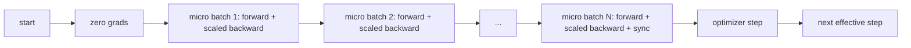
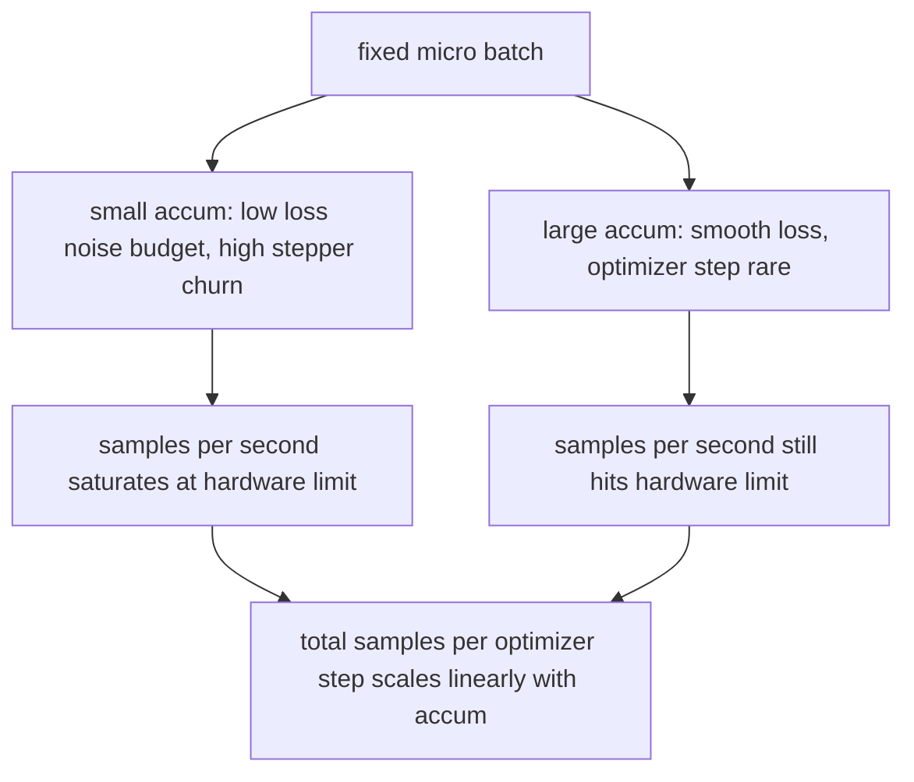

# 积累率的渐进.

> 训练一个有效的批量,你不能负担,一个微批量.

> **【中文解读】**本节是综合项目,实现梯度剪裁和混合精度训练.


**Type:** Build | **类型:** Build
**Languages:** Python | **语言:** Python
**Prerequisites:** Phase 19 lessons 42 to 45 | **前置知识:** Phase 19 lessons 42 to 45

>  前置轨B17/20──轨C 第5节──
>  梯度累积 = "穷人版大批"――使用买不起的有效批量 训练:一个微批量 一时――缩减损失+持有优化器步骤+让梯度堆积――多GPU不可得时模拟大批量标准技术――
**Time:** ~90 minutes | **时间:** ~90 minutes

## 学习目标

- 取出有效批量身份: `effective_batch = micro_batch * accum_steps`现在,我们要去.
  中文翻译: 推出有效的批量身份: `effective_batch = micro_batch * accum_steps`现在,我们要去.
- 实现每微批量损失规模化,使累积的梯度与单个全批次回归相匹配.
  中文翻译:实现每微批量损失缩小,使累积的梯度匹配单个全批次向后.
- 跳过优化器同步到最后一批微量 (同步最后一步).
  中文翻译:跳过优化器同步到最后一批微批次 (同步上最后一步).
- 读取一个吞吐量与有效批量曲线相比,并解释降低回报率.
  中文翻译:阅读一个吞吐量与有效的批量曲线,并解释降低的回报.

## 问题问题

> **【中文解读】**你想在有效批次512 下练习(损失曲线更平滑),但加速器只能容纳32个样本――梯度累积是自2017年以来的标准技巧:连续运行16次反向传播,让梯度在参数缓冲区累积,只有在达到目标时才执行优化器步骤――关键风险是损失缩小16个小批次交叉简单求和是完整批次的16倍,方向正确但幅度错误,优化器步骤长度16倍过大――修复只需要一次除法,但也最容易被遗忘.

> **【拓展：梯度累积在 LLaMA 和 GPT 训练中的关键作用】**在LLaMA 2 65B的训练中,每个GPU的微批次大小为4,通过梯度累积16步达到有效批次64(每GPU),再乘以数据并行度达到全局有效批次.GPT-3 175B的训练使用类似的策略:微批次0.5M代币,累积8步,全局有效批次3.2M代币.

由于损失曲线更平滑,而优化步骤在这个规模上更有意义. 在桌子上的加速器上,有32个例子, 两倍的批量不是一个选择. 减半模型不是一个选择. 现场在2017年实现的技巧是运行16次倒退传递,让梯度积累在参数缓冲器内,

> 你想在有效的512批量上训练,因为损失曲线更平滑, 在桌子上的加速器上,有32个例子, 两倍的批量不是一个选择. 减半模型不是一个选择. 现场在2017年实现的技巧是运行16次倒退传递,让梯度积累在参数缓冲器内,


没有扩展,梯度方向是正确的,但大小是错误的,优化步骤是16倍的太大.修复是一个分数.修复也是容易忘记的.

> 没有扩展,梯度方向是正确的,但大小是错误的,优化步骤是16倍太大. 修正是一个分数. 修正也是容易忘记的.


## 概念的概念



合同很短.

- 每个微批次的损失分为 `accum_steps`在之前`backward()`电器将梯度总算为`param.grad`按默认情况下, 分割将运行总额推回正确的规模.
  中文翻译:每一批微批的损失分为`accum_steps`在之前`backward()`电器将梯度总算为`param.grad`按默认情况下, 分割将运行总额推回正确的规模.
- 优化器步骤每次有效批次一次发射,最后一批微批次后退. 步骤中积累偏差每个参数,剩下的运行取决于.
  中文翻译:优化器步骤每有效批次一次发射,最后微批次后退. 步骤中积累偏差每个参数,其余的运行取决于.
- 优化器状态 (momentum buffers,Adam moments) 每个有效步骤都会一次进步,而不是每一个微批次.
  中文翻译:优化器状态 (momentum buffers,Adam moments) 每次有效步骤一次进步,而不是每次微批次.
- 在单个设备上,这是会计.在多级集群上,同样的模式将非最终的微批包裹在一个`no_sync`通过一个传输,最后一批微批减少了整个积累的梯度,而不是支付网络成本N倍.
  中文翻译:在单个设备上,这是会计.在多级集群上,相同的模式将非最终的微批包裹在一个`no_sync`通过一个传输,最后一批微批减少了整个积累的梯度,而不是支付网络成本N倍.

### 代码中的等效证明

> **【中文解读】**等价性证明:完整批次的前向/反向传播等价将批次分为N份,每份损失除以N后累积梯度.`param.grad`中,除法 N 使累积和回到正确尺度――优化器状态――动量缓冲、亚当矩) 每有效步骤只更新一次否则指数移动平均看错误频率――

> **【拓展：分布式训练中的 no_sync 模式】**在DDP (分布式数据并行) 中,每个非最终微量需要跳过梯度,减少通信.`model.no_sync()`上下文管理器实现了这一点. 在LLaMA 训练中,梯度累积步数为16小时,通信次数从16次减少到1次,显著降低了网络宽带消耗.

```python
loss = criterion(model(x_full), y_full)
loss.backward()
opt.step()
```

相当于

```python
for x, y in chunks(x_full, y_full, n):
    scaled = criterion(model(x), y) / n
    scaled.backward()
opt.step()
```

循环末积累的梯度缓冲器是单个全批后退产生的度.课程代码通过1e-4以下的最大abs差异来证明这一点.`equivalence_check`现在,我们要去.

> 起到浮点总数顺序.


### 价格上去哪里

> **【中文解读】**每个小批次消耗一次前向和一次反向传播――累积是用时间换内存每步优化器的墙钟时间翻倍,但梯度估计的方差减少了――文献将大批次和小批次视为不同的优化问题;本课的重点是力学而不是统计――关键权衡:加倍累积步数使优化器步骤频率减少了一半,但每步更稳定――

每个微批量成本一个向前和一个向后. 随着积累,你会以时间换取内存.`outputs/accum-curve.json`显示有效批量在固定微批量上成长时发生什么:

> 每个微批量成本一个前进和一个后退. 随着积累,你会换回时间的内存.`outputs/accum-curve.json`显示有效批量在固定微批量上成长时发生什么:




没有免费午餐.`accum_steps`通过测试,我们可以将每个优化器步骤的墙时间翻一番. 变化是梯度估计的差异性:在同一墙预算中,你做了更少的优化器步骤,但每个步骤都在更多样本中平均. 文献将大批量和小批量视为不同的优化问题;这里的教训是机械的,而不是统计的.

> 没有免费的午餐.


## 动手构建
```figure
cc-grad-accumulation
```

## 建立它

`code/main.py`它们可以执行三项操作.

> `code/main.py`它们可以做三个事情.


### 步骤1:等效检查

`equivalence_check()`函数比较优化器步骤前的梯度缓冲器和后的参数. 断言是`max_abs_diff < 1e-4`现在,我们要去.

> `equivalence_check()`建立两个相同网络的副本,


### 步骤2:最后步骤的同步模式

`train_one_optimizer_step`走微批次,除了最后一次进入`no_sync_context(model)`在单一过程中,文本是无操作的;在DDP上,这是降低所有的梯度被跳过的地方.`sync_counter`记录了我们离开了no_sync范围的数次;对于N微批次,数量为每个有效步骤的1次,而不是N.

> `train_one_optimizer_step`走着微型批量.


### 步骤3:输出曲线

`sweep_effective_batches`运行相同的模型,具有固定微批量和积累步骤列表.

> `sweep_effective_batches`运行相同的模型,具有固定微批量和积累步骤列表.


- `samples_per_sec`: 通过墙时间分为所见的样本总数
  翻译: 中文`samples_per_sec`: 通过墙时间分为所见的样本总数
- `median_step_ms`:每一步有效的50个百分点
  翻译: 中文`median_step_ms`:每一步有效的50个百分点
- `sync_calls`: 集体点
  翻译: 中文`sync_calls`: 集体点
- `avg_loss`:扫描的优化步骤中平均
  翻译: 中文`avg_loss`:扫描的优化步骤中平均

产量降落在`outputs/accum-curve.json`并且可从笔记本中重复使用.

> 产量降落`outputs/accum-curve.json`它们可以从笔记本中重复使用.


运行它:

```bash
python3 code/main.py
```

脚本打印了等效差,然后扫描表,然后JSON路径.

> 脚本打印了等效差,然后扫描表,然后JSON路径.


## 用它使用方法

> **【中文解读】**在生产训练中,梯度累积的公式是`accumulation_steps = effective_batch // (micro_batch * world_size)`△三种实践模式:1) 微批次大小选择为和设备内存的值;2) 有效批次由学习率调度决定(大批次需要缩小学习率和加热);3) 累积次数是连接的桥梁,也是唯一可以在运行中调整的旋转──

> **【拓展：线性缩放规则与大批次训练】**戈伊尔等人 (2017) 提出的线性缩放规则:当批次大小增加 k 倍时,学习率也应该增加 k 倍.

在生产训练中,梯度积累在一个后面.`accumulation_steps = effective_batch // (micro_batch * world_size)`您不允许使用的框架是相同的循环,但步骤是相同的:扩大损失,跳过非最终微信的同步,积累,步骤一次.

> 在生产训练中,梯度积累在一个后生活.`accumulation_steps = effective_batch // (micro_batch * world_size)`您不允许使用的框架是相同的循环,但步骤是相同的:扩大损失,跳过非最终微信的同步,积累,步骤一次.


野生动物的三个模式:

- 微批量是为了和设备内存的选择.任何更小的东西会浪费加速器周期.任何更大的东西会崩.
  中文翻译:微批量被选为和设备内存.任何较小的东西会浪费加速器周期.任何更大的东西会崩.
- 有效批次是从学习率时间表中选择的.大型有效批次需要扩大学习率和加热;这是自2017年以来所讨论的线性扩展规则.
  中文翻译:有效批次是从学习率时间表中选择的.大型有效批次需要扩大学习率和加热;这是自2017年以来所讨论的线性扩展规则.
- 积累数量是两个和唯一的按之间的桥梁, 在运行时, 您可以调节,
  中文翻译:积累数量是两个和唯一的按之间的桥梁,在运行时,你可以在没有重写数据加载器的情况下调整.

## 发射上线

`outputs/skill-gradient-accumulation.md`通过取食谱,一个同行可以将其放入一个新的 repo:`accum_steps`通过JSON,将优化器同步到非最终微信上,按有效批量进行一次优化器,将有效批量进行记录,以便交易可见.

> `产量/技能梯度积累.


## 练习题

1. 再进行扫描`--num-steps 100`根据实际批量,每秒的图片样本.
2. 添加错误的扩展变量 (没有分区),并在步骤1显示参数diff与参考.
3. 换取ADMW的SGD,并确认优化状态的进步每一步一次,而不是每次微批次一次.
4. 引入一个真正的`DistributedDataParallel`包装和路线`no_sync_context`确认同步调用每批量下降为N-1.
5. 修改等效检查,将两个不同的微分区 (2 x 8 vs 4 x 4) 进行比较,并解释您需要放松的任何宽容.

## 关键词 关键词

| Term | What people say | What it actually means |
|------|-----------------|------------------------|
| Micro batch | The batch you forward | The slice that fits in memory in a single forward pass |
| Accum steps | Backward passes per step | Number of backwards summed before one optimizer step |
| Effective batch | The batch | Micro batch times accum steps times data parallel world size |
| Loss scaling | Divide by N | Per-micro-batch division so summed gradients match full batch |
| Sync on last | Skip the rest | Only run the gradient collective on the last backward in the window |

## 继续阅读 继续阅读

- 关于Pytorch的文件`DistributedDataParallel.no_sync`对于生产版本的最后步骤同步技巧.
  中文翻译:PyTorch 文件`DistributedDataParallel.no_sync`对于生产版本的最后步骤同步技巧.
- 关于大型批次训练的线性扩展,
  中文翻译:Goyal等,2017年,关于大型批次训练的线性扩展,关心有效批次的正规原因.
- 火器对梯度积累相互作用的发射跟踪器,并进行混合精度的不扩展.
  中文翻译:PyTorch 问题跟踪器与混合精度不扩展的梯度积累相互作用.
- 第19阶段课程42至45课程涵盖了本课程所设的模型,数据加载器,优化器和培训者架构.
  中文翻译:第19阶段课程42至45课程涵盖了本课程所设的模型,数据加载器,优化器和培训者架构.
- 第19阶段课程47涵盖检查点和恢复,
  中文翻译:第19阶段课47涵盖检查点和恢复,因此长时间积累的运行可以存活墙钟盖.
