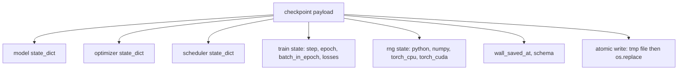
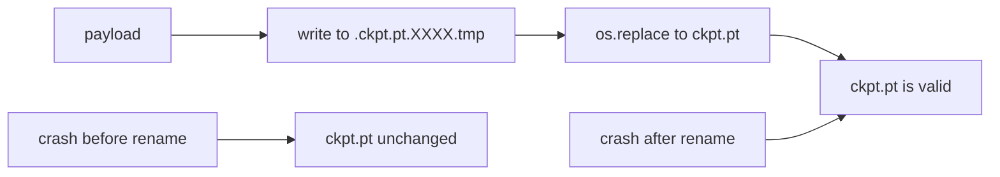
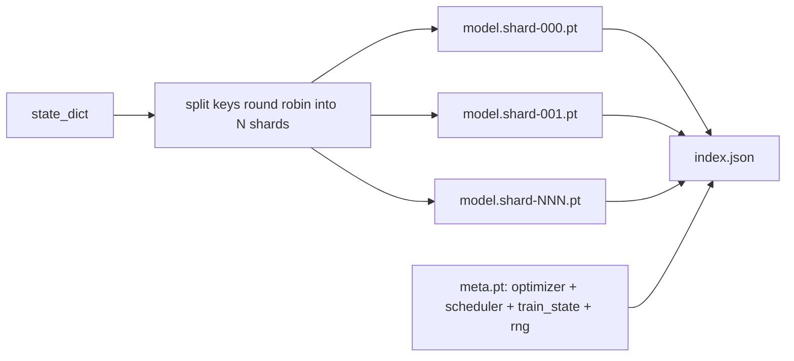

# 检查点保存和恢复

> 列车中断杀死运行;检查站让他们继续. 保存模型,优化器,调度器,损失历史,步数器和RNG状态,原子,所以杀死任何时候都会留下一个有效的文件在磁盘上.

> **【中文解读】**本节是全面项目,实现检查点保存和恢复.


**Type:** Build | **类型:** Build
**Languages:** Python | **语言:** Python
**Prerequisites:** Phase 19 lessons 42 to 45 | **前置知识:** Phase 19 lessons 42 to 45

>  前置轨B 18/20──轨C 第6节──15·16期 (检查点回滚) 的训练版──
> 检查点:模型+优化器+调度器+损失历史+步数计数器+RNG 状态随时被杀都能留在磁盘上有效文件。
**Time:** ~90 minutes | **时间:** ~90 minutes

## 学习目标

- 捕捉整个训练状态到一个有效载荷,可以重新加载到一个新的过程.
  中文翻译:将整个训练状态捕获到一个可重新加载到新的过程中的有效载荷中.
- 执行原子保存,然后重新命名,这样一个崩不会离开一个半写的文件.
  中文翻译:使用 write-to-temp实现原子保存,然后重新命名,以便崩永远不会留下半写的文件.
- 恢复Python,NumPy和PyTorch的RNG状态,以便简历后的损失与不间断的基线相匹配.
  中文翻译:恢复Python,NumPy和PyTorch的RNG状态,以便简历后的损失与不间断的基线匹配.
- 建立一个分断的检查点布局,用于不再适合单个文件的模型,
  中文翻译:为不再适合单个文件的模型构建一个分块化检查点布局,使用哈希验证的分块和JSON指数.

## 问题问题

> **【中文解读】**训练作业设置18小时但集群墙钟上限4小时,第11小时内核升级导致重启――没有检查点则从头开始,即使模型权重存活,AdamW动量矩也丢失了――正确的检查点包含五个状态桶:模型参数,优化器状态,调度器状态,训练计数器以及所有随机生成器 (RNG) 状态――没有RNG 状态,恢复后损失曲线是不同的曲线――原子保存通过先写入临时文件重新命名实现崩不会留下半写文件――

> **【拓展：检查点在 LLM 训练中的工程挑战】**通过JSON索引文件关联,每个GPU 写入自己的参数分片.同时,后台线程将检查点写入分布式文件系统,避免训练暂停.恢复时需要在数千个GPU 上并行加载分片,加载时间本身就是一个工程优化目标.

你设定了18小时的训练工作. 墙上钟盖是4小时. 集群在11点重新启动,因为一个高于你的薪水级别的人批准了内核升级. 没有检查站,你开始了. 没有简历,你也会失去学习前11小时的优化状态, 即使模型重量存活下来,

> 你设定了18小时的训练工作. 墙上钟盖是4小时. 集群在11点重新启动,因为一个高于你的薪水级别的人批准了内核升级. 没有检查站,你开始了. 没有简历,你也会失去学习前11小时的优化状态, 即使模型重量存活下来,


合适的文物是一个单个文件,包含所有需要的东西:模型参数,优化器状态,安排器状态,图片的损失历史,当前的步骤和时代和时代计数器, 没有RNG状态,恢复的损失曲线是不同的曲线. 同样的模型,相同的数据,不同的混动,不同的退出面具,不同的仪表板上的号码.

> 合适的文物是一个单个文件,包含所有需要继续的东西:模型参数,优化器状态,安排器状态,图片的损失历史, 没有RNG状态,恢复的损失曲线是不同的曲线. 同样的模型,相同的数据,不同的混动,不同的退出面具,不同的仪表板上的号码.


原子保存是合同的另一半.写入最终文件名意味着崩盘中写会留下一个腐败的文件;简历读取垃圾.写入同一目录中的临时文件,然后重新命名意味着崩盘中写会留下之前的好文件无损.在POSIX文件系统中,重新命名是原子的.

> 原子能救助是合同的另一半.


## 概念的概念



### 五个国家桶

| Bucket | Why it matters |
|--------|----------------|
| Model | Weights and buffers; what the model is. |
| Optimizer | Momentum and adaptive moments; without these the next step is a different optimization problem. |
| Scheduler | Where the learning rate is on its curve; cosine schedules in particular care. |
| Train counters | Step, epoch, batch-in-epoch, plus the loss history that draws the dashboard. |
| RNG state | Determinism for dropout, data shuffling, and any sampling inside the model. |

### 原子储存

> **【中文解读】**原子保存的两条规则:1) 临时文件和目标文件在同一目录中,确保重新命名在同一文件系统内(跨设备重新命名不是原子操作);2) 临时名称每次唯一,防止两个写者相互覆盖──崩在重命名发生时原文件不变,崩在重新命名发生后新文件已有效──



两个规则.第一,临时文件与目标存储在同一目录中,因此重命名保持在同一文件系统内;跨设备重命名不是原子的.第二,临时名称是单独的,因此两个作者不会踩脚.

> 两个规则.


### 碎片化检查站

> **【中文解读】**当模型变大时,单文件检查点太大无法快速加载,难以检查,网络共享阅读易出错. 分片方案将参数状态按轮询方式 (轮) 分布为N个分片,写入包含每个分片的JSON索引.

> **【拓展：分片检查点在 Megatron-LM 中的应用】**在恢复训练中,数千个GPU并行程阅读各自的分片,加载时间从几个小时降至分钟级. 这种模式也是 PyTorch FSDP的原生检查点格式.

当模型变得大时,单文件的有效载荷变得太大,无法快速加载,太大,无法检查,并且当网络在读中共享时,会太痛苦.

> 当模型变得大时,单文件的有效载荷变得太大,无法快速加载,太大,无法检查,并且当网络在读中共享时太痛苦.




索引记录碎片数量,每个碎片的 sha256 和 meta 文件的 sha256.当任何哈希不匹配时,加载器大声失败.碎片可以登陆不同的物理磁盘; meta 很小,首先读取.

> 索引记录碎片数量,每个碎片的 sha256 和 meta 文件的 sha256.当任何哈希不匹配时,加载器大声失败.碎片可以登陆不同的物理磁盘; meta 很小,首先读取.


### 简历继续中期

> **【中文解读】**恢复训练可以在时代中间继续,通过`(epoch, batch_in_epoch)`加 RNG 状态实现──加载后训练循环快进随机数生成器跳过当前时代 已耗尽的批次──本课代码严格实现此逻辑断恢复后的损失轨迹与未断基线在 1e-4 范围内一致──

简历可以追溯到下一个时代的开始,`(epoch, batch_in_epoch)`运行后,训练循环将随机数生成器快速推向过去,`batch_in_epoch`课程代码确实这样做; 声明是,恢复后的损失轨迹与1e-4内不间断的基线相匹配.

> 简历可以追溯到下一个时代的废物开始,从几分钟到一天.`(epoch, batch_in_epoch)`运行后,训练循环将随机数生成器快速推向过去,`batch_in_epoch`课程代码确实这样做; 声明是,恢复后的损失轨迹与1e-4内不间断的基线相匹配.


## 动手构建
```figure
cc-atomic-checkpoint
```

## 建立它

`code/main.py`提供4个原始和一个演示驱动程序.

### 步骤1:捕获和恢复RNG状态

`capture_rng_state`返回一个字符串的字符串.`random.getstate`,,,,,,,,,,,,,,,,,,,,,,,,,,,,,,,,,,,,,,,,,,,,,,,,,,,,,,,,,,,,,,,,,,,,,,,,,,,,,,,,,,,,,,,,,,,,,,,,,,,,,,,,,,,,,,,,,,,,,,,,,,,,,,,,,,,,,,,,,,,,,,,,,,,,,,,,,,,,,,,,`np.random.get_state`它们是PyTorch CPU和CUDA RNG字节.`restore_rng_state`处理器子是PyTorch的RNG知道如何消耗的8字节缓冲器.

> `capture_rng_state`返回一个字符的字符,用Python的 `random.


### 步骤2:原子储存

`atomic_save`写到目标目录中的临时文件,然后`os.replace`换成最后名字.`atomic_write_json`对于分碎的指数也是如此.

> `atomic_save`写入目标目录中的临时文件,然后 `os.


### 步骤3:完整的检查站回车

`save_checkpoint`包装模型,优化器,调度器,火车状态和RNG成一个单词. `load_checkpoint`转换后返回一个`TrainState`方案字段是升级:未来的格式变化将打破版本字符串和载荷器.

> `save_checkpoint`包装模型,优化器,调度器,火车状态和RNG,


### 步骤4:碎片变体

`save_sharded_checkpoint`通过 N 片段进行调整,将每个片段以其自己的原子保存编写,使用优化器,计划器和列车状态编写一个元文件,并使用 sha256s 编写JSON 指数. `load_sharded_checkpoint`在合并之前,检查每一个碎片.

> `save_sharded_checkpoint`通过 N 片段进行调整,将每个片段以其自己的原子保存编写,使用优化器,计划器和列车状态编写一个元文件,并使用 sha256s 编写JSON 指数.


### 步骤5:恢复演示

`run_resume_demo`列车的小型模型`total_steps`设置一个检查站`interrupt_at`后续进行.第二个过程恢复检查点并运行剩余步骤.函数返回两条损失轨迹之间的最大绝对差距.在恢复RNG时,差异为零或浮点噪音.

> `run_resume_demo`列车的小型模型`total_steps`设置一个检查站`interrupt_at`接着继续.


运行它:

```bash
python3 code/main.py
```

单档和分片的演示都在1e4下最大差异.`outputs/resume-demo.json`现在,我们要去.

> 单档和碎片的演示都在1e4下达到了最大差异.`outputs/resume-demo.json`翻译:


## 用它使用方法

> **【拓展：检查点策略在大规模训练中的权衡】**检查点频率是关键权衡:太频繁浪费 I/O 带宽(LLaMA 70B 检查点约140GB),太稀疏则崩时损失更多进度――工业实践:1) 每 N 步保存(N=1000 是常见值);2) 每 M 分钟保存(M=30 是常见值);3) 异步保存(训练继续,后台线程写检查点) ――PyTorch 的分布式样本和FSDP 的全_state_dict API 处理分布式环境下的检查点一致性只有排名 0 写入完整状态.

制作训练堆了作为训练器的一部分的船检查点. 形状相同:模型 + 优化器 + 计时器 + 计数器 + RNG,以原子形式写,以步骤命名,以便最新的位置容易找到. 碎片布局支持大型模型加载并行阅读; index.json 是这么做的.

> 生产训练集成船检查站作为训练员的一部分.


必须执行三个模式:

- **Schema is a string in the payload.**没有它,你不能在不打破旧运行的情况下演化格式.
  翻译: 中文**Schema is a string in the payload.**没有它,你不能在不打破旧运行的情况下演化格式.
- **Sha256 every shard.**沉默地缩短下载是最坏的错误;
  翻译: 中文**Sha256 every shard.**沉默地缩短下载是最坏的错误;
- **Keep checkpoint cadence honest.**保存每一个N步骤和每一个钟分钟,无论是较短的.否则长的步骤崩浪费了全窗口的工作.
  翻译: 中文**Keep checkpoint cadence honest.**保存每一个N步骤和每一个钟分钟,无论是较短的.否则长的步骤崩浪费了全窗口的工作.

## 发射上线

`outputs/skill-checkpoint-save-resume.md`任何新的训练脚本的配方:有效载荷形状,原子写,RNG捕获,碎片索引.`save_checkpoint`在定期保存地点,电线`load_checkpoint`在启动时,逃跑就能活下去.

> `输出/技能检查点-储存-续航.


## 练习题

1. 取代圆碎片的碎片,以参数组 (以 底层为`.weight`其他`.bias`什么时候最好?
2. 扩展保存循环,以保持最后的K检查点,并切割旧的.
3. 添加一个`--ckpt-every-seconds`标志会在墙钟间隔中触发一个保存,而不是仅仅是步骤计数.
4. 添加一个启动时运行的检查总数验证路径,扫描目录中的每个检查点,并报告哪些是腐败的.
5. 实施一个`migrate_v1_to_v2`函数将一个新的字段添加到有效载荷中,并将该方案字符串放大.

## 关键词 关键词

| Term | What people say | What it actually means |
|------|-----------------|------------------------|
| Atomic save | "Write and pray" | Write to a temp file in the same directory, then os.replace into the target name |
| State dict | "The weights" | Model parameters and buffers, keyed by parameter name |
| Sharded checkpoint | "Big model file" | Multiple files, one per shard, plus a meta file and a JSON index with sha256s |
| RNG state | "Random seed" | Captured state for python random, numpy, torch CPU, torch CUDA; not just the seed |
| Mid-epoch resume | "Restart" | Fast-forward the RNG and continue from the next batch in the same epoch |

## 继续阅读 继续阅读

- 子`rename`原子性学称`os.replace`根据
  中文翻译:POSIX `rename`原子性学称`os.replace`根据
- 关于 PyTorch 的文件`torch.save`其他`torch.load`包括`map_location`对于设备间的恢复.
  中文翻译:PyTorch文件`torch.save`其他`torch.load`包括`map_location`对于设备间的恢复.
- 阶段19课46涵盖了这个课程的检查点有效载荷的梯度积累.
  中文翻译:第19阶段的第46课涵盖了这个课程的检查点有效载荷的梯度积累.
- 第19阶段课时48涵盖了该方案适用于国家规定格式的分布式包装.
  中文翻译:第19阶段的第48课涵盖了该方案适用于状态规定格式的分布式包装.
- Linux内核`fsync`原子改名背后的耐用性保证文件.
  中文翻译:Linux内核`fsync`原子改名背后的耐用性保证文件.
