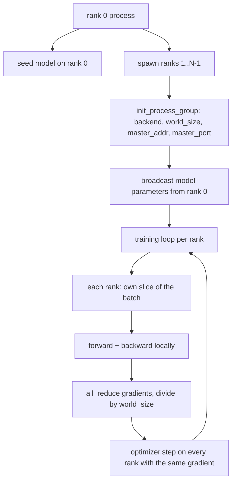
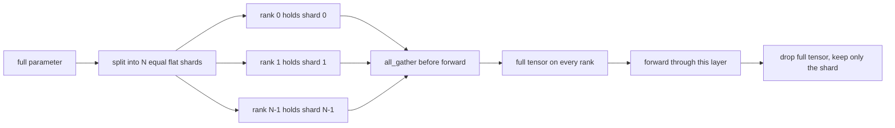

# 通过分发数据并行和FSDP从零分开

> 许多阶级的训练是两个集体和一个规则. 在启动时,将参数播放,

> **【中文解读】**本节是综合项目实现分布式训练FSDP/DDP.


**Type:** Build | **类型:** Build
**Languages:** Python | **语言:** Python
**Prerequisites:** Phase 19 lessons 42 to 45 | **前置知识:** Phase 19 lessons 42 to 45

>  前置B19/20的轨道.
>  多级 训练 = "两个集合通信+一条规则"――启动时广播参数+反向后平均梯度+永不许级对步数有分歧――DDP(数据并行) 和FSDP(完全分片数据并行) 都基于这个核心――
**Time:** ~90 minutes | **时间:** ~90 minutes

## 学习目标

- 通过N行列,与 `gloo`后端,没有特殊的硬件.
  中文翻译:将N列的过程组组组合起来`gloo`后端,没有特殊的硬件.
- 实现最小的DDP包装,在施工时发射参数,后退后完全降低梯度.
  中文翻译:实现最小的DP包装,在施工时播放参数,并将向后降低梯度.
- 证明每级梯度的全部减小与连接输入的单个过程梯度相匹配.
  中文翻译:证明每级梯度的全部降低与连锁输入的单个过程梯度相匹配.
- 图表FSDP参数分碎:每个排列都包含一个分片,全子被收集到前进的通过后落下.
  中文翻译:图表FSDP参数分碎:每个排列都包含一个分片,全子被收集到前进传递后.

## 问题问题

> **【中文解读】**模型可以安装在单个设备上,但数据集不能,优化预算要求每秒看N倍的样本――数据并行(DDP) 让每个级别在不同批次切片上运行相同的模型,然后平均梯度――FSDP 解决模型也不安装情况每个级别只保存部分参数,在前向传播时层次重建完整张量――关键风险:参数跨级别 漂移导致训练静态损坏;平均梯度但不平均损失导致仪表板说谎――

> **【拓展：DDP 和 FSDP 在 LLaMA 训练中的实际配置】**LLaMA 2 70B 使用FSDP 在 2000+ A100 GPU 上训练――每个 GPU 仅拥有约 35M 参数(70B / 2000),前向传播时通过全集重建完整层――PyTorch FSDP 的生产版本还包含:CPU卸载(将不活跃的分片卸载到CPU内存) 计算与通信重叠(在计算当前层时预占下层参数),以及选择性激活检查点以减少内存使用――

模型可以配合一个设备. 数据集没有. 优化预算说,你想看到N乘以每秒钟的例子. 第一个杆是数据平行:每个级别在不同批量的分片上运行相同的模型,然后在优化步骤之前平均梯度. 第二个杆是FSDP:模型也不适合一个设备,因此每个级别都包含每个参数的小部分,并在前进传递过程中重建了整个子层次.

> 模型适合一个设备. 数据集没有. 优化预算说,你想看到N乘以每秒钟的例子. 第一个杆是数据平行:每个级别在不同批量的分片上运行相同的模型,然后在优化步骤之前平均梯度. 第二个杆是FSDP:模型也不适合一个设备,因此每个级别都包含每个参数的小部分,并在前进传递过程中重建了整个子层次.


总体来说,如果一个人在一个数据库中找到一个数据库,那么它就会被运行.如果参数漂移到一个行列,运行就会沉默地腐败.如果你平均梯度,但不是损失,仪表板就会错误.如果集体后端不能同意一个拓学,运行将永远挂在上.解决办法是用手写集体一次,永远不要相信一个你不能复制的包装.

> 如果参数漂移到行列,运行会默默地腐败.如果你平均梯度,但不是损失,仪表板会撒谎.如果集体后端不能同意一个拓学,运行会永远挂在.解决办法是用手写集体一次,永远不要相信一个你不能复制的包装.


这堂课是通过CPU运行的.`gloo`任何PyTorch建造和接受的后端船`torch.multiprocessing`工人;同一个代码转换为 `nccl`在多GPU节点上,结构没有改变.

> 这一课运行在CPU上. CUDA不假设.`gloo`任何PyTorch建造和接受的后端船`torch.multiprocessing`工人;同一个代码转换为 `nccl`在多GPU节点上,结构没有改变.


## 概念的概念



### 两个重要集体

> **【中文解读】**分布式训练只需要三个集体通信操作:`broadcast`(从一个级别 复制张量到所有级别,用于参数初始化)`all_reduce`(跨级求和/平均张量,用于梯度同步)`all_gather`(每个级别 贡献一个张量,所有级别 获得拼接结果,用于FSDP重建参数) ――DDP的契约是构建时播放 + 反向传播后所有_减少――

| Collective | What it does | When |
|------------|--------------|------|
| `broadcast` | Copy a tensor from one rank to all others | Parameter init, scheduler state, any one-to-all sync |
| `all_reduce` | Sum (or mean, or max) a tensor across all ranks, every rank gets the result | Gradient averaging after backward |
| `all_gather` | Each rank contributes a tensor, every rank gets the concatenation | Logits collection, FSDP parameter unshard |

根据DDP合同`broadcast`在建筑和`all_reduce`后退. FSDP的草图补充`all_gather`在每个层向前过之前.

> 公司合同是`broadcast`在建筑和`all_reduce`后退. FSDP的草图补充`all_gather`在每个层向前过之前.


### 渐进平均相匹配单个过程渐进

> **【中文解读】**在B样本上使用N级训练模型,必须产生与单个过程在N*B样本上训练相同的梯度.关键洞察:将每个级别的梯度求和并除为N,给出平均损失梯度.`max-abs-diff < 1e-3`断言手动全减梯度与参考单个进程梯度一致.

训练在一批B样本中,在N级别中必须产生与一批N*B的单个过程训练相同的梯度. 技巧是,将每级别梯度加起来并将N分为N,给出了平均损失梯度,这就是交叉缩与平均减少将在整个批量中产生的结果.`max-abs-diff < 1e-3`在手动全降梯度和参考单程梯度之间.

> 一个模型在N级别的B组中训练的例子必须产生与N级别的N级别的单个过程训练相同的梯度. 技巧是,每级别梯度的总和和分为N,给出平均损失梯度,这是交叉缩与平均减少将在整个批量产生什么.课程代码证实这一点.`max-abs-diff < 1e-3`在手动全降梯度和参考单程梯度之间.


### FSDP的草图

> **【中文解读】**生产FSDP将与前层计算重叠,使墙钟成本远低于简单的估算. 本课程对每个参数进行回路并断定重建结果与原始比特级相等.

> **【拓展：FSDP vs Tensor Parallelism vs Pipeline Parallelism】**FSDP(ZeRO-3风格) 按层分片参数;光平行 (TP) 将单个矩阵乘法分成多个GPU;管道平行 (PP) 将不同层放在不同的GPU上.



记忆获胜精确:参数的每级记忆降至1/N.成本是聚,每次前进通过都会付出.生产FSDP与前层的计算重叠聚,因此墙钟成本比天真会计预测要小得多.课程在每个参数上进行回路,并声称重建与原始相等.

> 产量FSDP与前层的计算重叠,因此墙钟成本比天真会计预测要小得多.课程在每个参数上进行回路,并声称重建与原始相等.


### 处理器和暗黑后端

虽然CUDA是生产目标,但CPU上存在相同的代码路径.`gloo`它们的速度比 CPU 的速度慢.`nccl`课程过程组始化为`backend="gloo"`许多人都以此为代号.`torch.multiprocessing`而不是`torchrun`两者都在同一场比赛中结束`torch.distributed`在多GPU节点上,唯一的变化是`backend="nccl"`电气电气电气电气电气电气电气电气电气电气电气电气电气电气电气电气电气电气电气电气电气电气电气电气电气电气电气电气电气电气电气电气电气电气电气电气电气电气电气电气电气电气电气电气电气电气电气电气电气电气电气电气电气电气电气电气电气电气电气电气电气电气电气电气电气`torchrun`发射.

> 虽然CUDA是生产目标,但CPU上存在相同的代码路径.


## 动手构建
```figure
cg-allreduce-ring
```

## 建立它

`code/main.py`它们是可运行的文物.

### 步骤1:提起过程组

```python
os.environ["MASTER_ADDR"] = "127.0.0.1"
os.environ["MASTER_PORT"] = str(port)
dist.init_process_group(backend="gloo", rank=rank, world_size=world_size)
```

`MASTER_ADDR`其他`MASTER_PORT`课程选择一个自由的端口通过绑定和关闭技巧以避免碰撞,当多个运行共享机器.

> `MASTER_ADDR`其他`MASTER_PORT`每个级别都在同一宿主上拨号相同的端口.


### 工程工程中发射

`MinimalDDP.__init__`查看每个参数,缓冲器和调用`dist.broadcast(tensor, src=0)`没有这个,每个级别都以自己的种子开始,并且从第一步中分离.

> 〇最低的DPD.


### 步骤3: 倒退后完全减少梯度

```python
def all_reduce_grads_(module, world_size):
    for p in module.parameters():
        if p.grad is None:
            p.grad = torch.zeros_like(p.data)
        dist.all_reduce(p.grad.data, op=dist.ReduceOp.SUM)
        p.grad.data.div_(world_size)
```

每个排名都会得到相同的平均梯度.优化步骤现在是每个排名相同的输入函数,这就是为什么参数在运行过程中保持同步的原因.

> 每个排名最终具有相同的平均梯度.优化步骤现在是每个排名相同的输入函数,这就是为什么参数在运行中保持同步的原因.


### 步骤4:证明等效性

`manual_all_reduce_matches_single_process`构建相同模型在0级和比较后所有降低梯度与一个过程将计算的梯度在连接输入.最大-abs-diff是1e-8左右.

> `manual_all_reduce_matches_single_process`构建相同模型在0级,并将所有减产后梯度与单个过程在连接输入计算的梯度进行比较.


### 步骤5:FSDP回来旅行

`fsdp_round_trip_sketch`平每一个参数,平到一个倍数`world_size`按下列列,每一个列的重建是原始的.这是未分的步骤;反向 (在前后重新分) 是从收集的子中减掉的一片.

> `fsdp_round_trip_sketch`平每一个参数,平到一个倍数`world_size`片,片,片,片.


运行它:

```bash
python3 code/main.py
```

两个CPU进程产生,通过互动.`gloo`输出量为`outputs/ddp-demo.json`捕捉每位参数总数,所有减值后的梯度标准,FSDP回路结果和手动对参考梯度差异.

> 默认世界大小是2.


## 用它使用方法

> **【拓展：从 DDP 到 FSDP 到混合并行的演进路线】**小模型(<1B 参数) 只需要DP──中等模型(1-7B) 需要FSDP或ZeRO-3──大模型(70B+) 需要FSDP+度平行性+管道平行性的组合──PyTorch的FSDP在2.x版本已成为原生API,取代了FairScale的实现──Megatron-LM提供了TP+PP的参考实现──DeepSpeed的ZeRO优化器提供了FSDP的替代方案,增加了ZeRO-Offload,CPU卸载) 和ZeRO-Infinity(NVMe卸载) ──

生产训练堆都称之为原始人.`DistributedDataParallel`后退梯度,覆盖所有降低与后退,桶子所有降低,将几个小梯度结合成一个集体,`no_sync`文本课46使用.

> 生产训练堆也叫做原始人.


PyTorch的FSDP添加:每个层面的平面参数视图,因此每个层面都包含一个连接缓冲,下一个层的不分块和当前层的计算重叠,并为分块进行了可选的CPU脱载.

> PyTorch的FSDP添加:每个层面的平面参数视图,因此每个层面都包含一个连接缓冲,下一个层的不分块和当前层的计算重叠,并为分块进行了可选的CPU脱载.


发射时的形式保持不变, 后退后的数量减少,

> 发射时间保持相同,后退,减少参数,当它们不再合适时.


## 发射上线

`outputs/skill-distributed-fsdp-ddp.md`培训方案的配方: 起过程组`gloo`对于 CPU 和 `nccl`对于GPU,将模型包装在DDP中,在施工时播出并减少后退,可选地将参数分片用FSDP草图中的所有_集图案.

> `输出/技能分布-fsdp-ddp.


## 练习题

1. 走上`--world-size 4`确认参数扩散在整个运行中保持在1e-3以下.
2. 取代手动平均值为 `dist.all_reduce(op=dist.ReduceOp.AVG)`时间的差异.
3. 加入后退式子到DDP包装,使全减重叠与其余的后退;测量墙钟的改善.
4. 执行FSDP重碎步骤:在前进通过后,再次用本地碎片取代全子.确认每级内存下降.
5. 转换后端为`nccl`观察哪些环境变量改变,哪些保持不变.

## 关键词 关键词

| Term | What people say | What it actually means |
|------|-----------------|------------------------|
| Backend | "gloo or nccl" | The library that implements the collective ops; gloo is CPU, nccl is GPU |
| World size | "Total ranks" | Number of processes in the group; the group is the unit collectives operate on |
| Rank | "Worker id" | Process identifier within the group, zero indexed |
| All-reduce | "Sum the grads" | Sum a tensor across all ranks, every rank ends with the same result |
| Unshard | "Gather the params" | Reconstruct the full tensor from per-rank slices via all_gather |

## 继续阅读 继续阅读

- 火器`torch.distributed`对于集体语义来说,这本课依赖于的文档.
  中文翻译:PyTorch `torch.distributed`对于集体语义来说,这本课依赖于的文档.
- 其他`gloo`图书馆的集体列表,与CUDA支持的图书馆相同的形状`nccl`它们是原始的.
  中文翻译: `gloo`图书馆的集体列表,与CUDA支持的图书馆相同的形状`nccl`它们是原始的.
- 阶段19课46 对于梯积累模式,`no_sync`现在,我们要去.
  中文翻译:第19阶段的课程46 对于梯积累模式,`no_sync`现在,我们要去.
- 控制点布局的19期课47:DDP和FSDP运行.
  中文翻译:DDP和FSDP运行后的检查点布局的19阶段课47
-  PyTorch FSDP 文件,用于生产实施在这里描绘的参数碎片化.
  中文翻译:PyTorch FSDP文件用于生产实现在这里绘制的参数碎片.
