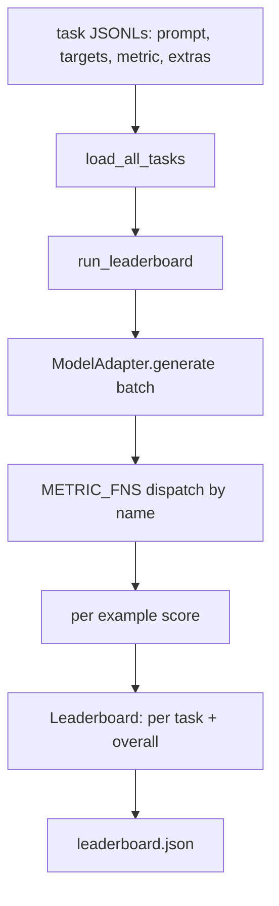
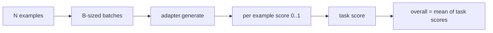

# 语言模型评估 运用 评估 线束

> 没有什么可能的模型是一个不确定性的模型, 运用一个简短的形式, 换成一个.

> **【中文解读】**本节是综合项目 构建代理线束循环和契约验证系统.


**Type:** Build | **类型:** Build
**Languages:** Python | **语言:** Python
**Prerequisites:** Phase 19 lessons 42 to 45 | **前置知识:** Phase 19 lessons 42 to 45

>  前置轨B20/20(轨C收官) ――LM 评估带――
>  评估 = "任务定义+指标+运行器+排行榜"――在无法定义任务上表现好的模型=偶然好――是这一切的统一可替换形态――整合19·42-48阶段的训练管线做评估――
**Time:** ~90 minutes | **时间:** ~90 minutes

## 学习目标

- 定义一个任务为一个JSONL文件`prompt`现在`targets`现在`metric`其他选择性`extras`举个例子.
  中文翻译:定义一个任务作为一个JSONL文件`prompt`现在`targets`现在`metric`其他选择性`extras`举个例子.
- 执行五个指标:精确匹配,Rouge-l F1,可执行的检查,多次选择,和子字符串含量.
  中文翻译:执行五个指标:精确匹配,红色-l F1,可执行的检查,多选项,和子字符串含量.
- 建立一个按任务进行批量的运行器,然后将其发送到可交换的模型适配器.
  中文翻译:构建一个运行器,按任务进行批量示例,并将其发送到可交换的模型适配器.
- 发出一个排名表 JSON 每项任务分数,延迟,和可复制的总体平均值.
  中文翻译:发出一个排名表 JSON 每项任务分数,延迟,和可复制的总体平均值.

## 问题问题

> **【中文解读】**每周都有新语言模型发布,营销声称性能优异,但真正的问题是:在哪个任务上优秀?没有评估线束,团队只能凭感觉比较两个模型.线束是昨天运行和今天运行之间的契约.

> **【拓展：lm-evaluation-harness 在 AI 行业中的地位】**基于它的构建,它支持HellaSwag、ARC、MMLU、TruthfulQA等核心基准. Meta 评估LLaMA 时使用定制版本,增加了代码生成和数学推理任务. 评估线束的设计原则是:适配器 (适配器) 是唯一与模型相关的代码,交换适配器影响任务和量度.

每周都有新的语言模型.营销声称它做得很好.诚实的问题是:在什么方面?诚实答案是你自己写的排名表,因为供应商的排名表是他们调整的.

> 诚实的问题是:在什么方面?诚实答案是你自己写的排名表,因为卖家的排名表是他们调整的.


没有一个带在你的 repo比较两个模型的振动.用一个带比较他们根据分数在一个固定任务组上,一个固定的指标,在一个JSON输出你可以区分.

> 在 repo 中使用一个带,你根据振动比较两个模型.用一个带,你根据固定任务组的分数进行比较,在一个固定的测量量度上,你可以区分.


陷是过度将带连接到单个模型. 解决方案是逆向的陷: 带足够小,可以在15分钟内读取,任务足够小,可以在备忘录中发送, 换个适配器,排名板移动;换个任务,排名板移动. 别的东西不应该移动.

> 陷是过度将带放在单个模型上. 解决方案是逆向的陷: 带足够小,可以在15分钟内读取,任务足够小,可以在备忘录中发送, 换个适配器,排名板移动;换个任务,排名板移动. 别的东西不应该移动.


## 概念的概念



### 任务规范

每个例子都是一个JSONL行:

```json
{"id": "arith-00", "prompt": "compute: 2 + 2", "targets": ["4"], "metric": "exact_match"}
```

对于需要助手的指标,`extras`携带侧面的有效载荷:

> 对于需要助手的指标,`extras`带着侧面的有效载荷:(翻译)


```json
{
  "id": "code-00",
  "prompt": "python: write a function f that doubles its input",
  "targets": ["ok"],
  "metric": "code_exec",
  "extras": {"io_pairs": [[1, 2], [3, 6]]}
}
```

任务是一个任务.`.jsonl`下面的文件`outputs/tasks/`文件名是任务名称. 文件中的所有例子都具有一个指标.

> 一个任务是一个`.jsonl`下面的文件`outputs/tasks/`文件名是任务名称. 文件中的所有例子都具有一个指标.


### 五项固定任务

> **【中文解读】**五个内置任务覆盖不同评估维度:算术(精确_匹配,标记 级正确性) 摘要(rouge_l,最长公共子序列 F1) 码执行(code_exec,输入输出对验证) 多选(多种_选择,首字母匹配) 生成(substring_contains,自由文本包含目标子串) ⋅code_exec 指标在剥离的构建 命名空间中执行预测断言`import os`我会失败.

| Task | Metric | What it tests |
|------|--------|---------------|
| arithmetic | exact_match | Token-level correctness on a deterministic answer |
| summary | rouge_l | Longest common subsequence F1 against a one-line reference summary |
| code-exec | code_exec | Executable test: the predicted function must satisfy a list of input-output pairs |
| multiple-choice | multiple_choice | First letter of the prediction must match an allowed letter |
| generation | substring_contains | Free-form text must contain at least one target substring |

### 计量合同

> **【中文解读】**每个量都是从`(prediction, targets, extras)`到了`[0.0, 1.0]`函数――线束将每个案例分数平均得到任务分数,再将任务分数平均得到总分分数――度数函数都极小:exact_match做小写和空白归结后比较相等性;rouge_l 计算最长的公共子序列的F1;code_exec 在受限命名空间执行预测并验证输入输出对――

每个指标都是从`(prediction, targets, extras) -> float in [0.0, 1.0]`杆平均每个例子分数,以获得任务分数,然后平均任务分数,以获得总数.

> 每个指数是从`(prediction, targets, extras) -> float in [0.0, 1.0]`杆平均每个例子分数,以获得任务分数,然后平均任务分数,以获得总数.


- `exact_match`基本面:小文字,白色空间崩,平等.
  翻译: 中文`exact_match`基本面:小文字,白色空间崩,平等.
- `substring_contains`标准化,子字符串测试.
  翻译: 中文`substring_contains`标准化,子字符串测试.
- `multiple_choice`首个字符上.
  翻译: 中文`multiple_choice`首个字符上.
- `rouge_l`: LCS长度以预测和参考长度,精度和召回F1分.
  翻译: 中文`rouge_l`: LCS长度以预测和参考长度,精度和召回F1分.
- `code_exec`: 执行预测在一个限制的名称空间,调用`f(x)`在每一个输出输入对, 计数匹配.
  翻译: 中文`code_exec`: 执行预测在一个限制的名称空间,调用`f(x)`在每一个输出输入对, 计数匹配.

代码_exec测量在一个剥离的内置命名空间中运行预测.课程测试表明`import os`爆炸是因为`os`文件系统不能从代码预测中访问.

> 测试测试表明,`import os`爆炸是因为`os`文件系统不能从代码预测中访问.


### 模型适配器

> **【中文解读】**适配器是评估线束的接(`generate(prompts) -> list[str]`是唯一的模型相关接口.`ToyAdapter`(对固定任务返回正确答案的确定性模式匹配器) 和`HttpAdapter`调用真实API的例子) 交换适配器,任务、量度和排行榜不变──

```python
class ModelAdapter(Protocol):
    def generate(self, prompts: Sequence[str]) -> List[str]: ...
    @property
    def name(self) -> str: ...
```

适配器是接,课程是船只.`ToyAdapter`根据该系统的定义,一个确定性模式匹配器,在五个固定任务中返回每一个提示的正确答案.一个真正的适配器调用模型并返回其输出.

> 适配器是接.课程船.`ToyAdapter`根据该系统的定义,一个确定性模式匹配器,在五个固定任务中返回每一个提示的正确答案.一个真正的适配器调用模型并返回其输出.


### 跑步者

`run_task`批量`batch_size`按时提示,并发送到测量函数. `run_leaderboard`完成每项任务,平均.`write_leaderboard`发射JSON与一个方案字符串,以便未来的格式变化不会默默打破仪表板.

> `run_task`批量`batch_size`按时提示,并向计数函数发送.




## 动手构建
```figure
eval-harness-matrix
```

## 建立它

`code/main.py`它们是可运行的文物.

### 步骤1:种子固定任务

`seed_fixture_tasks(target_dir)`写出五个`.jsonl`文件的第一批`main.py`在目录空时种种它们.

> `seed_fixture_tasks(target_dir)`字母是五 `.


### 步骤2:负载任务

`load_all_tasks(task_dir)`读到每一个`.jsonl`返回一个命令从任务名称到一个列表`Example`评论行开始于`#`没有空白的行列,以便贡献者可以注释文件.

> `load_all_tasks(task_dir)`读到每一个 `.


### 步骤3:实现指标

每个指标都是一个小函数,一个单元测试.课程的测试套件包括13个案例,包括正常化,部分重叠,代码执行和不安全的代码拒绝.

> 每个测量是一个小函数,具有单元测试.课程的测试套件包括13个案例,包括正常化,部分重叠,代码执行和不安全的代码拒绝.


### 步骤4:写出跑步

`run_task`代批量并产生一个`TaskResult`通过分数,正确的计算,总数和延迟.`run_leaderboard`完成所有任务并产生一个`Leaderboard`总体平均水平.

> `run_task`代批量并产生一个`TaskResult`通过分数,正确的计算,总数和延迟.


### 步骤5:发射JSON

`write_leaderboard`片的连载.`--include-per-example`标志将每例记录丢弃,以便你可以与前一次运行时的预测进行差异.

> `write_leaderboard`它们将板块串行.


运行它:

```bash
python3 code/main.py
```

脚本在第一次运行时种植装置,用玩具适配器 (它将每个装置都得到正确的),然后写`outputs/leaderboard.json`玩具适配器的总分为1.0, 玩具适配器的试验在`test_main.py`适配器不能回复时,相同的带产生0.0.

> 脚本在第一次运行时种植装置,用玩具适配器 (它将每个装置都得到正确的),然后写出`outputs/leaderboard.json`玩具适配器的总分为1.0, 玩具适配器的试验在`test_main.py`适配器不能回复时,相同的带产生0.0.


## 用它使用方法

> **【拓展：大语言模型评估基准的演进】**2024-2026年评估基准经历了显著变化:1)MMLU被证明存在数据污染,MMLU-Pro被提出替代;2)HumanEval 扩大为HumanEval+(增加测试用例);3)IFEval(指令遵循评估) 成为新标准;4)GPQA(研究生级问答) 取代ARC作为推理能力基准;5)LiveCodeBench 使用不断更新的LeetCode题目避免数据污染;.本课程的五项任务设计是这些杂基准的核心简化相同的结构原则,更小规模的复制.

为了连接一个真正的模型, 写一个适配器.

```python
class HttpAdapter:
    name = "vendor.v1"

    def __init__(self, endpoint, api_key):
        self.endpoint = endpoint
        self.api_key = api_key

    def generate(self, prompts):
        out = []
        for prompt in prompts:
            response = http_post(self.endpoint, prompt, self.api_key)
            out.append(response["text"])
        return out
```

换换`ToyAdapter`为了`HttpAdapter`在顶部`main()`杆,任务,指标和排名表保持不变.

> 换换`ToyAdapter`为了`HttpAdapter`在顶部`main()`现在,我们要去.


在一个真正的项目中,在运送带时必须执行三个模式:

> 在一个真正的项目中,在运送带时必须执行三个模式:(翻译)


- **Pin the task files.**排名板.json 包含哈希嵌任务内容或它携带JSONLs;否则,任务文件在执行时,分数会移动,而您无法确定哪个.
  翻译: 中文**Pin the task files.**排名板.json 包含哈希嵌任务内容或它携带JSONLs;否则,任务文件在执行时,分数会移动,而您无法确定哪个.
- **Diff predictions, not just scores.**其他`--include-per-example`标志让你看到模型在分数下降的那天说什么.
  翻译: 中文**Diff predictions, not just scores.**其他`--include-per-example`标志让你看到模型在分数下降的那天说什么.
- **Cap the batch size.**实际适配器的速度限制. 较小的批量量使得连接器在供应商之间保持兼容性.
  翻译: 中文**Cap the batch size.**实际适配器的速度限制. 较小的批量量使得连接器在供应商之间保持兼容性.

## 发射上线

`outputs/skill-lm-eval-harness.md`包含配方:JSONL任务规格,五个指标,可交换的适配器,批量运行器,排名表 JSON 与方案字符串.`outputs/tasks/`它们是固定装置, 它们可以作为一个真正的项目.

> `输出/技能-lm-eval-harness.


## 练习题

1. 添加一个第六个任务,使用一个自定义的指标,你从零开始写 (像BLEU的重叠,像BLEURT的参考分数,任何有明确的合同).
2. 延长时间`code_exec`捕获击和接受预期击的目标列表.
3. 添加一个排名表差命令:给了两个 `leaderboard.json`文件,打印哪些任务移动,以及多少.
4. 缩适配器调用时间;单独地表面`timeouts`在排名表中列.
5. 按排名表中的 sha256 标签,以便未来的读者可以验证他们取得了相同的任务.

## 关键词 关键词

| Term | What people say | What it actually means |
|------|-----------------|------------------------|
| Task spec | "The eval format" | JSONL file with prompt, targets, metric, optional extras per example |
| Metric | "How you score" | Function from (prediction, targets, extras) to a float in [0, 1] |
| Adapter | "The model client" | Object with a generate(prompts) -> list[str] method; the only model-specific code |
| Leaderboard | "The scoreboard" | JSON with per-task scores, total counts, latency, and an overall average |
| Code exec metric | "Run it and check" | Execute the prediction in a restricted namespace, compare against input-output pairs |

## 继续阅读 继续阅读

- 生产参考原始lm评估,大得多,但形状相同.
  中文翻译:原始的lm评估用于生产参考,大得多,但形状相同.
- 为了实现同样的合同,HuggingFace的轻松.
  中文翻译:HuggingFace为另一个实施同一个合同提供了轻松的支持.
- 阶段19课46涵盖了训练堆中使用的梯度积累模式.
  中文翻译:第19阶段课46涵盖了训练堆和杆分数中使用的梯度积累模式.
- 阶段19课时47课时,你将分数的检查点格式进行分析.
  中文翻译:第19阶段课47涵盖了你得分的检查点格式; 入排名表中的检查点哈希.
- 第19阶段课时48涵盖了测试模型的分布式训练堆.
  中文翻译:第19阶段的48课涵盖了测试模型的分布式训练堆.
