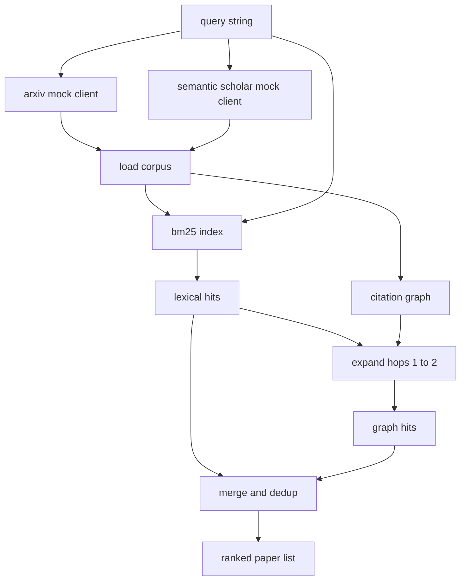

# 文献检查

> 假设是便宜的.知道有人是否已经证明了它是昂贵的部分. 在跑步者把沙盒翻到上面之前,建立一个回收层来回答这个问题.

> **【中文解读】**本节是综合项目,实现文献检查.


**Type:** Build | **类型:** Build
**Languages:** Python | **语言:** Python
**Prerequisites:** Phase 19 Track A lessons 20-29 | **前置知识:** Phase 19 Track A lessons 20-29

>  前置轨道D 2/8──参考阶段11·14-17(RAG 检索)──
>  文献检索 = "避免重复造轮子"――假设很便宜,知道有人是否证明才是贵的部分――在沙箱 跑实验前必须先建立检索层回答这个问题――
**Time:** ~90 minutes | **时间:** ~90 minutes

## 学习目标
- 模拟一个小的纸张记录, 循环将下游读取的字段.
  中文翻译:模拟一个小的纸张记录,循环将在下游读取的字段.
- 仅使用stdlib数据结构的摘要而建立BM25指数.
  中文翻译:仅使用stdlib数据结构的摘要构建BM25指数.
- 通过引用图表, 填写文件, 词汇搜索错过.
  中文翻译:在引用图表上行走,
- 复制字母,图表通过稳定的纸标.
  中文翻译:翻译翻译翻译翻译翻译翻译翻译翻译翻译翻译翻译翻译翻译翻译翻译翻译翻译翻译翻译翻译翻译翻译翻译翻译翻译翻译翻译翻译翻译翻译翻译翻译翻译翻译翻译翻译翻译翻译翻译翻译翻译翻译翻译翻译翻译翻译翻译翻译翻译翻译翻译翻译翻译翻译翻译翻译翻译翻译翻译翻译翻译翻译翻译翻译翻译翻译翻译翻译翻译翻译翻译翻译翻译翻译翻译翻译翻译翻译翻译翻译翻译翻译翻译翻译翻译翻译翻译翻译翻译翻译翻译翻译翻译翻译翻译翻译翻译翻译翻译翻译翻译翻译翻译翻译翻译翻译翻译翻译翻译翻译翻译翻译翻译翻译翻译翻译翻译翻译翻译翻译翻译翻译翻译翻译翻译翻译翻译翻译翻译翻译翻译翻译翻译翻译翻译翻译翻译翻译翻译翻译翻译翻译翻译翻译翻译翻译翻译翻译翻译翻译翻译翻译翻译翻译翻译翻译翻译翻译翻译翻译翻译翻译翻译翻译翻译翻译翻译翻译翻译翻译翻译翻译翻译翻译翻译翻译翻译翻译翻译翻译
- 包裹两个假的外部API在一个客户端后面,以便当真正的终端点登陆时,上游调用站点保持相同.
  中文翻译:将两个假的外部API包在一个客户端后面,以便当真正的终端点登陆时,上游调用站点保持相同.

## 为什么两个检索通过

> **【中文解读】**关键词搜索覆盖大多数词汇匹配,但遗漏两种情况:基础论文使用不同词汇(如搜索"散率注意力"错过了标题"变压器路由中的区块选择"的论文),以及相关论文是已知点的后续引用――本课构建两阶段检索:BM25 词汇搜索 + 引用图谱遍历(1-2跳),合并重重后按综合分数排序――

> **【拓展：学术检索在 AI 科研自动化中的应用】**语义学者推系统使用类似的混合检查策略:词汇匹配 + 引用图谱 + 知识图谱――Sakana AI 的"AI科学家"使用语义学者 API 进行文献检查――Google Scholar 的 PageRank 变体 ((称为 ScholarRank) 也结合了引用网络拓和文本相似性――本课从零构建的BM25+ 引用图谱组合是这些工业系统的核心简化版本――

总结中搜索关键字会返回与查询共享词汇的论文. 这覆盖了大部分表面. 没有两个案例. 首先是基础论文使用不同的词汇库;例如"稀疏注意"的查询错过了题为"变压器路由中的区块选择"的论文.

> 一个关键字搜索回报的论文与查询分享词汇. 这覆盖了大部分表面. 没有两个案例. 首先是基础论文使用不同的词汇库;例如"稀疏注意"的查询错过了题为"变压器路由中的区块选择"的论文.


课程构建了两个传递.BM25在摘要中捕获了词汇的打击.引用图的穿越扩大了前后的种子,一个或两个跳跃.联盟由纸 ID 复制并由一个小的组合分数排名.

> 课程构建了两个传递.BM25超过摘要捕获了词汇的打击.引用图的穿越扩大了前后的种子一两个跳.联盟由纸 id 减倍,由一个小的组合分数排名.


## 纸质的形状

> **【拓展：学术知识图谱在 AI 科研中的价值】**语义学家的知识图谱包含200亿+论文,20亿+引用关系――它不仅支持关键词检索,还支持:1)TLDR自动摘要;2)影响力预测;3) 研究趋势检测――本课的论文 结构是语义学家论文记录的教育性简化 同样的字段 ((id、标题、摘要、引用、引用),更小的规模――

```text
Paper
  id          : str           (stable identifier, "p001" for the mock corpus)
  title       : str
  abstract    : str
  year        : int
  authors     : list[str]
  references  : list[str]     (paper ids this paper cites)
  citations   : list[str]     (paper ids that cite this paper)
  source      : str           (which mock api supplied it, "arxiv" or "s2")
```

两个假 API 返回重叠但不相同的字段,因此体载体将它们结合在`id`现在,我们要去.

> 两个假 API 返回重叠但不相同的字段,因此体载体将它们结合在`id`现在,我们要去.


## 建筑,建筑
```figure
cg-citation-hops
```

## 建筑



检索客户端拥有通过和合并.调用者向其提交一个查询,并返回一个排名列表,每个输入包含每张纸质分数字段 (`bm25_score`现在`graph_distance`现在`recency_score`现在`final_score`) 解释了排名.

> 调用客户端拥有通过和合并.调用客户端将给其一个查询,并返回一个排名列表,每个输入包含每张纸质分数字段 (`bm25_score`现在`graph_distance`现在`recency_score`现在`final_score`) 解释了排名.


## 从零开始BM25

> **【中文解读】**BM25 的实现使用标准 Okapi 公式,默认参数 k1=1.5, b=0.75──索引由两个字典组成:`term -> doc_frequency`和 `term -> list of (doc_id, term_count)`△评分公式对查询词求和 `idf * tf_norm`文档长度归归化.分词器只做小写化和非字母数字分割,不做词干提取.

实现是标准 Okapi BM25 具有默认参数`k1=1.5`现在`b=0.75`索引是两个词典:`term -> doc_frequency`其他`term -> list of (doc_id, term_count)`文件长度是抽象的代号数量.平均文件长度在索引构建时间计算一次.查询的分数是查询术语的总和.`idf * tf_norm`在哪里`tf_norm`是标准BM25长度标准化术语频率.

> 实现是标准的Okapi BM25 具有默认参数`k1=1.5`现在`b=0.75`索引是两个词典:`term -> doc_frequency`其他`term -> list of (doc_id, term_count)`文件长度是抽象的代号数量.平均文件长度在索引构建时间计算一次.查询的分数是查询术语的总和.`idf * tf_norm`在哪里`tf_norm`是标准BM25长度标准化术语频率.


标志者是`lower`产品系统将在一个小的选民中交换. 接口保持不变.

> 标记器是`lower`产品系统将在一个小的选民中交换. 接口保持不变.


```text
idf(t)      = log((N - df + 0.5) / (df + 0.5) + 1.0)
tf_norm(t)  = (f * (k1 + 1)) / (f + k1 * (1 - b + b * dl / avgdl))
score(d, q) = sum over t in q of idf(t) * tf_norm(t)
```

## 引用图的穿越

> **【中文解读】**引用图谱从语料库一次构建――前向边向论文指向其参考文献,后向边向论文指向引用论文――遍历是从BM25命中种子发出的广度优先搜索,限制2跳――一跳太浅,三跳在连通图上爆炸且容易偏离主题――跳数限制可配置――

图表是从体积中构建的.前边从纸到其参考.后边从纸到其引用.穿越是由顶部BM25击中种植的宽度首次搜索,在两个跳转上.

> 图表从图库中构建一次.前边从纸到其参考.后边从纸到其引用.穿越是一个宽度的首次搜索,由顶部BM25击中,在两个跳转上.


两个跳跃是故意的天花板.一个跳跃太浅;代理人经常想要直接的祖先或后代.三跳跃在连接的图表上爆炸结果大小,并倾向于偏离主题.课程暴露了跳跃极限作为一个配置按,因此下游循环可以紧缩它.

> 两次跳跃是故意的天花板.


## 排名和排名

> **【中文解读】**两阶段检索返回重叠集合,合并以论文 id 为键重.最终分数是三个加权和:归结 BM25 分数(重量 0.5) 图谱分数(直接命中 1.0,一跳 0.6,两跳 0.3,重量 0.3) 时效分数(年线性插值,重量 0.2) 权重可配置,过时话题可降低时效重,快速发展的领域可提高──

> **【拓展：混合检索在 RAG 系统中的应用】**本课的BM25+图谱混合检查策略与RAG(恢复-增强代) 系统中的混合检查异曲同工――Pinecone 和 Weaviate等向量数据库都支持"关键词 + 语义向量"混合搜索――在学术RAG系统中,论文引用图谱作为结构化知识来源,比纯向量搜索更擅长发现间接相关文献――

两张传递返回重叠的集合. 合并键在纸 ID 上. 每张纸的最终分数是权重的混合.

> 通过TWo,返回重叠集合. 合并键在纸 ID上. 对于每个纸,最终分数是权重混合.


```text
final_score = w_bm25 * bm25_score_norm
            + w_graph * graph_score
            + w_recency * recency_score
```

`bm25_score_norm`是BM25分数,由合并集中的最大BM25分数 (所以该场在零到一中生活). `graph_score`现在,我们可以说,`0.6`对于一个跳跃,`0.3`两次跳跃,否则是零.`recency_score`是从零的线性坡道在体积最小年到最大的1年.

> `bm25_score_norm`是BM25分数,由合并集中的最大BM25分数 (因此该场在零到一中生活).


默认权重是`0.5`现在`0.3`现在`0.2`时代主题可能会调低近期,而快速移动的主题则会提升它.

> 默认权重为 `0.


## 假冒的体体

百份论文由由`build_corpus()`每篇论文都有五个主题中的一个手写标题和摘要:注意力稀缺性,检索增强性,低级适配器,数据集蒸和评估链.参考和引用是有线的,因此每个主题形成了一个连接的子图,有几个跨主题边缘.

> 百份论文,由`build_corpus()`每篇论文都有五个主题中的一个手写标题和摘要:注意力稀缺性,检索增强性,低级适配器,数据集蒸和评估链.参考和引用是有线的,因此每个主题形成了一个连接的子图,有几个跨主题边缘.


两个假的API客户端 (`ArxivMockClient`现在`SemanticScholarMockClient`) 从同一组中读取,但暴露不同的领域.Arxiv返回标题,摘要,年份,作者.语义学者添加引用和引用.查找客户联盟在id;跨客户领域的不同意见处理被推迟到后续课程.

> 两个假的API客户端 (`ArxivMockClient`现在`SemanticScholarMockClient`) 从同一组中读取,但暴露不同的领域.Arxiv返回标题,摘要,年份,作者.语义学者添加引用和引用.查找客户联盟在id;跨客户领域的不同意见处理被推迟到后续课程.


## 第52和53课中,我们读到什么?

五十二课中的跑者读`paper.id`现在`paper.title`试验的背景是抽象的前三句话.`paper.year`其他`paper.references`对于特定论文来说,

> 跑步者在课52读`paper.id`现在`paper.title`试验的背景是抽象的前三句话.`paper.year`其他`paper.references`对于特定论文来说,


检索客户端返回一个`RetrievalResult`运行者记录这些数据,以便下游可观测度通过可以随时间来绘制质量.

> 检索客户端返回一个`RetrievalResult`运行者记录这些数据,以便下游可观测度通过可以随时间来绘制质量.


## 如何读取代码

`code/main.py`定义`Paper`现在`ArxivMockClient`现在`SemanticScholarMockClient`现在`BM25Index`现在`CitationGraph`现在`RetrievalClient`模拟客户端和体积都在同一文件中,所以课程保持可移植.BM25实现是一个类,六十行.图形穿越是一个方法.

> `代码/主


`code/tests/test_retrieval.py`包含词汇路径,图形路径,合并,减值和空查询.

> `code/tests/test_retrieval.py`涵盖词汇路径,图形路径,合并,减值和空查询.


## 在哪里这个插槽

第五十课产生假设. 第五十一课搜索文献,看看假设是否已经解决. 第五十二课运行实验,如果不是. 第五十三课阅读检索结果和实验指标,以写出判决.检索客户端是四个阶段中最便宜的,并在乐器中运行第一.

> 五十课产生了一个假设.

