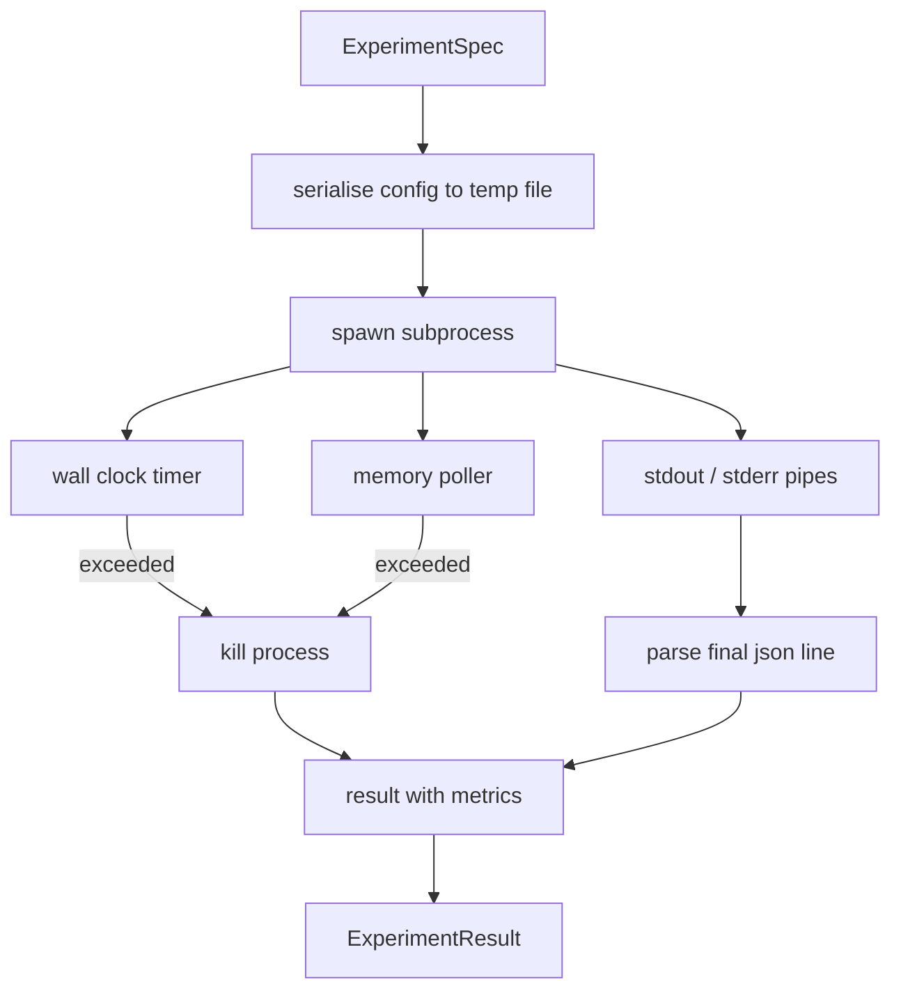

# 实验运营器

> 循环只像它的测量一样诚实. 构建运行器,它采用规格,在一个沙盒子子中执行它,

> **【中文解读】**本节是综合项目 构建实验运行器.


**Type:** Build | **类型:** Build
**Languages:** Python | **语言:** Python
**Prerequisites:** Phase 19 Track A lessons 20-29 | **前置知识:** Phase 19 Track A lessons 20-29

>  前置轨道D 3/8──参考19·26期
>  实验运行器 = "测量的诚实度"――循环只和测量的诚实一样――建运行器:取规格→沙箱子过程 执行→输出可信的JSON指标布给评估器――
**Time:** ~90 minutes | **时间:** ~90 minutes

## 学习目标
- 运行者可以将实验编码为类型的规格,
  中文翻译:将实验编码为一个输入的规格,运行者可以将其串行到一个子进程.
- 启动一个硬墙钟时间和软内存盖子的子进程,
  中文翻译:启动一个硬墙钟时间和软内存盖子的子进程,并将两者都作为终端条件.
- 捕捉了 stdout, stderr,和结构化指标的块,成为一个结果记录.
  中文翻译:捕捉 stdout, stderr,和结构化指标成一个结果记录.
- 构建一个除表,一次扫一扫一个配置按,
  中文翻译:构建一个除表,一次扫一扫一个配置按在固定的基准规格上.
- 给出一个种子,使评估者看到相同的数量.
  中文翻译:给一个种子,保持每个结果的确定性,以便评估者在运行中看到相同的数字.

## 为什么一个子过程

> **【中文解读】**研究循环运行不信任的代码假设来自采样机,实验脚本也来自同一个路径.将它们视为过程内安全的是在邀请崩.子进程是最简单的隔离:独立地址空间,父进程有信号句柄.本课程的运行器不实现完整的沙盒 (没有cgroup、seccomp、namespace),但有钟盒超时,内存轮询和终止路径.

> **【拓展：实验隔离在 AI 科研平台中的实践】**谷歌的 Vertex AI 实验和重量和偏差的扫描都使用容器化隔离运行实验脚本。Meta的ADBench 使用Kubernetes 运行对比实验──子进程+超时+内存限制是这些工业方案的核心简化版本──关键设计原则:运营商从非零退出码抛异而记录在结果中.`terminal`字段中,让评估器决定如何处理.

研究循环运行不可信赖的代码.假设来自样本器,实验脚本来自同一个路径;将任何一个作为安全的过程要求发生崩,将乐队调整器下降.子进程是语言船的最简单的孤立:一个单独的过程,一个独立的地址空间,母侧的信号手柄.

> 一个研究循环运行不可信赖的代码.假设来自一个样本器,实验脚本来自同一个路径;在过程中将任何一个作为安全的过程要求发生崩,导致主管下降.子进程是语言船的最简单的孤立:一个单独的过程,一个独立的地址空间,母侧的信号手柄.


跑步者在这里没有实现完整的沙盒.没有cgroup,没有seccomp过器,没有命名空间重新绘制.它确实有一个墙钟时间,一个选区循环用于记忆增长,和一个杀死路径,结束了过程在任何一个极限.这是运行时间合同每一个复杂的沙盒延长.课程使合同足够小,可以在一个座位上读取.

> 运行者在这里没有实现完整的沙盒.没有cgroup,没有seccomp过器,没有命名空间重新映射.它确实有一个墙钟时间,一个选区循环用于记忆增长,和一个杀死路径,结束了过程在任何一个极限.这是运行时间合同每一个复杂的沙盒延长.课程使合同足够小,可以在一个座位上读取.


## 实验Spec的形状

> **【拓展：实验规格在 MLOps 中的标准化】**本课程的实验Spec 映射到MLOps中的实验追踪标准――MLflow的实验+运行、重量和偏差的扫描配置、确定 AI的实验配置 都采用类似的声明式规格――关键字段:hypothesis_id(关联研究问题)、config(可复现参数)、种子(确定性保证)、metric_keys(评估器需要读的字段) ――标准化实验规格使实验可复现、可比较、可审计――

```text
ExperimentSpec
  spec_id        : str            (stable id, "exp_001")
  hypothesis_id  : int            (link back to the queue from lesson 50)
  script_path    : str            (path to the python script to run)
  config         : dict           (passed to the script as one json arg)
  seed           : int            (deterministic seed for the experiment)
  wall_timeout_s : float          (hard timeout, killed on exceed)
  memory_cap_mb  : int            (soft cap, polled; killed on exceed)
  metric_keys    : list[str]      (which fields the evaluator will read)
```

脚本生活在磁盘上;运行者将配置写入脚本读取的临时文件路径.脚本预计将在 stdout 上打印一个单个 json 线,其键是 超级集`metric_keys`其他任何东西都会被捕获,但被测量分析器忽略.

> 脚本在磁盘上存活;运行者将配置写入脚本读取的临时文件路径.脚本预计将在 stdout 上打印一个单个 json 线,其键是 超级集`metric_keys`其他任何东西都会被捕获,但被测量分析器忽略.


## 建筑,建筑
```figure
cg-runner-limits
```

## 建筑



选手是一个类型,有一个主要方法. 选民是一个小线程,每次选民间隔一次醒来,读取子过程.`psutil`根据该平台的规定,在平台未暴露时,该平台将不再使用.

> 选民是一个小线程,每次选民间隔一次醒来,读取子过程.`psutil`根据该平台的规定,在平台未暴露时,该平台将不再使用.


## 为什么软的记忆帽

硬件内存盖子需要`resource.setrlimit`课程提供了一个便携式方法:从平台上测试居民设置大小,如果超过限量,则杀死子进程.由于测试器有一个非零间隔,因此该限量是软的;一个过程可以在测试之间升到限量,然后退回.运行者记录了最大观察的RSS,以便评估员可以看到运行到底是多近.

> 硬件内存封闭需要资源.


在没有过程检查支持的系统上,测试员会记录一次性警告并自行禁用.墙钟时间限期仍然适用.课程测试涵盖了两条路径.

> 在没有过程检查支持的系统中,测试员记录一次性警告并自行禁用.墙钟时间限期仍然适用.课程测试涵盖了两条路径.


## 捕捉到和

> **【中文解读】**运行器读取 stdout 和 stderr 管道。 Stdout 逐行扫描最后解析为JSON 并且包含所有必需的`metric_keys`作为测量数据块.`intermediate_metrics`中,评估器可用于学习曲线──Stderr 原样捕获──非零退出码记录但不抛异,标记为`"crash"`,我知道.

跑步者读出完成后排水的两管. 排水被线后扫描;最后一行被解析为json,并所有所需的.`metric_keys`之前的JSON线在结果中保存为`intermediate_metrics`评估者可以使用这些信息来学习曲线.

> 运行者读取完成后排水的两管. 排水是线后线扫描的;最后一行是解析为json,所有所需的`metric_keys`之前的JSON线在结果中保存为`intermediate_metrics`评估者可以使用这些信息来学习曲线.


跑步者从来没有在非零出口代码上提升;相反,它记录了结果中的代码.任何非零出口都标记着`"crash"`评估员将部分运行作为默认失败.

> 结果将史德尔字面上被捕获.


## 排放表

> **【中文解读】**消融表(Ablation Table) 一次只变一个参数――完整因子设计指数爆炸且评估器无法解释――单参数消融产生评估器可以绘制干净坐标轴――本课支持多参数扫描,但作为重复的单参数消融由调用者组合――每个规格从基础规格派生,获得`spec_id = "{base}_{knob}_{value}"`格式标识符──

> **【拓展：消融实验在 LLM 论文中的标准地位】**关于"人工智能"的研究,研究人员发现,人工智能是"人工智能"的核心工具.

```python
def ablate(base: ExperimentSpec, knob: str, values: list[Any]) -> list[ExperimentSpec]:
    ...
```

根据基准规格和按名称,辅助器返回每值一个规格`config[knob]`每个规格都得到一个衍生.`spec_id`(`f"{base.spec_id}_{knob}_{value}"`跑步者将飞行`AblationRunner`它们是顺序的,然后返回一个`AblationTable`按值按键.

> 根据基准规格和按名称,辅助器返回每值一个规格`config[knob]`没有任何其他方法.


为什么一次一次. 完全的因子扫描速度高,结果值评员无法解释. 一个一次的按产生了评估员可以绘制的清洁轴.课程只支持多按扫描,只作为一次性的单个按排放,由调用者组成.

> 为什么一次一次.


## 确定性

> **【中文解读】**每个标本都带着种子,运输器通过`config["__seed"]`传递给脚本――模拟实验脚本使用无数随机通过 生成确定性度量――评估器依赖于这种特性无确定性,一次"回归"可能只是不同的随机初始化――本课消融表中的两个运行断言产生相同的测量值――

每个标本都携带一个种子. 运行者通过配置命令将种子转发到脚本中 (`config["__seed"] = spec.seed`实验编写的模拟脚本`code/experiments/`对于""的定义,我们可以说是""的定义,但如果没有确定性,则"退回"可能是不同的随机初始化.

> 每个物种携带一个种子. 运行者通过配置命令将种子转发到脚本中 (`config["__seed"] = spec.seed`实验编写的模拟脚本`code/experiments/`对于""的定义,我们可以说是""的定义,但如果没有确定性,则"退回"可能是不同的随机初始化.


## 假实验剧本

课程中,有一个实验脚本:`code/experiments/sparsity_experiment.py`它是真正的脚本,它读取配置文件,模拟一个小训练运行,用一个无数的随机通过,`sleep_s`测试时间和一个`allocate_mb`测试记忆测试器的.

> 本课附带一个模拟语言模型.


模拟不是训练任何真实.它是一个数值计算模仿训练循环的形状:一个损失曲线,最后的困惑,一个墙时间.课程的重点是跑步,而不是模拟.一个真正的实验脚本将导入模型.

> 模拟不是训练任何真实.它是一个数值计算模拟训练循环的形状:一个损失曲线,最后的困惑,一个墙时间.课程的重点是运行者,而不是模拟.一个真正的实验脚本将导入模型.


## 结果形状

```text
ExperimentResult
  spec_id              : str
  hypothesis_id        : int
  exit_code            : int
  terminal             : "ok" | "timeout" | "oom" | "crash"
  wall_time_s          : float
  peak_rss_mb          : float | None
  metrics              : dict
  intermediate_metrics : list[dict]
  stdout_tail          : str
  stderr_tail          : str
```

评价者读到`metrics`其他`terminal`如果终端是其他任何东西`"ok"`实验被认为是失败的,评估者的判决是自动的.

> 评价者读到`metrics`其他`terminal`如果终端是其他任何东西`"ok"`实验被认为是失败的,评估者的判决是自动的.


## 如何读取代码

`code/main.py`定义`ExperimentSpec`现在`ExperimentResult`现在`ExperimentRunner`现在`AblationRunner`微型处理器是一个类型,内存调试器是一个小线程,除离辅助器是一个单个函数.

> `代码/主


`code/experiments/sparsity_experiment.py`它从 argv 读取配置文件路径,并在完成时写出单个json测量线.

> `code/experiments/sparsity_experiment. 编码/实验/稀疏性_实验.


`code/tests/test_runner.py`覆盖成功路径,时间期路径,崩路径,排放表,以及两个运行中的确定性检查.

> `code/test/test_runner.


## 在哪里这个插槽

第五十课产生了假设. 第五十一课过了已经解决的文献. 第五十二课运行了剩下的实验. 第五十三课阅读了结果,运行了意义测试,并写出了主管对假设 id 的判决.

> 五十课就产生了假设.

