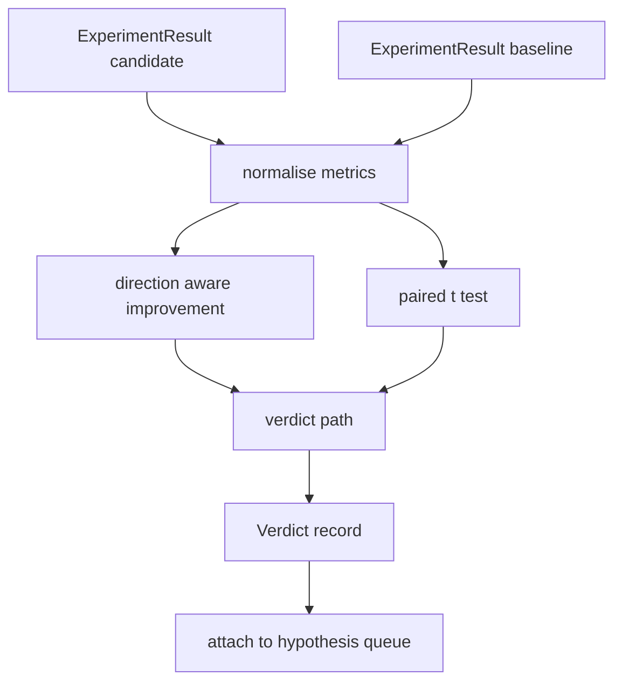

# 结果评价器 结果评价器

> 运行者产生了数量.评估者决定这些数量是否是改善,退缩或噪音. 构建判断路径,将测量量变成一个线路结论.

> **【中文解读】**本节是综合项目建设结果评估器.


**Type:** Build | **类型:** Build
**Languages:** Python | **语言:** Python
**Prerequisites:** Phase 19 Track A lessons 20-29 | **前置知识:** Phase 19 Track A lessons 20-29

>  前置轨道D 4/8──基于52 实验运行器──
>  结果评估器 = "数字变成结论"――运行器产数字;评估器决定是改进、归归还是噪声――建判断路径:指标→一行结论――统计显著性检查是关键――
**Time:** ~90 minutes | **时间:** ~90 minutes

## 学习目标
- 根据方向意识的改善和固定门,将候选人运行与基线进行比较.
  中文翻译:使用方向意识的改善和固定门来对比候选人运行与基线.
- 运行一个对 t 测试从零开始,然后读取结果的 p 值.
  中文翻译:从零开始运行对对 t 测试,然后读取结果的 p 值.
- 正常化日志规模的指标,以便下游报告可以将它们与线性指标结合起来.
  中文翻译:将日志规模度量标准化,以便下游报告可以将它们与线性量度混合.
- 根据假设,发出一个判决, 管弦乐员可以从第五十课中将其附加到排队.
  中文翻译:根据假设,发出一个判决,
- 保持每一步的纯度,这样同样的输入总是产生同样的判决.
  中文翻译:保持每一步的纯洁,

## 为什么要做双重测试

> **【中文解读】**运营器的单个数字不能说明变化是真实的相同配置不同种子给出不同困惑度.配对 t 检验是正确的比较:相同种子,相同数据,分别运行候选人和基线.每个种子贡献一个差异值,差异的平均值是效果,差异的标准差异是噪声底线.

> **【拓展：统计显著性在 AI 论文中的争议】**对于ML社区的使用p值存在争议――ACL 2023的统计显著性教程推使用p值的配对而不是t测试,因为ML量通常不符合正态分布假设――但由于其简单性,t测试仍然广泛使用LLaMA和GPT论文都报告了对p值的配对.关键是理解:p值 <0.05意味着"只有5%的概率,差异来自随机波动",而不是"改进是真实的".

只有一个数字,不能说明变化是真的. 种子的配置不同, 变化可能是噪音. 合适的比较是:相同的种子,相同的数据,一次与候选人进行了运行,一次与基线. 每种种子都会有所不同. 它们的平均差异是效果. 这些差异的标准错误是噪音地板.

> 运行者单个数字并不能说明变化是否真实. 种子的配置不同, 变化可能是噪音. 合适的比较是:相同的种子,相同的数据,一次与候选人进行了运行,一次与基线. 每种种子都会有所不同. 它们的平均差异是效果. 这些差异的标准错误是噪音地板.


课程从头开始执行测试.`scipy.stats`数学是足够小的,可以在一块屏幕上读.

> 雷森从零开始实施了测试.`scipy.stats`算法是足够小的,可以在一块屏幕上读.


```text
diffs    = [a_i - b_i for i in seeds]
mean     = sum(diffs) / n
variance = sum((d - mean) ** 2 for d in diffs) / (n - 1)
t_stat   = mean / sqrt(variance / n)
df       = n - 1
p_value  = two_sided_p(t_stat, df)
```

两个侧 p 值使用规范化不完整的beta函数.课程运行一个使用Lentz继续分数的小实现.整个东西是60行的 stdlib 数学.

> 课程中使用了使用Lentz继续分数的小实现.整个东西是60行Stdlib数学.


## 方向意识的改善

> **【中文解读】**某些指标上升为好 (准确率,吞吐量),有些下降为好 (损失,困惑,钟钟时间) .`higher_is_better`时改进 = (候选人 - 基线) / 基线 进;`lower_is_better`时改进 = (基线 -候选人) / 基线 进而进而进而进而进而进而进而进而进而进而进而进而进而进而进而进而进而进而进而进而进而进而进而进而进而进而进而进而进而进而进而进而进而进而进而进而进而进而进而进而进而进而进而进而进而进而进而进而进而进而进而进而进而进而进而进而进而进而进而进而进而进而进而进而进而进而进而进而进而进而进而进而进而进而进而进而进而进而进而进而进而进而进而进而进而进而进而进而进而进而进而进而进而进而进而进而进而进而进而进而进而进而进而进而进而进而进而进而进而进而进而进而进而进而进而进而进而进而进而进而进而进而进而进而进而进而进而进而进而进而进而进而进而进而进而进而进而进而进而进而进而进而进而进而进而进而进而进而进而进而进而进而进而进而进而进而进而进而进而进而进而进而进而进而进而进.

一些指标随着上升 (精度,吞吐量) 改善,另一些指标随着下降 (损失,困难,墙时间) 改善.`direction`在每个指标上.

> 一些指标随着升级而提高 (准确性,吞吐量).


```text
if direction == "higher_is_better":
    improvement = (candidate - baseline) / abs(baseline)
elif direction == "lower_is_better":
    improvement = (baseline - candidate) / abs(baseline)
```

改进签署了.一个较高的负面改进是更好的指标,意味着候选人更糟糕.判决路径读取标志和大小.

> 改进已经签署.


均的门 (`improvement_threshold=0.02`根据该判断的"噪音"不论p值;循环不感兴趣用户无法测量的变化.

> 一个平门 (`improvement_threshold=0.02`根据该判断的"噪音"不论p值;循环不感兴趣用户无法测量的变化.


## 建筑,建筑

> **【拓展：自动化评估在 MLOps 流水线中的位置】**评估器位于CI/CD流水线的关键节点:模型训练完成后、部署之前――谷歌的Vertex AI模型评估、AWS SageMaker模型监测器都提供类似的自动化评估――评估器输出判决 结构直接驱动部署决策"改善"触发金丝雀部署,"噪音"保持当前版本,"愤怒"阻止部署――本课程的判决是这些系统的核心抽象――
```figure
cg-paired-verdict
```

## 建筑



评估器执行三个独立的计算,并将它们结合在判决路径.每个计算都是没有共享状态的纯函数.

> 评估器运行三个独立的计算,并将它们结合在判决路径. 每个计算都是一个纯函数,没有共享状态.


## 记录规范

> **【中文解读】**困惑率是损失指数损失下降0.1 在困惑率上更大的下降.`scale="log"`值在数空间应用中值从32降至28在低_is_better下是`log(28) - log(32) = -0.133`远超2% 值──

乱是损失的指数量.损失的0.1下降是乱的更大的下降.直接对两个配置进行乱的比较是很好的,但将其与线性指标混合在单个报告中需要正常化.

> 尬的损失是指数的.


课程将任何指标都正常化`scale`字段是`"log"`通过在计算改进之前取自然日志. 门值则在日志空间中应用. 复杂性从32降至28是`log(28) - log(32) = -0.133`在较低的水平上,更好的指标,远远超过2%的门.

> 课程将任何指标正常化`scale`字段是`"log"`通过在计算改进之前取自然日志. 门值则在日志空间中应用. 复杂性从32降至28是`log(28) - log(32) = -0.133`在较低的水平上,更好的指标,远远超过2%的门.


```text
if scale == "log":
    a = log(candidate)
    b = log(baseline)
else:
    a = candidate
    b = baseline
```

与`scale="linear"`换代码路径处理两个.

> 与`scale="linear"`换代码路径处理两个.


## 每种种子对对测试

课52的跑者每次跑出一个最后的测量点.对对测试,评估员需要一个对候选人每种子,一个对基线的种子.调整员在两个配置下运行相同的实验,通过一个种子列表,并交给评估员两个种子列表.`ExperimentResult`记录.

> 经过52,选手每次运行每次发出一个最后的测量标题.对对测试,评估员需要一个对候选人的种子,一个对基线的种子.调整员在两个配置下运行相同的实验,通过种子列表,并向评估员交出两个种子列表.`ExperimentResult`记录.


评估者根据种子对应它们 (种子生活在`result.metrics["seed"]`) 并行走所要求的指标.如果两个列表中的种子不匹配,评估员将提升一个`PairingError`管家应该再跑.

> 评估者按种子对应它们 (种子生活在`result.metrics["seed"]`) 并行走所要求的指标.如果两个列表中的种子不匹配,评估员将提升一个`PairingError`管家应该再跑.


## 判决的形状

> **【中文解读】**判定(判决) 是评估器的核心输出,包含假设 id、量名、方向、尺度、候选/基线平均值、改进量、p 值和判定结果。判定路径是五步决策表:1) 候选有失败终端 -> "失败";2) 改进量 < 值 -> "噪音";3) p 值不显著 -> "噪音";4) 改进 > 0 -> "改善";5) 不则 -> "退后"――定附带一行可读的理由供调度器记录。

> **【拓展：自动化判定在 CI/CD 中的应用】**评估器的判决形状与归归检中的通过/失败 判定异曲同工――Meta的CI系统在每次LLaMA模型变化后自动运行基准测试,与上一版本的差异相比,差异超过值则阻止合并――这种"自动判断+人工审核"模式是AI工程质量保障的标准实践――

```text
Verdict
  hypothesis_id          : int
  metric                 : str
  direction              : "higher_is_better" | "lower_is_better"
  scale                  : "linear" | "log"
  candidate_mean         : float
  baseline_mean          : float
  improvement            : float       (signed, fraction; see direction rules)
  p_value                : float | None  (None if n < 2)
  significance_threshold : float
  improvement_threshold  : float
  verdict                : "improved" | "regressed" | "noise" | "failed"
  rationale              : str
```

判决路径是一个小的决定表:

```text
1. If any candidate result has terminal != "ok": verdict = "failed"
2. else if |improvement| < improvement_threshold:  verdict = "noise"
3. else if p_value is None or p_value > significance: verdict = "noise"
4. else if improvement > 0:                          verdict = "improved"
5. else:                                             verdict = "regressed"
```

理性是一个单行的人类可读的句子,管弦乐器可以记录与假设 id.

> 理性是一个单行的人类可读的句子,管弦乐员可以记录与假设 id.


## 如何读取代码

`code/main.py`定义`MetricSpec`现在`Verdict`现在`Evaluator`测试是纯粹的Stdlib数学中实现的; numpy仅用于阅读指标列表和计算手段和变异.

> `代码/主


`code/tests/test_evaluator.py`覆盖改进路径,退回路径,噪音路径 (小改进),噪音路径 (低n),故障终端路径,日志正常化路径,对已知参考值的t测试和对配错误.

> `code/test/test_evaluator.


## 在哪里这个插槽

第五十课产生了假设队列. 第五十一课过了文献解决的任何东西. 第五十二课在种子中运行了候选人和基线配置下的实验. 第五十三课阅读了这些运行并写出判决. 管弦乐器将四个编织在一起:

> 五十课产生了假设队列.


```text
for hypothesis in queue:
    literature = retrieval.search(hypothesis.text)
    if literature_settles(hypothesis, literature):
        attach(hypothesis, verdict="settled")
        continue
    candidates = runner.run_all(specs_for(hypothesis))
    baselines  = runner.run_all(baseline_specs_for(hypothesis))
    metric_spec = MetricSpec("perplexity", direction=LOWER, scale=LOG)
    verdict = evaluator.evaluate(hypothesis.id, metric_spec, candidates, baselines)
    attach(hypothesis, verdict)
```

这位管弦乐器不在这个课程中;四个课程都在它中构成,

> 这位管弦乐器不在这个课程中;四个课程都在它中构成,

