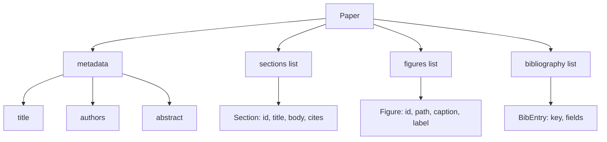
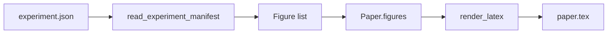
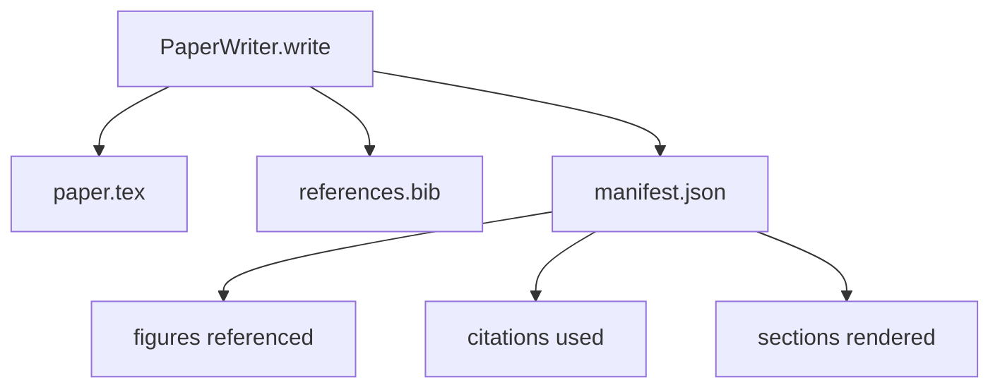

# 论文作者 论文作者

> 拉特克斯骨格是研究人员和打字符符符之间的合同.如果合同被打破,文档不会编译,故障很大.先构建骨格,然后填写它.

> **【中文解读】**本节是综合项目 构建论文作者 代理


**Type:** Build | **类型:** Build
**Languages:** Python | **语言:** Python
**Prerequisites:** Phase 19 lessons 50-53 | **前置知识:** Phase 19 lessons 50-53

>  前置 轨道D 5/8──基于50-53──
> 论文写作器 = "拉德克斯骨架的契约精神"――拉德克斯骨架是研究人员和排版者的契约契约破了文档不编译,失败响亮――先建骨架,再填写内容――AI科学家 v2(Phase 15·05) 的写作模块――
**Time:** ~90 minutes | **时间:** ~90 minutes

## 学习目标

- 作为一个已知部分图的结构化文物,而不是一个自由形式的文档.
  中文翻译:把研究论文视为具有已知部分图的结构化文物,而不是自由形式的文档.
- 在任何散文写之前,生成一个拉特克斯骨格,
  中文翻译:在写任何散文之前,生成一个拉特克斯骨格,声明其抽象,部分,数字插槽和书籍密钥.
- 通过确定性槽机制将实验输出 (路径和标题) 的数字注入骨架中.
  中文翻译:通过确定性槽机制将实验输出 (路径和标题) 的数字注入骨架中.
- 电线一个模仿的散文发电机,以从结构的轮中填满每个部分,
  中文翻译:将一个模拟的散文生成器连接到一个结构的轮中,以使其可以在没有模型的情况下测试.
- 发出一个单机`paper.tex`加上一个`references.bib`附上一个列出所引用的每一个数字和所使用的引用.
  中文翻译:发出一个单一`paper.tex`加上一个`references.bib`附上一个列出所引用的每一个数字和所使用的引用.

```figure
ch-paper-skeleton
```

## 为什么要先做一个骨

> **【中文解读】**以散文开始的草稿积累结构性债务:引言混入相关工作、图表在定义前被引用、参考文献出现重复键──骨架反转这个过程结构先声明为数据:章节是名字和序列的槽位,图表是有 id 和标题的槽位,文献键在顶部声明──利用任何散文之前可以验证每个图表有槽位、每个引用有条目每个章节都出现在目录中──

> **【拓展：LaTeX 骨架在 AI 科研自动化中的应用】**萨卡纳AI的"人工智能科学家"和多个学术论文生成系统都采用了"骨架优先"策略.学术论文有严格的章节结构.

文章的草稿以散文开始,积累了结构债务. 序言中增加了三个段落,应该在相关作品中写入. 在定义之前,引用一个数字. 书籍最终以同一篇论文的三个键结尾. 当作者注意到时,重写成本高于写费.

> 一个草稿开始于散文积累结构债务.介绍增加三个段落,应该在相关作品中.一个数字在定义之前被引用.书籍最终以同一篇论文的三个键结尾.作者注意到时,重写成本高于写费.


骨架会逆转. 结构是先前声明为数据. 部分是有名字和顺序的插槽. 数字是个字符和标题的插槽. 图书馆关键在顶部,并列出了它们指向的条目. 散文是每次生成到这些插槽. 在任何散文写之前, 连接器可以验证每个数字都有一个插槽,每个引用都有一个条目,

> 一个骨逆转了这一点. 结构是先前声明为数据. 部分是有名字和顺序的插槽. 数字是个字符和标题的插槽. 图书馆关键在顶部,并列出了它们指向的条目. 散文是每次生成到这些插槽. 在任何散文写之前, 连接器可以验证每个数字都有一个插槽,每个引用都有一个条目,


对于计划,工具调用和跟踪,这是以前所学到的学科.

> 结构是合同. 结构是合同.


## 纸质的形状



每个字段都是简单的Python数据. 染器是从 `Paper`带可以在染前内视纸张:计算部分,列出缺失的图像文件,检查每一个`\cite{key}`没有相匹配的`BibEntry`现在,我们要去.

> 每个字段是简单的Python数据. 染器是纯函数`Paper`带可以在染前内视纸张:计算部分,列出缺失的图像文件,检查每一个`\cite{key}`没有相匹配的`BibEntry`现在,我们要去.


## 交换合同

> **【中文解读】**染器保证三个属性:1) 每个图表槽位输出`\begin{figure}`块并有稳定标签`fig:<id>`2) 每章输出`\section{}`没有稳定标签`sec:<id>`参考文献输出`\bibliography`块,`references.bib`包含精确声明条款. 违反任何一项是染色错误而不是警告. 骨架是契约.

首先,骨架中的每一个图形插槽都会发出一个`\begin{figure}`单元的稳定标签`fig:<id>`第二,每一个部分都会发出一个`\section{}`具有稳定的表格标签`sec:<id>`其他研究人员也发现,`\bibliography`区块的`references.bib`文件上所声明的内容,不超过,不减少.

> 首先,骨架中的每一个图形插槽都会发出一个`\begin{figure}`单元的稳定标签`fig:<id>`第二,每一个部分都会发出一个`\section{}`具有稳定的表格标签`sec:<id>`其他研究人员也发现,`\bibliography`区块的`references.bib`文件上所声明的内容,不超过,不减少.


违反任何这些都是一个错误,而不是一个警告.

> 违反任何这些都是一个错误,而不是一个警告.


## 实验中的图像注射

> **【中文解读】**实验输出发出JSON表,包含工件路径和简短标题──论文写作者读取表并产生`Figure`记录──图表 id 从实验名称加单调计器派生,标题来自 manifest,路径相对于论文输出目录归结这样即使实验输出在磁盘其他位置,LaTeX 也能编译──

在本曲目中,早期的课程产生了 JSON 演示的实验输出.每个演示包含了带有路径和短标题的文物列表.`Figure`记录.

> 根据本曲目中的早期课程,随着JSON表现的结果产生了实验输出.每个表现包含了带有路径和短标题的文物列表.`Figure`记录.




插入是决定性的.图形 id 来自实验名称加上单调计器.标题来自表格.路径与纸张的输出目录相比正常化,因此Latex即使实验输出位于磁盘上的其他地方,也会编译.

> 图标的名称来源于实验名字加上单调计器.标题来自表格.路径与纸张输出目录相比正常化,因此Latex即使实验输出位于磁盘上的其他地方,也会编译.


## 刺的散文发电器

> **【拓展：LLM 论文生成的当前能力与局限】**2024-2026年的LLM在论文生成方面取得了显著进展:Claude Opus和GPT-4可以生成良好的结构学术散文,但仍然缺乏精确的数学公式推导,实验数据的准确解释和文献引用的准确性.Sakana AI的AI科学家使用"骨架+逐节填充"策略,本课的 MockProseGenerator是其教育简化.

课程不需要一个模型.`MockProseGenerator`发射的表格是每节一个短字符串.生成器将该字符串扩展到两个短段落,部分标题被织在一起.生成的表格是表格声明时的数字和引用.

> 课程不需要一个模型.`MockProseGenerator`发射的表格是每节一个短字符串.生成器将该字符串扩展到两个短段落,部分标题被织在一起.生成的表格是表格声明时的数字和引用.


这足以测试作家的每一种行为.一个真正的实现将将发电机换成一个模型调用.周围的环节不会改变.这是宣布散文发电机作为可调用的价值:测试取代确定性,生产取代模型,其余的管道是相同的.

> 这足以测试作家的每一种行为.一个真正的实现将将生成器换成模型调用.周围的带连接不会改变.这是宣布散文生成器作为可调用的价值:测试取代确定性,生产取代模型,其余的管道是相同的.


## 显现输出

编写者将三个文件发送到输出目录中.



简单是下游评价者或评论家循环读取的内容.它不解析Latex,它读取了简单.下一个课程,即评论家循环,将此简单作为输入,并产生反列表.这就是为什么简单是合同的一部分,而Latex不是.

> 分析程序不是分析拉泰克斯,而是阅读了表格.下一个课程,即评论循环,将此表格作为输入,并产生反列表.这就是为什么表格是合同的一部分,而拉泰克斯不是.


## 验证门

> **【中文解读】**写作者在写文件前运行四个验证门:1) 每个图表的ID 在论文中唯一;2) 每个章节的`cites`字段引用论文声明的文献键;3) 摘要非空;4) 标题非空――失败的门抛出`PaperValidationError`没有部分写入,或者三个文件全部发出,或者一个都没有发出.

> **【拓展：验证门在自动化出版流水线中的价值】**学术出版平台 (如 arXiv、OpenReview) 的自动化系统也使用类似的验证门:检查 LaTeX 编译、图表文件存在性、引用完整性.本课的验证门是"编译前检查"在 LaTeX 编译器看到文件之前就捕获了结构错误.

写作者在写任何文件之前,会经过四个门.

1. 每个数字的身份证都在纸上是独一无二的.
2. 每个部分都在`cites`字段引用在文件上声明的图书馆关键.
3. 抽象是没有空的.
4. 标题是没有空的.

一个失败的门起了`PaperValidationError`没有部分写字:三文件都发射,或者没有.

> 一个失败的门升高`PaperValidationError`没有部分写字:三文件都发射,或者没有.


## 如何读取代码

`code/main.py`定义`Paper`现在`Section`现在`Figure`现在`BibEntry`现在`PaperValidationError`现在`MockProseGenerator`现在`PaperWriter`其他`render_latex`它们的功能.`write`方法采用输出目录并发出`paper.tex`现在`references.bib`其他`manifest.json`现在,我们要去.`read_experiment_manifest`帮助者将实验表单转换为`Figure`记录.

> `代码/主


`code/tests/test_paper_writer.py`封面:没有部分的骨格成像,两个部分和两个数字的完整成像,缺失引用口,重复数字的身份口,表现内容,以及LateX字符串合同 (每个部分发出一个`\section{}`每个数字都会发射一个`\begin{figure}`)

> `代码/测试/测试_纸_作者.


## 走得更远

实际实现需要两个扩展.`Paper`转换器成为一个战略.`Paper`编写者从引用键中获取BibTeX输入,因为有DOI的本地缓存.

> 实际实施需要两个扩展.


骨架是投注. 部分,数字和引用被声明为数据,生成成插槽,与拉特克斯一起发射的表格.

> 部分,数字和引用被声明为数据,生成成插槽,与拉特克斯一起发射的表格.

