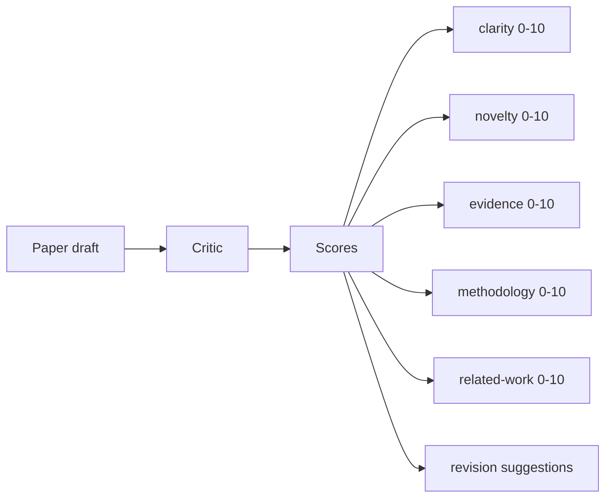
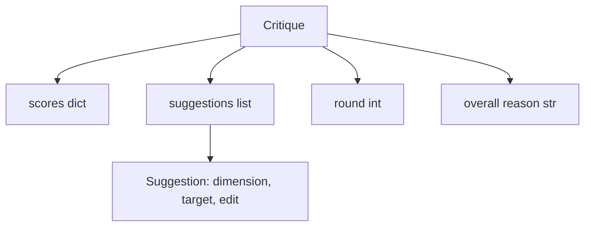
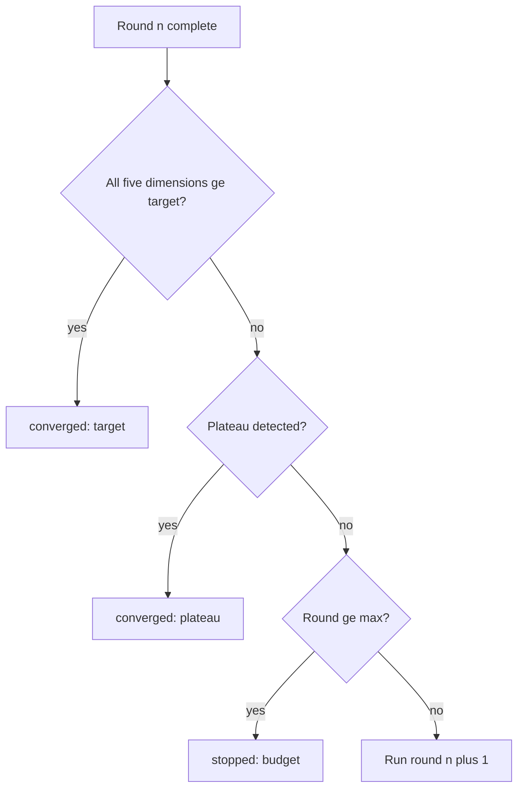
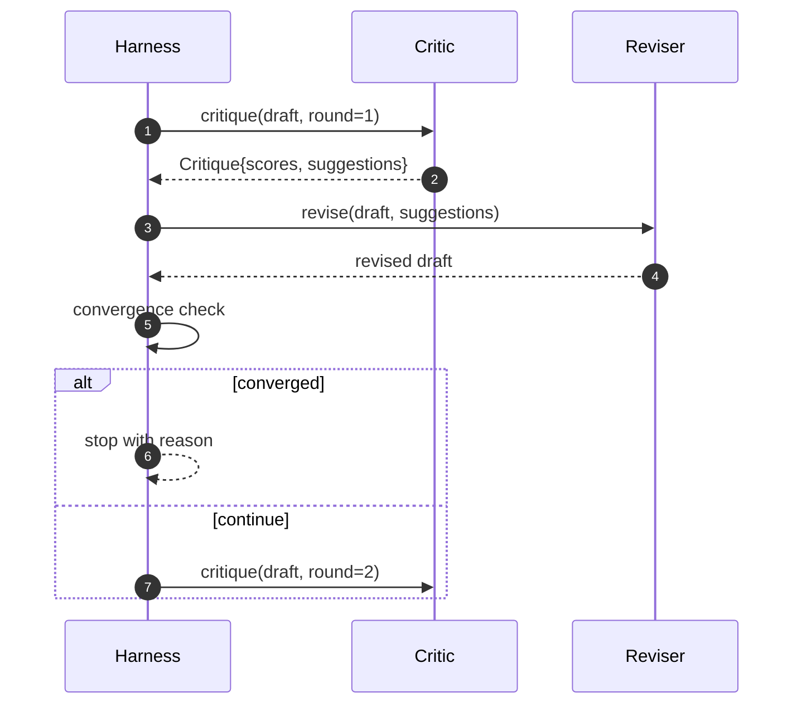

# 评论家,评论家.

> 一个评论家回来"看起来很好"的第一次被打破了. 一个评论家总是回来"需要工作"的评论家被打破了. 有趣的评论家是那些融合,你必须设计融合.

> **【中文解读】**本节是综合项目 构建代理线束循环和契约验证系统.


**Type:** Build | **类型:** Build
**Languages:** Python | **语言:** Python
**Prerequisites:** Phase 19 lessons 50-53 | **前置知识:** Phase 19 lessons 50-53

>  前置轨道D 6/8。参考16·07期(多代理辩论)+16·08期(验证器角色)。
>  批评循环 = "AI 同行评审"――第一次就"看起来不错"=坏了;永远"需要改进"=坏了――有趣的批评者会收,你必须工程化收──MAST(阶段16·23) 证明验证器是承担重壁本课是其具体实现──
**Time:** ~90 minutes | **时间:** ~90 minutes

## 学习目标

- 通过五个固定维度进行纸质草案:清晰度,新奇性,证据,方法,相关工作.
  中文翻译:通过五个固定维度来编写一篇纸质草案:清晰度,新奇性,证据,方法,相关工作.
- 应用每个轮的批评作为结构化修改差别而不是自由形式的重写.
  中文翻译:将每个轮的批评作为结构化修改差异而不是自由形式的重写.
- 通过比较轮子中的分数来检测到相近性; 停在高原,目标达到或预算耗尽.
  中文翻译:通过比较轮子中的分数来检测到趋同;停在高原上,目标达到,或预算耗尽.
- 限制使用最大的预算,所以一个不一致的批评者不会永远运行.
  中文翻译: 顶轮子是最大的述预算,所以一个不融合的批评者不会永远运行.
- 发出每轮的痕迹,以便仪表板或下一个阶段可以呈现得分轨迹.
  中文翻译:发出每轮的痕迹,以便仪表板或下一个阶段可以呈现得分轨迹.

```figure
ch-critic-converge
```

## 为什么五个固定尺寸

> **【中文解读】**自由形式的批评者回应一段建议,下一轮修订将其视为环境下文修订是否解决了批评无法验证,因为批评从未有结构.

> **【拓展：结构化评审在学术出版中的对应物】**学术同行评审 (学术同行评审) 通常使用评分量表 (学术同行评审) 覆盖多个维度:新性 (新性) 健全性 (方法可靠性) 清晰性 (清晰性) 重要性 (重重复性) 可复现性 (重复性) △OpenReview 平台将这些评分公开. 本课的五维度和0-10 评分系统是学术同行评审的结构化模拟,使自动化批评循环可以像人类评审一样提供可操作的反──

自由形式的评论家是一个回复建议段落的模型.下一轮的修订将段落视为环境环境.重写是否针对批评是无法验证的,因为批评从未有结构.

> 一个自由形式评论家是一个返回建议的模型.下一轮的修订将该段落视为环境环境.重写是否解决了批评是无法验证的,因为批评从未有结构.


五维度给了带一个合同.



评分是一个向量. 带在轮子中监视每个维度. 修改提高了清晰度,但将证据储存,是证据的回归,并通过接近检查看到它. 仅仅是模型的批评者不能提供这种保证.

> 通过测试,我们可以看到一个数据的数据,但我们不能看到一个数据的数据.


## 评论的形状

> **【拓展：结构化批评在 AI 对齐中的应用】**专为训练一个批评模型检测GPT-4代码输出中的错误. 本课的五维评分 (清晰度,新奇性,证据,方法学,相关工作) 与OpenReview的同行评审表直接对应.



每个建议都包含了它改善的尺寸,它针对的部分,`edit`修改器可以应用指令.修改器也可以调用.课程发送一个确定性修改器,它将修改指令解释为一个附加到部分操作.一个模型驱动的修改器将解释同一个字段.合同不会改变.

> 每个建议都包含了它改善的尺寸,它针对的部分,`edit`修改器可以应用指令.修改器也可以调用.课程发送一个确定性修改器,它将修改指令解释为一个附加到部分操作.一个模型驱动的修改器将解释同一个字段.合同不会改变.


## 汇率规则,按顺序

> **【中文解读】**批评循环的终止条件按优先级排序:1) 所有五个维度 >= 目标分数(默认8.0)→"目标"收;2)连续两轮平均值改进低于平原_epsilon(默认0.1)→"平原";3) 达到最大轮次(默认5)→"预算"――优先级顺序很重要:如果第三轮同时满足目标和平台检测,结果是目标而不是平原――

当任何三个条件发生火灾时,

> 任何三个条件发生火灾时,CRitic循环会结束.




目标是最严格的情况:每一个五个维度 (清晰度,新奇性,证据,方法,相关_工作) 都必须达到`>= target_score`(默认方式`8.0`) 循环返回成功之前.一个较高的平均值,一个较弱的尺寸不够.高原检测比较当前轮的平均值与前轮的平均值.如果改善低于`plateau_epsilon`(默认方式`0.1`) 连续两轮,循环从中出发.`plateau`预算是轮子上限 (默认)`5`) 及出口`budget`现在,我们要去.

> 目标是最严格的情况:每一个五个维度 (清晰度,新奇性,证据,方法,相关_工作) 都必须达到`>= target_score`(默认方式`8.0`) 循环返回成功之前.一个较高的平均值,一个较弱的尺寸不够.高原检测比较当前轮的平均值与前轮的平均值.如果改善低于`plateau_epsilon`(默认方式`0.1`) 连续两轮,循环从中出发.`plateau`预算是轮子上限 (默认)`5`) 及出口`budget`现在,我们要去.


如果第三轮在同一次代中击中目标,也会触发平原,结果是`target`没有`plateau`现在,我们要去.

> 如果第三轮在同一次代中击中目标,也会触发平原,结果是`target`没有`plateau`现在,我们要去.


## 为什么高原检测是两次的

一轮高原是噪音.一个真正的评论家即使在固定的草稿上都会回报每次代的点数,因为确定性得分仍然取决于哪些建议被应用和在哪种顺序下.需要连续的两个高原轮来过噪音.如果带报告高原,草稿实际上已经停止改善.

> 一个单轮高原是噪音.一个真正的评论家即使在固定的草稿上都会返回一个稍微不同的分数,因为确定性分数仍然取决于哪些建议被应用和在哪种顺序.需要连续的两个高原轮子来过噪音.如果带报告高原,草稿实际上已经停止改善.


## 在这堂课中,确定主义的批评者

> **【中文解读】**本课程的确定性评论者基于三个信号评分:章节平均正文长度(清晰度) 图表和引用数量(证据) 、论文元数据的`originality_tag`修订者将每一个建议解释为定向增加增加正文提高清晰度,设置原创性_tag="high" 提高新性,添加图表引用提高证据――一轮后的利用可观察分数上升――

课程不需要模型. 发送的评论家是一个调用器,根据三个信号评分一个草案:平均部分体长度 (清晰度),数字数量和引用数量 (证据),`originality_tag`修改者知道如何将每个分数推向上方.

> 课程不需要模型. 发送的评论家是一个调用器,根据三个信号评分一个草案:平均部分体长度 (清晰度),数字数量和引用数量 (证据),`originality_tag`修改者知道如何将每个分数推向上方.


```text
clarity      grows when the average section body length increases
novelty      grows when originality_tag is set to "high"
evidence     grows when a section's figure_refs is non-empty
methodology  grows when a section titled "Method" exists with body
related-work grows when a section titled "Related Work" exists with body
```

修改器将每个建议解释为一个目标附加.在第一轮后,带可以观察得分上升.测试使用这种属性来证实循环减少差距.

> 检查器将每个建议解释为一个目标附加. 在第一轮后,带可以观察得分上升.测试使用这种属性来证实循环减少差距.


## 完整循环合同



带拥有圆数,跟踪和融合检查. 评论家拥有分数. 修改者拥有差异. 三种都没有触及其他状态.

> 分析师拥有分数,修改者拥有差异,三者都没有触及其他状态.


## 排行量

每轮发出一个跟踪事件,包括圆数,积分向量,建议数量和结判决.完整的跟踪记录在最终草案旁返回.下游仪表板可以呈现每轮的积分图表.下一个课程,即回复安排器,读取了跟踪记录,决定是否值得保留分支.

> 每轮发出一个跟踪事件,包括圆数,分数向量,建议数量和结判决.完整的跟踪记录在最终草案旁返回.下游仪表板可以呈现每轮的比分图表.下一个课程,即回复安排器,读取跟踪记录,决定是否值得保留分支.


## 保护自己免受坏批评

> **【中文解读】**产生无效建议的评论家会将循环锁定到最大轮次上限――轨迹(Trace) 使问题可见:五轮后分数平坦、判定为"预算"――用户读的是评论家 bug 而不是草稿 bug――只显示最终草稿的替代方案会隐藏诊断――Trace-first 设计暴露了问题――

> **【拓展：批评循环与 LLM 自我改进的关系】**开放AI的"批判"模型用于齐结:一个模型生成输出,另一个模型批评并建议改进.

评论家提出建议,但不会改善得分,他会把循环锁在最大的表达限度上.`budget`作为一个批评 bug,而不是一个草案 bug. 另一个,只出现最后的草案,隐藏了诊断. 追踪设计表面.

> 评论家提出建议,不会改善得分,将循环锁定在最大的表达限度.`budget`作为一个批评 bug,而不是一个草案 bug. 另一个,只出现最后的草案,隐藏了诊断. 追踪设计表面.


## 如何读取代码

`code/main.py`定义`Critique`现在`Suggestion`现在`Critic`协议`Reviser`协议`CriticLoop`其他`make_deterministic_critic_pair`对于这些问题,我们需要一个简单的方法.`Paper`形状是包含的,所以课程是独立的.

> `代码/主


`code/tests/test_critic_loop.py`内容:第一轮后的单调调度改善,调整的草案上目标融合,两轮后的平原检测,没有建议改善时的预算耗尽,修改者提出的建议应用以及痕迹形状.

> `code/test/test_critic_loop.


## 走得更远

实际实施需要两个扩展.第一,维度权重:一个研讨会的论文重量新性高于方法;一个期刊重量反之. 融合检查成为重量平均.第二,对评员:一个评员得分,第二个评员在修改者看到之前判断建议.`Critique`它们的形状.

> 实际实施需要两个扩展.


一旦批评结构化,每次改进,融合规则,仪表板,对策者,都会没有改变循环.

> 一旦批评结构化,每次改进,融合规则,仪表板,对比批评者,都会没有改变循环.

