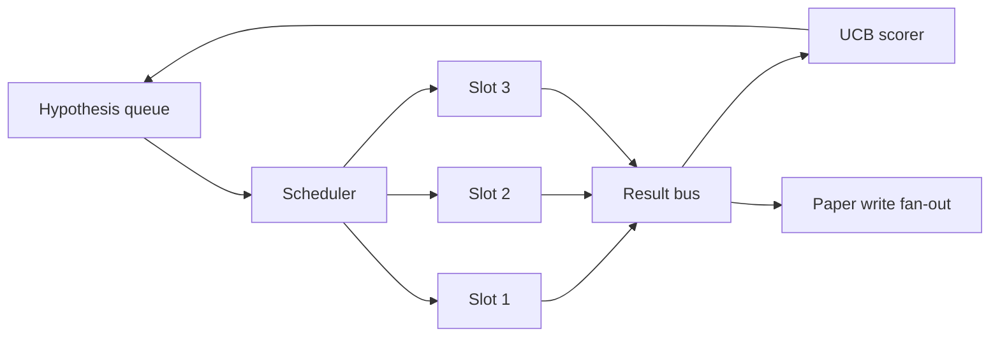
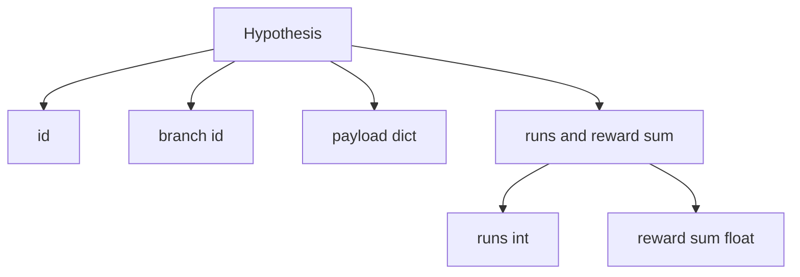
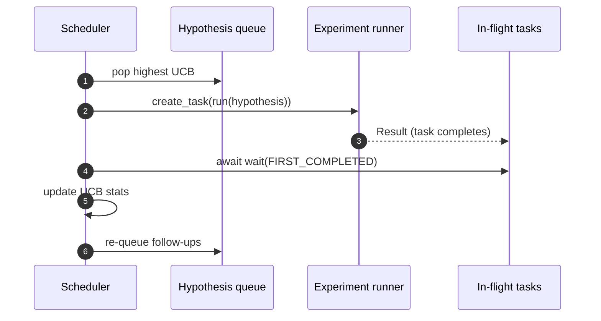

# 代调节器

> 没有调度器的研究循环是有妄想的排队.调度器是循环决定什么停止探索的地方,

> **【中文解读】**本节是综合项目 构建代调度器.


**Type:** Build | **类型:** Build
**Languages:** Python | **语言:** Python
**Prerequisites:** Phase 19 lessons 50-53 | **前置知识:** Phase 19 lessons 50-53

>  前置轨道D 7/8。参考15·03期AlphaEvolve进化选择+15·13期成本管理者──
>  代调度器 = "研究循环的放弃艺术"――无调度器的研究循环=有妄想的队列――调度器是循环决定停止探索什么的地方,这个决定是整个游戏――预算约束下的资源分配――
**Time:** ~90 minutes | **时间:** ~90 minutes

## 学习目标

- 模型研究工作流程作为一个假设队列,以提供平行实验插槽,其结果反弹.
  中文翻译:模型一个研究工作流程作为一个假设队列,为其结果提供了平行实验插槽.
- 同时执行多次实验,以便调度器可以保持所有空中的繁忙.
  中文翻译:同时运行多个实验,以便安排器可以保持所有机场的繁忙.
- 通过 UCB 评分每个假设分支,以便安排人员可以在不放弃探索的情况下剪切低产量分支.
  中文翻译:用 UCB 评分每个假设分支,以便安排人员可以在不放弃探索的情况下切割低产量分支.
- 通过将完成的结果分发到纸上写作阶段和排队阶段,
  中文翻译:将完成结果推向纸质写作阶段和排队阶段,因此高产量分支产生后续假设.
- 填写一个反复的标记,分分分数,占用空间和剪裁决定.
  中文翻译:用分分数,空隙占用率和剪裁决定,表面上进行一次性测试.

```figure
ch-ucb-scheduler
```

## 为什么要安排时间,而不是工作列表

> **【中文解读】**平面工作列表按提交顺序运行作业,但研究不是独立的实验三的结果改变了四五的优先级.调度器读取结果被进并重排排列列,每单位计算获得更多有用工作.核心设计选择是评分规则:贪评分者永远选择当前领导人不探索;均评分者永远不利用.

> **【拓展：UCB 在推荐系统和 AutoML 中的应用】**微软算法源于多臂老虎机 (多臂) 问题,广泛应用于推系统 (多臂老虎机) 和 AutoML (自动超参数搜索) ⋅Google Vizier 使用改进的微软算法变量进行超参数优化――在科学研究自动化中,每个"研究分支"是一个臂 UCB自动平衡"深入有前途的方向"和"探索新方向"之间的权衡――

单一的工作列表以提交顺序运行工作.每一份工作都是独立的.研究不是独立的:从实验三中发现的结果改变了四和五的实验的优先级.一个编程程序员读取结果的粉丝并重新排列队列,每个计算单位都能完成更有用的工作.

> 一个平面工作列表以提交顺序运行工作.每一个工作都是独立的.研究不是独立的:从实验三中发现的改变了实验四和五的优先级.一个编程程序员读取结果的粉丝,并重新排列队列,每个计算单位完成了更有用的工作.


设计的选择是得分规则.一个贪的得分者总是选择当前的领袖,从来没有探索.一个统一的得分者从来没有利用.UCB (上层信心限制) 是中间的途径:利用领袖,同时保留能力,用于未经尝试过的分支.

> 利的得分者总是选择当前的领袖,从来没有探索. 统一的得分者从来没有利用. UCB (上层信心限制) 是中间的路径:利用领袖,同时保留能力,以较少的分支.


## 系统形状



排队包含假设.当一个插槽释放时,调度器选择最高的UCB假设.每个插槽都以异步运行实验.完成的实验将其结果传递到公共汽车上.公共汽车更新了 UCB的统计数据,并在分支收益超过门时将其更新到纸上写的阶段.

> 排队包含假设.当一个插槽释放时,调度器选择最高的UCB假设.每个插槽都以异步运行实验.完成的实验将其结果传递到公共汽车上.公共汽车更新了 UCB的统计数据,并在分支的收益超过门时将其更新到纸上写的阶段.


## 假设的形状



`branch`许多假设可能是分支 (分支是研究方向;假设是其中的一个试验).`runs`是该分支完成的实验数量,`reward_sum`美国央行读出了这两项.

> `branch`美国央行统计数据的关键.


## 欧元联储的分数

> **【中文解读】**号公式:`ucb(branch) = mean_reward + c * sqrt(ln(total_runs) / runs(branch))`△c 默认的分支获得了+inf,保证未尝试分支优先调度. 高平均值奖励的分支保持高分分直到其他分支追上;运行多次但奖励的分支被更少运行的替代方案超越.

在本课中使用的UCB公式是经典的UCB1.

```text
ucb(branch) = mean_reward(branch) + c * sqrt( ln(total_runs) / runs(branch) )
```

`total_runs`是所有各个部门完成的所有实验的数量.`c`探索重量; 课程不符合`sqrt(2)`没有运行的分支得到了`+inf`因此未经测试的分支总是先安排.高平均奖励的分支保持高分数,直到其他分支赶上;许多次运行的分支没有太多奖励的分支被运行的替代品遮盖.

> `total_runs`是所有各个部门完成的所有实验的数量.


切割门与采集器分开. 切割将分支从未来的安排中移除,当其平均奖励低于绝对地板时 (默认`0.2`) 至少在`prune_after_runs`试验 (默认`3`这将保持排队的限制.

> 切割门与采集器分开. 切割将分支从未来的安排中移除,当其平均奖励低于绝对地板时 (默认`0.2`) 至少在`prune_after_runs`试验 (默认`3`这将保持排队的限制.


## 具有异步的平行槽

> **【中文解读】**调度器使用`asyncio.create_task`驱动实验,每个任务运行异步实验运行器.`asyncio.wait(..., return_when=FIRST_COMPLETED)`等待飞行中的任务集,每次完成时触发评分更新.

> **【拓展：异步调度在工业级科研平台中的应用】**带有GPU集群的科研平台 (如确定AI、Ray Tune) 使用类似的异步调度模式――Ray Tune的AsyncHyperBandScheduler 使用异步结果收集+动态资源分配,与本课的异步+UCB架构在概念上一致――区别在规模:Ray 管理数千个GPU槽位,本课管理3个异步任务――

时间表器使用了`asyncio.create_task`每个任务都会由实验运行者 (一个`async def`报名可) 返回一个`Result`机上任务的重组将在 `asyncio.wait(..., return_when=asyncio.FIRST_COMPLETED)`并且在每次完成时都会发射得分更新.

> 调度确定研究循环的下一步.




两个分槽同时运行.主循环从来没有阻止一个实验. 编程师随着分槽的释放,就会继续启动新的任务,直到排队都空,没有任务在飞行中.

> 两个机场同时运行.


## 扩展:纸质触发器

> **【拓展：研究自动化中的探索-利用平衡】**在科研中探索利用困境是现实存在的:持续深入研究方向 (利用) 可能错过更好的替代方案 (利用) 探索 (探索)  本课的 UCB调度器自动平衡这两种. 在实际科研管理中,Google DeepMind使用"20%时间"政策鼓励探索,微软研究使用"研究注"组合管理.

当一个分支的平均奖励越来越高`paper_threshold`(默认方式`0.7`) 而该分支尚未制作一份论文,`paper.trigger`在本课中,触发器被捕获为列表,以便测试可以确认它.

> 当一个分支的平均奖励交叉`paper_threshold`(默认方式`0.7`) 而该分支尚未制作一份论文,`paper.trigger`在本课中,触发器被捕获为列表,以便测试可以确认它.


## 扩散:后续假设

当一个高效的结果降落时,调度器可以调用用户提供的`expander`扩展器是从 到 的纯函数.`Result`为了`list[Hypothesis]`课程将运输一个确定性扩展器, 产生两个后续结果,

> 当一个高产量结果登陆时, 时间表编程者可以调用用户提供的`expander`扩展器是从 到 的纯函数.`Result`为了`list[Hypothesis]`课程将运输一个确定性扩展器, 产生两个后续结果,


## 预算

> **【中文解读】**两个预算保护调度器免于失控循环:`max_experiments`跨所有分支的总实验数) 和`max_seconds`调度器停止调度新任务,等飞行中的任务完成,返回最终轨迹――轨迹包含`stop_reason`供下游使用.

两个预算保护时间表达者免受逃跑的循环.

```text
max_experiments    : total count of experiments run across all branches
max_seconds        : wall-clock cap (asyncio time)
```

随着任何一场火灾,调度器停止调度新的任务,等待飞行中的任务,并返回最后的痕迹.`stop_reason`现在,我们要去.

> 随着火灾,调度器停止调度新任务,等待飞行中的任务,然后返回最后的痕迹.`stop_reason`现在,我们要去.


## 追踪和最终报告

每个安排决定 (选择,发送,结果,剪裁,风扇) 发出一个事件.最终报告总结每分支的统计数据,总运行,总墙钟,和发射的纸动触发器.下一个课程,端到端演示,阅读这份报告以驱动纸写者.

> 每个安排决定 (选择,发送,结果,剪裁,风扇) 发出一个事件.最终报告总结每分支的统计数据,总运行,总墙钟,和纸张触发器.下一个课程,端到端演示,阅读这份报告以驱动纸质作家.


## 如何读取代码

`code/main.py`定义`Hypothesis`现在`Result`现在`BranchStats`现在`IterationScheduler`其他`make_deterministic_runner`运行者睡着一段时间.`delay_ms`(默认方式`5ms`) 因此可以观察到同步性.

> `代码/主


`code/tests/test_scheduler.py`封面:UCB首先选择未经测试的分支,平行槽占用量,超过门时的纸质触发,低产量试验后的分支剪切,延伸后续假设和预算退出 (实验计数和墙钟).

> `code/test/test_scheduler.


## 走得更远

实际实施需要三次扩展. 首先,在会议中持续的UCB统计数据:当前的统计数据存储在内存中;一个真正的时间表将检查它们, 第二,多目标得分:每个结果都发出向量,UCB成为帕雷托式选手. 第三,背景盗:假设的选择条件 (长度,复杂性) 具有特征,因此类似的假设共享探索.

> 实际实施需要三次扩展.


时间表是研究不仅仅成为一个工作列表的地方. 一旦UCB连接,并行时段,其他改进都会加上.

> 调度确定研究循环的下一步.

