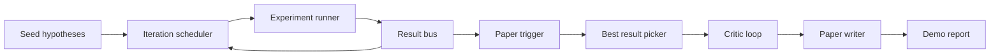
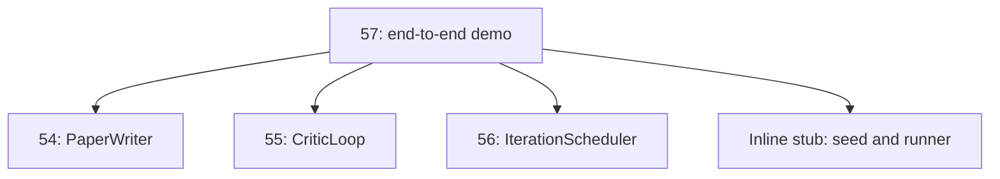
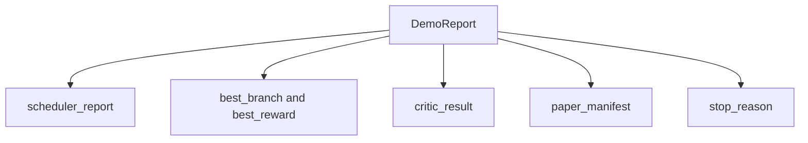

# 终端研究演示

> 演示是你之前写的每一份合同都必须写的场所.如果其中一个泄露,演示是抓住它的教训.

> **【中文解读】**本节是综合项目端到端研究演示的完整集结.


**Type:** Build | **类型:** Build
**Languages:** Python | **语言:** Python
**Prerequisites:** Phase 19 lessons 50-53 | **前置知识:** Phase 19 lessons 50-53

>  前置轨道D8/8(阶段19+全课程收官) ――基于轨道D 全部 +阶段19 全部。
> 端到端研究演示项目:Demo 是所有先前契约组合的地方 任何漏洞,Demo 就是抓住它的课程.
**Time:** ~90 minutes | **时间:** ~90 minutes

## 学习目标

- 通过自动研究循环进行结尾:假设种子,实验运行者,安排者,评论者循环,论文作家.
  中文翻译:自动研究循环端到端:假设种子,实验运行者,安排者,评论者循环,论文作家.
- 通过简单的Python进口,而不是框架,编写前四个D轨道课程的原始内容.
  中文翻译:通过简单的Python进口,而不是框架,编译了之前四个D轨道课程的原始内容.
- 运行循环到一个自动结束的终端, 发出一个单个演示报告,
  中文翻译:运行循环到自动结束的终点,并发出单个演示报告,列出每个阶段的输出.
- 保持演示确定性,以便测试组可以确认最终的形状.
  中文翻译:保持演示确定性,以便测试套件可以确认最终的形状.
- 任何阶段的合同破裂时,表面上设置一个明显的故障模式,以便下一个阶段不会出现破产输入.
  中文翻译:当任何阶段的合同破裂时,表面有一个明显的失败模式,因此下一个阶段不会出现破产输入.

```figure
ch-research-pipeline
```

## 在这里构成的

> **【中文解读】**端到端研究演示组装了 Track D的四个先前课程:种子假设送进代调度器,调度器用 UCB 选择假设并运行实验,结果触发论文写作,批评循环代草稿到收,论文写作者输出最终 LaTeX/BibTeX/Manifest──五个阶段通过纯 Python 导入连接,而不是框架──每个阶段要么成功或抛出类型化错误失败短路整个演示──

> **【拓展：端到端科研自动化的里程碑】**萨卡纳AI的"人工智能科学家" (The AI Scientist) 首次展示了从假设生成到论文撰写的完整自动化流程,在ICLR 2024研讨会上被评为前-10位.Google DeepMind的FunSearch使用LLM发现新的数学算法并发表在自然上.本课程的端到端演示是这些系统的教育简化.



种子是一个列表三个假设. 编程师在它们上进行了六次实验,其中有三个并行插槽. 公共汽车报告一个或多个纸质触发器. 选手选择了单个最佳结果. 评论者循环在该结果构建的草稿上反复. 纸质编写者发出了最终的Latex,BibTeX和表格.

> 五个阶段.


## 为什么进口而不是复制

每个早些时候的课程都会带来一个`main.py`演示程序通过调整它们进口`sys.path`这不是框架线程,而是以前的课程已经使用的检测文件的导入.

> 每个早上课都会发送一个`main.py`演示程序通过调整它们进口`sys.path`这不是框架线程,而是以前的课程已经使用的检测文件的导入.




线条取代了50到53课程:一个小种子假设生成器和同步的奖励函数.用户可以通过调整两个进口来替换线条取这些课程的真实原始.

> 实行杆取代了50到53课程:一个小种子假设生成器和同步的奖励函数.用户可以通过调整两个进口来替换实行杆来取代这些课程的真实原始.


## 确定性保障

> **【中文解读】**演示按构造确定性:实验运行器使用种子编号,批评循环的修改者按固定顺序穿过固定维度,论文作者散文生成器是模拟的,调度器的UCB 选择器用代顺序(而不是随机选择) 打破平局――相同的种子产生相同的报告测试通过运行两个演示并比较显而易见来断定这种属性――

演示是建立的决定性.实验运行者种植的.评论循环的修改器在固定顺序中行走固定尺寸.纸作家的散文生成器是第五十四课中的嘲笑.规划者的UCB选手在反复顺序上打破了联系,而不是随机选择.

> 试验运行器是种子的.评论循环的修改器在固定顺序中行走固定尺寸.纸作家的散文生成器是第五十四课中嘲笑的.规划器的UCB选手在反复顺序上打破了联系,而不是随机选择.


测试通过两次运行演示并比较表格来证实这一属性.

> 由于相同的种子,演示表发出相同的报告.


## 演示报告形状

> **【拓展：组合式架构在 AI 系统中的优势】**本课程的端到端演示证明了"组合即架构" (组合即架构) 构成是架构:五个课程通过纯Python 导入连接,无框架依赖.这种设计使每个组件可以独立测试,独立替换,独立发展.



每个字面上都是从上游阶段来的.演示程序不会转换任何输出,它会构成它们.这是演示程序的测试.

> 每个字段从上游阶段来说.演示没有转换任何输出,它构成它们.这是演示的测试.


## 失效模式处理

> **【中文解读】**每个阶段要么成功要么抛出类型化错误:调度器返回带 stop_reason 的报告,最佳结果选在无触发器时抛出NoTriggerError,批评循环返回带状态的 LoopResult,论文作者在契约违反时抛出 PaperValidationError.

每个阶段都会成功,或者会出现输入错误.

```text
Scheduler ........ returns SchedulerReport with stop_reason
                   in {queue_empty, max_experiments, deadline}
Best-result pick . raises NoTriggerError if no paper trigger fired
Critic loop ...... returns LoopResult with status converged or stopped
Paper writer ..... raises PaperValidationError on contract break
```

测试中,有任何阶段的失败, 测试中只有一种输入例外.`test_no_triggers_raises_typed_error`其他`test_best_picker_raises_when_no_triggers`确认选手提升`NoTriggerError`现在,`BestResultError`当没有一支支支支火发起子的时候,

> 测试中,有几个问题,但这些问题都不适合.`test_no_triggers_raises_typed_error`其他`test_best_picker_raises_when_no_triggers`确认选手提升`NoTriggerError`现在,`BestResultError`当没有一支支支支火发起子的时候,


## 最好的选择者

> **【中文解读】**调度器按分支发行论文触发器──选取器选择所有触发器中平均值奖励最高分支,平局按分支 id 字母序列打破以保证确定性──选取器是一个小纯函数──`mini_to_full_paper`将收到的迷你纸 升级为完整的纸 附加选中分支图表和合成参考文献.

调度器每分支发出纸质触发器. 调度器选择所有触发器中最高平均奖励的分支. 结按分支 id 字母分裂,因此演示是确定性的. 调度器是一个小的纯函数;测试键在固定调度器报告上.

> 调度确定研究循环的下一步.


## 电缆的关键循环

五五课中的批判循环运行在一个`MiniPaper`演示程序建立了一个`MiniPaper`通过将抽象填写到分支ID,种植两个部分 (介绍和结果),并设置`originality_tag`根据分支的平均奖励 (如果高`>= 0.8`平均水平`>= 0.6`其他情况下,低).

> 批评循环审查并代草稿──


修改者将草案重复到融合.输出进入纸质写作器.

> 经验者将草案重复到融合.输出进入论文编辑器.


## 电缆的报纸作家

课54的报纸作家在全文工作.`Paper`演示程序将升级收藏的数据.`MiniPaper`通过`mini_to_full_paper`根据评论家建议的引用密钥联盟,它将一个数字连接到选定的分支和一个小型合成文献.

> 论文写作者产生 拉特克斯草稿──


## 如何读取代码

`code/main.py`定义`BestResultError`现在`NoTriggerError`现在`DemoReport`现在`pick_best_branch`现在`build_mini_paper`现在`mini_to_full_paper`其他`run_demo`进口量在最高调整`sys.path`一次,然后拉下`PaperWriter`现在`CriticLoop`其他`IterationScheduler`他们的课程.

> `代码/主


`code/tests/test_e2e.py`封面:演示程序从端到端运行,并发出一个报告,所有五个填满的字段,两次运行中的确定性,没有分支越过门时的错误, 文件验证错误,当作者合同破裂时,纸质表包含选定的分支的数字,和安排器停止原因是预期值之一.

> `代码/测试/测试_e2e.


## 走得更远

一旦演示程序绿色,就值得连接三个扩展. 首先,持续状态:每个阶段的结果写入一个小的JSON存储器, 第二,仪表板:从调度器和评论循环中追踪事件作为一个单一的时间线. 第三,真正的模型调用:将嘲笑的散文生成器和确定性评论器换成基于模型的;

> 一旦演示程序绿色,就值得连接三个扩展.


演示的任务是证明构成是建筑.五个课程,四个进口,一个报告.下次你添加一个阶段,

> 演示的任务是证明构成是建筑.五个课程,四个进口,一个报告.下次你添加一个阶段,

