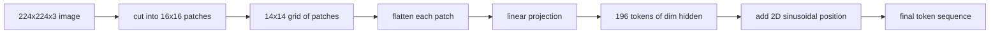

# 视觉编码器分块

> 读像素的视觉模型需要一个像素代码器. 补丁嵌入是这个代码器. 切割图像成一个平方网,平平平每个平方,将它投射到一个线性层,然后添加一个2D位置信号,这样变压器就可以知道每个平方在原始图像中坐在那里.

> **【中文解读】**本课是"构建它/使用它"中构建侧的第一块:视觉编码器的分块 (分块) 嵌入) 前端.视觉模型读取像素,而变压器是量序列分块嵌入就是像素世界的"分词器"――流程是:把图像切成方块网格、每块展平面、过一个线性层投影、再加二维位置信号,让模型知道每个块原来在图中的位置――

> **【拓展：多模态视觉路线→整个 VLM 栈的地基】**视觉侧面从"Conv2d 分块投影+位置信号"前端起步.本课.58 建前端,59 课叠加 12 层变压器,60 课做模拟对齐投影,61 课做交叉注意力融合,62 课做视觉语言预训练五课合成一条完整的多模态视觉路线.

>  **【前置】**学本课前请先掌握:阶段19 · 30-37(轨道B 基础:BPE 分词器、位置嵌入、注意力机制从零实现)

**Type:** Build | **类型:** 构建
**Languages:** Python | **语言:** Python
**Prerequisites:** Phase 19 lessons 30-37 (Track B foundations) | **前置知识:** Phase 19 · 30-37（Track B 基础）
**Time:** ~90 minutes | **时间:** 约 90 分钟

## 学习目标

- 标记图像成固定长度的嵌入补丁序列.
  中文翻译:把一张图像分块成固定长度的图像块嵌入序列.
- 实施一个`Conv2d`基于补丁投影,与"展开然后线性"的数学相匹配.
  中文翻译:实现基于`Conv2d`图像块投影,其数学结果与"展开后再线性"完全一致.
- 构建一个确定性2D双向状位置,嵌入,所以代号序符号编码空间位置.
  中文翻译:构建确定性的二维正弦位置嵌入,让词元顺序携带空间位置信息──
- 检查片数量,嵌入形状,`Conv2d`合成装置的配方.
  中文翻译:在合成测试图上验证图像块数量、嵌入形状以及`Conv2d`与展开的等价性.

## 问题 问题引入

> **【中文解读】**本节算清"为什么必须分块"这个笔记. 每个像素当词元将使224x224的图片产生150,528个代币,注意力开销平方级爆炸;整图压成一个向量又丢失局部性.

变体食用了一个向量序列. 图像是一个三通道的网格. 读取每个像素作为一个符号, 序列长度会爆炸: 224x224 RGB 图像是 150,528 个符号, 读取图像,作为一个巨大的平面向量, 抛弃了位置, 编码器前端的任务是将像素格式压缩成几百个代币,每个代币都总结了一个方形区域.

> 变压器 吃的是向量序列,而图像是三通道网格――把每个像素当一个词语将使序列长度爆炸:一张224x224的RGB图片是150,528个词语,12层变压器的注意力根本不起――把整个张图读成一个巨大的平流量又丢失了局部性,注意力层也无法找到它.编码器前端的任务是将像素网格压缩成几百个词语,每个词元概括一个块方形区域――

补丁嵌入解决了一个线性投影.一个224x224图像切成16x16补丁产生14x14的格格 196补丁.每个补丁是平坦的从`(3, 16, 16) = 768`变压器看到196个维度代币.`hidden`网络其他部分可以取的序列.

> 图像块嵌入式使用一次线性投影解决这个问题. 224x224的图片成 16x16块得到 14x14 网格共 196块.`(3, 16, 16) = 768`个像素值展平成一个向量,再由线性层映射到模型的隐藏维度.`hidden`单词的序列是后续网络动的序列.

## 概念的核心概念



### 为什么用图像块而不是像素

>  **【类比】**分块像把一个大拼图按16x16的格子"预组装"成196块中等碎片再交给整理师 (Transformer) ⋅分像等于把1万多粒散落在台面上,整理师连两配对都做不完;整图片压力一块等于把拼图直接碎成粉碎,局部图案信息完全消失了.16x16的碎片刚好保留了"这个有猫耳边缘"级别的信号,再压整理量到196 ⋅分.

关注是序列长度的方形. 196 个代币的序列成本.`196 * 196 = 38,416`关注度分数每个头/层;一个150,528个代币的序列成本`150,528 * 150,528 = 22.6 billion`补丁可以减少注意力计算的590,000倍,而一个16x16区域可为高水平视觉任务承载足够的信号.成本是一个补丁内部细节空间细节的损失,这就是为什么下游多模块堆经常运行第二个高分辨率分支,当细节定位是重要的.

> 注意力开销与序列长度成平方关系.`196 * 196 = 38,416`个注意力分数;150,528个词元的序列需要 `150,528 * 150,528 = 226 亿`△分块换时注意力计算能力缩小了约59万倍,而单个16x16区域带有信号足以支高层视觉任务.

### 为什么线性投影足够

每个补丁都被视为一个独立的向量.投影学习了基础:边缘检测器,颜色过器,简单的纹理.`768 * 768 = 589,824`根据ViT-Base的标准,并快速列车.更深的卷积茎存在 ("混合"ViT),但平线线性投影是标准的,大多数现代开放权重编码器都具有这个形状.

> 每个图像块被视为独立向量处理.投影层学出的一组基:边缘检测器,颜色波器,简单纹理.`768 * 768 = 589,824`个参数) 且训练快──更深的卷积前端也存在,但平的线性投影才是标准做法,大多数现代开源重编码器出厂就是这种形状──

### 其他`Conv2d`招`Conv2d`技巧

> **【中文解读】** `Conv2d(in_channels=3, out_channels=hidden, kernel_size=patch_size, stride=patch_size)`没有加时,数值上与"展开+线性层"完全等价每个输出位置就是这个块像素与一个波器的点积.生产代码库几乎都使用卷积写法:GPU上更快,还少一次重塑.本课程的测试正是验证这两种拼法逐位一致.

`Conv2d(in_channels=3, out_channels=hidden, kernel_size=patch_size, stride=patch_size)`没有填充的结果与fold-then-linear相同,因为每个输出位置点-produces的补丁像素对一个过器. 卷积是补丁投影,大多数生产代码基础将它运送到这种方式,因为它在 GPU上更快,使用一个更少的重塑.

> `Conv2d(in_channels=3, out_channels=hidden, kernel_size=patch_size, stride=patch_size)`不加填充时与"展开+线性"都给出相同的数值结果,因为每个输出位置就是把图像块像和一个波器做点积.

### 位置嵌入

两个维的双向突嵌入式给每个代币一个固定信号,`(row, col)`位置. 嵌入维度的一半在多频率上编码行位置,另一半编码列位置. 编码是决定性的,因此可以在不需要重新训练的情况下交换分辨率,并且它清洁地插入模型在训练时从未看到的网格.

> 词元走出投影层时不携带顺序信息.`(行, 列)`位置:嵌入维度的一半使用多频率 sin/cos 编码行位置,另一半编码列位置──该编码是确定性的,因此不重训也能换分辨率,还能干净地插值到训练时从未见过的网格──

| Component | Shape | Parameters |
|-----------|-------|------------|
| Patch projection (`Conv2d`) | `(hidden, 3, patch, patch)` | `3 * P * P * hidden + hidden` |
| Position embedding (fixed) | `(num_patches, hidden)` | 0 (computed, not learned) |
| CLS token (learned) | `(1, hidden)` | `hidden` |

对于ViT-Base/16的 224 分辨率:投影中590.592 个参数,CLS代币中768个参数,对于鼻状位置则是零.下一个课程 (59) 将这个前端上堆叠一个12层变压器.

> 对224分辨率的ViT-Base/16:投影层590,592个参数,CLS词元768个,正弦位置编码零个. 下一课,59) 在这个前端之上叠加一个12层变压器──

### 相当性作为一个健康检查.

补丁步骤有两个拼写:`Conv2d`它们必须为相同的权重产生相同的输出.如果它们没有,则解体数学是错误的,而其余的编码器是建立在沙子上.本课中的测试实行了同等性.

> 图像块这个步骤有两种拼法:`Conv2d`投影和显式的"展开+线性"――同样的权力必须产生同样的输出――如果不一样,说明展开的数学写错了,编码器的剩余部分就是在沙子上建成――本课的测试专门验证这个等价性――

```figure
ch-patch-tokenizer
```

## 建立它,实现它.

> **【中文解读】** `code/main.py`用 PyTorch 实现了四个部分:`PatchEmbed`包着`Conv2d`图像块投影模块)`sinusoidal_2d`(无状态的二维位置表构造函数)`VisionFrontEnd`(分块嵌入 + CLS 前置 + 位置相加一次前向组合)`synthesize_image(seed)`子`numpy.random`造确定性 224x224x3 测试图) ⋅demo 跑一张测试图并打印输出形状、CLS 词元范数和位置嵌入一行范数在同一行内均,正是正弦编码的签名──

`code/main.py`执行:

- `PatchEmbed`其他`nn.Module`包装`Conv2d`用于补丁投射.
- `sinusoidal_2d(grid_h, grid_w, dim)`构建2D位置表的无状态函数.
- `VisionFrontEnd`接,CLS预定,并将位置添加到一个前进传输中.
- `synthesize_image(seed)`通过  测量, 测量, 测量, 测量,`numpy.random`现在,我们要去.
- 通过前端运行一个固定图像的演示,打印出式形状,CLS代币标准,以及位置嵌入的一行.

运行它:

```bash
python3 code/main.py
```

输出:224x224固定符号为一个形状序列`(1, 197, 768)`首个代币是CLS,接下来的196个是补丁代币. 位置嵌入规范在一行内均,这是鼻状签名.

> 输出:224x224 测试图被分成块形状`(1, 197, 768)`序列──第一词元是CLS,后面196个是图像块词元──位置嵌入式范数在同一行中均一致,这正是正弦编码的签名──

## 用它实现框架

> **【中文解读】**同一个分块前端现在每一个现代视觉语言模型里:CLIP ViT-L/14、SigLIP、DINOv2、Qwen-VL 家族、InternVL 全都从"`Conv2d`分块投影 + 位置信号"起步──各家庭的差异都在下游(CLS 池化vs 无 CLS 池化、注册词元、14vs 16 的块大小、根据位置插值做动态分辨率)──本课程前端是所有这些模型共同站立的基──

现在,每一个现代视觉语言模型都出现了相同的补丁前端:Clip ViT-L/14,SigLIP,DINOv2,Qwen-VL家族,以及InternVL堆,`Conv2d`补丁投影加一个位置信号. 家庭之间的差异是下游 (CLS vs 没有CLS的集成,注册代币,不同补丁尺寸14 vs 16,通过插曲的位置进行动态分辨率). 本课程的前端是每个模型都站在的基板.

> 同一个分块前端现在每一个现代视觉语言模型中:CLIP ViT-L/14、SigLIP、DINOv2、Qwen-VL 家族和InternVL 都从`Conv2d`分块投影加位置信号开始──各家庭之间的差异都在下游(CLS 池化vs 无 CLS 池化、注册词元、14vs 16 的块大小差异、通过位置插值实现动态分辨率)──本课程前端是所有这些模型共同站立的基层──

## 测试测试

`code/test_main.py`覆盖:

- 补丁数量匹配`(image_size / patch_size) ** 2`
  中文翻译:图像块数量等于`(image_size / patch_size) ** 2`,我知道.
- 输出形状匹配`(batch, num_patches + 1, hidden)`
  中文翻译:输出形状为`(batch, num_patches + 1, hidden)`,我知道.
- 其他`Conv2d`投影等于手动在小装置上打开然后直线
  中文翻译:在小测试图上,`Conv2d`投影与手工"展开+线性"逐位一致.
- 坐标位置表是通过调用的确定性
  中文翻译:正弦位置表跨调用保持确定性──
- 通过批量淡而无泄漏的CLS代币发射
  中文翻译:CLS 词元在批量 维度上广播且不发生串扰──

运行它们:

```bash
python3 -m unittest code/test_main.py
```

## 练习题

1. 换一个学会的位置.`nn.Parameter`训练后改变分辨率时,学习的位置在固定的分辨率上获胜;
   中文翻译:把正弦位置变为可学习的`nn.Parameter`较于第一时代的微型合成分类任务的损失.

2. 换一个`Conv2d`为了明确的`nn.Unfold`另外`nn.Linear`它们的输出与浮动容量相匹配.
   中文翻译:把 `Conv2d`变成显然的`nn.Unfold`加  `nn.Linear`论断输出在浮点容量差内一致.

3. 添加支持非方形补丁尺寸 (例如32x16用于宽面输入) 并验证位置表处理非方形网格.
   中文翻译:增加对非方形图像块的支持(如宽高比输入用32x16),并验证位置表能处理非方形网格──

4. 片步骤在批量1,8,64的配置.
   中文翻译: 在批量为 1、8、64 下给分块步骤做性能剖析──图像块投影很少是瓶;下游的注意力层才占大头──

5. 训练前端作为一个冷的特征提取器在4类合成形状数据集 (圆,方形,三角形,星).CLS代币输出应线性分开.
   中文翻译:把前端当结特征提取器,在四类合成形状数据集中训练.

## 关键词 快速查找表

> **【中文解读】**五个词锁定本课词汇:Patch(图像块) 、Patch嵌入(块嵌入) 、序列长度(分块后的序列长度,通常再加 CLS) 、共弦位置编码) 、CLS标志(可学习的池化头词元) ⋅后续四课都在这套词汇上展开──

| Term | What it means |
|------|---------------|
| Patch | A square sub-region of the image, typically 14x14 or 16x16 |
| Patch embedding | Linear projection of one flattened patch to the hidden dim |
| Sequence length | Number of tokens after patch tokenization, usually plus CLS |
| Sinusoidal position | Fixed sin/cos signal that encodes 2D grid coordinates |
| CLS token | Learned vector prepended to the sequence as the pooling head |

## 继续阅读 继续阅读

- 一张图像值16x16字 (ViT, 2021) 对于原始的补丁嵌入式框架.
  中文翻译:一个图像值16x16字(ViT,2021) 图像块嵌入的开山之作──
- 关注就是你需要的 (2017) 对于这里适应2D的鼻形位置公式.
  中文翻译:注意力就是你需要的(2017) 本课改编为二维的正弦位置公式出处。
- 印证的DINOv2纸,可以添加为6练习.
  中文翻译:DINOv2论文注册词元的出处,可作为附加练习自行扩展──
