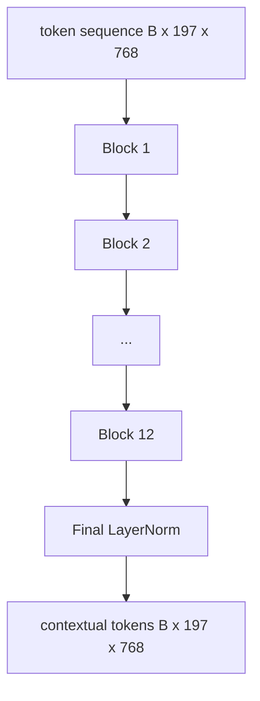
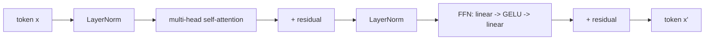

# 视觉变压器编码器

> 补丁本身就看不见.一个12层的LN前变压器,有12个注意头,将补丁代币的序列转化为文本代币的序列,CLS代币将整个图像的功能聚集在最后的隐藏状态中.这个课程是每个现代视觉语言模型的机器室.

> **【中文解读】**光有图像块还不够块与块之间相互不识. 本课在58 课的分块前端上叠加了12层前LN变压器,12 个注意头,把"各顾各"的图像块词汇变成带上下文的词汇序列;CLS词汇在最后层把整个图像特征汇集到自己的隐藏状态中.这里是每个现代视觉语言模型的机房.

> **【拓展：一块稳定的积木→读任何 VLM 论文的通行证】**配方是Clip ViT-L、SigLIP、DINOv2、Qwen-VL、InternVL等所有2025-2026年开源视觉编码器的共同脊柱──配方稳定到你可以直接阅读这些论文并认定是这个块形状,除非作者明确说没有.

>  **【前置】**学本课前请先掌握:本阶段 58 课(视觉编码器分块) 本课代码直接进口 58 课的 `VisionFrontEnd`头自注意力、LayerNorm、残差连接的从零实现──

**Type:** Build | **类型:** 构建
**Languages:** Python | **语言:** Python
**Prerequisites:** Phase 19 lessons 30-37 (Track B foundations) | **前置知识:** Phase 19 · 30-37（Track B 基础）
**Time:** ~90 minutes | **时间:** 约 90 分钟

## 学习目标

- 实现一个LN前变压器块,具有多头自注意和一个输送前置子层.
  中文翻译:实现一个前LN变压器块,包含多头自注意力和一个前子层.
- 堆积12块,以形成一个ViT-Base编码器.
  中文翻译:堆叠12块、12个头,组成VT-Base编码器──
- 导向第58课前端的补丁进入编码器,然后向前传递.
  中文翻译:把58 课的图像块前端接入编码器并跑一次前向──
- 检查CLS代币是否从每个补丁中汇集信息.
  中文翻译:验证 CLS 词汇汇聚来自每个图像块的信息.

## 问题 问题引入

> **【中文解读】**本节回答"为什么块上还需要变压器"――分块嵌入产生的197个词元彼此无意识:一张猫图需要每个块知道哪些块是胡须,哪些是背景,哪些是眼睛――注意力逐层建立这种感知――标准配方:12层深度,12头宽,前LN、GELU、前 4倍扩展稳定到可以作为默认值――

补丁嵌入产生了197个代币的序列,每个代币都是一个向量,没有意识到任何其他补丁. 猫的照片需要每一个斑点,才能知道哪些斑点包含胡须,哪些包含背景,哪些包含眼睛. 变压器是建立意识的机制,一次性关注一层. 没有它,补丁前端是一个聪明的代币,没有理解.

> 分块嵌入产出了197个词元的序列,每个词元都是对其他块的无知向量. 一张猫的图片需要每个图像块知道哪些块装胡须,哪些装背景,哪些装眼睛.

标准配方是12块深,12个头宽, 具有前层规范的放置,GELU激活, 这种配方是Clip ViT-L,SigLIP,DINOv2,Qwen-VL家族,InternVL以及2025-2026年的其他开放权重视觉编码器的脊柱. 配方是足够稳定的,你可以读到任何一篇论文,

> 标准配方是12层深度,12层宽度,前层标准 摆放,GELU 激活,前 4倍扩展. 标准配方是Clip ViT-L,SigLIP,DINOv2 wen-VL 家族,InternVL以及2025-2026年所有其他开源重视编码器的脊柱. 配方足够稳定,你读到的任何论文都能认定是这个块形状,除非作者明确说不是.

## 概念的核心概念





### 之前的LN与后LN.

>  **【类比】**后LN 像给每层流水线工位前加一道"标准化预处理台":材料先归化再进工位,深层流水线(12+层) 运行稳定.

原始变压器在剩余后放置了LayerNorm.前LN (每一个子层前LayerNorm) 是每个现代视觉语言模型所使用的版本,因为它稳定地训练而没有学习速度的加热技巧.前进的差异是前进传递中的一条线,深度12+的梯度流量是白天和夜.

> 原始变压器 把层规则 放在残差之后――Pre-LN (每层前做LayerNorm) 是所有现代视觉语言模型采用的版本,因为它不需要学习热身技巧就能稳定训练――区别只是前向传播中的一行代码,而12层以上的深度流量却是天壤之别――

### 更多的自我注意力

每个头都将标志向量投射到自己的头`(query, key, value)`三维的三维`head_dim = hidden / num_heads`随着`hidden = 768`其他`heads = 12`每个头都有`dim = 64`双头的同时,其输出回归768维度,通过输出投影.多头的目的是,一个头可以学习"看猫眼睛",而另一个头可以学习"看背景梯度"而不受到干扰.

> 每个头把词汇向量投影到自己的`(query, key, value)`三元组,维度为 `head_dim = hidden / num_heads`,我知道.`hidden = 768`,我知道.`heads = 12`时每头维度为64──12头并行做注意,输出拼接回768维再过一个输出投影──多头的意义在于:一个头可以学"住猫眼"",另一个头同时学"住背景渐变"",互不干扰──

### 为什么前层扩大了4倍?

美国联邦农业局`hidden -> 4 * hidden -> hidden`由于其实,在数据中,GELU是最重要的,但在数据中,GELU是最重要的. 因素4是经验性的,自2017年以来一直存在于语言和视觉变革器中. 较小 (2x) 低调;较大的 (8x) 超越固定数据预算.

> 走上一个层`hidden -> 4 * hidden -> hidden`由于语言和视觉变革器中始于2017年起一直存在的经验值,更小的2倍 (缺合;更大的8倍) 在固定数据预算下过合.

| Component | Parameters at ViT-Base scale |
|-----------|------------------------------|
| qkv projection per block | `3 * 768 * 768 = 1.77M` |
| output projection per block | `768 * 768 = 590K` |
| FFN per block (4x expansion) | `2 * 768 * 4 * 768 = 4.72M` |
| LayerNorm per block | `4 * 768 = 3K` |
| Total per block | about 7.1M |
| 12 blocks | about 85M |
| Plus front end | about 86M total |

维特基是一个86M参数编码器.这在2026年标准上很小 (SigLIP-So400M是400M,Qwen-VL ViT是675M),但在宽度和深度上,架构是相同的.

> 根据2026年的标准,VIT-Base是86亿参数编码器.

### 原因面具还是不?

> **【中文解读】**视觉变压器是纯编码器,双向的:词元`i`可以看任意词元`j`视觉编码器内部的注意力是全连接的.

视觉变压器仅使用编码器,并且双向:代币`i`现在,我们可以参加.`j`解码器侧交叉注意力在第61课中将使用因果性面膜,但在视觉编码器内,注意力完全连接.

> 视觉变压器是纯编码器和双向的:任意对词元`i`,我知道.`j`之间可以互相注意. 没有掩码.

### 什么是CLS标志学到了什么

CLS标志开始作为一个学习参数,没有自己的补丁内容,并通过每个区块的注意力积累信息.到最后层,CLS行是整个图像的向量总结;下游头将这个单个向量投射到类日志,对比嵌入或交叉注意力键中.

> CLS 词元起始只是一个可学习的参数,本身没有任何图像块内容,依靠每个层次的注意力积累信息.到最后层次,CLS 那一行已经是整张图的向量摘要;下游头部把这个单一向量投影成类逻辑,对比嵌入,或供文本解码器使用交叉注意力键.

```figure
ch-cls-funnel
```

## 建立它,实现它.

> **【中文解读】** `code/main.py`自底上实现`MultiHeadSelfAttention`(qkv + 输出投影 + 缩放点积)`FeedForward`子子子子子子子子子子子子子子子子子子子子子子子子子子子子子子子子子子子子子子子子子子子子子子子子子子子子子子子子子子子子子子子子子子子子子子子子子子子子子子子子子子子子子子子子子子子子子子子子子子子子子子子子子子子子子子子子子子子子子子子子子子子子子子子子子子子子子子子子子子子子子子子子`Block`(前LN+双子层残差)`ViT`其他类型的类型:`VisionEncoder`(接线 58 课前端,前向返回上下文序列与 CLS 池化向量) ⋅示范 打印输入输出形状、参数量(约86M) 和每层 CLS 范数范数随层数漂漂、在最终层Norm 处稳定──

`code/main.py`执行:

- `MultiHeadSelfAttention`随着`qkv`结果的投影, 标点产品注意力数学,
- `FeedForward`通过4倍扩展的GELU MLP.
- `Block`含残留物,包括注意和输送的子层.
- `ViT`只有一个最后的"级别"
- `VisionEncoder`哪些线`VisionFrontEnd`从第58课到第6课`ViT`起并暴露一个`forward()`返回文本序列和集成的CLS向量.
- 通过完整的编码器运行合成的224x224固定图像的演示,并在其他层中打印输入形状,输出形状,参数数和CLS标准.

运行它:

```bash
python3 code/main.py
```

输出: 装置编码为 a`(1, 197, 768)`由于层的合,CLS标准向上移动,然后在最后的层Norm中稳定.

> 输出:测试图被编码为`(1, 197, 768)`张量――CLS 范数随层叠加上漂移,在最终层Norm 处稳定下来――总参数约86M――

## 用它实现框架

> **【中文解读】**这里定义编码器在宽度和深度之外,就是2025-2026年每个开源VLM 里出厂的块──差异只有四处:宽深:ViT-L 1024/24/16、So400M 1152/27/16)、池化头:CLS/平均/注意力池化)、位置处理:正弦/可学习 1D/ALiBi/2D RoPE)、注册词元:DINOv2 前置4个额外可学习词元,一行代码事项:数学块不变:60-63 课共站立的基座

在此定义的编码器是,在宽度和深度上,相同的块堆,在2025-2026年,每一个开放重量的VLM内运输.

- **Width and depth.**维特-大是`hidden=1024, depth=24, heads=16`;siglipso400m是`hidden=1152, depth=27, heads=16`区块相同.
  翻译: 中文**宽度和深度。**子子`hidden=1024, depth=24, heads=16`利普 So400M 是`hidden=1152, depth=27, heads=16`同一个块.
- **Pooling head.**总体而言,在这些课程中,
  翻译: 中文**池化头。**课程中,学生们的注意力和注意力都会增加.
- **Position handling.**固定的阴影状 (课58) 与学习1D对 ALiBi对 2D RoPE.
  翻译: 中文**位置处理。**固定正弦 () 对于可学习的1D对ALiBi对2D RoPE──块数学不变──
- **Register tokens.**迪诺二预备了4个额外的学习代币.
  翻译: 中文**Register 词元。**,我还没有说过.

接下来的课程 (60-63) 站在上面.

> 这块是基座. 下一个课.

## 测试测试

`code/test_main.py`覆盖:

- 一块保持形状,不变于输入批量大小
  中文翻译:单个块保持形状且对输入批量大小不敏感──
- 关注点总数在关键轴上达到1 (软max智能)
  中文翻译:注意力分数沿键轴求和为 1(软最大健康性) ⋅
- 剩余路径是有线 (零输入仍然通过CLS代币产生非零输出)
  中文翻译:残差路径接通(零输入仍能通过CLS 词元产生非零输出) 』
- 通过4层堆叠的前进通过产生正确的形状
  中文翻译:4 层堆叠前向产生正确形状――
- 从CLS输出流向补丁投影的梯度流
  中文翻译:梯度从CLS 输出流回图像块投影──

运行它们:

```bash
python3 -m unittest code/test_main.py
```

## 练习题

1. 加入注册代币 (CLS后预pendiated的4学习向量) 和重复运行.通过最后层的软max分布的透来比较注意地图的顺度.
   中文翻译:添加注册词元(4个前置在 CLS 后可学习向量)并重跑──使用最后一层软max 分布的比较注意力图的平滑度──

2. 换LN前后LN,在合成形状分类器上进行一段时间的列车.观察哪个列车在没有LR加热的情况下稳定地进行列车.
   中文翻译:把前LN 换后LN,在合成形状分类器上训练一个时代──观察哪一个不需要学习率热身也能稳定训练──

3. 实施因果化掩饰`attn_mask`按下下列方法来定义一个模块的模块.`(seq, seq)`低三角形.
   中文翻译:把因果掩码实现为`attn_mask`参数,让同一个块可复用为解码器块.`(seq, seq)`现在,我在上.

4. 配置一张前进通行,以批量1,8,64为单位`torch.profiler` MLP 层主导墙壁时间,而不是注意力.
   中文翻译:用`torch.profiler`在批量为 1、8、64 下剖析前向──占壁钟时间大头是MLP层,不是注意力──

5. 换一个注意力头的q-k-v投影器,用低级的LoRA适配器, 结其余的,
   中文翻译:把一个注意力头的q-k-v 投影换成低排的LoRA 适配器,结结其余部分,验证梯度只流向预期位置――

## 关键词 快速查找表

> **【中文解读】**本课五个关键词:前LN(子层前归归一化) ‧自觉 (自觉) ‧同序列内互相注意) ‧多头 (多头) ‧隐藏维拆给H个独立头) ‧FFN扩展(前先扩大到4倍再缩小) ‧CLS聚合 ((使用第一个词元的最终隐藏状态作图像摘要) ‧60 课的投影层将直接消耗这里的 CLS 池化输出──

| Term | What it means |
|------|---------------|
| Pre-LN | LayerNorm applied before each sub-layer instead of after |
| Self-attention | Each token attends to every other token in the same sequence |
| Multi-head | The hidden dim is split across `H` independent attention heads |
| FFN expansion | The feed-forward layer widens to `4 * hidden` before contracting |
| CLS pooling | Use the first token's final hidden state as the image summary |

## 继续阅读 继续阅读

- 对于编码器配方,一个图像值16x16字 (ViT,2021年).
  中文翻译:一个图像值16x16字(ViT,2021) 编码器配方的出处。
- 登记代币的DINOv2 (2023) 和自我监督预训目标.
  中文翻译:DINOv2(2023) 注册词元与自监督预训练目标──
- 对于第62课中使用的平均聚合变体和sigmoid对比损失的SigLIP (2023)
  中文翻译:SigLIP(2023) 平均池化变体与62 课将使用的sigmoid对比损失.
