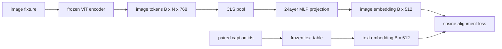

# 模态对齐投影层

> 视觉编码器生成图像代币.文本解码器消耗文本代币.这两个生活在不同的矢量空间中.一个小的两层MLP将图像代币投射到文本嵌入空间中,而对对对的副本的可西因对齐损失将两个空间拉入协议.该投影是视觉语言模型中最小的部分,并且是转移最重要的.

> **【中文解读】**视觉编码器产出图像词元,文本解码器消费文本词元两者生活在不同的向量空间里. 本课用一个小两层MLP将图像特征投影到文本嵌入空间,再使用与配对描述文本的余弦对齐损失把两个空间拉──这个投影块是视觉语言模型中最小的部分,但是移动最重要的块.

> **【拓展：适配器范式→LLaVA 2023 的原点】**结论 86M 视觉编码器、结论文本表,仅训1.3M 参数的投影桥这是LLaVA 2023年原装配方,BLIP-2 将它重新包装成Q-Former,之后每个开源VLM都以某种形式采用了──本课用对余弦损失进行训练动力学看清楚;62课再升级成批量对比 (InfoNCE)──

>  **【前置】**学本课前请先掌握:本阶段 58、59 课(分块前端 + ViT 编码器) 本课直接进口 59 课的编码器并结;轨道B的 MLP、嵌入表与损失函数基础(30-37)。

**Type:** Build | **类型:** 构建
**Languages:** Python | **语言:** Python
**Prerequisites:** Phase 19 lessons 30-37 (Track B foundations) | **前置知识:** Phase 19 · 30-37（Track B 基础）
**Time:** ~90 minutes | **时间:** 约 90 分钟

## 学习目标

- 构建一个两个层的MLP投影,将图像特性映射到文本嵌入空间中.
  中文翻译:构建一个两层MLP 投影,把图像特征映射到文本嵌入空间中.
- 构建一个模拟文本嵌入表 (没有预先训练的代币,没有真正的体积).
  中文翻译:构建一个模拟文本嵌入表
- 计算预测图像代币和对标题嵌入之间的可西因对齐损失.
  中文翻译:计算投影后图像词元与配对描述文本嵌入之间的余弦对齐损失──
- 通过冷的视觉编码器和冷的文本表来训练单独的投影.
  中文翻译:在结视觉编码器和结文表的前提下,只训练投影层

## 问题 问题引入

> **【中文解读】**问题很具体:编码器 ((58-59 课) 输出维度 `vision_hidden = 768`解码器要接下来的是`text_hidden = 512`图像词元 图像词元 住在"纯视觉预训学出的基"里,与解码器的词量无关.

你有一个视觉编码器 (58-59课) 产生维度标记`vision_hidden = 768`你有一个文本解码器,你想把它插入到上面.`text_hidden = 512`解码器预期文字形象的代币.图像代币不是文字形象:它们生活在一个编码器在视觉预训练中学到的基础上,没有与解码器的词向量关系.

> 你有一个视觉编码器,产出维度.`vision_hidden = 768`你有一个想接在上面的文本解码器,嵌入维度`text_hidden = 512`解码器的词量与解码器的词量无关.

两层MLP投影 (线性,GELU,线性) 弥合了差距.`768 * 1024 + 1024 * 512 = 1.3M`视觉编码器保持冷.文本嵌入表保持冷.只有投影运动.这是2023年发送的LLaVA配方,BLIP-2被重新框架为Q-Former,并且自那以后,每一个开放式VLM都以某种形式采用.

> 两层MLP 投影(线性、GELU、线性) 补上这道──它足够小(约`768 * 1024 + 1024 * 512 = 1.3M`参数),单张GPU 几分钟就能训练完毕,而且是齐阶段唯一需要学习的部件.视频编码器保持结,文本嵌入表保持结,只有投影在动.

## 概念的核心概念



### 投影前先池化

视觉编码器发射197个代币.文本侧有一个标题级嵌入.为了对齐它们,你需要每样本一个图像级向量.CLS聚合是最简单的:从编码器中取出第一个代币并投射它.所有197个代币的平均聚合是另一个选择,这是SigLIP使用的.

> 视觉编码器吐出197个词,文本侧只有单个描述级嵌入. 需要对齐,每个样本需要一个图像级向量.

### 为什么两个层而不是一个层?

>  **【类比】**单层线性投影像"只能平移旋转缩地图的坐标系"两个空间如果只是摆放不同角度,转转就对了;但如果一个空间有、一个平面(曲率不匹配),光转坐标系永远对不齐.

一个线性投影可以旋转和重新扩展,但如果两个空间有曲率不匹配,则不能固定基础. 两层线性之间的GELU给投影一个非线性曲线,这对Clip风格的特性进行对应到语言模型嵌入式的经验性足够. 深度投影 (LLaVA-NeXT使用GLU;Qwen-VL使用了一堆注意力层) 是扩展;双层MLP是可信的基线,是BLIP-2的Q-Former投影头舰在罩杯下面的.

> 单层线性投影能旋转和缩小,但如果两个空间存在曲率失配就无法修复基. 两层线性层之间 一层GELU 给投影一次非线性折,经验足以将CLIP风格特征对齐成语言模型嵌入. 更深层次投影 (LLaVA-NeXT使用GLU;Qwen-VL使用一层注意力层) 是扩展;两层MLP是经典基线,也是BLIP-2的Q-Former 投影头内部载载的东西.

| Layer | Shape | Parameters |
|-------|-------|------------|
| fc1 | `(vision_hidden, projection_hidden)` | `768 * 1024 + 1024` |
| activation | GELU | 0 |
| fc2 | `(projection_hidden, text_hidden)` | `1024 * 512 + 512` |

约为1.3M的参数`768 -> 1024 -> 512`头部.

> 一个`768 -> 1024 -> 512`投影头约1.3M参数.

### 余弦对齐损失

> **【中文解读】**"对齐"不等于`image_emb == text_emb`为了齐是指`image_emb`在联合空间中与`text_emb`指向同一方向.`1 - cos_sim(image, text)`取值从0 (完全同向) 到2 (完全反向),训练把每一个配对往零推推.62 课把它推广成批量对比.

调整并不意味着`image_emb == text_emb`调整意味着`image_emb`方向的点`text_emb`体损失是`1 - cos_sim(image, text)`训练将这项工作推向每对零. 第62课将其概括为对比分批量 (InfoNCE),每个图像必须比批量的任何其他标题更接近自己的标题;本课使用每对版本,以便动态可见.

> 没有等于`image_emb == text_emb`为了齐是指`image_emb`在联合空间中与`text_emb`指向同一方向.`1 - cos_sim(image, text)`训练把每一个配对往零推推推推推推推推为批量对比 (InfoNCE),其中每张图片必须比批量中的任何其他描述更接近自己的描述;本课用于逐个版本,让动力学看看见.

### 结编码器是的

视觉编码器具有86M参数. 文本表还有一些百万. 训练他们从假体是一个不初步. 结两者都意味着投影的1.3M参数是唯一的变化, 适配器的VLM的运行形状是这样的:重部件保持冷,轻桥列车.

> 视觉编码器有86M参数,文本表还有几百万个. 模拟语料从头上训练它们是完全不可能的. 把它们都结结起来意味着投影的1.3M参数是唯一的变化,合成配对上几百步就足以减轻损失压力. 这正是每个适应器的VLM操作形式:重部件保持结局,轻量桥负责训练.

```figure
ch-projection-bridge
```

## 建立它,实现它.

> **【中文解读】** `code/main.py`实现`MLPProjector`两层热卢 (GELU MLP)`MockTextEmbedding`(种子确定性初始化结嵌入表)`make_pair(seed, vocab_size)`(合成"图像 + 描述 id 序列"配对,描述嵌入由词元嵌入平均池化)`cosine_alignment_loss`(逐对`1 - cos_sim`训练循环在32个合成配对上跑200步,每25步打印损失从约1.07降至约0.80,证明通过投影就能把图像词元拉向文本空间.

`code/main.py`执行:

- `MLPProjector(in_dim, hidden_dim, out_dim)`两层线性MLP,具有GELU激活.
- `MockTextEmbedding(vocab_size, dim)`结结结嵌入表,由种子的定性源头.
- `make_pair(seed, vocab_size)`标题是短的 id 序列;标题嵌入是指合并于代币嵌入.
- `cosine_alignment_loss(image_emb, text_emb)`两人均`1 - cos_sim`目标.
- 训练循环,在32个合成对 (循环) 上运行了200步的投影,视觉编码器和文本表被结,每25步就会打印损失.

运行它:

```bash
python3 code/main.py
```

输出:训练报告在200步内从初始损失下降到0.80左右,证明仅投影可以将图像代币拉到文本空间.每对的最终共数相似性也会打印.

> 输出:训练报告显示损失在200步内从初始1.07降至0.80,证明单靠投影就能把图像词元拉向文本空间.

## 用它实现框架

> **【中文解读】**同样模式出现每个开源VLM 里:LLaVA 1.5(CLIP-ViT-L 隐藏维到LLaMA 嵌维的两层GELU MLP,第一阶段只训练投影) 、BLIP-2(Q-Former使用32个可学习查询词对图像词对图像词做交叉注意,末端投影头就是本课MLP的应对物)、MiniGPT-4(单线投影)、Q-VL多(层交叉注意配配器,最后一个块仍然投投向LM 嵌维的投影) ⋅形状不同,角色相同:池化图像词元、投向文本嵌维、单独训练.

任何开放式VLM都会出现相同的模式:

- **LLaVA 1.5.**双层GELU MLP投影从CLIP-ViT-L隐藏到LLaMA嵌入薄.冷视觉编码器,冷LLM,训练只有投影 (然后在第二阶段解LLM).
  翻译: 中文**LLaVA 1.5。**从Clip-ViT-L 隐藏维到LLaMA 嵌入维的两层GELU MLP 投影――结视觉编码器、结LLM,只训投影(第二阶段再解LLM) 』
- **BLIP-2.**通过通过交叉注意力与图像代币进行学习的32个查询代币,然后将其投影到LLM嵌入式.Q-Former的最尾的投影头是本课的MLP的模拟.
  翻译: 中文**BLIP-2。**让32个可学习查询词元对图像词元做交叉注意力,再投影到LLM 嵌入维──Q-Former 最终投影头头就是本课MLP的应对物──
- **MiniGPT-4.**从BLIP-2 Q-Former输出到Vicuna嵌入式.
  翻译: 中文**MiniGPT-4。**从BLIP-2 Q-Former 输出到Vicuna 嵌入维的单线性投影.
- **Qwen-VL.**交叉注意力适配器有几个层,但最后的部分再次是投影到LM嵌入式.
  翻译: 中文**Qwen-VL。**许多层交叉注意力适配器,但最后一个块仍然投放到LM 嵌入维的投影.

形状不同,但作用是一样的:池图标,投影到文本嵌入模糊,单独列车.

> 形状不同,角色相同:池化图像词元,投影到文本嵌入维,单独训练――

## 测试测试

`code/test_main.py`覆盖:

- 投影机输出形状与配置相匹配`out_dim`
  中文翻译:投影器输出形状与配置的`out_dim`一致的.
- 结结结文本嵌入表为零`requires_grad`参数
  中文翻译:结文本嵌入表的`requires_grad`参数为零.
- 在相同的向量上,可素损失为零,而在反平行向量上则为2
  中文翻译:同向量上余弦损失为零,反向平行向量上为2──
- 投影仪梯度流动在一次向后过后
  中文翻译:一次反向传播后投影器梯度正常流动──
- 训练循环减少步骤0至步骤200之间的损失
  中文翻译:训练循环在第0步和第200步之间降低损失.

运行它们:

```bash
python3 -m unittest code/test_main.py
```

## 练习题

1. 替换CLS聚合式为196个补丁代币的平均聚合式,并比较200步后的最终损失.平均聚合式通常在合成数据上运行得更快;CLS在自然图像上更有效的样本.
   中文翻译:把CLS池化换成196个图像块词元的平均池化,比较200步后的最终损失――合成数据的平均池化通常更快;自然图像上的CLS更省钱样本――

2. 增加已知的度温度 (`cos / tau`) 并观察当`tau`低于 (渐变噪音) 或高于 (高于损失平原).
   中文翻译:给余弦损失加一个可学习标量温度`cos / tau`),观察`tau`太小了,太大了,太大了,太大了,太大了,太大了.

3. 换取两层MLP为单一线性层,量化损失差距.非线性更重要于自然图像特征,而不重要于合成特征.
   中文翻译:把两层MLP 换成单层线性并量化损失差距――非线性在自然图像特征上更重要,在合成特征上影响较小――

4. 添加一个小的L2罚款在投影仪重量和观察它如何与可西因配线相互作用 (可西因是尺度不变,所以罚款大多缩小未使用的方向).
   中文翻译:给投影器权重加一个小的L2 惩罚,观察它与余弦对齐的相互作用

5. 继续投影仪的重量,然后重新加载并运行推断,而不需要视觉编码器向后通过,以验证在部署时只需要投影仪.
   中文翻译:持久化投影机权重,然后重载并在无视觉编码器反向传播的情况下推理,验证部署时只需要投影机――

## 关键词 快速查找表

> **【中文解读】**五个词:模式对齐模态让图文嵌入共享空间可比) √ 项目头 √投影头通常是两层MLP) √ 邻近相似度点积分以L2范数之积) √ 结编码器全部参数`requires_grad=False`模拟语料免数据集下载依赖的合成配对)

| Term | What it means |
|------|---------------|
| Modality alignment | The act of making image and text embeddings comparable in one shared space |
| Projection head | The small module that maps one space to another, usually a 2-layer MLP |
| Cosine similarity | Dot product divided by the product of L2 norms |
| Frozen encoder | The vision (or text) model has all parameters with `requires_grad=False` |
| Mock corpus | Synthetic pairs used so training has no dataset download dependency |

## 继续阅读 继续阅读

- 两阶段火车的LLaVA纸 (项目,然后解LM).
  中文翻译:LLaVA 论文两阶段训练(先投影,再解 LM) 』
- 作为可学习的投影替代品,用于Q-Former的BLIP-2纸.
  中文翻译:BLIP-2论文Q-Former 作为可学习投影的替代方案.
- 作为更深层次的投影头,交叉注意力适配器的Qwen-VL技术报告.
  中文翻译:Qwen-VL 技术报告交叉注意力适配器作为更深的投影头
