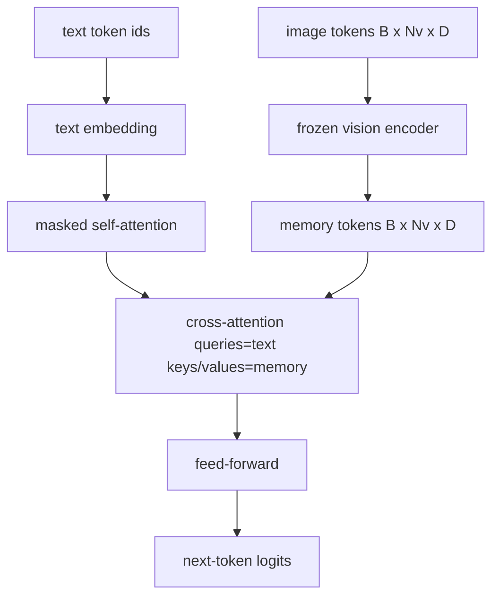
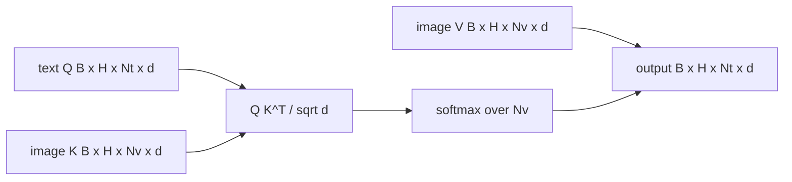

# 交叉注意力融合

> 投影层将一个图像向量与一个标题向量对齐. 实际的视觉语言解码器需要每个文本代码来关注每个补丁代码, 通过注意力来实现这种地定. 文本问答;视觉关键和价值 这一课建立了跨越注意力区块,因果性文本自我注意力,

> **【中文解读】**60 课的投影层只对齐"一个图像向量与一个描述向量"――真正的视觉语言解码器需要每个文本词元都能看到每个图像块词元,把每个词定在某个图像区域交叉注意力就是实现这种定制的机制:文本查询 ,视觉出键和值 ,K、V) 答案.本课造三样式:交叉注意力块带因果掩码的文本自注意力以及让两者方便的掩码形状.

> **【拓展：早融合 vs 晚融合→两条产品路线】**把图文词元拼成一条序列 ([[早融合]]) 是马龙、Emu3 的路;交叉注意力(晚融合) 是弗拉明戈 开创、此后所有弗拉明戈 形解码器沿用路──晚融合两大红利:文本流干净(保留纯文本能力)、图像流算一次好反复复复用(长描述生成也便宜)──代价是每个块多一个注意力层──

>  **【前置】**学本课前请先掌握:59 课 交叉注意力与它是相同的数学,只是Q 和 K/V 来自不同流;60 课  模态对齐) 理解"图像词元作为解码器的记忆"这一角色.

**Type:** Build | **类型:** 构建
**Languages:** Python | **语言:** Python
**Prerequisites:** Phase 19 lessons 30-37 (Track B foundations) | **前置知识:** Phase 19 · 30-37（Track B 基础）
**Time:** ~90 minutes | **时间:** 约 90 分钟

## 学习目标

- 实现多头交叉注意力,其中查询流是文本,键/值流是视觉.
  中文翻译:实现多头交叉注意力,查询流是文本、键/值流是视觉──
- 编写一个解码器块:因果自我注意+横向注意+传递.
  中文翻译:组合一个解码器块:因果自注意力 + 交叉注意力 + 前──
- 按正确的面具形状:因果性面具用于自我注意力,没有面具用于横向注意力.
  中文翻译:把掩码形状搞对:自注意力用因果掩码,交叉注意力不用掩码.
- 运行一个前进通行,包含批量文字代币和固定的图像代币池.
  中文翻译:用成批文本词元和固定的图像词元池跑一次前向──

## 问题 问题引入

> **【中文解读】**本节对比两种融合路线.早期融合把图像块词元与文本词元拼成一条序列.晚融合让文本解码器运行在纯文本词元上,每个层通过交叉注意力伸进图像流.

结合图像代币和文本代币成一个序列是一个融合选项 (早期融合,Chameleon和Emu3走路).交叉注意力是另一种 (后期融合,Flamingo引入的路径,并且自此以来每个Flamingo形的解码器都复制了).在后期融合中,文本解码器仅使用文本代币运行,通过交叉注意力在每个层中进入图像流.

> 把图像词元和文本词元拼进一条序列是一种融合选项 (早融合,Chameleon 和 Emu3 走的路) 』.交叉注意力是另一种 (晚融合,Flamingo 引入,此后每个Flamingo 形解码器都抄写的路) 』.在晚融合中,文本解码器在纯文本词元上运行,每个层都通过交叉注意力伸进图像流――

后期融合有两个优势.一是,文本流保持清洁,模型保留仅为文本的功能.二是,图像流每图像计算一次,每次解码步骤都会再使用,因此生成即使是长片标题便宜.成本是每块额外的注意次层.

> 晚融合有两个大优势――第一,文本流保持干净,模型保持纯文本能力――第二,图像流每张图片只计算一次――每个解码步骤都复用,所以即使描述很长的生成也便宜――价格是每个块多一个注意力层――

## 概念的核心概念





### 面具的形状

> ️ **【易错点】**场景:把注意力因果掩码顺手也加到交叉注意力上 (文本词元只能看到前几块图像) / 后果:模型对图像下半部分"失明",损失曲线看不出明显异常,纯靠隐藏的幻觉退化 / 修复:自注意力掩码是`(Nt, Nt)`下三角,交叉注意力无掩码整张图对每个文本位置可见――本课的形状校验函数把"混混两种掩码"变成一个`ValueError`没有一个坏掉的损失曲线.

解码器区内的两个注意力需要不同的面具:

> 解码器块中的两个注意力需要不同的掩码:

| Attention | Query length | Key length | Mask | Why |
|-----------|--------------|------------|------|-----|
| Self-attention | `Nt` (text) | `Nt` (text) | Causal: lower-triangular `(Nt, Nt)` | Text tokens may not look ahead during autoregression |
| Cross-attention | `Nt` (text) | `Nv` (vision) | No mask | The whole image is visible to every text position |

课程包括一个形状验证函数,所以混合它们的错误是`ValueError`而不是一个然破碎的损失曲线.

> 这一课包含一个形状检验函数,让"把两种掩码混"这个错误被视为`ValueError`没有一个坏掉的损失曲线.

### 为什么没有掩盖的面具?

在生成任何文本之前,图像会被完全观察.`t`某些Flamingo变体在交织多个图像和文本段时添加一个样本按模式,但对于单个图像加上一个标题,交叉注意力可以看到一切.

> 图像在任何文本生成之前就被完整观测.`t`个词元可以注意图像的任意图像块;图像块之间没有时间顺序.一些弗拉明戈变体在交错多图多段文本中加入个样本掩码模式,但对于单图加一条描述,交叉注意力是全部.

### 关键/值缓存

> **【中文解读】**图像的键和值在解码开始时计算一次并放进缓存,然后每个新文本词元直接复用缓存、不再重计算──这正是推理时看图描述快的原因:重 ViT只跑一次,交叉注意力每步复用其 K/V──本课把缓存暴露出来并测试缓存命中路径──

图像密钥和值在解码开始时计算一次,并存储在缓存中.每个新文本代币都使用缓存,而不需要重新计算.这就是导致标题快速推断的原因:重量 ViT一次运行;跨重视频每一步都会重新使用其密钥和值.课程暴露缓存并测试缓存击中的路径.

> 图像的键和值在解码开始时计算一次并保持存储里里――每一个新的文本词元直接使用缓存、不重计算――这正是推理图像描述快的原因:重的VT只跑一次,交叉注意力每一步复用其键和值――本课把缓存暴露出来并测试缓存命中路径――

### 区块组合

解码器区块运行:LN前 ->自我注意 ->残留 ->LN前 ->横向注意 ->残留 ->LN前 ->向前 ->残留.三个子层,每个层都有自己的LayerNorm.Flamingo论文增加了学习的跨向注意的门,以便模型可以选择在训练时间稳定成本下退出图像路径;正规的基线 (在这里使用) 没有门.

> 解码器块的流程:前LN -> 自注意力 -> 残差 -> 前LN -> 交叉注意力 -> 残差 -> 前LN -> 前 -> 残差──三个子层,各配自己的层Norm。Flamingo 论文在交叉注意力上加了一个可学习门控,让模型可以退出图像路径,代价是训练稳定性;经典基线(本课所需) 没有门控──

```python
class DecoderBlock:
  def forward(self, text_tokens, image_tokens, text_mask, cross_mask):
      text_tokens = text_tokens + self.self_attn(self.ln1(text_tokens),
                                                 mask=text_mask)
      text_tokens = text_tokens + self.cross_attn(self.ln2(text_tokens),
                                                  image_tokens,
                                                  mask=cross_mask)
      text_tokens = text_tokens + self.ffn(self.ln3(text_tokens))
      return text_tokens
```

```figure
ch-crossattn-fan
```

## 建立它,实现它.

> **【中文解读】** `code/main.py`实现`CrossAttention`(独立的投影)`CausalSelfAttention`们的声,`DecoderBlock`(三个层前LN残差组合)`VisionLanguageDecoder`(模拟视觉编码器输出 + 小文本嵌入表养的四层解码器)`causal_mask(length)`(下三角布尔张量) ⋅示范 两条长度10的文本序列加上 197 长度图像记忆,印出形状、自注意掩码形状和每个位置交叉注意输出范数──

`code/main.py`执行:

- `CrossAttention(hidden, heads)`双头交叉注意力,`q`其他`kv`预测
- `CausalSelfAttention(hidden, heads)`通过标准解码器来隐藏自我注意.
- `DecoderBlock`组建三个子层,含有LN前残留物.
- `VisionLanguageDecoder`通过假视觉编码器输出和一个小的文本嵌入表提供四层解码器.
- `causal_mask(length)`返回一个`(length, length)`低三角形的布尔尔子.
- 显示一个节目,以长度10的两个文本序列提供一个节目,具有长度197的图像内存,并打印出口形,自我注意力面具形状,每个位置的跨注意力输出标准.

运行它:

```bash
python3 code/main.py
```

输出:解码器产生一个`(2, 10, text_vocab)`子的形状是`(10, 10)`缓存和未缓存的路径之间的相同的登录.

> 输出:解码器产出 `(2, 10, text_vocab)`张量――掩码形状是`(10, 10)`△KV 缓存复用检查确认缓存路径与无缓存路径的记录完全一致──

## 用它实现框架

> **【中文解读】**交叉注意力在生产中有两个大门派:Flamingo/IDEFICS每K个语言模型块插入一个交叉注意力子层、LM 结,视觉语言适配器就是交叉注意力块加门控;BLIP-2Q-前让固定的32个查询词元对图像特征做交叉注意力,再把查询投入LM 嵌入空间──本课的块形状直接映射到两个派;掩码律;;自注意因果、交叉掩码无码) 完全相同.

两种生产家庭中出现了交叉关注:

- **Flamingo and IDEFICS.**每个K语言模型块都插入一个跨注意次层,并使用一个结的LM.视觉语言适配器是跨注意区块加上它的门.
  翻译: 中文**Flamingo 与 IDEFICS。**每个K个语言模型块插入一个交叉注意力层,LM 结.视觉语言适配器就是交叉注意力块加上它的门控.
- **BLIP-2.**图像功能中使用32个查询代币的固定集合的交叉注意力,然后将查询投射到LM嵌入空间中.
  翻译: 中文**BLIP-2。**让一组固定的32个查询词元对图像特征做交叉注意力,再把查询投影进LM 嵌入空间――

面具纪律 (因子自在,没有因子交叉) 是相同的.

> 本课的块形状直接映射到两者──掩码纪律──自注意因果──交叉注意力无掩码) 是相同的──

## 测试测试

`code/test_main.py`覆盖:

- 原因面膜是下方三角形,与预期的布尔形状相匹配
  中文翻译:因果掩码是下三角且匹配预期的布尔形状.
- 交叉注意力输出形状是`(B, Nt, hidden)`无论钥匙长度如何
  中文翻译:无论键长多少,交叉注意力输出形状都是`(B, Nt, hidden)`,我知道.
- 基动机缓存路径与未缓存路径和浮动耐受性相匹配
  中文翻译:KV 缓存路径与无缓存路径在浮点容容差内一致.
- 文字和图像流之间的形状不匹配,`ValueError`
  中文翻译:文本流与图像流的形状失配会抛出清晰的`ValueError`,我知道.
- 一个完整的解码器前传输产生了正确的批量和序列形状
  中文翻译:完整解码器前向产生正确的批与序列形状──

运行它们:

```bash
python3 -m unittest code/test_main.py
```

## 练习题

1. 加入一个学习的门,并验证训练从接近零的初始门汇聚.门开始于0;模型在混合图像流之前恢复仅仅是文本的行为.
   中文翻译:给交叉注意力残差加一个可学习的门控 (Flamingo 技巧),验证训练从近零初始门控开始收──门控从 0 起步;模型先恢复纯文行为,再把图像流混进来──

2. 实现交叉关注,当同一解码器使用多个图像和多个文本段时. 构建每样本交叉关注面具,防止文本段 2 加入图像 1.
   中文翻译:实现交错注意力,让同一个解码器消费多张图加多段文本――构建防止文本段 2注意到图 1 的个样本交叉注意力掩码――

3. 介绍跨注意与自我注意层`Nt=64, Nv=576`跨重视成本是 `Nt * Nv`它们的图像分辨率很高.
   中文翻译:在`Nt=64, Nv=576`分析交叉注意力与自注意力层――交叉注意力开销是`Nt * Nv`图像分辨率高的占主导地位.

4. 在交叉注意力地图上添加查询侧的置,并在演示中测量标题多样性 (随着交叉地图中置,标题样本差异增加).
   中文翻译:给交叉注意力图加查询侧落,在演示上测量描述多样性(交叉图上的落落 越大,描述样本方差越大) ⋅

5. 交换跨注意层,以Q-Former式的注意区块,其中一个固定的32代币查询池每层一次关注图像功能.
   中文翻译:把交叉注意力层换成Q-前式注意力块固定的32个词元查询池每层对图像特征做一次注意──

## 关键词 快速查找表

> **【中文解读】**五个词:晚融合图文分流、逐块交叉注意力搭桥) ‧跨注意力(Q与K/V 来自不同流) ‧因果面具(自归防偷看的下三角布尔掩码) ‧KV缓存(图像K/V 算一次、每步复用) ‧记忆令牌(解码器伸手去取的结图像词元) ‧ 这套词汇直接延续到62 课预训练――

| Term | What it means |
|------|---------------|
| Late fusion | Text and vision stay in separate streams; cross-attention bridges them at every block |
| Cross-attention | Q comes from one stream, K and V from another |
| Causal mask | Lower-triangular boolean mask that prevents looking ahead during autoregression |
| KV cache | Image keys and values stored once and reused for every decode step |
| Memory tokens | The frozen image tokens that the decoder reaches into |

## 继续阅读 继续阅读

- 弗拉明戈 (2022) 用于加нони化后期融合设计,具有门口交叉注意力.
  中文翻译:Flamingo(2022) 带门控交叉注意力的经典晚融合设计.
- 对于Q-Former来说,BLIP-2 (2023) 是一个穿着学习查询池的跨注意区块.
  中文翻译:BLIP-2(2023) Q-前,一个扮成"可学习查询池"的交叉注意力块.
- 为了对"弗拉门戈"配方进行公重复制,IDEFICS (2023)
  中文翻译:IDEFICS(2023) 弗拉明戈配方的开源权重复刻──
