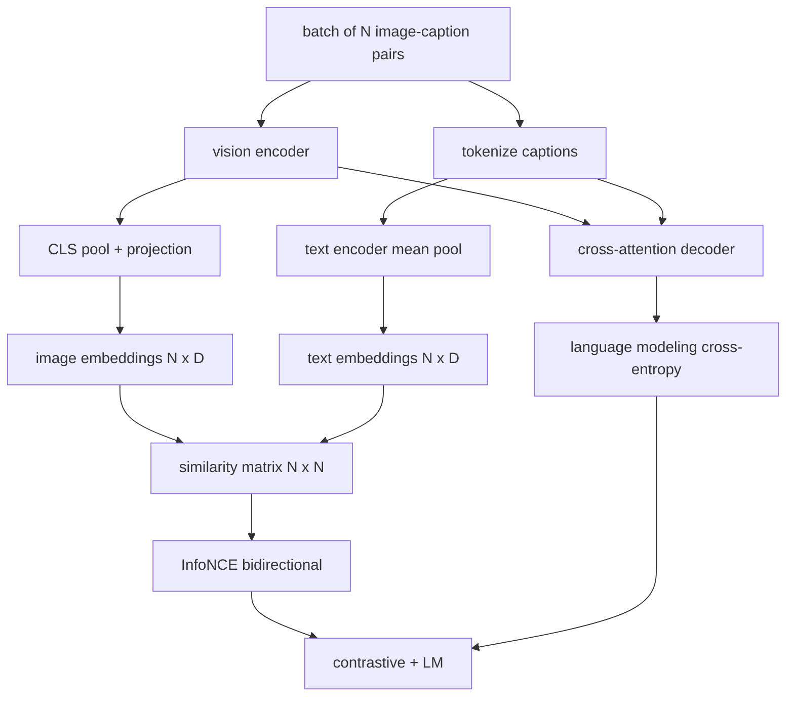

# 视觉语言预训练

> 编码器,投影器和解码器是有线的.现在将它们训练在一起.两个目标推动学习:对比图像文本损失 (InfoNCE),该系统将匹配的对合在联合嵌入空间中拉在一起,以及语言建模损失,该系统要求解码器标题每个图像.

> **【中文解读】**编码器、投影层、解码器都接收了,本课把它们一起训练了.

> **【拓展：单技能 vs 双技能→CLIP 与 GPT-4V 的分工被一个多目标统一】**只有会排序的CLIP 不会写描述;会写描述的GPT-4V 得另配检索头排序.CoCa、BLIP、SigLIP 一脉多目标预训一次获得双技能.本课组合损失.

>  **【前置】**学本课前请先掌握:59 课   编码器)  60 课 投影层与余弦对齐)  61 课 交叉注意力解码器) 本课把它们组装成一个`MultimodalModel`车B的交叉与训练循环基础30-37)

**Type:** Build | **类型:** 构建
**Languages:** Python | **语言:** Python
**Prerequisites:** Phase 19 lessons 30-37 (Track B foundations) | **前置知识:** Phase 19 · 30-37（Track B 基础）
**Time:** ~90 minutes | **时间:** 约 90 分钟

## 学习目标

- 实现InfoNCE对比损失在一批图像标题对.
  中文翻译:跨一批图像描述对比实现InfoNCE对比损失
- 复合对比性损失与自动降低性语言建模损失.
  中文翻译:把对比损失与自归语言建模损失组合起来.
- 合成一个200对假的图像标题,
  中文翻译:合成 200 对模拟图文语料,无需下载真实数据集.
- 运行一个50步的演示训练循环,
  中文翻译:跑一个50步的演示训练循环,观察两个损失同步下降.

## 问题 问题引入

> **【中文解读】**视觉语言模型需要两种技能:排序,从一堆图里挑对图) 和生成,给图,写描述) 只有预训一种技能等于只有半系统CLIP 会排序不会写描述;GPT-4V 会写描述但排序需要另配检索头.`N^2 - N`个错配当负样本,对`(N, N)`相似度矩阵跑交叉──LM 损失管产生半边:以图像为条件的标准下一词元预测──两个损失都可微,共享编码器、投影器、解码器权重──

视觉语言模型需要两个技能.它必须排名:给出一个标题,在许多中找到正确的图像.它必须生成:给出一个图像,写一个标题.仅仅在一个技能上预训练模型就能给你一半的系统.Clip钉排名但不能标题.GPT-4V可以标题,但使用一个独立的检索头来排名.多目标预训练可以在一个通过中获得两者.

> 视觉语言模型需要两种技能――它必须排列:给定一条描述,从许多图中找到对的图片――它必须生成:给定一张图,写出一条描述――只对一种技能进行预训得到的是半系统――CLIP 拿下排列但不会写描述――GPT-4V 会写描述但排列需要另一个检索头――多目标预训一次拿到两者――

对于一批N对,模型将N匹配对作为正面和`N^2 - N`结果是,在数值中,`(N, N)`类似性矩阵. LM 损失处理生成的一半:标准下一个代币预测,根据图像.这两个损失都可分化,可以共享编码器,投影器和解码器重量.

> 信息NCE 负责排序的一半. 对一批N 配对,模型把N 配对当正品样本,`N^2 - N`个错配对当负样本,然后对得到的`(N, N)`类似度矩阵跑交叉损失――LM 损失负责产生那一半:以图像为条件的标准下一词元预测――两个损失都是微小的,并且可以共享编码器、投影器和编码器权重――

## 概念的核心概念



### 简单的信息NCE在一个段落.

>  **【类比】**报道NCE 像一场"照片配字幕"抢答赛:N 张照片、N 句字幕混在桌上,裁判(交叉)要求第 `i`字幕的第一名必须是第一个`i`张照片(按行对角),反过来第`i`张照片的第一名也必须是第一个`i`句字幕 按列对角`tau`是裁判的严格程度:太严 小) 只有着最像的错误配对吹哨,训练噪音大;太松 大) 全场打分都差不多,梯度消失──CLIP 干脆把`tau`也当参数数学.

堆叠N图像嵌入式为行列和N文字嵌入式为行列. L2-正常化.计算 `N x N`矩阵`S = I T^T / tau`在哪里`tau`角进口是相匹配的对,外面进口是负. 应用与目标交叉透`argmax`沿线线走向:行`i`应该是列中最高的入口`i`总数是两个的平均值.这是8行的Clip损失.

> 把N个图像嵌入按行堆叠,N个文本嵌入也按行堆叠――两者都做L2归结――计算`N x N`矩阵`S = I T^T / tau`在其中`tau`是可学习的温度.对角线元素是匹配的;非对角线元素是负样本.施加交叉,目标`argmax`沿对角线排列:第`i`走的最高分数应落在第`i`列──再沿列对称做一次──总数取两者平均──这就是8行代码写完的CLIP 损失──

### 温度是重要的.

温度`tau`控制软max的峰值.`tau = 0.01`升率只有最强的负值,训练是的.太大,软max平坦化,升率消失.`tau`作为一个参数,这里的演示也是这样.

> 温度`tau`控制软max 有多尖.`tau = 0.01`时梯度仅来自最困难的负面样本,训练噪音大――太大时软max 变平、梯度消失――CLIP 把`tau`作为数学习本课的演示也就是这样做.

### 语言建模损失

解码器通过交叉注意力消耗图像内存代币,并在每个位置预测下一个文本代币.损失是标准的交叉透与下一个位置目标.接位置被掩盖.

> 解码器经交叉注意力消费图像记忆词元,并在每个位置预测下一个文本词元. 损失是以下一个位置为标准交叉──填充位置被从损失中掩盖.

### 组合损失

`total = contrastive + lm_weight * lm`在哪里`lm_weight`两种损失在编码器和投影中分享梯度;只有解码器获得LM-loss梯度.这是CoCa,BLIP和SigLIP类型模型使用的多任务配方,具有各种权重.

> `total = contrastive + lm_weight * lm`在其中`lm_weight`是标量(常取 1.0) ⋅两个损失把梯度共享到编码器和投影层;只有解码器接收LM 损失的梯度──这是CoCa、BLIP、SigLIP 式模型都在使用多任务配方,只是权重各有不同──

| Component | Loss surface | Affects |
|-----------|--------------|---------|
| InfoNCE | Pair ranking in the joint space | Encoder + projection + text head |
| LM | Token prediction conditioned on image | Encoder + projection + decoder |
| Combined | Multi-task | Whole stack |

### 为什么50步足以演示?

> **【中文解读】**模拟语料是随机图 +随机描述 id 的200对合成集. 批量16 跑50步SGD,两损失肉眼可见下降. 即使绝对值高于真实数据模型水平. 演示的目的是确认梯度管线端到端通,加上LM损失不会破坏对目标的稳定性.

假装体是一个合成200对组,有随机图像和随机标题ID. 随着50个SGD步骤的批量大小16次,即使绝对值保持在现实数据模型达到的水平以上,两者均显著下降.演示的目的是确认梯度管道工作的终结,并表示添加LM损失不会破坏对比目标的稳定.

> 模拟语料是由随机图像和随机描述 id 组成的200对合成集. 大小16 跑50步 SGD 后,两个损失都肉眼可见地降低,即使绝对值仍然高于真实数据模型可以达到的水平.

```figure
ch-infonce-diagonal
```

## 建立它,实现它.

> **【中文解读】** `code/main.py`把59-61课件的组装进`MultimodalModel`(小 ViT + MLP 投影器 + 文本侧平均值池化编码器 + 交叉注意力解码器),加上 `info_nce_loss`(双向CLIP式对比损失)`lm_loss`现在,我们在车上.`make_mock_corpus`训练循环50步 16批 16 亚当可学习日志温度,每5步印双损失比损失`ln(16)=2.77`走向2.4 走向,LM 损失从随机基线`ln(512)≈6.24`走向4.7 走向,证明了梯度接对对的.

`code/main.py`执行:

- `MultimodalModel`结合一个小的ViT编码器,MLP投影器,一个小的文本侧编码器 (嵌入式ID的平均积分),和课题61的跨注意力解码器.
- `info_nce_loss(image_emb, text_emb, temperature)`双向Clip类对比损失.
- `lm_loss(logits, target_ids, padding_id)`罩在下一个代币的交叉.
- `make_mock_corpus(seed, n_pairs)`返回200个确定性 (图像,字幕_ID) 对.
- 训练循环运行50步,配套尺寸16个,亚当优化器,以及学习日志温度参数.

运行它:

```bash
python3 code/main.py
```

产量:比较的损失从大约下降`ln(16) = 2.77`随机均基线的LM损失从2.4向下降`ln(512) ≈ 6.24`实际模型训练数百万步,动态是相同的.

> 输出:对比损失`ln(16) = 2.77`降至2.4 附近;LM 损失从随机平均基线`ln(512) ≈ 6.24`降至4.7左右. 两次降落都证明了梯度相对.

## 用它实现框架

> **【中文解读】**本课的损失配方就是生产中的那一套:CLIP(仅对比) 、CoCa(对比 + 描述LM,正是本课模式)、BLIP/BLIP-2(对比 + LM +图文匹配三头)、SigLIP(把InfoNCE 变成一个 sigmoid 逐变对损失,角色不变)、LLaVA(两阶段:60 课对应第一阶段对齐,本课对应第二阶段加 LM 损失解解 LM) ⋅

这就是送来的同样的损失配方:

- **CLIP (2021).**只有图像和文字对比,有单独的冷编码标题探测器.
  翻译: 中文**CLIP（2021）。**仅图文对比,另配一个结合编码器的描述探针.
- **CoCa (2022).**图像-文字对比加上图像标题的LM损失在一个模型. 这一课构建的确切模式.
  翻译: 中文**CoCa（2022）。**图文对比图像描述LM 损失合入一个模型――正是本课的构建模式――
- **BLIP (2022) and BLIP-2.**复杂加上LM加上图像和文字匹配头,共3次损失.
  翻译: 中文**BLIP（2022）与 BLIP-2。**对于加 LM 加图文匹配头.
- **SigLIP (2023).**换取InfoNCE为sigmoid对损失;相同的对比作用,不同的功能形式.
  翻译: 中文**SigLIP（2023）。**把InfoNCE 换成 sigmoid 逐对损失;对比角色相同,函数形式不同.
- **LLaVA family.**两个阶段的训练,其中第一阶段是对齐 (结的LM上的结) 第二阶段增加了结的LM损失. 第60课程将第一阶段映射,这课程将第二阶段映射.
  翻译: 中文**LLaVA 家族。**两阶段训练:第一阶段对齐 (结 LM 上做余弦),第二阶段解 LM 加 LM 损失――60课对应第一阶段;本课对应第二阶段――

## 测试测试

`code/test_main.py`覆盖:

- 信息NCE损失在图像/文本行中对称
  中文翻译:InfoNCE 损失在图像/文本行之间对称.
- 当相似性矩阵是大正数的完美角角时,InfoNCE损失返回0
  中文翻译:当相似度矩阵是大正数的完美对角阵时,InfoNCE 损失返回0──
- 光损失正确掩盖填充位置
  中文翻译:LM 损失正确掩掉填充位置.
- 输出输出输出输出输出输出输出输出输出输出输出输出输出输出输出输出输出输出输出输出输出输出输出输出输出输出输出输出输出输出输出输出输出输出输出输出输出输出输出输出输出输出输出输出输出输出输出输出输出输出输出输出输出输出输出输出输出输出输出输出输出输出输出输出输出输出输出输出输出输出输出输出输出输出输出输出输出输出输出输出输出输出输出输出输出输出输出输出输出输出输出输出输出输出输出输出输出输出输出输出输出输出输出输出输出输出输出输出输出输出输出输出输出输出输出输出输出输出输出输出输出输出输出输出输出输出输出输出输出输出输出输出输出输出输出输出输出输出输出输出输出输出输出输出输出输出输出输出输出输出输出输出输出输出输出输出输出输出输出输出输出输出输出输出输出输出输出输出输出输出输出输出输出输出输出输出输出输出输出输出输出输出输出输出输出输出输出输出输出输出输出输出输出输出输出输出输出输出输出输出输出输出输出输出输出输出输出输出输出输出输出输出输出
  中文翻译:模型前向无错地产出两损失.
- 五步训练循环减少了总损失
  中文翻译:5 步训练循环降低组合损失.

运行它们:

```bash
python3 -m unittest code/test_main.py
```

## 练习题

1. 替换InfoNCE以SigLIP式的sigmoid对损失,并对模拟体上的融合进行比较.
   中文翻译:把InfoNCE 换成SigLIP 式 sigmoid 逐对损失,在模拟语料上比较收速度──

2. 添加一个硬负矿山步骤:每次分组,从前一批中选择最硬的离线对,并添加它. 训练并检查对比损失是否会更快地下降.
   中文翻译:加步困难负样本挖掘:每分一批,从上一批挑选最困难的非对角配对额外进进来.

3. 在联合嵌入的顶部添加一个图像-文本匹配的二元头 (真/假:这些匹配吗?) 为第三个输出,复制BLIP的三头设置.
   中文翻译:在联合嵌入之上加一个图文匹配二分类头对/错:这两种配对吗?)作为第三损失,复刻BLIP的三头设置.

4. 取代假冒体格用从一个马科夫链中提取的标题标识序列,其过渡矩阵是基于图像哈希的.标题丢失应该进一步下降,因为实际的可学习信号存在.
   中文翻译:把模拟语料换成由马尔可夫链生成的描述 id 序列,其转移矩阵以图像哈希为条件――描述损失应降低更多,因为存在真正可学信号――

5. 训练同一个模型`lm_weight = 0`再一次,`lm_weight = 1`较量损失;LM损失不应退向排名目标.
   中文翻译:分别用`lm_weight = 0`和 `lm_weight = 1`训练同样模型――比较对比损失;LM 损失不应使排列目标退化――

## 关键词 快速查找表

> **【中文解读】**五个词:信息NCE(噪音对估计相似度矩阵上的交叉) 温度(温度控制对软max 尖度的标量) 硬负面(困难负样本模型觉得难分非对角配对) LM损失(LM损失描述侧的标准下一词元交叉) 、联合嵌入空间(联合嵌入空间投影后图文向量共居住共享空间) ⋅

| Term | What it means |
|------|---------------|
| InfoNCE | Noise contrastive estimation: cross-entropy on a similarity matrix |
| Temperature | Scalar that controls how peaked the contrastive softmax is |
| Hard negative | An off-diagonal pair the model finds confusing, useful for sampling |
| LM loss | Standard next-token cross-entropy on the captioning side |
| Joint embedding space | The shared space where image and text vectors live after projection |

## 继续阅读 继续阅读

- 对于原始的对比食谱的Clip纸.
  中文翻译:CLIP论文对比配方的原点.
- 对于一个模型的对比性加上字幕的CoCa纸.
  中文翻译:CoCa论文对比与描述合入一个模型――
- 对于sigmoid对损失变体的siglip纸,以及为什么它更好地扩展.
  中文翻译:SigLIP论文sigmoid 逐对损失变体及其更易扩张的原因.
