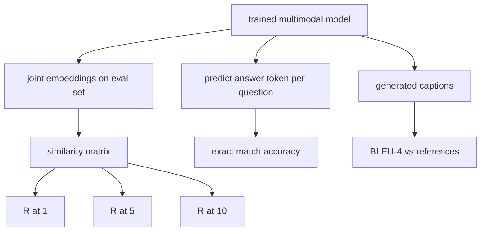

# 其他类型的评价

> 训练是半循环.另一半是测量.这个课程从原始的基础上构建了三个评估表面:图像标题检索报告为R@1,R@5,R@10;视觉问题回答报告为精确匹配准确性;图像标题报告为BLEU-4.每个度量是模型输出的函数和合成评估套件,运行在秒钟内.

> **【中文解读】**训练只是一个半环,另一半是度量. 本课从原语中发出三个评测面:图文检索. 报告 R@1、R@5、R@10) 视觉问答. 报告精确匹配准确率. 报告 BLEU-4) 报告. 每个指标都是"模型输出上的一个函数",再配合几秒钟就能运行完整的合成评测集.

> **【拓展：多模态评测生态】**这三个指标正是学界和工业界的标准汇报口径:CLIP 式图文检查使用R@K 报告,VQA v2 用(软)精确匹配报告问答,MS-COCO 描述生成赛道使用BLEU-4/CIDEr 排名.本课程的函数签名与这些基准的官方评测脚本和构成将合成评测集成成成真实数据文件,指标函数一行无需改进.

>  **【前置】**学本课前请先完成第19阶段 · 58-62(视觉路线基础:视觉编码器分块、视觉变压器、模态对齐投影层、交叉注意力融合、视觉语言预训) 本课直接加载第62课的多模态模型做训练前后比较评测;另需要余弦相似性与n-gram 精确率的概念基础――

**Type:** Build | **类型:** 构建
**Languages:** Python | **语言:** Python
**Prerequisites:** Phase 19 lessons 58-62 (Track E foundations: encoder, transformer, projection, cross-attention fusion, pretraining) | **前置知识:** Phase 19 · 58-62（视觉路线基础：编码器、Transformer、投影层、交叉注意力融合、预训练）
**Time:** ~90 minutes | **时间:** 约 90 分钟

## 学习目标

- 计算图像和标题嵌入之间的类似性矩阵 Recall@K.
  中文翻译:从图像与描述文本嵌入之间的相似度矩阵计算 Recall@K。
- 从绘制对 (图像,问题) 的模型计算到固定答案词汇库的精确匹配VQA准确性.
  中文翻译:基于把(图像,问题) 对映射到固定答案词表的模型,计算视觉问答的精确匹配准确率――
- 根据生成的代币序列计算BLEU-4,并且没有任何外部库.
  中文翻译:不依赖任何外部库,从生成序列和参考代币序列计算 BLEU-4。
- 运行所有三个评估与一个合成套件建立在训练模型的上课62.
  中文翻译:运行全部三项评测在基于第62课训练模型构建的合成评测套件上.

## 问题 问题引入

> **【中文解读】**本节回答"训练损失收到了,为什么还不能宣布模型完成"――训练损失仅仅是测量训练分布式的适应,不测量模型能否在批量排列出图文对、能否答对问题、能否写出人类可以接受的描述――多模态领域的标准做法是对三个评测指标的不同使用:检查使用R@K、问答使用精确匹配、描述生成使用BLEU-4――每个指标都是一个薄函数亲手实现它们,数学具体,正在评估才是真正的你的掌握下.

试图在训练损失平原时宣布一个多模模型完成.训练损失量度适合训练分布;它不测量模型是否可以在一批被持久的批量中排名对,回答问题,或写一个字幕一个人会接受.三个评估表面是标准的:

> 训练损失一进入平台期,人们就忍不住宣布多模态模型完成了.训练损失量量在训练分布上适应;它不测量模型是否能在一个留下批次里排对图文对、能否回答一个问题、能否写出一个人类愿意接受的描述.标准的做法是三个评测面:

- **Retrieval (R@1, R@5, R@10).**构建查询标题的联合嵌入;按代数排列评估池中的每个图像;报告是否匹配图像落在前1位,前5位,前10位.对称 (图像到文本) 形式运行相同.
  翻译: 中文**检索（R@1、R@5、R@10）。**为查询描述构建联合嵌入;把评测池中的每张图像按余弦相似度排序;报告匹配图像是否落在前 1、前 5、前 10──对称形式(图找文)按同样方式运行──
- **Visual question answering (exact match).**给出 (图像,问题),模型输出了一个答案代号. 精确的匹配是每样本的一位:预测答案是否等于参考答案?
  翻译: 中文**视觉问答（精确匹配）。**给定(图像,问题),模型输出一个答案标志――精确匹配是每个样本的比特:预测答案是否等于参考答案?
- **Captioning (BLEU-4).**生成标题. 计算1克到4克精度的几何平均值与参考标题,使用简短处罚.多引用是标准形式 (一个图像,多个参考标题).
  翻译: 中文**描述生成（BLEU-4）。**生成一段描述;对照参考描述计算1克到4克 精确率几何平均,并施加简短惩罚──多参考是标准形式(一张图、多段参考描述) ──

每个指标都是一个薄型的函数.课程都以代码构建它们,所以数学是具体的,表面保持在你的控制之下.真正的基准套件 (MS-COCO,VQA v2,GQA,OK-VQA) 插入相同的函数形状.

> 每个指标都是一个薄函数. 本课程将它们全部用代码实现,让数学变得具体,让评测面处于你的控制之下.

## 概念的核心概念

> **【中文解读】**三条评测路径共享已训练的模型:检索路径计算N×N余弦相似度矩阵后看对角线落在前K名的比例;问答路径逐条读出答案符号做精确匹配;描述生成路径对生成序列算带短惩罚的4克精确率几何平均――三者都可以在几秒内完成在内存中的合成套件上,这让你能够快速生成,而不是每次变化就像一晚的评测.



### 从类似性矩阵中回忆@K

建立一个`(N, N)`图像和标题嵌入之间的共数相似性矩阵. 按下降的相似性来排序列. 记住@K是线索对角列指数位于顶部K位置的部分. 交换矩阵的代码是: 报道了两位数字. 对于N=100的评价,R@1 =0.6意味着60个标题中100个获取了正确的图像作为顶部匹配.

> 在图像嵌入和描述嵌入之间构建`(N, N)`余弦相似度矩阵――对每一行,按相似度降低序列排列――Recall@K就是"对角线索引落在前 K 个位置"的行所占比例――对称的Recall@K(文找图) 在转置矩阵计算――两方向的数字必须报告――对 N=100的评价,R@1 = 0.6意味着100条描述中60条把正确图像检索作为第一条――

### 完全匹配的VQA

对于每一个图像 (图像,问题,答案),编码图像,嵌入问题,通过解码器并阅读下一个标志. 预测的代币ID与参考ID进行比较;如果等,则正确. 平均值超过评估集. 实际的VQA数据集每一个问题都包含多个人注释的答案,使用柔软精度公式 (1.0如果至少有3个注释者同意,以下缩小);课程使用单个答案的精确匹配来提供清晰度.

> 对每条图像,问题,答案:编码图像,嵌入问题,经解码器融合,读出下一个代币.预测代币 id 与参考 id 比较,相等即正确,在评测集中取而取.真实VQA 数据集每题带多个个人标注答案,并使用软准确率公式.

### 蓝色-4

```text
BLEU-4 = BP * exp(mean(log p1, log p2, log p3, log p4))
```

在哪里?`p_n`是修改的 n-gram精度 (任何参考中出现的生成 n-gram 的剪切数量,分为生成的 n-gram 总数),以及`BP`是短暂的处罚:

> 其中`p_n`是修改后的 n-gram 精确率(生成 n-gram 中出现任一参考中的剪切计数,除以生成的 n-gram 总数),`BP`是简短惩罚:

```text
BP = 1                if generated length > reference length
   = exp(1 - r/g)     otherwise, where r is reference length and g is generated
```

需要滑滑小样本,其中一些样本`p_n`实现使用陈和桃"方法 1" (为任何零数量添加1到数量和命名器),这是低数量模式的最安全默认.

> 小样本下某些`p_n`实现采用陈与桃的"方法 1" (对任何零计数,分子分母加 1) 这是低计数场景下最安全的默认选择.

### 合成评估套件

> **【中文解读】**评测套件沿着第62课的合成语料模式,换一个留出种子在内存中生成50个样本,三条列表分别服务检查,问答,描述生成.关键纪律是"数据模型从来没有见过":种子与训练语料不相交,标志才有意义.随机基线表给判断标准50步训练后的指标不一定高,但必须高于随机基线,这正是演示程序检查的内容.

根据第62课中使用的模拟体格,在内存中构建了一个50个样本的评估套件,其中有一个持久的种子.

> 一个50个样本的评测套件在内存中构建,沿着第62课的合成语料模式,但使用留下的种子.

- `pairs`: 50 (图片,字幕_字幕) 对可检索.
  翻译: 中文`pairs`图像,描述ID) 对.
- `vqa`图片,问题,答案:50倍
  翻译: 中文`vqa`图片,问题 id,答案 id) 三元组──
- `caps`: 50 (图片, [引用_标题_字符, ...]) 条目每张图片最多有3个引用.
  翻译: 中文`caps`图片, 引用描述 id 列表]) 条目,每张图最多 3 条参考.

套件是从种子中确定性的,并从训练体中延伸出来,因此测量表是基于模型从未见过的数据计算的.将套件保持到JSON是作为一个练习 (见下面).

> 套件由种子确定性生成,并与训练语料留出分离,因此指标是基于模型从未见过的数据计算的.

| Metric | Range | Random baseline (N=50) |
|--------|-------|------------------------|
| R@1 | 0 to 1 | 0.02 (1 / N) |
| R@5 | 0 to 1 | 0.10 |
| R@10 | 0 to 1 | 0.20 |
| VQA EM | 0 to 1 | 1 / vocab |
| BLEU-4 | 0 to 1 | small but nonzero |

对于基于合成数据的50步训练,预计测量不会高,预计将超过随机基线,这是演示测试的结果.

> 对于合成数据的50步训练,指标不要求高;要求高于随机基线.

```figure
ch-recall-window
```

## 建立它,实现它.

> **【中文解读】** `code/main.py`将三个指标实现为可独立测试的纯函数,再提供`build_eval_suite`与`evaluate`串起整个评测循环.演示加载 第62课的全新初始化模型,先评一次,训练50步后再评一次,打印前后对比让你亲眼看到标志从接近随机到体现模型学到的信号.

`code/main.py`执行:

- `recall_at_k(sim_matrix, k)`回一个浮动的`[0, 1]`两方向都会发生.
  翻译: 中文`recall_at_k(sim_matrix, k)`两条路都回来了`[0, 1]`内部浮点数――
- `vqa_exact_match(predictions, references)`返回平均值`int`平等.
  翻译: 中文`vqa_exact_match(predictions, references)`返回整数相等结果的平均值.
- `bleu4(generated, references, smoothing=True)`通过多个参考支持.
  翻译: 中文`bleu4(generated, references, smoothing=True)`支持更多参考.
- `build_eval_suite(seed, n_samples, vocab_size, max_len)`返回三个确定性评估列表.
  翻译: 中文`build_eval_suite(seed, n_samples, vocab_size, max_len)`返回三条确定性的评测列表
- `evaluate(model, suite)`运行所有三个指标,返回一个`dict`它们是数字的.
  翻译: 中文`evaluate(model, suite)`运行全部三项指标并返回一个数字`dict`,我知道.
- 通过一个测试,从第62课中装载一个新启动的多模式模型, 评估它, 然后训练它50步,
  中文翻译:一个演示:加载第62课全新初始化的多模态模型,先评测,再训练50步后重新评测,印前后指标对比──

运行它:

> 运行:

```bash
python3 code/main.py
```

输出:前后的表表显示,从近随机到模型学习的信号的检索改善,VQA在随机上改善,BLEU-4的改善 (合成结构足以实现4克精密升降).

> 输出:前后指标对比表显示检索从接近随机升级到体现模型学到的信号,VQA 升级到随机上,BLEU-4也在升级(合成结构足以带来4克精确率升级) ⋅

## 用它实现框架

> **【中文解读】**本节把三个指标对接到真实基准:MS-COCO 5K 验证集、Flickr30K、ImageNet 零样本都是同一相似度矩阵上的R@K问题;VQA v2、GQA、OK-VQA 用相同的精确匹配形状(VQA v2 换成软准确率);描述生成赛道在BLEU-4 之外再加 CIDER、METEOR──要迁移到真实基准,只需要把`build_eval_suite`换成真实数据加载器,函数体一行不变数学与基准无关.

每个指标直接映射到生产基准指标上:

> 每个指标都直接应对一个生产级基准:

- **Retrieval.**基于相同的类似性矩阵的R@K问题,可以将合成的 eval取代为真实文件,并且函数签名保持不变.
  翻译: 中文**检索。**图像网零样本都是同一相似度矩阵上的R@K问题――把合成评测换成真实文件,函数签名不变――
- **VQA.**VQA v2,GQA,OK-VQA使用相同的完全匹配形状 (VQA v2 采用软 acc 而不是单响应 EM).
  翻译: 中文**视觉问答。**根据"VQA v2"",GQA"",OK-VQA 用同样的精确匹配形状"
- **BLEU-4.**加入CIDEr是另一个功能.
  翻译: 中文**BLEU-4。**简介: 编辑器: 编辑器: 编辑器: 编辑器: 编辑器: 编辑器: 编辑器: 编辑器: 编辑器: 编辑器: 编辑器: 编辑器: 编辑器: 编辑器: 编辑器: 编辑器: 编辑器: 编辑器: 编辑器: 编辑器: 编辑器: 编辑器: 编辑器: 编辑器: 编辑器: 编辑器: 编辑器: 编辑器: 编辑器: 编辑器: 编辑器: 编辑器: 编辑器: 编辑器: 编辑器: 编辑器: 编辑器: 编辑器: 编辑器: 编辑器: 编辑器: 编辑器: 编辑器: 编辑器: 编辑器: 编辑器: 编辑器: 编辑器: 编辑器: 编辑器: 编辑器: 编辑器: 编辑器: 编辑器: 编辑器: 编辑器: 编辑器: 编辑器: 编辑器: 编辑器: 编辑器: 编辑器: 编辑器: 编辑器: 编辑器: 编辑器: 编辑器: 编辑器: 编辑器: 编辑器

对于真正的基准,交换`build_eval_suite`算法是基准无知的.

> 为了真正的准备,把`build_eval_suite`换成真实加载器、保留函数体即可──数学与基准无关──

## 测试测试

`code/test_main.py`覆盖:

- 返回回回0在完美的身份相似性矩阵上,并返回0在翻转的矩阵上为k < N
  中文翻译:完美恒等相似度矩阵上回归1.0;k < N 时翻转矩阵上回归0.0
- 提醒@k尊重`k <= N`上边界
  中文翻译:回忆@k 遵守 `k <= N`上界
- 当生成时, bleu4返回1.0是相当于一个引用的确切值
  中文翻译:生成序列与某条参考完全一致时蓝4 返回 1.0
- 蓝色4返回了0.0的分离词汇库
  中文翻译:词表不相交时蓝4 返回0.0
- 完全匹配的vqa等于等于等对的分数
  中文翻译:VQA 精确匹配等于相等对比的比例
- build_eval_suite返回预期对数,vqa项和标题入口
  中文翻译:build_eval_suite 返回预期数量检索对、问答条目和描述条目

运行它们:

> 运行测试:

```bash
python3 -m unittest code/test_main.py
```

## 练习题

1. 添加CIDEr到标题指标中.CIDEr使用TF-IDF权重在n克,从而奖励信息代币.
   中文翻译:给描述生成标标加上CIDEr──CIDEr对n-gram 使用TF-IDF加权,奖励信息量大标.

2. 实施柔性精度VQA:每一个问题多个人答案,精度是`min(human_count / 3, 1)`如果有任何匹配,则复制VQA v2.
   中文翻译:实现软准确率 VQA:每个问题多个个人工业答案,如果有匹配则准确率为`min(human_count / 3, 1)`◎ ◎ ◎ ◎ ◎ ◎ ◎ ◎ ◎

3. 添加一个安全的 NaN 变体`bleu4`无需毁,处理空格生成的序列.
   中文翻译:给`bleu4`增加一个安全变体,处理空生成序列时不崩.

4. 计算与R@K的平均对方级别 (MRR).MRR对正确项落在顶部K之外的位置敏感;R@K对它落在顶部K是否敏感.
   中文翻译:在R@K之外计算平均倒数排名(MRR) ――MRR 敏感于正确项落在前K之外的什么位置;R@K 敏感于它是否落进前K──

5. 在训练期间,在五个检查点 (步骤0, 10, 20, 30, 40, 50) 运行模型的评估,绘制学习曲线.确认测量轨迹跟踪损失轨迹.
   中文翻译:在训练中多个检查点 (第0、10、20、30、40、50步) 评测模型并绘制学习曲线.

## 关键词 快速查找表

| Term | What it means |
|------|---------------|
| R@K | Fraction of queries where the correct match lands in the top K results |
| Exact match | The simplest VQA scoring: predicted answer equals reference |
| BLEU-4 | Geometric mean of 1- to 4-gram precisions, with brevity penalty |
| Multi-reference | A captioning metric accepts several reference captions per image |
| Held-out | The eval set is sampled from a seed disjoint from the training corpus |

## 继续阅读 继续阅读

- 软精度公式和数据集统计的VQA v2文件.
  中文翻译:VQA v2 论文软准确率公式与数据集统计――
- 对于TF-IDF权重 n克字幕的CIDER纸.
  中文翻译:CIDEr论文TF-IDF 加权 n-gram 的描述生成评测──
- 对于滑滑变体,BLEU原始 (Papineni等人,2002).
  中文翻译:BLEU 原始论文(Papineni等,2002) 平滑变体──
- 标题标题的MS-COCO评价脚本用于可信参考实现.
  中文翻译:MS-COCO 描述生成评测脚本权威参考实现。
