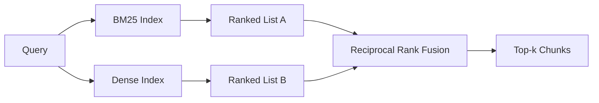

# 混合检查:BM25与密向量

> 复式检索与相互排列融合的混合检索不交叉,它投票 - 投票赢得每个查询类.

> **【中文解读】**字面检索与语义检索在相反的查询分布上翻车:字面标识符查询(如`AbortMultipartOnFail`)BM25 秒中、密检索排错;改述查询("上传取消了怎么处理")正好反过来──混合检索使用倒数排名融合(RRF) 把两个排列列表"投票"合并不是分数插值──本课来自罗伯逊/斯帕克·斯 公式从零实现BM25,再实现密检索与RRF,三种查询类型全赢──

> **【拓展：混合检索的生产版图】**混合检索是2025-2026年生产RAG的默认形态:Elasticsearch/OpenSearch 原生 BM25,pgvector/Milvus/Qdrant 提供密索引,Vespa与Weaviate 把RRF做成一等公民接口──本课实现的`1/(k+rank)`公式来自科尔麦克,克拉克,布特切尔 2009年SIGIR论文,k=60的默认值从此成为行业惯例.

>  **【前置】**学本课前请先掌握:阶段11 · 04(嵌入) 、06(RAG 基础) 向量检索与余弦相似度;阶段19 轨道B 基础(20-29 课);第 64 课 (分块策略) 本课检索的块由它切出──术语约定:混合检索=混合检索、密度=密、词面、RF=倒数排名融合──

**Type:** Build | **类型:** 构建
**Languages:** Python | **语言:** Python
**Prerequisites:** Phase 11 lessons 04 (embeddings), 06 (RAG); Phase 19 Track B foundations (lessons 20-29); Phase 19 lesson 64 (chunking strategies) | **前置知识:** Phase 11 · 04（嵌入）、06（RAG）；Phase 19 Track B 基础（20-29 课）；Phase 19 · 64（分块策略）
**Time:** ~90 minutes | **时间:** 约 90 分钟

## 学习目标
- 从罗伯逊和斯帕克·斯的公式中从零开始实现BM25,使用场面权重,文件长度正常化,以及可调节的k1和b.
  中文翻译:根据罗伯茨森与斯帕克·斯的公式从零实现BM25,带字段加权、文档长度归结和可调的 k1、b。
- 建立一个密集的回收器, 建立一个定性模拟嵌入式,
  中文翻译:在确定性模拟上嵌入构建密检查器,让整条回路离线运行.
- 按照科尔麦克,克拉克和布埃特切尔2009年发表的情况,实施相互级别融合,并解释为什么它占据了分数权重的插图.
  中文翻译:严格按照科尔麦克,克拉克,布特切尔 2009年发表的公式实现倒数排名融合(RRF),并解释为什么它优于分数加权插值──
- 调整RRF k常量和每种模式权重,并在小的固定器件体上读取交易.
  中文翻译:调 RRF的 k 常数与各个模式权重,在小固定语料上读出权衡──

## 问题 问题引入

> **【中文解读】**本节核心洞见:两种检查器的强度由查询分布决定,而生产系统的查询分布有两种类型.字面标识符查询是BM25的主场词面命中即可;改述查询是密检查的主场语义接近即可.选择不是静态,合并步骤才必须对待的地方.

字母搜索获胜,当查询包含字面标识符时,该表包含字面标识.`AbortMultipartOnFail`在微秒内通过BM25返回正确的Go函数.相同的查询,嵌入式,位于三个相似度集群的边界,密集的检索器首先排名错误的文件.

> 字面检索在"查询带语料中逐字存在的字面标识符"时获胜.`AbortMultipartOnFail`用BM25微秒级就返回正确的Go函数. 后,在三个相似度聚合区间内嵌入了同一查询,密检查器把错误文件排在第一.

密集搜索在查询被抛词而远离体积的字面标记时获胜.一个用户问"我们如何处理取消的上传"从来没有打入"取消"或"多部分"这个词.BM25将文件部分返回"上传大型文件"上,因为该页面包含"上传"这个词.密集检索发现了"取消"这个函数,总结中提到取消.

> 密检索在"查询被改述"",脱离语料字面标志"时获胜. 问"我们如何处理被取消的上传"的用户从未输入过关或多部分.

两个之间的选择不是静态的.查询分布是变量.一个生产RAG系统从同一端点处理两个类,所以检索必须同时处理两类.这就是混合检索. 合并步骤是必须正确的部分.

> 查询分布是变量. 生产RAG系统在同一端点同时服务两个类型的查询,所以查询必须同时拿下两个.

## 概念的核心概念

> **【中文解读】**BM25 一段话:对每一个查询词求"IDF × 和词频 × 长度归结"再求和,k1=1.5、b=0.75 是论文默认值,字段加权在索引期期内乘数实现.



### 在一个段落中,BM25

BM25通过在查询条件上总算一个反向文件频率因子乘以一个和术语频率因子,包括长度正常化纠正.`k1`标准的1.5是公布的建议,并且您不应该没有基准值移动它. `b`根据标准的0.75 个标准,长文件会受到惩罚,但不是线性.

> 给"查询文档"打分的方式是:对每个查询词,把逆文档频率因子乘以带长度归结修正的和词频因子,然后求和――两个旋律:`k1`控制词频和,默认 1.5 是论文推值,没有基准数据别动它;`b`控制文档长度的权重,默认 0.75 表示长文档受罚但不呈线性──

据说,以色列国防军使用了罗伯逊和斯帕克·斯的定义,`log((N - df + 0.5) / (df + 0.5) + 1)`总体而言,在一个小组中, 关键词技术上很少存在.

> 据报道,这项计划是:`log((N - df + 0.5) / (df + 0.5) + 1)` 里加一保证当某个词出现时, IDF 仍为正确.

字段权重让你告诉BM25符号名称上的匹配比体内的匹配更重要. 实现是指数过程中的术语数量的乘法,而不是得分时间. 这使得数学保持相同,避免每个字段的分分分分.

> 字段加权让你告诉BM25:符号名上的命中比正文中的命中更有价值.实现方式是索引期对词频计数乘以一个系数,而不是在打分期中保持数学不变,也免去逐字段单独打分.

### 密集的检索在一个段落

嵌入每个部分在一个固定维度向量中,使用嵌入模型.在查询时,嵌入查询,通过相似性排名每个部分,并返回顶部k.模型是决定质量的变量.检索算法本身是两个线:点产量和排序.

> 用嵌入模型将每个块嵌入固定维度的向量.查询时:嵌入查询,按余弦相似性给所有块排序,返回前 k.决定质量是模型;检索算法本身只有两行:点积和排序.

这一课使用确定性基于哈希的嵌入式,以便您可以在没有网络调用的情况下阅读融合数学.哈希将代币键的抵消数量加成96维向量并正常化.测试套件所要求的代数数数列是确定性跨行.

> 本课程使用确定性哈希嵌入,让你不开网请求就能读融合数学――哈希把代币键控制的偏移和成96维向量重归化――余弦排列跨运行确定,这是测试套件的要求――

### 相互级别融合,公布的公式

两名排名名.对于每位名单中出现在的候选人,总结其相互排名贡献. 2009年论文使用`1 / (k + rank)`按总分数排序.这是整个算法.

> 两份排名列表――对每位候选人,加上其倒数排名贡献――2009年论文用 `1 / (k + rank)`、k 默认 60──按总分排序──算法到此为止──

发表的常数 k = 60 不是任意的.在 k = 60 时,排名-1贡献是1/61和排名-10贡献是1/70. 贡献会慢慢衰退,所以深层的候选人仍然投票.较小的 k 让顶级结果占主导地位.较大的 k 方便了贡献曲线.

> 论文常数 k = 60 不是随手取的──k = 60 时第 1 名贡献 1/61,第 10 名贡献 1/70衰减缓慢,深名次仍有投票权──k 越小头部越独大;k 越大贡献曲线越平──

两个调节式按在我们的实施.`k`根据标准,一个对比的数量是不变的.一个对比的数量是不变的.一个对比的数量是不变的.一个对比的数量是不变的.一个对比的数量是不变的.一个对比的数量是不变的.一个对比的数量是不变的.一个对比的数量是不变的.一个对比的数量是不变的.一个对比的数量是不变的.一个对比的数量是不变的.一个对比的数量是不变的.一个对比的数量是不变的.一个对比的数量是不变的.一个对比的数量是不变的.一个对比的数量是不变的.一个对比的数量是不变的.

> 我们实现了两个可调整的目标:`k`常数和对模态权重 当你有先验证表明某种模态在语料上更强大时,你可以给它权力增加.

### 为什么合比分权重插射更好

 BM25分数是无限的,依赖于体积. 科西因相似性是以 -1 到 1 边界的.`alpha * bm25 + (1 - alpha) * cosine`根据排名的融合没有.两个排名可以在各个模式中比较. 发表的RRF基线比2010年以来在每个公共TREC轨道中分数插入.

> 其他弦相似度限制在 -1 到 1 ⋅线性组合`alpha * bm25 + (1 - alpha) * cosine`需要逐语料调调,而且每次重建索引都会失效.

它们得出相同的结论:除非有非常强有力的证据来调整分数.

> 这与你在Vespa 和 Weaviate 文档中听到的RankFusion与RRF 争夺是同一个论文.

```figure
rrf-fusion
```

## 建立它,实现它.

> **【中文解读】** `code/main.py`现在,我们已经开始了.`BM25Index`其他类型的定性模拟`DenseIndex`带模态权重的`rrf`并且把它们组合起来.`HybridRetriever`◎演示跑三条查询,各自命中一个检查器的强与弱点,印制两种模式的排名和融合后的排名融合不是折叠,是每个类别的查询都赢得的系统──

`code/main.py`执行:

- `tokenize(text)`- 一个快速的regex标记.
  翻译: 中文`tokenize(text)`快速正则分词器──
- `BM25Index`- 按场面权重,`add`其他`search`置式 k1, b.
  翻译: 中文`BM25Index`带字段加权,提供`add`与`search`,可调
- `mock_embed`现在`DenseIndex`它们的分数是可比较的.
  翻译: 中文`mock_embed`,我知道.`DenseIndex`与第64课相同的确定性嵌入,保证块可比.
- `rrf(rankings, k, weights)`- 已公布的多模式权重融合.
  翻译: 中文`rrf(rankings, k, weights)`论文版融合,支持多模态权重
- `HybridRetriever`- 结合BM25和密集.
  翻译: 中文`HybridRetriever`组合 BM25 与密检索
- 一个演示`main()`运行三个查询,针对每个回收器的强度和弱点, 并打印出每个模拟的排名,
  中文翻译:一个演示`main()`运载小固定语料,运行三条分别命中各检查器强项和弱项的查询,打印每种产生的模态排名以及融合后列表.

运行它:

> 运行:

```bash
python3 code/main.py
```

阅读示范输出一边.字面标识查询到BM25排名1,密集排名4,RRF排名1. 抛词查询到BM25排名6,密集排名1,RRF排名1. 模糊查询到BM25排名3,密集排名3,RRF排名1. 融合不是打破;它是每一个查询类中赢得的系统.
  中文翻译:并排读演示输出:字面标识符查询落在BM25 第1、密第4、RRF 第 1;改述查询落在BM25 第6、密第1、RRF 第 1;歧义查询落在BM25 第3、密第3、RRF 第1──融合不是平局裁决器,而是每个类的查询都是赢得的系统──

## 调节扣

> **【中文解读】**五旋一张表:k1(词频和) 、b(长度惩罚)、RRF k(深名次投票权)、BM25 权重与密权重(语料先验)。上调下调各有明确时间,但结论只有一个条使用第 68 课的评测线束在留出查询集上调调,不要凭直觉──

| Knob | Default | Move it up when | Move it down when |
|------|---------|----------------|------------------|
| BM25 k1 | 1.5 | Terms repeat in documents and you want frequency to matter more | Documents are short and term repetition is noise |
| BM25 b | 0.75 | Long documents really do say less per word | Document length is uncorrelated with topic |
| RRF k | 60 | Deep candidates should keep voting | The top-1 should dominate |
| BM25 weight | 1.0 | Your corpus contains literal identifiers and queries match them | Your queries are user-paraphrased |
| Dense weight | 1.0 | Queries are paraphrased | Queries are literal |

通过重新运行第68课的评估, 调整你的保留查询集, 不是直觉.

> 调参依赖在留出查询集上重跑第68课的评测线束,不依赖直觉.

## 失败模式演示将隐藏不住的失败模式

> **【中文解读】**三条隐藏失败:词表外代币BM25的IDF对查询独有词贡献为零,密嵌入会"幻觉"出一个向量,返回看似可信实则错误的邻居(融合能吸收它,前提是按文档而不是按块重重);停用词支配对"查询BM25 给出全语料均排名,要么在索引器中过停用词;两模与冠军小语料BM25 密集中的第 1 名相同,RRF 输出不变,这不是失败但会让融合"隐形",评测加加对对抗查询证实融合真的在工作.

**Out-of-vocabulary tokens.**密集嵌入式对同一术语进行幻觉.在外体识别器上,密集模拟 returns plausible-looking but wrong neighbors. 融合吸收了这一点,因为BM25返回什么都没有,而排名贡献下降,但只有如果你通过文档,而不是通过分片进行复制.

> **词表外 token。**根据BM25的语料计算,仅出现在查询中的词贡献为零;密嵌入将给同一个词"幻觉"出一个向量.

**Stop-token domination.**根据"the"的词,BM25在表格上产生统一排名. 过索引中的停止代币或接受高IDF术语自然占主导地位.

> **停用词支配。**用"the"查看BM25 会得到全语料的均排名.

**Identical content across modalities.**如果你的体积足够小,以至于BM25的顶-1也是密集的顶-1,RRF给你带来了相同的邻居的顶-1.这是正确的行为,不是失败,但它使得融合看起来看不见.在你的评估中添加一个对立查询对来验证融合实际上是有效的.

> **跨模态内容相同。**如果语料小到BM25的第1名也是密密的第1名,RRF 给你同样的第1名和同样的邻居──这是正确的行为而不是失败,但会让融合看起来"隐形"──在评测中加上对抗查询,验证融合真的在工作中──

## 用它实现框架

> **【中文解读】**生产形态四条:BM25 进程内索引(瓶是词频字典不是向量);密向量进独立储备(本课用平列表,生产用HNSW);两种查询并行跑,融合是对并集的常数时间合并;把每个命中的模态持久化,让下游重排序器看到是谁投的票──

生产模式:

- 索引BM25在进程中;瓶是术语频率字典,而不是向量.
  中文翻译:BM25 在进程内索引;瓶是词频字典,不是向量.
- 在单独的商店中索引密集向量 (在这一课中我们使用平面列表;在生产中,您将使用HNSW).
  中文翻译:密向量索引到独立储存 (本课用平列表,生产会用HNSW) ⋅
- 运行两个查询并行; 融合是连接的持续时间合并.
  中文翻译:两种查询并行运行;融合是对并集的常数时间合并.
- 保持每次获取的重击方式,以便下游重新排名者可以看到哪种方式投票支持它.
  中文翻译:持久化每一个检查命中模态,让下游重排器看看是哪个模态投票.

## 运送它.

第66课从本课中取出了合并的顶k,并用一个跨码器重新排列. 第68课精确评估整个管道,回忆,MRR和nDCG.本课中的混合回收器是第69课中的端到端系统的第一阶段.

> 第66课拿本课融合出前 k 名用交叉编码器重排 第68课用精确率,召回率,MRR,nDCG评测整条流水线 本课的混合检查器是第69课端到端系统的第一级.

## 练习题

1. 取代`mock_embed`运行演示,并报告如何在抛词查询中变化.
   中文翻译:把 `mock_embed`换成你供应商的真实模型――重跑演示,报告改述查询上纯密排名变化――
2. 加入第三种方式:分别索引的零件总结,并作为第三排名列表合并.
   中文翻译:加第三种模态:单独索引的块摘要,作为第三排列列表参与融合――量增加――
3. 扫描RRF k在 10, 30, 60, 100, 200 上. 从第68课程绘制回忆@k曲线. 报告曲线在你的体积上达到的 k 的值.
   中文翻译:把RRF k 扫过10、30、60、100、200──绘制第68课口径的回忆曲线──报告曲线在语料上达到峰值的曲线──
4. 运行BM25F正确 (每场长度正常化而不是乘法技巧) 并在符号匹配最重要的体积上进行比较.
   中文翻译:正规实现BM25F (逐字段长度归结而非乘数技巧),在符号命中最重要的语料上对比.

## 关键词 快速查找表

| Term | What people say | What it actually means |
|------|-----------------|------------------------|
| BM25 | "Lexical search" | Probabilistic ranking with idf x saturating tf x length normalization |
| RRF | "Rank fusion" | Sum of 1 / (k + rank) across ranked lists; k = 60 default |
| k1 | "TF saturation" | Controls how fast a repeated term stops adding more score |
| b | "Length penalty" | 0 means ignore document length, 1 means full normalization |
| Field weighting | "Symbol boost" | Repeat tokens during indexing to boost matches in that field |
| Rank-based vs score-based fusion | "Why RRF beats linear" | Ranks are comparable across modalities; scores are not |

## 继续阅读 继续阅读

- 科尔麦克,克拉克,布埃特切尔,"互惠级别融合优于康多塞特和个人级别学习方法",SIGIR 2009
  中文翻译:RRF 原始论文(SIGIR 2009) `1/(k+rank)`与 k=60 的出处.
- 罗伯逊,沃克,伯利,加特福德,佩恩,"在TREC-3的Okapi" (原本BM25纸)
  中文翻译:OKapi 在TREC-3BM25 原始论文(k1、b 默认值的出处) 』
- [Vespa: Hybrid Retrieval with BM25 and Embeddings](https://docs.vespa.ai/en/tutorials/hybrid-search.html)
  中文翻译:Vespa 混合检索教程生产级 BM25 + 嵌入混合方案。
- [Weaviate: Hybrid Search](https://weaviate.io/developers/weaviate/search/hybrid)
  中文翻译:重复混合搜索文档RRF的另一种生产实现.
- 第十一阶段第六课 - RAG基本面
  中文翻译:第11阶段 · 06RAG 基础。
- 第19阶段课时64 - 产量在这里被索引
  中文翻译:阶段19 · 64其输出被本课索引的分块器──
- 阶段19课66 - 跨编码重排器消耗了融合的顶-k
  中文翻译:阶段19 · 66消费融合前 k 名的交叉编码器重排序器──
