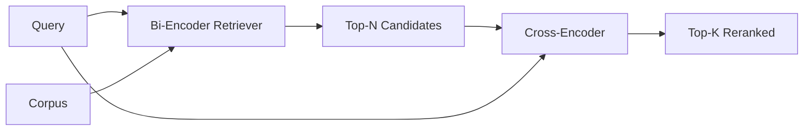

# 交叉编码器重排

> 双码码器独立嵌入查询和文档. 交叉码器连接它们并同时读取它们. 交叉码码器是最聪明的读者和最慢的. 作为双码码器的顶部k的第二阶段,它自行支付.

> **【中文解读】**双编码器(双编码器) 分别嵌入查询和文档、按余弦排序快但粗;交叉编码器(跨编码器) 把两者拼成一条序列一起读精确但慢到无法全库跑――解法是两段流水线:便宜式双编码器召回顶N,先昂贵的交叉编码器把N 精排到顶K――本课用 PyTorch从零搭配一个迷你交叉编码器,出量"延迟转换质量"的拐点――

> **【拓展：重排序器的生产版图】**生产中最常用的交叉编码器是`ms-marco-MiniLM-L-6-v2`(约22M参数,单卡可跑、p95可控);离线或首页精排常用更大`bge-reranker-v2-m3`选的方法: 选的方法: 选的方法: 选的方法:

>  **【前置】**学本课前请先掌握:阶段11 · 06(RAG) 、07(进阶段RAG) 召回与精排的分工;阶段19 轨道B 基础(20-29 课);第65课 (混合检索) 本课消费它融合出来的顶级k――术语约定:reranker=重排序器、跨码器=交叉编码器、双码器=双编码器──

**Type:** Build | **类型:** 构建
**Languages:** Python | **语言:** Python
**Prerequisites:** Phase 11 lesson 06 (RAG), Phase 11 lesson 07 (advanced RAG); Phase 19 Track B foundations (lessons 20-29); Phase 19 lesson 65 (hybrid retrieval feeding this stage) | **前置知识:** Phase 11 · 06（RAG）、07（进阶 RAG）；Phase 19 Track B 基础（20-29 课）；Phase 19 · 65（为本级供给候选的混合检索）
**Time:** ~90 minutes | **时间:** 约 90 分钟

## 学习目标
- 根据输入形状,参数数数和每次查询成本,区分双码码检索器与跨码码重排器.
  中文翻译:从输入形状,参数,单查询成本三个维度区分双编码器检查器和交叉编码器重排器――
- 从零开始,将一个小的跨编码器作为一个用包 (查询,文档) 的变压器块,并发出单个相关性尺度.
  中文翻译:从零实现一个小型交叉编码器:一个变压器块,吃进打包的(查询,文档)序列,吐出单个相关性标量――
- 通过两阶段的检索再排名管道:通过便宜的检索器检索N顶部,通过交叉编码器重新排名N至顶部K,返回K.
  中文翻译:接通"先检索后重排序"的两段式流水线:便宜检索器取顶-N,交叉编码器把N 精排到顶-K,返回K──
- 测量一个小的固定器件体上的延迟与质量交换,并选择给定的延迟预算的正确N.
  中文翻译:在小固定语料上度量"延迟换质量"的权衡,并根据给定延迟预算选择合适的N──

## 问题 问题引入

> **【中文解读】**本节是全课论证架构,四步推理值得背后下来: 1) 双编码器必须"盲压缩"文件嵌入时看不到查询,两个同主题文档的导向几乎不开,答对那篇和答错那篇分开; 2) 交叉编码器让查询和文档的每个代币 相互关注,精度天花板高; 3) 但它每一个查询,文档) 对每一个必须运行一次前进,千万文档库是千万次前进,预算分开不动; 4) 所以段双编码器管召回,交叉编码器精管,总质量=交叉编码器质量、上限=双编码器回 N处召集.

双编码器将查询和文档映射到同一向量空间中,并按二数排列.两个编码器从来没有见过彼此.模型必须将有关文档的所有有用信息压缩到单个向量中,盲目对查询.这很快 - 每个文档在索引时间内嵌入一个,每一个查询在查询时间内嵌入一个 - 这也是在体积尺度上排名的唯一方法.

> 双编码器将查询和文档映射到同一向量空间并按余弦排序.两个编码彼此看不见.模型必须将文档的所有有用信息压缩到单向量,对查询是盲目的.

两个具有相同的总体主题的文件可能具有几乎相同的嵌入式,即使其中一个回答了查询,而另一个没有.双编码器无法区分它们.

> 价格是精确的. 两篇完整主题文件几乎可以嵌入,

通过阅读查询和文档一起来解决这个问题.`[query] [SEP] [document]`作为一个单个序列,通过连接进行了全重视,并产生了一个相关性尺度.文件的每个符号可以参加查询的每个符号.模型决定了完整的文本.

> 交叉编码器通过"一起读"解决这个问题.`[query] [SEP] [document]`作为单条序列,在拼写处运行完整的注意力,产生一个相关性标志量――文档的每个标志都能注意到查询的每个标志――模型是完整的下文里打分――

代价是吞吐量. 双码码器嵌入一次并永远查询,交叉码码器运行一次 (查询,文档) 双.对于一个1000万的文档体,这每查询是1000万前进通行.在请求预算中无法运行.

> 代价是吞吐──双编码器嵌入一次就能永远查询;交叉编码器每一个查询,文档) 对每一个都跑一次──对数百万文档库,每一个查询是数百万次前向在请求预算内跑不动──

解决方案是阶段化.使用双码码器检索上层N.使用交叉码器重新排名N至上层K.N小 (50至200),交叉码器的质量升级集中在重要的地方.总延迟保持在请求预算中.总质量是交叉码器的质量,由双码码器在N召回限制.

> 解法是分段. 用双编码器检查顶N,用交叉编码器把N精排成顶K――N 很小(50到200),交叉编码器质量提升集中在要紧处――总延迟留在请求预算内,总质量=交叉编码器质量、上限=双编码器在N处召回――

## 概念的核心概念

> **【中文解读】**标准打包是`[CLS] query [SEP] document [SEP]`产品产量量: 22M 参数级`ms-marco-MiniLM-L-6-v2`),较小的模型质量比省下延迟快――延迟质量曲线上永远有一个20-50个候选人的"拐点",转折点就是白钱;而N 同时是质量上限交叉编码器救不回双编码器在N处就没有召回的答案――



### 交叉编码器输入形状

标准包装是`[CLS] query_tokens [SEP] document_tokens [SEP]`某些实现使用平均聚合而不是CLS;差异很小. 问题是,模型每对产生一个数字.

> 标准打包是`[CLS] query_tokens [SEP] document_tokens [SEP]`△CLS 位置的输出接到单线性头,输出相关性标量──有些实现使用平均值池化取代CLS;差别不大──关键在于:模型对每个查询,文档) 对产出一个数字──

通过22M参数交叉编码器 (已发布的`ms-marco-MiniLM-L-6-v2`较小的模型比节省延迟更快地失去质量.较大的模型 (例如:`bge-reranker-v2-m3`在568M参数) 时,这些参数仅用于非线重新排名或在K小时重新排名第一页.

> 交叉编码器的22M参数`ms-marco-MiniLM-L-6-v2`量级) 是典型的生产落点.较小的模型质量下降比省下延迟更快.较大的模型(如568M参数的`bge-reranker-v2-m3`) 留给离线排序或 K 很小的首页精排.

### 为什么这个课程训练一个小孩子

在生产中,你加载一个检查点并运行它. 在这个课程中,目标是向你展示模型的形状和延迟质量曲线的形状,而不是训练一个最先进的排名器.所以我们构建了一个小的`nn.Module`具有一个变压器块,多头注意力 (默认4头),和一个回归头.它从种子中初始化,因此演示可以在磁盘上重量无需重复.

> 真正交叉编码器是微调编码器变压器――生产中你加载检查点直接跑――本课程的目标是展示模型的形状和延迟质量曲线的形状,而不是训练一个SOTA排序器――所以我们构建了一个小的`nn.Module`转换器 块、多头注意力(默认4头) 、一个回归头──由种子确定性初始化,无需磁盘权重即可复现演示──

玩具模型从固定器件组中学习正确的形状:相关查询文件对比的预测分数比无关的对比更高.端到端管道将双编码器输出量重新排列,重排的顶级k与黄金标签相关.

> 玩具模型从固定语料学到正确的形状:相关查询-文档对对的预测分数高于不相关对――端到端流水线重排双编码器的输出,重排后的顶-k与金标签相关――

### 延迟与质量

在一个持久的查询集中扫描N从5到100,然后得到曲线.

> 在留出查询集中把N从5扫到100,你就得到了这个曲线.

| N | Recall@1 of stage 2 | Cross-encoder forward passes per query | Latency |
|---|--------------------|---------------------------------------|---------|
| 5 | 0.62 | 5 | low |
| 20 | 0.81 | 20 | medium |
| 50 | 0.86 | 50 | high |
| 100 | 0.86 | 100 | very high |

上面的数字说明了形状,而不是从这个装置的测量.形状是真实的.总有一只膝盖在20到50个候选人中,重新排名升降和.

> 上表数字显示形状,不是固定语料的实测值.形状是真的:拐点总在20-50个候选人附近,过了拐点重排序升和,再多的候选人就是白付钱.

通过加上延迟预算,选择N从评估曲线中. 交叉编码器不能提高回忆值超过双编码器的回忆值在N,因此低的N限制质量,而不仅仅是延迟.

> 根据评测曲线加延迟预算选择 N.交叉编码器无法把召唤抬到双编码器在 N 处的召唤上,所以 N 太低限制的不仅是延迟,还有质量上限.

```figure
rerank-funnel
```

## 建立它,实现它.

> **【中文解读】** `code/main.py`用PyTorch实现迷你`CrossEncoder`(词嵌入 + 单变压器 块 + 平均值池化回归头) 确定性打包器 `tokenize_pair`一轮监督训练`train_tiny`、生产接口`rerank`与`pipeline`△演示印双编码器上-N、交叉编码器上-K 与各阶段耗时交叉编码器单次慢,但从不上全库,总延迟留在预算内,还把双编码器排名第二第三的正确答案上到第一.

`code/main.py`执行:

- `CrossEncoder`- 一个小的`torch.nn.Module`:代号嵌入,一个变压器块,多头注意力和反式,平均聚合式头产生一个 skalar.
  翻译: 中文`CrossEncoder`小型`torch.nn.Module`标记嵌入,一个带多头的注意力和前的变压器块,产出单个标志的平均值池化头.
- `tokenize_pair(query, document)`- 将两个字符串包装成一个单个 id 序列,其中标记着边界,确定性和 stdlib 的类型 id.
  翻译: 中文`tokenize_pair(query, document)`把两个字符打包成带边界类型 id 的单条 id 序列,确定性、纯标准库──
- `train_tiny(pairs)`- 一次监督培训,在手动标记的三项列表上 (查询,文档,相关性),因此模型在设备上产生了合理的分数.
  翻译: 中文`train_tiny(pairs)`在手工标注的查询,文档,相关性) 三组列表上做一轮监督训练,让模型在固定语料上产生合理分数――
- `rerank(query, candidates, top_k)`- 生产界面.
  翻译: 中文`rerank(query, candidates, top_k)`生产接口.
- `pipeline(query, retriever, top_n, top_k)`- 两阶段的流量.
  翻译: 中文`pipeline(query, retriever, top_n, top_k)`两段式流程──
- 一个演示`main()`通过将课程65的模式加载,检索N的顶部,将其排列到K的顶部,印出了两列表,并报告了每个阶段的延迟.
  中文翻译:一个演示`main()`根据第65课程的模式加载语料,检索上-N,重新排序到上-K,并排印两份列表并报告各阶段延迟.

运行它:

> 运行:

```bash
python3 code/main.py
```

输出显示双码码器的顶N,交叉码码器的顶K和时间总结.交叉码码器每次通话需要更长时间,但不会在整个体内运行.两个阶段的总数保持在请求预算内,同时选择双码码器排名第二或第三的答案.

> 输出显示双编码器的顶-N、交叉编码器的顶-K 和计时摘要――交叉编码器单次调用更慢,但从未运行在全库中――两段总延迟留在请求预算内,同时将双编码器排到第二,第三的正确答案挑出来――

## 失败模式演示将隐藏不住的失败模式

> **【中文解读】**五条生产级陷:交叉编码器不对称查询永远放前面,接反召回崩;N=K时重排器只能加权不能重排,升级看起来为零 ((N 至少取K的三倍);训练对混入评测查询会让重排"看起来魔幻";22M参数浮动32 就是 88MB,承诺 p95 前算内存;批处理是硬要求N个候选人一次前向,不批处理延迟乘 N。

**Cross-encoder is not symmetric.** `rerank(q, d)`其他`rerank(d, q)`总是先输入查询. 如果你意外地交换,回忆会崩.

> **交叉编码器不对称。** `rerank(q, d)`与`rerank(d, q)`没有小心接反,召回崩.

**N is too low to expose the bug.**如果设置N=K,交叉编码器不能重新排序,它只能重重.升降器看起来是零.选择N至少是K的3倍.

> **N 太低暴露不了问题。**如果N=K,交叉编码器无法重排,只能重加权,升级看起来为零.

**Training data leaks into the eval.**如果手动标记的训练对包括评估查询,重新排名看起来很神奇. 严格分开训练和评估,即使在一个固定.

> **训练数据漏进评测。**对于包含评测查询,重排看起来很有魔法附体――严格分离训练与评测,甚至在固定语料上――

**Production weights are dense.**在 float32 上,一个22M参数跨码器为88MB. 在承诺 sub-100ms p95之前,计划模型服务器的内存.

> **生产权重是稠密的。**参数交叉编码器 float32 下就是 88MB──承诺 sub-100ms p95 之前,先规划模型服务器内存──

**Batching matters.**实际的交叉编码器将N个候选人运行在一个批量中.`_batch_encode`通过                                            `torch.tensor(...)`通过一个前进传输, 跳过批量, 延迟乘以N.

> **批处理很关键。**实际交叉编码器把N个候选人放进一批次.`_batch_encode`里就是这样做:用`torch.tensor(...)`构建批量 id 与类型id 张量、跑一次前向──不做批量处理,延迟乘以 N──

## 用它实现框架

> **【中文解读】**三条生产纪律:双编码器、交叉编码器、N 三者绑定版动任何一个都让评测失效;按(查询,文档 id) 哈希缓存重排输出,缓存命中就是免费的延迟减小;记录排名-1 分数上-1 分数低于语文特定料值说明是域外命中,让LLM以"我不确定"回应──

生产模式:

- 关键双码码,交叉码码和N在一起.改变任何一个使评估无效.
  中文翻译:把双编码器、交叉编码器和N 绑在一起──动任何一个都让评测失效──
- 缓存缓存输出 (查询,document_id) 哈希.与稳定体相对的相同查询对相同的顺序进行缓存;缓存击中可以免费减缓延迟.
  中文翻译:按(查询,文档 id) 哈希缓存重排序器输出。同一查询对稳定语料重排序出相同顺序;缓存命中白送一次延迟减减。
- 记录1级跨编码分数.一个比分高于1级的查询是域外的击中;将其表达给LLM为"我不确定".
  中文翻译:记录交叉编码器的排名-1 分数――上级-1 分数低于语料特定值的查询是域外命中;以"我不确定"的形式呈现给LLM──

## 运送它.

第68课评估了这两阶段的管道端到端. 第69课将这种重排器在第65课中的混合回收器后面和答案生成器前面.重排器是端到端系统的第二阶段.

> 第68课端到端评测 第69课把这个重排器连接到第65课混合检查器之后、答案生成器之前――重排器是端到端系统的第二级――

## 练习题

1. 扫描N从5到50,然后绘制重新排名输出的回忆@1. 在这个装置上找到膝盖.
   中文翻译:把 N 从 5 扫到 50,绘制重排序输出回忆@1──找到本固定语料上的拐点──
2. 训练交叉编码器进行十个时代,而不是一个.
   中文翻译:把交叉编码器从一轮训练改成十轮――量量每轮正负样本对的分数间隔――
3. 换一个CLS标记头,并将这种装置的融合进行比较.
   中文翻译:把平均值池化换成CLS代币头──对本固定语料上的收情况──
4. 添加一个第二个跨编码头,预测一个二进制"文件中是这个答案"标签. 在推断时使用两个头;一个是排名,一个是门.
   中文翻译:加第二交叉编码器头,预测"答案是否在文档里"的二元标签.
5. 取代确定性模拟双码器用第65课中的一个,链接两个阶段. 测量顶部K与单双码器的变化.
   中文翻译:把确定性模拟 双编码器换成第65课的实现并串联两段――度量顶-K 相对纯双编码器的变化――

## 关键词 快速查找表

| Term | What people say | What it actually means |
|------|-----------------|------------------------|
| Bi-encoder | "Vector retriever" | Encodes query and doc independently; cosine ranks them |
| Cross-encoder | "Reranker" | Encodes (query, doc) jointly; outputs one relevance scalar |
| Two-stage pipeline | "Retrieve and rerank" | Cheap retriever returns N, expensive reranker keeps K |
| N (candidate budget) | "Rerank pool" | The number of candidates the cross-encoder scores per query |
| Mean-pooling head | "Mean of last hidden" | Average the encoder's last-layer outputs into one vector |

## 继续阅读 继续阅读

- 诺格耶拉,乔, "通过BERT重新排名", 2019 - 经典的跨编码排名论文
  中文翻译:Nogueira 与 Cho,"通过与BERT重新排名" (中文翻译:Nogueira 与 Cho,"通过与BERT重新排名")
- 雷默斯,古雷维奇, "Sentence-BERT:使用西安式BERT网络的句子嵌入", 2019 - 关于双码器与交叉码器
  中文翻译:Reimers 与 Gurevych,"Sentence-BERT" (新华语) 双编码器与交叉编码器之辨.
- [SentenceTransformers Cross-Encoders documentation](https://www.sbert.net/examples/applications/cross-encoder/README.html)
  中文翻译:SentenceTransformers 交叉编码器文档生产级用法。
- [BGE Reranker v2 model card](https://huggingface.co/BAAI/bge-reranker-v2-m3)
  中文翻译:BGE 排列器 v2 模型卡568M 参数大重排序器──
- 第19阶段课65 - 混合式取器提供了这个重排阶段的食物
  中文翻译:19期 · 65为本级供给候选人的混合检索器──
- 阶段19课68 - 评估测量这一重排的升级
  中文翻译:阶段19 · 68度量本次重排序带来提升的评测.
