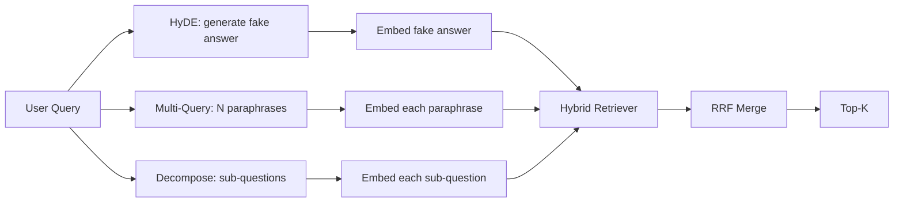

# 查询改写:HyDE、多查询与分解

> 查询用户输入的查询不是查询器想要的查询. 重写将在查询之前的差距弥合,因此索引会看到更接近答案的东西.

> **【中文解读】**用户敲下查询往往不是检查器想要的查询.HyDE 让LLM先写一篇"假想答案文档"、用它嵌入查询假想文档语料口吻写就,量量天然落在正确答案附近;多查询把一个查询改写为N条改述、各自的检查后使用RRF合并;查询分解复杂问题分解成子问题分别检查.本课用一个确定性 Mock LLM 让三种改写器全部离线运行.

> **【拓展：查询改写在生产 RAG 中的位置】**查询改写是"检索前优化"的统称:HyDE 来自高等人 2023年论文"精确零射精密检索没有相关性标签";多查询改写随微软 GraphRAG与RAG-Fusion流行;子查询分解是DSPy多跳问答的标志――LlamaIndex的查询转换、长链的多QueryRetriever都是这个层的成品――本课后,65-66 课的"检索 + 重排序差"面上拼图――这最后一块.

>  **【前置】**学本课前请先掌握:阶段11 · 04(嵌入) 、06(RAG;阶段19 轨道B 基础(20-29 课);第64、65 课改写器输出查询由第65 课的混合检查器执行,融合使用的是同一套RRF──术语约定:查询重写=查询改写、HyDE 保留原文、多查询=多查询、解解析=查询) 分解──

**Type:** Build | **类型:** 构建
**Languages:** Python | **语言:** Python
**Prerequisites:** Phase 11 lessons 04 (embeddings), 06 (RAG); Phase 19 Track B foundations (lessons 20-29); Phase 19 lessons 64 and 65 | **前置知识:** Phase 11 · 04（嵌入）、06（RAG）；Phase 19 Track B 基础（20-29 课）；Phase 19 · 64、65
**Time:** ~90 minutes | **时间:** 约 90 分钟

## 学习目标
- 实现假设文件嵌入 (HyDE):生成一个假答案,嵌入它,取回该向量而不是查询向量.
  中文翻译:实现假想文档嵌入 (HyDE):生成一个假答案,嵌入它,用这个向量而不是查询向量去检查.
- 实现多查询扩展:重写一个查询成N句子,与每个引用,通过相互排列融合将联盟合并.
  中文翻译:实现多查询扩展:把一条查询改写成N 条改述、各自检索、用倒数排名融合合并并集──
- 实现查询分解:将复杂问题分为子问题,每一个子问题检索,并合并.
  中文翻译:实现查询分解:把复杂问题拆成子问题、逐子问题检索、合并──
- 让我们比较三个重写器的位置,
  中文翻译:在固定语料上三向对比三种改写器,并解释每种策略何时胜.
- 导航一个假的LLM,产生定性,固定输出,
  中文翻译:接一个产出确定性、贴合固定语料结果的模拟LLM,让改写回路离线运行――

## 问题 问题引入

> **【中文解读】**本节给出了出现场:用户问"上传失败且预算耗尽时团队怎么办",语料中的文档写道:"堕胎MultipartOnFail 堕胎在飞行中的S3多部分上传和减小每桶复试预算"查询与文档没有一个共享名词短语,BM25 落空、双编码器把文档排到第三第四;若答案连上-N进不了,66 课重排序器根本看不到它――所以改写必须发生在检查之前――

一个用户输入"当上传失败,预算消失时,我们的团队会做什么?" 文件中包含一个文件,上面写道:"AbortMultipartOnFail 停止了飞行中的S3多部分上传, 查询和文档没有任何名词.  BM25失败了. 双编码器将文档排名第三或第四,因为查询向量落入嵌入空间的一个区域,该区域更喜欢关于取消的任务的文档,而不是关于取消的上传的文档. 如果它坐在N上方,则课66中的二阶级重新排名可以拯救答案,

> 用户输入"上传失败且预算耗尽时我们团队怎么办?"语料里有文档写道:"堕胎MultipartOnFail 停止在飞行中的S3多部分上传,并在上传失败时减少每桶重试预算"......查询与文档不共享任何名词短语――BM25 落空――双编码器将文档排列在第三或第四,因为查询量落在嵌入空间中偏爱"取消任务"文档而不是"停止上传"文档的区域. 第66课的两段重排在答案中还在顶端,但如果连接顶端,重排器根本没有进入它.

解决方案是在它触及回收器之前重新写查询. 2023年"精确零射击密集检索没有相关标签" (Gao等) 论文引入了HyDE:要求LLM写出将回答查询的文件,嵌入该假设文件,并使用其嵌入作为检索向量. 假设文件位于嵌入空间的右侧,因为它是用体体的声音写的. 查询向量没有.

> 修复方法是在查询碰到检查器之前改写它.2023年论文"精确零射击密集检查没有相关性标签" (Gao等)提出了HyDE:让LLM写出一个能回答该查询的文档,嵌入这个假想文档,用它嵌入作为检查向量.

两种表妹技术与HyDE结合. 多查询扩展 (微软使用的GraphRAG术语) 生成查询的N句子并与每个引用,然后合并. 解散 (在2024年斯坦福DSPy研究中被称为"下列查询解散") 将"当上传失败时我们的团队做什么,预算失败时"分为两个问题: 两个检索,一个合并结果,两个部分的答案可达成.

> 两个表亲技术与HyDE 搭档.多查询扩展.微软 GraphRAG 用的术语) 生成查询的N条改述、逐条检查再合并.分解.

这一课将所有三个都实现,并将它们与同一架构相对.

> 本课程实现了所有三种技术,并运行在同一固定语料上对比.

## 概念的核心概念

> **【中文解读】**三种改写器互补分工:HyDE 弥合"查询语料"的标志落差(假想文档写了中断、多部分、桶、预算 这些词);多查询覆盖改述方差(用户措辞只是众多等价格法之一);分解覆盖多主题查询(复合问题一次检索不) ⋅记忆点:HyDE 换向量、多查询集换措辞、分解出问题三者产都汇入同一个混合检查器+RRF 合并──



### 详细的海德

代取代用户查询向量为LLM编写的假设文档向量.提示是简短的:

> 代用 LLM 写出的假想文档向量替换用户的查询向量──提示词很短:

```
You are a domain expert. Write a one-paragraph passage that answers the question
below. Use the same vocabulary and phrasing the documentation in this domain would
use. Do not refuse. Do not say you do not know.

Question: {user_query}

Passage:
```

法律法师的答案是错误的,因为法律法师不了解你的体积. 这很好. 回者不关心事实正确性,只关心标志性分配. 假设的段落包含"堕胎","多部分","桶","预算"的词, 嵌入这个通道. 矢量落地在真实通道附近.

> 作为事实答案,LLM的答案是错误的,因为LLM不了解你的语料.但是这没关系.检查器不在乎事实正确性,只在于标志分布.假想段落里出现"堕胎","多部分","桶","预算"这些词,因为关于这个主题的文档段落就应该这样写.

在制作中,你将假设文档限制在两个或三个句子上.较长的假设文本收集更多的噪音.较短的文本输掉了HyDE所需的词汇信号.

> 生产中把假想文档限制在两句话中.

### 多项查询的详细扩展

生成用户查询的N句子.

> 生成用户查询的N 条改述──最简单的提示词:

```
Rewrite the following question in {N} different ways. Each rewrite must preserve
the original intent. Number them 1 to {N}. Do not add explanations.
```

取回每句话的顶部k.将N排列列列表与RRF (65课程相同的算法) 合并.

> 对于每条改述检查的顶-k,使用RRF第65课的相同算法)合并 N 份排列表――便宜、可并行、确定性――

复式查询是用户的句子提出问题的许多有效方式之一,任何重写都会更好地提出问题. 所有重写都一样糟糕,因为原始的情况同样糟糕.

> 当用户的措辞只是众多相同的价格问题之一,并且任一改述都可能问得更好,多查询获胜.

### 详细分解

解散要求LLM将问题分为子问题,系统则每一个子问题取回.提示:

> 单次检索满足不了多面问题――分解让 LLM 把问题拆成子问题,系统逐子问题检索――提示词:

```
The following question may require information from multiple distinct topics.
Decompose it into a list of sub-questions. Each sub-question must be answerable
independently. If the question is already atomic, return it unchanged.

Question: {user_query}
```

解散是包含连结,多条款比较或两个不相关的主题的问题,错误的原子问题工具;解散者的工作是返回单个问题,而不是发明假的子问题.

> 逐子问题检查,合并――分解适合含连接词、多从句比较或两个不相关的主题的问题;对原子问题是错误工具那时分解器的责任是原样回复这个问题,而不是发明假子问题――

### 为什么三者都存在

综合测试系统 (HyDE) 解决了查询-库的代币差距.多查询覆盖了语法变异.分解覆盖了多主题查询.一个生产系统运行了三个,并选择了每个查询的策略 (第69课的端到端系统显示了选择器).

> 三者互补――HyDE 弥合查询与语料的代号差异;多查询覆盖改述方差;分解覆盖多主题查询――生产系统三者都运行,并按查询选择策略(第69课的端到端系统展示了选择器) ――

## 假冒的法师

> **【中文解读】**本课程离线:假 LLM 是一个张以用户查询为关键的查找表每一个固定语料查询预置假想段落、三条改述和一个分解;未知查询走确定性底(取内容词、过同义词映射、返回结果) ⋅重要的是假的形状而不是数据:在生产中把假的换成真实模型调用,检查器一行不变――

课程开启在线.假 LLM 是一个小的查找表,按用户查询键,加上没有看到的查询的反弹.查找表包含:

> 本课离线运行. 模拟法师是一个用户查询为关键的小查找表,外加一个处理未见查询的底.

- 对于每一个固定查询:一个写的假设段落,三个句子,
  中文翻译:对每一个固定语料查询:一篇写好的假想段落、三条改述、一份分解──
- 对于未知查询:确定性转换:取查询内容单词,通过同义词地图扩展它们,然后返回结果.
  中文翻译:对未知查询:一个确定性变换取查询的内容词、经同义词映射扩展、返回结果──

假冒的形状是重要的,而不是数据. 在生产中,你把假冒换成真实模型调用.

> 重要的是模拟的形状,而不是数据.

```figure
cd-hyde-vector
```

## 建立它,实现它.

> **【中文解读】** `code/main.py`的接口清单:`MockLLM`、三个改写器`HyDERewriter`,我知道.`MultiQueryRewriter`,我知道.`DecomposeRewriter`) 与统一的`retrieve_with_rewriter`△检查器形状复制 第65课的混合BM25+密,融合还是那套RRF唯一的新形状是改写器接口,而它很小.

`code/main.py`执行:

- `MockLLM`- 上述的决定性替代.
  翻译: 中文`MockLLM`上文描述的确定性替代
- `HyDERewriter`- 要求法师写下假设文件,返回重写器输出为`RewriteResult`检索器应该使用的假设文本和查询.
  翻译: 中文`HyDERewriter`调用法学 写假想文档,以`RewriteResult`返回改写输出,内含假想文本与检查器应使用的查询.
- `MultiQueryRewriter`- 要求法师提供N句子,返回查询列表.
  翻译: 中文`MultiQueryRewriter`调用 LLM 生成 N 条改述,返回查询列表
- `DecomposeRewriter`- 要求法师解体,返回部分问题.
  翻译: 中文`DecomposeRewriter`调用LLM做分解,返回子问题.
- `retrieve_with_rewriter`通过重新写作器和回收器,
  翻译: 中文`retrieve_with_rewriter`接收一个改写器和一个检查器,运行改写并融合结果.
- 显示了三个重写器的演示,然后打印了哪个策略先返回黄金答案文件.
  中文翻译:一个演示:在固定语料上运行三种改写器,打印哪种策略最先返回金标答案文档.

复制器的形状从第65课中重新使用 (混合BM25 +密集). 融合是相同的RRF.唯一的新形状是重写器接口,它很小.

> 检索器形状复用第65课 混合BM25 + 密) 融合是同一套RRF──唯一的新形状是改写器接口,而它很小──

运行它:

> 运行:

```bash
python3 code/main.py
```

输出是每个策略排名和最终总结.HyDE在短语不匹配的查询中获胜.多次查询在语法变异查询中获胜.分解在多主题查询中获胜.倒退 (没有重写器) 在三个中至少输掉一个.

> 输出是逐策略排名加最终摘要――HyDE 在措辞错配查询上获胜;多查询在改述方差查询上获胜;分解在多主题查询上获胜;底(无改写器) 至少在三者中之一落败――

## 失败模式演示将隐藏不住的失败模式

> **【中文解读】**四条生产陷:HyDE 幻觉出语料外的标识符将使这个词变成高权重却不在索引中的代币,压正确文档的BM25 分限制假想长度、调低BM25 融合权重;弱模型的多条改述彼此趋同,N次检索返回同一顶加多样性指令并使用Jaccard查重;分解器把原子问题也拆开,检索全部命中同一文档但排名下降粉丝-out前先做"子是否足够不同"检查;延迟按策略翻倍检索可行并行问题,LLM调用才是地板.

**HyDE hallucinates corpus-specific identifiers wrong.**模型发明了一个函数名称.假设的BM25分数在右边文件崩,因为发明的名称现在是一个高权重的代币,它不出现在索引中.

> **HyDE 把语料专属标识符幻觉错。**模型编制一个函数名字――假想文档在正确文档上的BM25 分崩,因为编制名字成为高权重代币 却没有索引里――限制假想文档长度,并融合中调低BM25权重――

**Multi-query rewrites all converge.**软模型产生了三个几乎相同的表达语.N检索返回相同的顶-k.RRF合并不比单次检索好.添加明确的多样性说明给重写提示,检测Jaccard的重复.

> **多查询改述全部趋同。**弱模型产出三条几乎相同的改述――N 次检索返回相同的顶-k,RRF 合不比单次检索好――给改写提示词加显式多样性指令,并使用Jaccard 检测重复――

**Decomposition over-splits.**解散器将原子问题转化为列表.所有检索都返回相同的文档,但有降级. 合并比原始更糟. 在粉丝退出之前,通过"这些子问题足够明显吗?"检测到这一点.

> **分解过度拆分。**分解器把原子问题也变成列表. 各次检查都回归同一档案,但排名下降,合并结果比原始更差.

**Latency multiplies.**代成本一个LLM调用.多查询成本一个LLM调用生成N重写,然后N检索.分解成本一个LLM调用分解,然后M检索.检索运行并行;LLM调用是地板.

> **延迟成倍增加。**一次 LLM调用;多查询一次 LLM调用生成 N 条改述再加 N 次检索;分解一次 LLM调用做分解再加 M 次检索――检索可以并行;LLM调用才是延迟地板――

## 用它实现框架

> **【中文解读】**三条生产法:按查询特征选策略短的原子查询走多查询、复杂多从句子走分解、行话密集走 HyDE;按查询哈希缓存改写输出(大量查询会重复);三路并行再RRF 融合成本是三次 LLM 调用加一次融合,质量是三种策略覆盖的并集──

生产模式:

- 按查询长度选择策略:原子短查询得到多查询,复杂多条款查询得到分解,语重查询得到HyDE.
  中文翻译:按查询长度做逐个查询策略选择:短的原子查询走多查询,复杂多从句子查询走分解,行话密集查询走 HyDE──
- 通过查询哈希缓存重写器输出.许多查询重复.
  中文翻译:按查询哈希缓存改写器输出──大量查询是重复的──
- 运行三项并行,并将三项结果集组合到一个中,使用RRF. 成本是三项LLM调用和一项合并;质量是所有三项战略的合并.
  中文翻译:三路并行运行并使用RRF 把三份结果融合为一.成本是三次 LLM 调用加一次融合;质量是三种策略覆盖面的并集.

## 运送它.

第69课将重写器的阶段,在第65课的回收器和第66课的重排器之前,在第68课中评估了重写器在回收回忆中增加的升级.

> 第69课把这个改写阶段连接到第65课检查器和第66课重排器之前. 第68课评测改写器给了检查召回带来的提升.

## 练习题

1. 实施RAG-Fusion (多项查询的2024变体),如果重写者的表达是故意多样化的,然后重排步骤 (课66) 选择最终列表.
   中文翻译:实现RAG-Fusion(多查询的 2024 变体):改写器的改述刻意追求多样,再由重排序步 ((第 66 课) 选出最终列表──
2. 加入第四个策略:退步提示 (问法师更一般的问题,回复,然后缩小).
   中文翻译:加第四种策略:后退提示 让LLM给出更一般的问题 首先按它检索 再收窄)  在固定语料上对比.
3. 训练分解器识别原子查询,通过添加一个"是原子问题"标题.
   中文翻译:给分解器加一个"问题是否原子"的头,训练它识别原子查询――量前后过度分分率――
4. 取代假的法师与一个真正的模型调用.
   中文翻译:把模仿的LLM 换成真实模型调用――在你的技术上度量每种策略的延迟――
5. 增加每次重写的信任分数,将重写低于门,测量召回的影响.
   中文翻译:给每条改写加置信度分数――丢弃低于值的改写――量对召回的影响――

## 关键词 快速查找表

| Term | What people say | What it actually means |
|------|-----------------|------------------------|
| HyDE | "Fake-document retrieval" | LLM writes the answer; embed and retrieve on that instead of the query |
| Multi-query | "Paraphrase expansion" | N rewrites of the query; retrieve N times, merge by RRF |
| Decomposition | "Subquery split" | Multi-topic queries split into sub-questions, retrieved separately |
| Atomic query | "Single-topic" | Cannot be decomposed without inventing fake sub-questions |
| Step-back | "Abstract the query" | Ask the more general question, retrieve, then narrow |

## 继续阅读 继续阅读

- 盖奥,马,林,卡兰,"精确零射击密集检索没有相关标签" (HyDE), 2023
  中文翻译:Gao、Ma、Lin、Callan,"精确零射击密集检索没有相关性标签" (HyDE),2023假想文档嵌入的出处。
- 微软研究, "多个查询扩展用于检索"
  中文翻译:微软研究院,"多查询扩展"
- 斯坦福的DSPy, "多哈QA的下调"
  中文翻译:斯坦福DSPy,"多跳问答的子查询分解".
- [LlamaIndex query transformations documentation](https://docs.llamaindex.ai/en/stable/optimizing/advanced_retrieval/query_transformations/)
  中文翻译:LlamaIndex 查询变换文档本课三种改写器的成品件──
- 阶段11课07 - 高级RAG模式
  中文翻译:阶段11 · 07进阶 RAG 模式。
- 第19阶段课65 - 这台重写器的回收器
  中文翻译:阶段19 · 65本改写器下游的检索器。
- 第19阶段课程68 - 测量重写器升级的评估
  中文翻译:阶段19 · 68度量改写器提升的评测──
