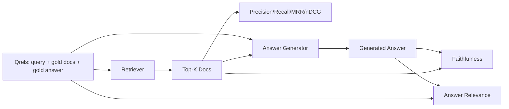

# 根据"高效率"的评价, 评价:精确率,召回率,MRR、nDCG、忠诚度、答案相关性.

> 如果您不能同时评分您的检索和答案,则您无法运输系统. 这两种方法不是相同的指标,并且相同的提示在不同的轴上失败.

> **【中文解读】**本课是RAG 深入路线(64-69) 的最后评测课程:使用一个固定的 qrels:查询 + 金标文档 + 金标答案) 同时给检索和生成两端打分.检索端四个指标精确率@k、召回率@k、MRR、nDCG@k评"找不到,排没排对";生成端两个指标忠诚与答案相关性评"答案是否落地是否落地、切题"......六个指标全部字面定义从零实现,M 裁判确定性模拟 替代,评测全程离线、可复测.

> **【拓展：RAG 评测生态→Ragas 三件套】**工业界流行的RAG框架把RAG评测分解成几乎相同的维度:忠诚度 (忠诚度) 回答相关性 (答案相关性) 文本精确度/回忆率 (回忆率),与本课六指标一对应.

>  **【前置】**学本课前请先掌握:(1) 阶段11 · 06(RAG 基础) 与 · 10(评测框架);(2) 阶段19 轨道B 基础(20-29 课);(3) 本路线前四课64 分块、65 混合检索、66 重排序、67 查询改写本课的标志正是给这四个组件定位故障仪表盘──

**Type:** Build | **类型:** 动手构建
**Languages:** Python | **语言:** Python
**Prerequisites:** Phase 11 lessons 06 (RAG), 10 (evaluation); Phase 19 Track B foundations (lessons 20-29); Phase 19 lessons 64, 65, 66, 67 | **前置知识:** Phase 11 · 06（RAG）、10（评测）；Phase 19 Track B 基础（20-29 课）；Phase 19 · 64、65、66、67
**Time:** ~90 minutes | **时间:** 约 90 分钟

## 学习目标
- 从金中计算四个取取值指标:精度@k,回忆@k,MRR (平均交互级别) 和nDCG@k.
  中文翻译:从金标 qrels 计算四个检索指标:precision@k、recall@k、MRR(平均倒数排名) 和nDCG@k。
- 计算两个答案等级指标:信实性 (每个索赔都是基于检索的背景) 和答案相关性 (答案解决问题).
  中文翻译:计算两个答案层标志:忠实度 (忠实度) 根据每条论断都检查上下文) 和答案相关性 (答案切合问题) ⋅
- 建立一个固定 qrels 文件 (查询,黄金文件标识,黄金答复文本) 评估读到端到端.
  中文翻译:构建一个固定的文件查询,金标文档 id,金标答案文本),让评测端到端读起来.
- 读取测量值,以诊断管道失败的地方:检索,排名,生成或定位.
  中文翻译:读懂指标数值,诊断流水线在哪一层失败:检索、排序、生成还是落地依据──

## 问题 问题引入

> **【中文解读】**RAG系统至少有四个可以独立出错的部件:分块器,检查器,重排序器,生成器.用户只报告"答案错了",但病可能在任何一个环节.

没有每一个阶段的指标,你会飞得盲目. 没有每一个阶段的指标,你会飞得盲目.

> RAG系统至少有四个活动部件:分块器,检索器,重排序器,生成器.任何一个都可能是错误答案的源头.

用户报告错误的答案.这是因为克削减了答案跨度吗?这是因为回收器没有包括克上层的克吗?是因为重排器推了右克过去的位置一?是因为发电机忽视了克并发明了什么东西吗?你不能从答案中说出来.你需要:

> 用户报告了一个错误答案. 是分块机切断了答案片段? 是检查机没有把正确分块送进顶-k? 是重排机把正确分块挤出了第一?还是生成器无视分块自己编制了一个? 光看答案无法判断. 你需要:

- 检索仪表将检索仪表的结果进行评分.
  中文翻译:检索指标,给检索器的产出打分.
- 排名指标,以分级,正确的部分坐落在顺序.
  中文翻译:排序指标,给正确分块在序列中的位置打分――
- 为了评分发电机是否留在检索的文本中.
  中文翻译:忠实度,检查生成器是否守在检索上下文之内──
- 答案是否符合问题的相关性.
  中文翻译:答案相关性,检查答案是否有任何回应问题.

在本课程中,所有六个课程都建立在一个固定的qrels文件上. 评估是离线和确定性的; 在制作中,你将假的法官作为法官换成一个真实的.

> 本课程在一个固定的文件上构建所有六个指标.

## 概念的核心概念

> **【中文解读】**六个指标分为两层看――检索层看上层列表:精确率=恢复 里有多少是金标,召回率=金标有多少进上层 k,MRR=第一个相关文档排多前,nDCG=带分级相关性排序质――生成层看最终答案:忠实度=每条论断是否有检索上下文支,答案相关性=答案是否回应问题――两个生成层指标彼此独立忠实但不切切切切切切切切切切切切切切切切切切切切切切切切切切切切切切切切切切切切切切切切切切切切切切切切切切切切切切切切切切切切切切切切切切切切切切切切切切切切切切切切切切切切切切切切切切切切切切切切切切切切切切切切切切切切切切切切切切切切切切切切切切切切切切切切切切切切切切切切切切切切切切切切切切切切切切切切切切切切切切切切切切切切切切切切切切切切切切切切切切切切切切切切切切切切切切切切切切切切切切切切切切切切切切切切切切切切切切切切切切切切切切切切切切切切切切切切切切切切切切切切切切切切切切切切切切切切切切切切切切切切切切切切切切切切切切切切切切切切切切切切切切切切切切切切切切切切切切切切切切切切切切切切切切切切切切切切切切切切切切切切切切切切切切切切切切切切切切切切切切切切切切切切切切切切切切切切切切切切切切切切切切切切切切切切切切切切切切切切切切切切切切切切切切切切切切



### 精准@k

如果金子有三份文件,而金子3份返回其中两个文件,而一个是错误的,精度@3是2/3.当不相关的检索件的成本高时,使用精度 (发电机浪费代币,或该件毒解答).

> 在检查器返回的顶级k文档中,有多少比例属于金标集?若金标有3篇文档而3篇命中其中2篇外加1篇错误,精度@3 = 2/3──当"检索回一个无关分块"的价格高时(生成器浪费代币,或该分块污染答案) 使用精确率──

### 提醒

如果金子有三个文件,而五号包含三个文件, recall@5是1.0.当错过答案的成本高时,使用 recall (你宁愿看到一个额外的错误部分,而不是完全错过答案部分).

> 在金标文档中,有多少个比例进入顶级?如果金标有3篇和5篇全部包含,回忆@5 =1.0──当"错过答案"的价格高时召回率(宁可多看一个错过答案分块,也不要彻底错过答案分块)

在生产中,人们通常引用的标准是 recall@k.

> 生产RAG中人们最常引用的标志是回忆@k――生成端丢失无关分块很容易;但它无法空空地回答一个从未见过的分块里问题――

### 平均相应等级

对于每个查询,在排名列表中找到第一个相关文档的位置. 相互排名为1/位置. 在查询集中平均. MRR是检索器如何把最佳答案放在顶部的单数总结.

> 对于每一个查询,找出排列列表中的第一个相关文档的位置.倒数排列 = 1 / 位置.

MRR 重量重于位置-1.一个查询中黄金文档处于排名1的贡献1.0.排名2的贡献0.5.排名10的贡献0.1.表格由列表的顶部占主导地位.

>  MRR 重罚非第一的位置──金标文档排名第 1 的查询贡献 1.0,第 2 贡献 0.5,第 10 贡献 0.1──该指标由列表顶部主导──

### 其他类型

标准化折扣累计收益.完整公式将每份获取的文件分配到收益 (通常是相关的1个,不相关的0个),按位置日志折扣,总和和 divides 理想的DCG (如果您排名完美的话,您将获得的DCG).范围从0到1.

> 归结折损累计增益――完整公式给每一个检索到的文档赋予增益――通常与1相关,不与0相关),按位置对数折损,求和,再除以理想的DCG――完整排列时能得到的DCG――取值范围0到1――

nDCG可以满足分类相关性:金字母可以说"doc A 是 3,doc B 是 2,doc C 是 1".MRR 和 recall@k 将所有内容平坦成二进制.使用 nDCG 当每次查询中有多个部分相关的文档时.

> 语料中的每一个查询都存在多个部分相关的文档时,使用nDCG。

### 忠诚

对于生成答案中的每个索赔,请检查索索赔是否支持被检索的文本.标准实施使用一个LLM作为法官提示,接收 (索赔,文本) 并返回是否.

> 对于生成答案中的每条论断,检查是否被检查上下文支──标准实现使用 LLM 裁判提示词:输入(论断,上下文),输出是否──指标值 = 通过论断占比──

忠诚度捕获生成器故障模式,模型发明内容.即使检索器返回了正确的块,一个产生幻觉的生成器就会被破坏.忠诚度也被称为基地,支持,归因.

> 忠实度捕捉是"模型编制内容"这种生成器失败模式.即使检查器返回正确的分块,会幻觉的生成器也是坏的.

在本课程中,我们使用一个确定性假设法官来实现忠诚度,该法官检查每个索赔的代币是否通过门覆盖检索的文本.在生产中,你会换成一个真实模型调用.

> 本课使用确定性模拟 裁判实现忠实性:检查每条论断的符号与检查上下文的重叠是否超过值――生产中转换为真实模型调用,标志的形状不变――

### 答案的相关性

忠诚性问"答案是否基于文本?"答案相关性问"答案是否基于问题?"一个忠诚但不涉及主题的答案在信任度上高,而在相关性上低.一个忽略文本的短短暂,主题上的答案在相关性上高,而在信任度上低.

> 答案是否基于下文?忠实性问答是否基于下文? 答案是否基于问题? 答案是否基于问题? 答案是否基于问题? 答案是否基于问题? 答案是否基于问题? 答案是否基于问题? 答案是否基于问题? 答案是否基于问题? 答案是否基于问题? 答案是否基于问题? 答案是否基于问题? 答案是否基于问题? 答案是否基于问题? 答案是否基于问题? 答案是否基于问题? 答案是否基于问题? 答案是否基于问题? 答案是否基于问题? 答案是否基于问题? 答案是否基于问题? 答案是否基于问题? 答案是否基于问题? 答案是忠实性高,相关性低,简短问题但没有视为下文的答案,相关性高,忠实性低.

标准实施还使用LLM作为法官:接受 (问题,答案) 并问答是否解决问题. 这一课实行了一个代币重叠加法官的替代.

> 标准实现同样使用LLM 裁判:输入(问题,答案),问答案是否回应了问题.本课实现是"代码重叠 + 裁判"的替代.

## 固定的东西 测评集

> **【中文解读】**查询与相关性判定) 是评测的基因:每条查询带金标文档 id 集合(供精确率/召回率/MRR 用) 分级相关性字典(供nDCG 用) 和金标答案子串(仅根据元数据,忠诚度不依赖于它计算) ⋅生产中对这些标签需要人工标签; 本课交付手工构造的固定,让评测开箱即运行.

```python
{
  "qid": "q1",
  "query": "what is the abort threshold for multipart uploads",
  "gold_doc_ids": ["d1", "d3"],
  "gold_answer_substring": "three failed parts",
  "graded_relevance": {"d1": 3, "d3": 2},
}
```

每个查询都包含:
- 查询链,
  中文翻译:查询字符串;
- 一组黄金文件 (准确/召回/MRR)
  中文翻译:金标文档 id 集合(供精确率/召回率/MRR 使用);
- 标准性相关性指令 (对于nDCG),
  中文翻译:分级相关性字典;
- 黄金答案字符串 (每个字符串的参考元数据被保留;本课程的忠实性是通过根据检索的文本来判断提取的索赔,而不是对此字符串来计算).
  中文翻译:金标答案子串(仅作为每条的参考元数据保留;本课的忠实性是把抽取的结论对检查上下文判定,不是对这个子串) ⋅

在生产中,你标签这些. 这堂课将手工制造的装置发送,

> 产业环境中这些需要人工标记.

```figure
ci-rag-metric-ladder
```

## 动手构建

> **【中文解读】** `code/main.py`按照字面定义实现六个标志,加上确定性`MockJudge`,,,,,,,,,,,,,,,,,,,,,,,,,,,,,,,,,,,,,,,,,,,,,,,,,,,,,,,,,,,,,,,,,,,,,,,,,,,,,,,,,,,,,,,,,,,,,,,,,,,,,,,,,,,,,,,,,,,,,,,,,,,,,,,,,,,,,,,,,,,,,,,,,,,,,,,,,,,,,,,,,,,,,,,,,,,,,,,,,,,,,,,,,,,,,,,,,,,,,,,,,,,,,,,,,,,,,,,,,,,,,,,,,,,,,,,,,,,,,,,,,,,,,,,,,,,,,,`evaluate_pipeline`编排器――演示对三条流水线变体(分块基线、混合检索、混合检索+重排) 运行同一部分,输出单张指标混合检索行召回率高于基线,重排的MRR也高于混合检索,与64-67课程结论形成闭环――

`code/main.py`执行:

> `code/main.py`实现:

- `precision_at_k(retrieved, gold, k)`- - 字面上定义.
  翻译: 中文`precision_at_k(retrieved, gold, k)`字面定义──
- `recall_at_k(retrieved, gold, k)`- - 字面上定义.
  翻译: 中文`recall_at_k(retrieved, gold, k)`字面定义──
- `mean_reciprocal_rank(retrieved_list_of_lists, gold_list)`- - 关于查询的恶意.
  翻译: 中文`mean_reciprocal_rank(...)`对查询集取平均
- `ndcg_at_k(retrieved, graded_relevance, k)`- 双向或分别增长的DCG/IDCG.
  翻译: 中文`ndcg_at_k(...)`二元或分级增益下DCG/IDCG──
- `extract_claims(answer)`- 分开答案成句子形状的索赔.
  翻译: 中文`extract_claims(answer)`把答案分解成句子形状的论断.
- `faithfulness(claims, context_texts, judge)`- 据裁定支持的索赔的比例.
  翻译: 中文`faithfulness(...)`被判为有支的论断占比.
- `answer_relevance(question, answer, judge)`- 判断答案是否符合问题.
  翻译: 中文`answer_relevance(...)`法官答案是否回应了问题
- `MockJudge`确定性标志重叠判断,所以评估运行离线.
  翻译: 中文`MockJudge`确定性代币 重叠裁判,让评测离线运行.
- `evaluate_pipeline(pipeline_fn, qrels, ks)`- - 管家,他运行了每一个指标.
  翻译: 中文`evaluate_pipeline(...)`跑全部标标的编排器.
- 测试试将三个管道变体 (chunker基线,混合检索,混合+重排) 运行到qrels上,并打印一个指标表.
  中文翻译:一个演示对三条流水线变体(分块基线、混合检索、混合检索+重排序) 跑并打印标签──

运行它:

```bash
python3 code/main.py
```

输出显示了单个指标表中的每个变体的精度@k,回调@k,MRR,nDCG@k,忠实性和答案相关性.混合检索行超过回调时的重点线;重排行行超过MRR上的混合.

> 输出在一张指标表中给出每个变体的精度@k、回忆@k、MRR、nDCG@k、忠诚度和答案相关性──混合检索行在召回率上胜过基线;重排序行在MRR上胜过混合检索──

## 读取测量数据,诊断失败.

> **【中文解读】**这张诊断表是本课的实战核心:指标组合直接指向故障组件──召回率和精确率都低 →查分块器或检索器;召回够但MRR 低 →查重排序器;MRR高但忠诚度低 →查生成提示词(强制引用或拒绝);忠诚度高但相关性低 →查询改写器──四个指标都高而用户仍抱怨 → qrels 不代表真实查询,扩集──

| Symptom | Likely cause | What to fix |
|---------|-------------|-------------|
| Low recall@k, low precision@k | Chunker cut the answer or retriever cannot find it | Chunker boundaries (lesson 64) or retriever modality (lesson 65) |
| Decent recall@k, low MRR | Right chunk is in top-k but not at position 1 | Reranker (lesson 66) |
| High MRR, low faithfulness | Generator invents content despite right context | Generation prompt; force-cite-or-refuse |
| High faithfulness, low relevance | Answer is grounded but off-topic | Query rewriter (lesson 67) or generation prompt |
| All four high, users still complain | Eval set is unrepresentative | Expand qrels with real user queries |

## 失败模式演示将掩盖失败模式

> **【中文解读】**机械评价的四个坑:LLM 裁判偏自家输出(换一个与生成器不同家族的模型当裁判,或人工抽查);qrels 腐化(语料一变金标答案就过期,安排季度复审);逐句忠诚漏掉整体误导(在机械指标上叠加人工抽查);平均召回率掩盖某类查询永远失败(按查询类别切片报告)

**LLM-as-judge bias.**模型判断自己的输出比其更忠实. 用不同的模型家族来判断,

> **LLM 裁判偏袒。**模型给自己的输出忠诚度打分偏高.

**Qrels rot.**随着体积的变化,黄金答案漂移.在2024年1月份为Q1的文件不再是正确的答案,因为团队将该函数更名.

> **qrels 腐化。**语料变化时金标答案随之漂移――2024年1月还是Q1金标的文档,到2024年10月因为团队给函数改名就不再是正确答案――安排季度的查――

**Faithfulness micro-checks miss macro-claims.**总体答案结构误导性时,每句话的忠诚性可以通过.

> **忠实度微观检查漏掉宏观论断。**单个句子的忠诚性可以得到全部通过,而整个篇答案的结构仍然是误导人.

**Recall@k masks per-query failures.**平均回忆率90%可以隐藏一个查询类总是错过.按查询类 (字面,句子,多主题) 切割qrels,并每片报告.

> **recall@k 掩盖单查询失败。**平均回报率90%可以掩盖某种类型的查询永远失败.

## 运用它,生产实践.

生产模式:

> 生产实践模式:

- 运行每一个检索器或发电机的变化. 处理回调@k 像测试失败.
  中文翻译:每次改动检索器或生成器都跑评测――把回回归作测试失败对待――
- 继续按每一个查询的指标. 当用户抱怨时,请查看匹配的qrels条目,看看它是否被抓住.
  中文翻译:按查询持久化指标轨迹──用户投诉时查到匹配的条目,看它本不应被拦截──
- 排列的数量:一个由20个查询组成的烟集,运行在CI中;一个每晚运行的回归集200个;一个每周运行的深层集2000个.
  中文翻译:给克尔斯 分层:20 条查询的冒烟集跑CI;200 条的回归集每晚跑;2000 条的深度集每周跑──

## 运送它.

课程69将整个管道线 (机,检索机,重排机,发电机) 线程,并对付端到端系统进行评估.

> 第69课把整个条流水线 (分块器,检索器,重排器,生成器) 接起来,并使用这个评测套给端到端系统打分.

## 练习题

1. 添加第五个检索指标:hit-rate@k. 与 recall@k. 解释它们不同时.
   中文翻译:加第五个检索指标:hit-rate@k。与回忆@k 对比,解释二者何时不同。
2. 执行一个级别的忠诚度:0 (不支持),1 (部分支持),2 (完全支持). 根据此更新指标.
   中文翻译:实现分级忠实度:0(无支) 、1(部分支)、2(完全支),并相应更新指标──
3. 测量假设法官和真实法官之间的不一致性.
   中文翻译:把模拟 裁判换成真实模型调用,度量模拟 与真实裁判在固定上的分歧──
4. 添加查询类分片 ("字面","句子","多主题"). 报告每分片的指标.
   中文翻译:加查询类别切片("字面""",改述"、"多主题"),分片报告指标──
5. 添加一个"答案长度"的指标,并将其与忠诚度相对.
   中文翻译:加"答案长度"指标并与忠诚度做相关分析,画出曲线──

## 关键词 快速查找表

| Term | What people say | What it actually means | 中文术语 |
|------|-----------------|------------------------|----------|
| Precision@k | "Hit rate over retrieved" | Fraction of top-k that are gold | 精确率@k |
| Recall@k | "Hit rate over gold" | Fraction of gold in top-k | 召回率@k |
| MRR | "First-hit position" | Mean of 1 / rank of first relevant document | 平均倒数排名 |
| nDCG@k | "Graded ranking quality" | DCG over the top-k divided by ideal DCG | 归一化折损累计增益 |
| Faithfulness | "Groundedness" | Fraction of answer claims supported by retrieved context | 忠实度 |
| Answer relevance | "Did it address the question?" | Whether the answer matches the question's intent | 答案相关性 |
| Qrels | "Gold labels" | The labeled set of queries and their gold documents and answers | 金标评测集 |

## 继续阅读 继续阅读

- 布克利,沃尔希斯, "评估评估措施稳定性"SIGIR 2000 - 排名指标的经典论文
  中文翻译:巴克利与沃尔希斯,SIGIR 2000排序指标稳定性度量经典论文
- 瑞林,凯卡莱宁, "基于收益的 IR 技术的累计评估" - nDCG论文
  中文翻译:Jarvelin 与 KekalainennDCG 的原始论文。
- [Ragas: Automated Evaluation of RAG Pipelines](https://docs.ragas.io)
  中文翻译:拉加斯自动化RAG流水线评测框架的官方文档。
- [Anthropic, Evaluating RAG](https://www.anthropic.com/news/evaluating-rag)
  中文翻译:人类论 关于RAG评测的实践文章。
- 第十课 - 评估框架基础
  中文翻译:第11阶段 · 10评测框架基础――
- 第19阶段课程 64-67 - 在这里评估的组件
  中文翻译:第19阶段 · 64-67本课评测的组件──
- 第19阶段课程69 - - 这项评估成绩的端到端管道
  中文翻译:阶段19 · 69本评测打分的端到端流水线──
