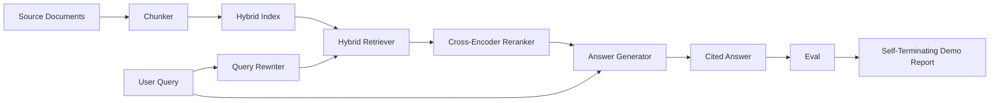

# 终端到终端的RAG系统

> 六个组件课程,一个管道,一个评估循环,一个自动终结的演示.这是你发送的系统.

> **【中文解读】**本课把64-68 五课组件接入一个完整流水线:分块 → 混合索引 → 查询改写 → 交叉编码器重排 → 带引用的答案生成,再使用第68课的六个指标评价给整条系统打分.核心论证方法是"集成对孤立":只有当集成后的指标全面超过各组件孤立演示的成绩时,系统计算才被证明.演示自闭断取固定语料,运行固定查询值,按设置退码,可以直接使用CI 冒险测试.

> **【拓展：RAG 路线终点→生产形态】**这条 64-69 路线应对生产RAG 系统的标准架构:人类的上下文检查 (文本检索) 文章讲的正是"分块时给每块补充下文 + BM25 与密向量混合 + 重排序"这个组合.本课的模仿 生成器不能幻觉(只复述检索文本),这恰好隔离检索端的变化;在生产中换 LLM 之后,忠诚指标就成为守幻风险的门.

>  **【前置】**学本课前请先掌握:(1) 阶段11 · 06(RAG 基础) 与 · 10(评测框架);(2) 阶段19 轨道B 基础(20-29 课);(3) 本路线64-68 五课分块、混合检索、重排序、查询改写、评测

**Type:** Build | **类型:** 动手构建
**Languages:** Python | **语言:** Python
**Prerequisites:** Phase 11 lessons 06 (RAG), 10 (evaluation); Phase 19 Track B foundations (lessons 20-29); Phase 19 lessons 64, 65, 66, 67, 68 | **前置知识:** Phase 11 · 06（RAG）、10（评测）；Phase 19 Track B 基础（20-29 课）；Phase 19 · 64、65、66、67、68
**Time:** ~90 minutes | **时间:** 约 90 分钟

## 学习目标
- 组建一个单个端到端管道,
  中文翻译:把分块器、混合检索器、查询改写器、交叉编码器 重排器和答案生成器组装成一条端到端流水线──
- 执行一个答案生成器, 引用其要求的断片, 拒绝对低信心的回归.
  中文翻译:实现一个按分块点引用论断的答案生成器,并带低信心拒绝回复.
- 通过对合组管道进行第68课程评估, 证明每个测量量量度的阶段构建在同一组件上单独获胜.
  中文翻译:对组装好的流水线跑第68课的评测,证明分阶段的构建在每个标志上都胜过同样的组件的孤立版本.
- 建立一个自动终结的CLI演示,它吞了一个固定器件,运行一个固定查询集,并以总结报告离开零.
  中文翻译:构建一个自终止的CLI演示:摄取固定语料、跑固定查询集、输出摘要报告并以零退出码结束──

## 问题 问题引入

> **【中文解读】**本节论证"集成测试才是真正的测试":组件在孤立基准上赢不代表系统会赢分块器赢回忆@5 但检查器排不动它产生的块;重排器在合成候选池上提升MRR但在真实双编码器候选中失败;改编器在一个查询上提升、在下一个条中崩──唯一可信的证据是整条流水线对同一标题的qrels、同一套指标的端到端成绩.

六个单独的组件都没有证明任何事. 克可以在回忆@5上赢得对象,而在系统回忆@5上输掉,因为回收器无法排名克所发射的东西. 重新排名器可以在合成候选人池上提升MRR,而在真正的双编码候选人上失败,因为重新排名预算中的双编码者召回量太低. 查询重写器可以在一个查询上推广黄金文档,然后在下一个查询上打破,因为LLM模拟返回了退化假设.

> 孤立的六个组件什么也证明不了――分块机可以在语料上赢得回忆@5,但在系统回忆@5上输掉因为检索机排不动它产生的块――重排机可以在合成候选池上拉高MRR,但在真实双编码机候选中失败因为双编码机在重排预算内召回率太低――查询改编机可以在一个查询上把金标上,但在下一个文章上崩因为LLM模拟 返回一个退化假设文档――

整合测试是整个管道的终端运行,与相同的固定式,同样的测量,一个管弦器文件,将所有东西连接在一起.这就是这个课程的构建.如果整合管道的测量量超过每个阶段的单独演示的测量,你已经证明了系统.

> 集成测试就是从端到端地对同一个固定的线程进行,并由一个连接的编排器文件完成. 本课程的构建就是它. 如果集成流线的指标超过每个阶段的单独演示指标,你就证明了这个系统.

## 概念的核心概念

> **【中文解读】**流水线是一个小图:每个阶段都是一个签名清晰的函数,`Pipeline`类持有五个阶段并按顺序执行.签名稳定是可组合的前提.任何阶段都可替换,流水线照跑.



### 电缆选择

管道是一个小图,每个阶段都是一个有明确的签名的函数.

> 流水线是一个小图. 每个阶段都是一个签名清晰的函数.

| Stage | Input | Output |
|-------|-------|--------|
| Chunker | Document text | List of Chunk records |
| Retriever | Query string | Top-N Chunk records |
| Rewriter (optional) | Query string | List of rewrites + hypothetical |
| Reranker | Query, candidates | Top-K Chunk records with cross scores |
| Generator | Query, top-K Chunk records | Answer string with citations |

只有一个字符,每一个字符都稳定.`Pipeline`课程包含五个阶段,`query`每个阶段都可交换:通过不同的器,检索器,重写器,重排器或发电机,

> 每个签名都稳定,组装就直截了当.`Pipeline`类有五个阶段,一个按顺序执行它们.`query`方法──每阶段都可替换:传入不同的分块器、检索器、改写器、重排器或生成器,流水线照跑──

### 答案生成器

> **【中文解读】**生成器是最容易坏的环节之一. 本课的确定性模拟 生成器:从重排后的顶-K 里选至多两个与查询内容代币重叠最高块,逐句拼接成答案,每句后跟.`[doc_id:chunk_index]`点;没有任何块的重叠超过拒答值就输出"我不知道"且不带引用.

课程中,一个决定性模拟生成器:

> 生成器是最后一个阶段,也是最容易坏的一个.

1. 取了K级重排的部分.
   中文翻译:取重排序后的顶部K 分块──
2. 选择最多两个部分,其文本包含最高内容标记与查询重叠.
   中文翻译:选出多至两个文本与查询内容代币 重叠最高的分块──
3. 发出一个答案,是从每一个选定的部分中连接一个句子,每个句子都会被一个句子所接下来.`[doc_id:chunk_index]`着.
   中文翻译:输出答案是"每个选中分块各取一句"的拼音,每个句子后面跟一个`[doc_id:chunk_index]`点──
4. 如果没有一块超过垃圾门,则发出"我不知道"没有引用.
   中文翻译:若没有任何分块的重叠超过拒答值,输出"我不知道"且不带引用.

在制作中,你用提示模板换取真实LLM电话:

> 生产中把模仿 换成真实 LLM 调用,提示词模板如下:

```
You are answering a question using only the snippets below.
Cite every claim with the anchor in parentheses.
If the snippets do not answer the question, say "I do not know".

Question: {query}

Snippets:
{enumerated chunks with anchors}

Answer:
```

拒绝对低信心的路径是跨编码器级-1分数记录的全部原因.如果它位于体积门以下,发电机拒绝.这是对幻觉答案的安全门.

> 低信度拒绝答案的路径正是交叉编码器第1名分数被记录的全部原因. 如果它低于语料值,生成器就拒绝答案.

### 自我灭绝的演示

> **【中文解读】**演示就是CI冒烟测试的形状:印单条查询的分阶段明细、对四条固定的qrels 跑评测、印标;全部第68课标达到演示设定的值则退码为0,任一指标低于值则非零退出并指标失败指标──离线、快速、确定性;在固定上刻意收紧,六课中任何一个部分的回归都会挂演示.

演示程序运行一切,以结束.它打印一个查询的阶段分类,运行四个固定式 qrels的 eval,打印一个指标表,如果所有课程68指标都符合演示中设定的门值,则出局状态为零.如果任何指标都低于门值,则演示程序将以非零状态和一个命名失败指标的消息出局.

> 演示端到端跑完一切――它打印一条查询分阶段明细,对四条固定的列表 跑评测,打印标签;如果第68 课的全部标志达到演示设定的值,就以状态码 0 退出――任一标志低于值,演示就非零退出并给出指名失败标志的消息――

通过测试,我们可以看到一个测试的结果, 测试的结果是这样的. 测试的结果是这样的. 测试的结果是快速的,快速的,决定性的. 值是故意紧张的,

> 这就是CI 冒烟测试的形状――流水线离线、快速、确定性运行――值在固定上刻意紧紧,六课中任何一个回归都会让演示失败――

```figure
rag-pipeline-flow
```

## 动手构建

> **【中文解读】** `code/main.py`组装全部五阶段:`Chunk`记录整个过程;`Chunker`选64课的策略;`HybridIndex`打包 65 课的BM25+密+RRF;`Rewriter`从 67 课程的 HyDE/多查询/分解中按查询长度和连词情况选择一;`Reranker`是66课的交叉编码器(缩小训练集以便秒级收);`Generator`是带引用与拒绝答的模仿.

`code/main.py`执行:

> `code/main.py`实现:

- `Chunk`- 经过所有阶段进行的记录 (通过一个chunk_index和源doc_id扩展了第64课的形状).
  翻译: 中文`Chunk`通过所有阶段的记录在64课程的形状上扩展了chunk_index和源 doc_id)
- `Chunker`-从第64课中选择一个策略 (默认递归分区).
  翻译: 中文`Chunker`选用64课的策略
- `HybridIndex`- 课65的BM25+密集+RRF包.
  翻译: 中文`HybridIndex`打包 65 课的BM25 + 密向量 + RRF──
- `Rewriter`(可选) - 选择一个HyDE,多查询,按查询长度和连接存在,从67课程分解.
  翻译: 中文`Rewriter`根据查询长度和连词情况,从67课程的HyDE、多查询、分解中选择一──
- `Reranker`- 训练有素的交叉编码器,从第66课中,具有较小的固定训练集,
  翻译: 中文`Reranker`66 课训的交叉编码器,配更小的固定 训练集以便在几秒内收。
- `Generator`- 具有引用和低信心的决定性假设生成器.
  翻译: 中文`Generator`带引用与低信任拒绝答案的确定性模拟 生成器
- `Pipeline`- 组建五个阶段`query(question)`返回方法`Result(answer, top_k, latency_ms_per_stage)`现在,我们要去.
  翻译: 中文`Pipeline`组装五阶段,`query(question)`方法返回`Result(answer, top_k, latency_ms_per_stage)`,我知道.
- `run_demo()`- 摄入体积,执行三个固定查询,执行评估,打印结果,按门设置出口代码.
  翻译: 中文`run_demo()`摄取语料、跑三条固定查询、跑评测、打印结果、按值设定退出码──

运行它:

> 运行:

```bash
python3 code/main.py
```

输出是打印一个查询痕迹,完整的评估表,以及最后的通过/失败状态. 返回出口代码0在固定.

> 输出是一条印出的查询痕迹,完整评测表和最终通过/失败状态.

## 失败模式演示将掩盖失败模式

> **【中文解读】**五个演示掩盖不了的坑:分块边界漂移(qrels 标签与演示之间换分块策略会让金标 id 对不上把策略锁进qrels 文件,演示头部写明分块器);重排训练集泄入评测(严格隔离评测查询,本课刻意让二者不相交);mock 生成器掩盖复觉风险(它只会改变检查文本,无法想象生产真模型);流量输出答案(层标只影响最终字符串,不会影响正确性);延迟离线mock常数时间,真实 LLM调用占据大头,按域规划调节预算指标)

**Chunker boundary drift.**如果您在 eval qrels标签通过和演示中交换了 chunker 策略,黄金文档ID不再排列. 锁定了 chunker 策略在 qrels 文件中.演示包含一个标题,以标题的 chunker.

> **分块边界漂移。**如果在图标轮和演示之间进行分块策略的交换,金标档 id 就对不起了.

**Reranker training set leaks into the eval.**在课66中,14个训练三重中包含类似于评估查询的查询.在制作中,严格地进行评估查询.演示的评估查询是故意与重排训练集分离的.

> **重排序训练集泄入评测。**66 课程的14个训练三元组包含与评测查询相似的查询――生产中必须严格隔离评测查询――演示的评测查询与重排训练集刻意不相交――

**Mock generator hides hallucination risk.**假冒不能幻觉,因为它只发出来自检索的部分的文字.

> **mock 生成器掩盖幻觉风险。**模仿无法想象,因为它只输出检查分块中的文本. 本课指出这一点,并把生产替代路径指向真模型.

**No streaming.**管道在每个阶段结束时返回完整的答案.一个生产系统将流出发电机的输出.流出是不适用的;答案级的指标在最后的字符串上无论是如何工作.

> **无流式输出。**流水线在每个阶段结束时返回完整答案――生产系统会流式输出生成器结果――流式超出本课程范围;无论如何,答案层标志都作用于最终字符串――

**Latency is offline.**假 LLM 电话是持续时间.真正的 LLM 电话占主导地位. 在请求范围内规划延迟预算;课程的每个阶段时间仅仅衡量CPU工作.

> **延迟是离线的。**实际的LLM 调用占大头 在请求范围内规划延迟预算;本课分阶段计时只量度CPU工作

## 运用它,生产实践.

生产模式:

> 生产实践模式:

- 通过一个管道导体,将管道文件运送到一个管道导体下,并使用明确的舞台接口.
  中文翻译:把流水线放进单个编排器文件,接口显式――不要把接线散落全仓库――
- 如果评估下降, 合并不会降落.
  中文翻译:每次碰到某个阶段的合并前都跑评测――评测掉了,合不落地――
- 按CI运行的指标追踪保持,以便您可以将回归归归因于阶段交换.
  中文翻译:按CI运行持久化指标轨迹,以便把归归归归归归归某次阶段替换.
- 加入一个由20个查询 (回归集的子集) 组成的烟集,该集在30秒内运行;全回归集每晚运行.
  中文翻译:加一个20条查询的冒烟集,30秒内跑完;完整回归集每晚跑了──

## 运送它.

在本课程中,管道文件是19期F轨道课程的其他部分课程所承受的形状.随后的课程将增加摄入自动化,增量重新索引,远程测量和服务层.查询,重新排名,重写和评估的部分在这里完成.

> 本课程流水线文件是19期轨道F后续课程假定的形状.后续课程将根据此加载自动化,增加重索引,遥测和服务层.

## 练习题

1. 在重写器内添加一个每查询策略选择器:从67课中 (长度,连接,语法比) 选择HyDE,多查询或分解.
   中文翻译:在改写器内加按查询选择策略的选择器:用 67 课的启发式 (长度,连词,术语占比) 在 HyDE,多查询或分解之间挑选――
2. 加入一个真正的LLM电话来发电机后面的 env旗. 默认的模拟. 测量延迟三角形.
   中文翻译:在环境开关后面给生成器加真实 LLM调用,默认用模拟,度量延迟差──
3. 扩展演示,以进行一个`--corpus path`检查和值检查.
   中文翻译:给演示加 `--corpus path`参数以加载真语料,重跑评测和值检查
4. 添加一个`--strategy`测量每个战略对端到端召回的贡献.
   中文翻译:给分块器加`--strategy`参数,衡量每种策略对端到端召回率的贡献.
5. 添加一个流通生成器接口,然后将其输入到 eval 中. 确认信任是计算在最后的字符串上,而不是在流通的前.
   中文翻译:加流式生成器接口并接入评测,确认忠实度在最终字符串上计算而非流式前──

## 关键词 快速查找表

| Term | What people say | What it actually means | 中文术语 |
|------|-----------------|------------------------|----------|
| Pipeline | "RAG pipeline" | The composed stages from ingestion to cited answer | 流水线 |
| Citation anchor | "Source link" | The (doc_id, chunk_index) reference attached to each claim | 引用锚点 |
| Refuse-on-low-confidence | "I do not know" | Generator returns no answer when the reranker top-1 score sits below threshold | 低置信度拒答 |
| Smoke set | "CI eval" | The minimal qrels subset that runs in every PR check | 冒烟集 |
| Stage interface | "Function signature" | The stable input and output type of each pipeline stage | 阶段接口 |

## 继续阅读 继续阅读

- [Anthropic, Building search and retrieval](https://www.anthropic.com/news/contextual-retrieval)
  中文翻译:人类 上下文检索生产级检索增强的技术文章。
- [Pinterest, MCP internal search](https://medium.com/pinterest-engineering)- 参考生产架构
  中文翻译:Pinterest 工程博客生产架构参考。
- [Ragas: Automated Evaluation of RAG Pipelines](https://docs.ragas.io)
  中文翻译:拉加斯自动化RAG流水线评测框架的官方文档。
- 第十一阶段第六课 - RAG基本面
  中文翻译:第11阶段 · 06RAG 基础。
- 第19阶段课程 64-68 - - 这里所组成的组件
  中文翻译:阶段19 · 64-68本课组装的组件──
