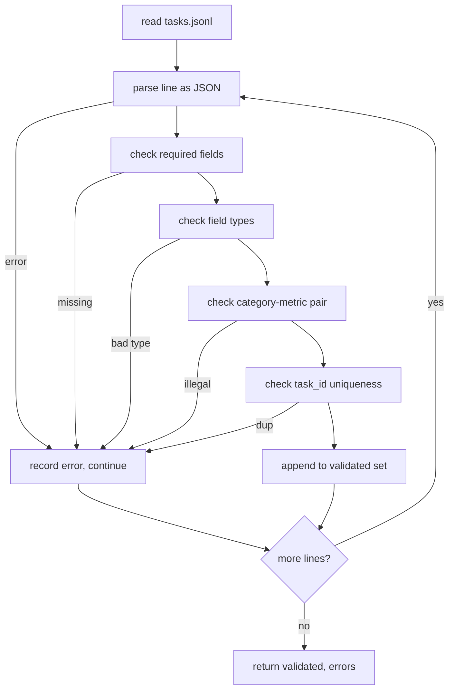

# 任务规格格式

> 评估工具只能像合同任务一样有效. 在写一个分数函数之前,冷JSONL形状和计量词汇.

> **【中文解读】**本课是评测系统路线 (70-75) 第一个课:在写任何打分函数之前,先结任务的JSONL 形状和标志词表.一个评测线束的上限由其任务遵守的契约决定算术,多选,代码执行,分类,摘要五类任务共享一种记录形状,标志词表封闭,校验器把坏记录在运行器之外.这是后面的71经典标志) 、72代码执行标志) 、75 号码运行器端到端) 共同遵守的地基.

>  **【前置】**学本课前请先掌握:阶段19 轨道B基础(20-29 课) 特别是其中的验证门控与固定任务设计;本课不依赖于任何调用模型,纯标准库――

**Type:** Build | **类型:** 动手构建
**Languages:** Python | **语言:** Python
**Prerequisites:** Phase 19 Track B foundations | **前置知识:** Phase 19 Track B 基础
**Time:** ~90 min | **时间:** 约 90 分钟

## 学习目标 学习目标

- 定义一个包含算术,多选项,代码执行,分类和单形自由文本总结的JSONL任务记录方案.
  中文翻译:定义一个JSONL 任务记录方案,使用相同的形状覆盖算术、多选、代码执行、分类和自由文本摘要。
- 关闭一个密码名字词汇,以便下游课 (71-73) 可以在一个领域发送.
  中文翻译:钉死一个封闭的标标名词表,让下游课程(71-73) 只按单个字段分发──
- 指定一些拍摄的例子和后处理规则作为任务的一部分,而不是运行者,因此相同的提示在模型中产生相同的目标.
  中文翻译:把少样本示例和后处理规则写成任务的一部分而不是运行器的一部分,让相同提示词在不同模型上产生相同的目标.
- 执行一个严格的验证器, 拒绝错误记录,
  中文翻译:实现严格校验器,在坏记录到达运行器之前就拒绝它.
- 发送一个10任务的配件组, 运行规格的每个分支,
  中文翻译:交付一个10任务的固定集,走遍规格的每个分支,让校验器有真实的东西可──

```figure
ci-task-spec-gate
```

## 为什么要结论规则?

> **【中文解读】**本节给出动机:研究代码库积累评测脚本的速度快过积累测试,半年后每笔记本一套JSON形状、每一个标志被实现两次、跨运行无法比较──解法无聊但有效:定制一个方案、写一个校验器、拒绝其余一切──设计借镜大板、HELM、lm-eval 风格的线束,但字段名为本课本身 每个段都有唯一属性,流水线中任何段都不可变的.

一个研究代码库会积累评估脚本比测试积累更快.六个月后,每个笔记本都有自己的JSON形状,每个指标都被重新实现了两次,并且没有什么可以在运行中比较.修复是无聊的.选择一个方案.写一个验证器.拒绝其他一切.这就是这个课程所做的.

> 研究代码库积累评测脚本的速度快过积累测试――半年后,每个笔记本都有自己的JSON形状,每个标志被实现两次,没有什么可以跨运行比较――修复方法很无聊:选择一个方案,写一个校验器,拒绝其余一切――这就是这门课所做的.

形状借鉴了来自大板,HELM和lm-eval风格的带,但场地名称是我们的.每个场地都有一个主人.跑者读取任务.测量器读取目标.后工艺步骤正常化了生成.没有场地是可变的中管线.

> 这种形状借镜了大,HELM 和 lm-eval 风格线束的思路,但字段名是我们自己的.

## 记录形状的记录结构

> **【中文解读】**一个任务就是一个行 JSON对象`tasks.jsonl`并逐行独立校验 一行坏了只停止该记录,不停止整个运行.

任务是一个单行JSON对象.`tasks.jsonl`坏行取消了记录,而不是运行.

> 一个任务是单行一个JSON对象.`tasks.jsonl`不逐行独立校验. 一行坏了. 暂停了记录,不暂停了整个运行.

```json
{
  "task_id": "arith_001",
  "category": "arithmetic",
  "prompt": "Compute the result. Question: 17 + 24\nAnswer:",
  "targets": ["41"],
  "metric_name": "exact_match",
  "few_shot_examples": [
    {"prompt": "Question: 2 + 2\nAnswer:", "completion": "4"}
  ],
  "post_process": "strip_whitespace",
  "metadata": {"difficulty": "easy"}
}
```

要求的领域是`task_id`现在`category`现在`prompt`现在`targets`现在`metric_name`现在`post_process`现在,我们要去.`few_shot_examples`其他`metadata`无知的顶级字段未能验证.

> 必须填字段是`task_id`,我知道.`category`,我知道.`prompt`,我知道.`targets`,我知道.`metric_name`,我知道.`post_process`,我知道.`few_shot_examples`和 `metadata`可选──未知顶层字段校验失败──

## 场规则 字段规则

> **【中文解读】**字段规则的核心是"类别约束指标":`code_exec`任务必须配备`metric_name = code_exec`没有任何`mcq`必须配`exact_match`加单字母目标──指标词表封闭为六个(精确_匹配、f1、蓝_4、红_l、精确、代码_执行) 加新指标必须开新课并在词表里加条目──少打上限 8 条;后处理规则六选一、不许组合──

`task_id`验证器将文件的独特性强制执行.

> `task_id`是不含空白字符的字符串──校验器在整个文件范围内强制唯一──

`category`是一个`arithmetic`现在`mcq`现在`code_exec`现在`classification`现在`summary`类别限制了哪个计量和后处理对是合法的.`code_exec`任务必须使用`metric_name = code_exec`其他`mcq`任务必须使用`metric_name = exact_match`针对一个单字母的目标.

> `category`是 `arithmetic`,我知道.`mcq`,我知道.`code_exec`,我知道.`classification`,我知道.`summary`之一──类约束哪个"指标+后处理"组合是合法的:`code_exec`任务必须用`metric_name = code_exec`其他`mcq`任务必须用`metric_name = exact_match`为了单字母目标.

`prompt`验证器禁止后续白空间,并且拒绝已经包含一些弹的区块的记录.

> `prompt`是非空字符串──校验器禁止尾部空白,并拒绝即时 正文里已含有少量样本块的记录──少量样本染发生在运行器上,不在作者侧──

`targets`是一个不空的字符串列表.`exact_match`任何相匹配的元素都会被计算出来.`f1`其他`rouge_l`获得最高分的目标赢得了.`mcq`列表包含一个元素.

> `targets`是非空字符串列表.对.`exact_match`任一元素命中即算;对`f1`和 `rouge_l`实现最高目标;对`mcq`列表恰好一个元素.

`metric_name`是一个`exact_match`现在`f1`现在`bleu_4`现在`rouge_l`现在`accuracy`现在`code_exec`词汇库关闭,一个新的指标需要一个新的课程和一个新的入口.

> `metric_name`是 `exact_match`,我知道.`f1`,我知道.`bleu_4`,我知道.`rouge_l`,我知道.`accuracy`,我知道.`code_exec`之一──词表是封闭的──新标志需要新课和新条目──

`few_shot_examples`是一个列表`{prompt, completion}`验证器将列表封闭在8个条目,以保持提示的边界.

> `few_shot_examples`是 `{prompt, completion}`对的列表.校验仪将列表的上限压到8条,以约束提示词长度.

`post_process`是一个`none`现在`strip_whitespace`现在`lower`现在`extract_letter`现在`extract_code_block`现在`extract_first_line`每个规则都有一个单独的确定性行为.验证者禁止结合规则.

> `post_process`是 `none`,我知道.`strip_whitespace`,我知道.`lower`,我知道.`extract_letter`,我知道.`extract_code_block`,我知道.`extract_first_line`之一. 每条规则只有单一确定行为.校验器禁止组合规则.

## 验证器行为

> **【中文解读】**校验器返回两个列表:通过记录,以及带行号"",违规"",出错字段的错误记录"",运行器在错误列表非空时拒绝启动,除非显而易见传输`--allow-bad-tasks`"失败快速+精确指认"是评测基础设施的基本功能的



验证器返回两个列表:验证记录和错误记录,违反行,违反规则和错误字段.如果错误列表不空,运行者拒绝启动,除非明确`--allow-bad-tasks`旗已经设置.

> 校验器返回两个列表:通过记录;带出错行号、违反规则和出错字段的错记录――错列表非空时运行器拒绝启动,除非显然设置`--allow-bad-tasks`开关.

## 几次转载.

> **【中文解读】**染色和后处理都被收录到规格层:染色由运行器统一拼拼接 服务所有模型,方差来源只剩下模型本身;作者只写示例一次,不是每个提供者 写──后处理在生成后一次、标志之前运行,确定性、无状态、不允许组合──

运行者将一些拍摄的例子连接到提示前,用空行分离器.每个模型都运行相同的代码路径,因此唯一的差异来源是模型本身.作者每一个提供商都会写一次,而不是一次.

> 运行器把少样本示例拼接在提示之前,中间以空行分隔. 运行每个模型的代码路径相同,因此唯一的差异来源是模型本身. 作者把示例写一次,而不是每个提供者写一次.

```python
def render(task):
    parts = []
    for ex in task.get("few_shot_examples", []):
        parts.append(ex["prompt"] + " " + ex["completion"])
    parts.append(task["prompt"])
    return "\n\n".join(parts)
```

## 后处理规则

后流程步骤是次世代,是次数前的.

> 后处理步骤在生成后,标志在运行之前.

- `none`返回链接没有变化.
  翻译: 中文`none`开始回来字符串.
- `strip_whitespace`带领和后续的白色空间.
  翻译: 中文`strip_whitespace`离开首尾空白.
- `lower`下了弦.
  翻译: 中文`lower`把字符串转小写.
- `extract_letter`返回匹配的第一个字符`[A-E]`用于 MCQ.
  翻译: 中文`extract_letter`返回第一个匹配`[A-E]`的字符,用于多选题──
- `extract_code_block`返回用于代码执行的第一个三杆后围块的体体.
  翻译: 中文`extract_code_block`返回第一个3反引号围绕代码块的主体,用于执行代码.
- `extract_first_line`返回用于总结分类的第一个非空行.
  翻译: 中文`extract_first_line`返回第一个非空行,用于摘要分类.

需要一个规则的任务属于新课程.

> 需要这个清单之外的规则任务,应该放进一个新课.

## 什么这个课程不做

没有得分,没有调用模型,没有运行代码.这些都在71,72和75课中.

> 本课不评分,不调模型,不运行代码,在71、72、75课中结论的是,它们都必须遵守协议.

验证器传递所有10项. 单独的固定器 (`tasks_bad.jsonl`) 打开每一个规则,验证器返回了完全相同的错误.

> 10条任务的固定 覆盖两条算术、两条多选、两条代码执行、两条分类、两条摘要――校验器在全部10条上通过――另一个固定`tasks_bad.jsonl`通过每条规则,校验器回来了恰好那么多错误.

## 如何读代码

`main.py`定义`TaskSpec`现在`validate_task`现在`validate_file`设备装载器是`load_fixtures`染和后处理辅助器在验证旁边,所以第75课的运行者进口了单个模块.

> `main.py`定义`TaskSpec`,我知道.`validate_task`,我知道.`validate_file`和 CLI 入口──固定加载器是`load_fixtures`染和后处理辅助函数就放在校验旁边,让75个课程的运行器只需要导入单个模块.

阅读`main.py`读一读.`code/tests/test_spec.py`测试标记了每个验证规则和后流程行为.`main.py`验证捆绑的装置并打印总结.

> 从头到尾读`main.py`然后读`code/tests/test_spec.py`测试钉死每条校验规则和每次处理行为.`main.py`底部的演示校验自带的固定并打印摘要──

## 我们要走得更远.

> **【中文解读】**结尾态度值得记住:像对待数据库迁移一样对待规格变化加类别必须同时加标标签、后处理规则和至少一个固定任务;每次变化都经过评审、有版本、带测试──校验器就是那门──

实际的评估套件就像计划一样增长列列的类别.清醒的举动是拒绝添加一个类别,而不添加一个指标,一个后过程规则和至少一个固定任务.把规格看作数据库迁移.每个变化都会被审查,版本化,并伴随着测试.本课中的验证器是门户.

> 真正评测套件长类的方法,就是方案长列的方式.清醒的做法是:拒绝只加类而不同时加一个指标,一条后处理规则和至少一个固定任务.
