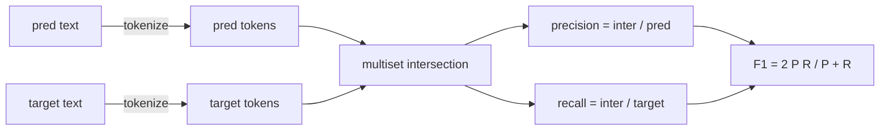
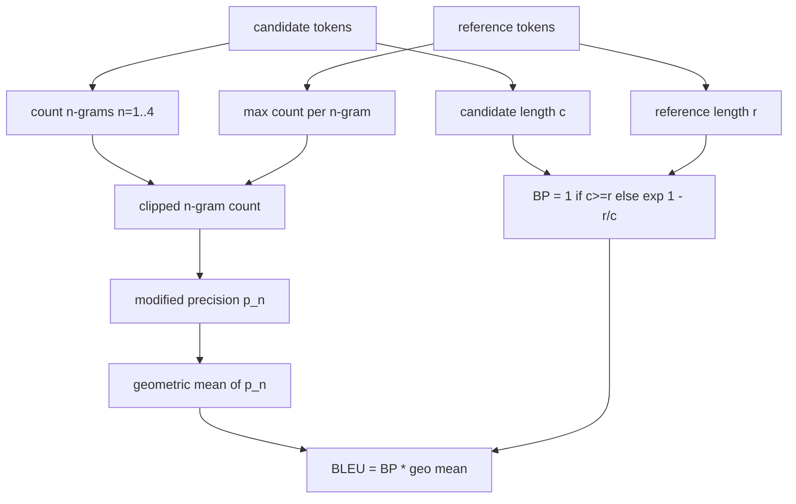

# 经典指标

> 蓝色,红色,F1,精确匹配,精确性.五个指标仍然占据了大多数发表的LLM评估数字.从第一原则实施每个,这样你知道数字意味着什么.

> **【中文解读】**本课程将在文献中最常见的五个LLM评价指标BLEU、ROUGE-L、F1、精确匹配、精确率全部从第一性原理实现一遍遍──目的不是制造轮子,而是让你能够指代说"分词器在哪一行决定、平滑在哪一行施加",从此阅读文中指标数字不再困惑──全部实现只依赖于标准加量,并与70课程的 метри_名字段对接入单一分发入口.

> **【拓展：指标分层→经典地基与模型层】**评测指标分为两层:本课的经典层面重叠:n-gram、LCS、代码 集合)快、可审计、可复现,但奖励字面重合、漏掉语义;模型层面(BLEURT、BERTScore、GEval) 与神经网络度量语义相似,但引入模型偏差与复现成本――工程惯例是先钉死经典层作为地,再在上面叠加模型层两层背离时,恰恰暴露了"表面但语义不同"的样本――

>  **【前置】**学本课前请先掌握: 1) 70 课) 任务规格格格式) 本课的分发器按其计量_名称 字段分发; 2) 基础组合数学 (几何平均) 与动态规划概念ROUGE-L 的 LCS 表将使用到。

**Type:** Build | **类型:** 动手构建
**Languages:** Python | **语言:** Python
**Prerequisites:** Phase 19 Track B foundations, lesson 70 | **前置知识:** Phase 19 Track B 基础；70 课（任务规格格式）
**Time:** ~90 min | **时间:** 约 90 分钟

## 学习目标 学习目标

- 实现令牌级别的精确匹配,F1和准确性,并遵守明确的令牌规则.
  中文翻译:用显式的分词规则实现代币 级精确匹配、F1 和准确率──
- 实现BLEU-4从头开始:修改的 n-gram精度, n 超过 n 的几何平均值等于 1 到 4,短暂处罚.
  中文翻译:从零实现BLEU-4:修改版 n-gram 精确率、n=1.4 的几何平均、短句惩罚。
- 使用最长的常见次序,执行ROUGE-L,使用F-beta精度和召回组合.
  中文翻译:用最长公共子序列实现ROUGE-L,以F-beta组合精确率和召回率――
- 通过第70课的 metric_name 字段,让跑步者保持了不了解测量.
  中文翻译:按70 课的指标_名字 字段分发,让运行器对标志保持无关.
- 通过从工作实例中取出的参考向量,而不是第三方图书馆,将行为固定.
  中文翻译:使用手工演算的参考向量钉死行为,而不是依赖第三方库.

```figure
cd-bleu-overlap
```

## 为什么要重新实现

> **【中文解读】**"BLEU 28.3 和 BLEU 0.283 哪个大""两个库的红色-L 为什么差十分"这种困惑的根源是指标实现藏在看不见的默认值中分词,大小写,平滑) .自己写一次,钉住每条规则,是指标数字从黑盒变成可读配置的唯一途径.

您将阅读报告BLEEU 28.3的论文,另一个报告BLEEU 0.283. 两本图书馆之间,你会发现ROUGE-L分数差异10分,因为一个分数缩小到小字母,而另一个分数没有. 最快的方法是自己写出指标,然后指向标记器决定的行线和滑滑的行线. 之后,在文件中比较数字成为阅读标准设置的问题,而不是争论图书馆.

> 你会读到BLEU 28.3的论文,也会读到BLEU 0.283的论文. 你会发现两个库的ROUGE-L 分数差距十分大,因为一个截转小写,另一个不转.

蓝色是计算和.红色是动态编程.F1是代币的交叉路口.最困难的部分是选择代币和承诺它.

> 标准库加numpy就够了.BLEU是计数加一个制.ROUGE-L是动态规划.F1是标志上集合交集.

## 标志化

> **【中文解读】**分词器是本课唯一的全局决定:小写,`\w+`连串、丢标点,所有标志共享,运行器无权换――换分词器就是换基准分词器是契约,不是旋──生产环境需要另议CJK、缩写、代码标识符──

标记器是`re.findall(r"\w+", text.lower())`微字,字母数,字母分数,字母分数.这个课程中的每个指标都使用了这个标记符号. 运行者没有选择.如果你换代码符号,你会运行一个不同的基准.

> 分词器是`re.findall(r"\w+", text.lower())`转小写、字母数字连串、丢标点──本课中的每个标志都用同一个分词器,运行器无权选择──换分词器,你跑的就是另一个基准──

```python
TOKEN_RE = re.compile(r"\w+", re.UNICODE)
def tokenize(text):
    return TOKEN_RE.findall(text.lower())
```

产品设置将关心CJK,缩写和代码识别器.课程的重点是,代币化器是合同,而不是一个按.

> 简单化,简单化,简单化,简单化,简单化,简单化,简单化,简单化,简单化,简单化,简单化,简单化,简单化,简单化,简单化,简单化,简单化,简单化,简单化,简单化,简单化,简单化,简单化,简单化,简单化,简单化,简单化,简单化,简单化,简单化,简单化,简单化,简单化,简单化,简单化,简单化,简单化,简单化,简单化,简单化,简单化,简单化,简单化,简单化,简单化,简单化,简单化,简单化,简单化,简单化,简单化,简单化,简单化,简单化,简单化,简单化,简单化,简单化,简单化

## 完全匹配.

```python
def exact_match(pred, targets):
    return float(any(pred.strip() == t.strip() for t in targets))
```

它每项任务返回1.0或0.0. 数据集中的总数是平均值.这是算术,MCQ和短分类任务的工作马.

> 每个任务返回1.0或0.0――数据集中的聚合值取平均――这是算术多选和短分类任务的主力指标――

## 标志级F1标志级F1

> **【中文解读】**代币级 F1 是 SQuAD 风格问答的标准分分:预测和目标各构建代币 多重集,交集除以预测长度精确率、除以目标长度召回率,调和平均成 F1;多目标任务取目标列表上最大值──它比精确匹配宽容(部分重叠有部分分),又比蓝色 简单(不看词序)──

设置预测和目标的代币多组.精度是预测的多组分为预测的多组分.回忆是目标的多组分为相同的交叉.F1是和平均值.实现处理空预测和空目标边缘情况.

> 为预测和目标各构建代币多重集──精确率 = 多重集交换除预测的多重集──召回率 = 同一交换除目标的多重集──F1是对方调和平均──实现处理空预测和空目标的边界情况──



对于多目标任务,我们将最好的F1取出目标清单上. 这与SQuAD类型的行为相匹配.

> 对于多目标任务,我们在目标列表中获得了最好的F1――这与文献中广泛报告的SQuAD风格行为一致.

## 蓝色-4

> **【中文解读】**BLEU-4 三件套:修改版 n-gram 精确率(候选人计数按"任一参考中最大计数"截断,防止靠重复短语刷分) 、n=1.4 精确率几何平均、短句惩罚(候选人比参考短就指数扣分) ‧平滑使用Lin-Och 方法 1(分子分母各加一),避免单个缺失 4-gram 把分数打到零BP──

蓝色是正规的机器翻译指标,它仍然在总结工作中出现.我们使用的公式是体积水平的蓝色4 (BLEU-4) 标准短暂处罚和添加-一平滑在修改的n-gram数量上,因此一个缺失的4gram不会推到零的分数.

> 蓝色是机器翻译的经典指标,如今仍存在摘要工作中. 我们使用的形式是语料级蓝色4:标准短句惩罚,加上修改版n-gram 计数的加一平滑,使单个缺失的4gram 不至于把分数压到零.

对于每个候选人参考对,我们计算了修改的 n-gram精度为 n等于 1, 2, 3, 4.修改的精度剪辑了候选人 n-gram的数量最大数量 n-gram在任何参考,因此一个候选人不能通过重复一个句子膨胀.四个精度的几何平均被简短处罚包裹.

> 对每一个"候选人参考"对,我们为n=1,2,3,4 统计修改版n-gram 精确率――修改版精确率把候选人数量按"该n-gram 在任一参考中最大数量"截断,候选人不能靠重复一个短语刷分――四个精确率的几何平均重包上短句惩罚――



顺规则是林和奥赫所谓的方法1:在取日记之前,在每个 n-克的精度中,加一个数量和命名器.`log 0`如果一个参考没有相匹配的4克,并且接近长期候选人的不平衡值.

> 平滑规则是林和奥赫所谓的方法1:在对比数之前,给每一个n克分母的分子和分母的精确率加一.它避免了参考中没有匹配的4克时.`log 0`长期候选人接近未平滑的值.

## 红色

> **【中文解读】**罗格-L 用最长公共子序列捕捉词序而不强制连续:LCS/参考长度=召回率,LCS/候选长度=精确率,F-beta(beta=1) 合成──动态规划 O(nm),摘要长度下毫秒级──它是默认的摘要指标,因为对词的插入删除不敏感──

红色-L比较了候选和参考代币序列的最长常见次序.LCS捕获了单词顺序,而不会强加连续性,这就是为什么它是默认的总结度.我们使用标准动态编程表计算LCS长度,然后将回忆取出为`lcs / reference length`精度如`lcs / candidate length`并且与F-beta结合,在Beta等于对称F1形式的Beta等于1

> 红色-L比较候选与参考代币序列的最长公共子序列――LCS在不强制连续的情况下捕捉词序,这正是它成为默认摘要指标的原因――我们使用标准动态规划表计算LCS长度,然后以`lcs / 参考长度`导出召回率`lcs / 候选长度`导出精确率,并以beta=1的F-beta组合成对称的F1形式──

```python
def lcs_length(a, b):
    n, m = len(a), len(b)
    dp = numpy.zeros((n + 1, m + 1), dtype=int)
    for i in range(n):
        for j in range(m):
            if a[i] == b[j]:
                dp[i+1, j+1] = dp[i, j] + 1
            else:
                dp[i+1, j+1] = max(dp[i+1, j], dp[i, j+1])
    return int(dp[n, m])
```

编号表使实现可读;纯 Python 列表也会工作.选择 ROUGE-L 的任务支付每项任务的 O(n m) 成本.对于典型的总结长度保持在毫秒以下.

> 选择 ROUGE-L 的任务为每个任务付出O(nm) 的成本. 对典型摘要长度,这保持在毫秒级内.

## 准确率

对于多目标分类任务,准确度降低到与单个标准化目标的完全匹配. 我们将其作为一个独立的功能,`metric_name`没有在跑者内部进行串串比较.

> 对于多个目标分类任务,准确率归类约是对单个归类目标的精确匹配.`metric_name`分发,而运行器内部不需要做字符串比较.

## 发送合同

> **【中文解读】**运输商对标志保持无关的关键:唯一入口`score(metric_name, prediction, targets)`返回 [0,1] 浮点数,运行器不分支、只转交并记录结果──72 课程的代码_执行器将以同样的方式插入这个表──

唯一的入口点是`score(metric_name, prediction, targets)`它回来了漂浮的.`[0, 1]`跑步者不会分类为测量名称.它将电话放弃并写出结果.这是第75课将粘贴到第70课任务规范的表面.

> 唯一的入口是`score(metric_name, prediction, targets)`,它回来了.`[0, 1]`区间的一个浮点数――运行器不按标签名分支,它把调用转交出去并写下结果――这就是75课程接到70课程任务规则上的那个面孔――

```python
def score(metric_name, pred, targets):
    if metric_name == "exact_match":
        return exact_match(pred, targets)
    if metric_name == "f1":
        return max(f1_score(pred, t) for t in targets)
    if metric_name == "bleu_4":
        return max(bleu4(pred, t) for t in targets)
    if metric_name == "rouge_l":
        return max(rouge_l(pred, t) for t in targets)
    if metric_name == "accuracy":
        return accuracy(pred, targets)
    raise ValueError(f"unknown metric_name: {metric_name}")
```

`code_exec`在第72课中处理,然后把它放进发射器中.

> `code_exec`在72课时处理,然后插入发射器.

## 什么这个课程不做

它不调用模型. 它不会将后流程规则70课程已经做的事情超越的几代人进行正常化. 它不计算信任间隔. 它不做BLEURT或BERTScore (他们需要模型,生活在不同的课程中). 问题是层面:五个指标,一个代币,一个发送表.

> 本课不调模型;不做70 课后处理规则之外的生成归结;不计算置信区间;不做BLEURT或BERTScore(它们需要模型,属于另一课) ⋅重点是打地基:五个指标、一个分词器、一个分分发表──

## 如何读代码

`main.py`根据标准的定义,每个指标是自由函数加上发射器.`_reference_examples`测试中,测试器使用了8个例子,并打印了每次测量分数.`code/tests/test_metrics.py`点参考向量,并强调每个边缘情况 (空预测,空引用,没有共享的代币,精确匹配,重复短语剪辑).

> `main.py`把每个指标定义为自由函数加分发器.`_reference_examples`块──演示对八个样本的跑分发发器并打印各个标志分数──`code/tests/test_metrics.py`里测试钉死参考向量,并压测每个边界情况(空预测、空参考、无共享代币、精确匹配、重复短语截断) 

阅读`main.py`函数按复杂性排序.精确_匹配和精度是每行一个线.F1是六行.BLEU和ROUGE-L是重部件,它们包含对平滑规则和LCS复发的详细评论.

> 从头到尾读`main.py`△函数按复杂度排序――精确_匹配和精确性 各一行――F1 六行――BLEU 和 ROUGE-L 是重头,附有关平滑规则和LCS 递推的详细注释――

## 我们要走得更远.

> **【中文解读】**经典指标奖励表面重叠、漏掉语义,是必要条件而不是充分条件──正确的顺序是:先让这五个运行并使用测试钉住,再在信任基后叠加模型层指标,

经典指标是必要的,不够的.它们奖励表面重叠和错失意义.解决方案是将基于模型的指标层放在顶部 (BLEURT,BERTScore,GEval) 一旦你信任了经典的地板.这是一个后来的课程.现在:让这五个工作,用测试结它们,你有一个可审计,快速和可复制的指标堆.

> 经典指标是必要条件,不是充分条件.它们奖励表面重叠,漏掉语义.修复方法是信任这个层经典基基之后,将基于模型的指标上.
