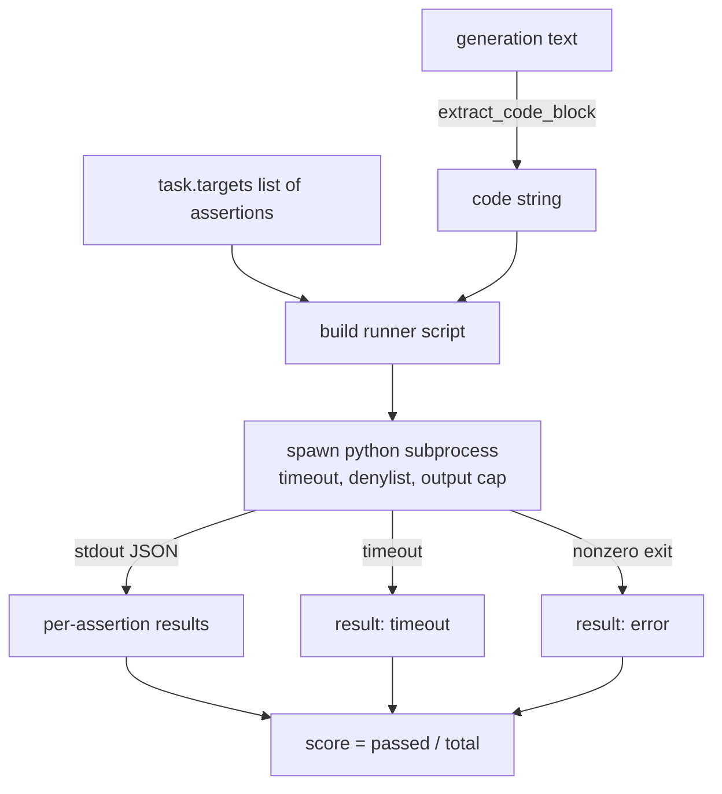
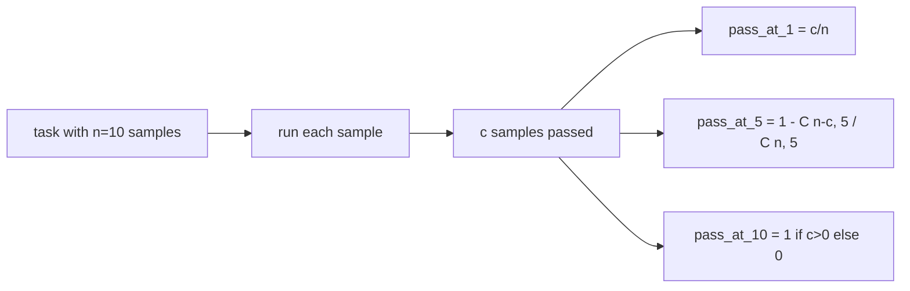

# 代码执行指标

> 通过测试,生成的代码是正确的. 评估带必须提取代码,运行它而不撞击主机,并诚实地计算通过率. 这一课构建了表面.

> **【中文解读】**本课给评测平台补充"代码执行"这个最后类指标:从自由格式生成中抽取代码块,在隔离过程中执行(挂钟超时 + 输出上限 + 导入拒绝列表),按"断言字符串通过比例"分分,并实现HumanEval 式的通过-k 无偏测.

>  **【前置】**学本课前请先掌握: 1) 70 课 任务规格格式) 代码_执行 任务的形状`extract_code_block`后处理规则`metadata.timeout_s`上限都定义在那里;(2) 71 课 经典标签) 本课以同样的分发契约把代码_exec 插入标签;(3) 基础的子进程与组合数概念(通过-k 用到C(n,k))

**Type:** Build | **类型:** 动手构建
**Languages:** Python | **语言:** Python
**Prerequisites:** Phase 19 Track B foundations, lessons 70 and 71 | **前置知识:** Phase 19 Track B 基础；70、71 课（任务规格与经典指标）
**Time:** ~90 min | **时间:** 约 90 分钟

## 学习目标 学习目标

- 通过与课70后过程规则相匹配的方式从自由形式生成中提取代码块.
  中文翻译:以与70 课后处理规则一致的方式,从自由形式生成中抽取代码块.
- 执行候选代码在一个孤立的子进程中,具有墙钟时间限,输出盖和进口列表.
  中文翻译:在隔离过程中执行候选码,配挂钟超时、输出上限和导入拒绝列表.
- 作为提供的断言字符串的分数,将任务分为对候选人的分数.
  中文翻译:把任务评分定为"给出的断言字符串在候选人通过的比例"――
- 计算一个模型中多个代人的任务的pass-at-k.
  中文翻译:为从同一模型采样多条生成的任务计算通过-k――
- 处理沙箱崩,语法错误和时间切断作为第一级失败模式,运行者可以登录的出口代码.
  中文翻译:把沙箱崩、语法错误和超时当作一等失败模式,配运行器可记录的不同退出码――

```figure
sandbox-runner
```

## 为什么要分离过程?

> **【中文解读】**内联`exec`两场灾难场景`while True: pass`卡死评测,`shutil.rmtree('/')`真删根目录决定候选码必须进入隔离子进程:代码走走了,结果走了,超时被杀了,宿主评测进程毫发无损.

> **【拓展：沙箱分级→从子进程到 microVM】**代码执行沙箱是一条频谱:进程内拒绝列表(最弱,可对抗代码绕过)→ 隔离子进程 + 超时 + 输出上限(本课,教学足够)→ Docker 容器(文件系统与网络隔离)→ gVisor/Firecracker microVM(最强,在线评测平台所使用) △本课明说拒绝列表只是、超时与输出上限的底层才是承担责任控制这个诚实的安全层判断的"万分无一失"宣传都值得学.

排列中的`exec`造成安全和稳定危险.`while True: pass`永远阻止了评估.`import shutil; shutil.rmtree('/')`解决方案是产生一个新的Python解释器,通过代码到Stdin,写出声明结果到Stdout,然后杀死该过程,如果它超越.主机评估过程继续运行.

> 内联`exec`是安全和稳定性隐患.`while True: pass`总是会给你一个评价.`import shutil; shutil.rmtree('/')`破坏力如它看起来的那样──修复方法是每个候选人都启动一个全新的Python解释器:代码经过stdin 传入、断言结果写到stdout、超时就杀过程──宿主评测过程继续运行──

实际的评估,如HumanEval,MBPP,BigCodeBench和LiveCodeBench都使用一个子进程沙箱.上面有一层Docker.我们停下来处理这个子进程的原因是:它便携式,它是stdlib,它捕获了对教育评估重要的故障模式.生产部署增加了Seccomp,网络隔离和只读取文件系统.下一个关于硬化生活的课程是除了这条轨道之外.

> 人类Eval、MBPP、BigCodeBench、LiveCodeBench 这些真实评测都用子进程沙箱,有些再叠加一层Docker──我们停在子进程这个层有理由:它可移植、纯标准库、能住教学评测在乎失败模式──生产部署会再加一段子、网络隔离和只读文件系统──关于加固的下一课不在这条路里──

## 代码执行任务的形状

> **【中文解读】**执行代码 任务把断言字符串放进`targets`关键设计是"失败也归归一化":子进程崩、超时、语法错误全部映射为退出码词表里的一项,线束永远得到相同的形状的结果,而不是被追踪 冒泡打断。

`code_exec`任务包含了声明字符串`targets`运行者从该代码中提取一个围的代码块,围绕它建立一个测试圈,然后运行结果.

> 一个`code_exec`任务把断言字符串放在`targets`里──运行器从生成中抽取代码块,围绕它搭建一个测试线束,然后运行结果──



结果是中小部分`[0, 1]`运行者无论失败如何都会返回相同的形状:子进程崩都会被映射到一个正常化的错误代码,而不是一个到带的Python追踪.

> 分数是`[0, 1]`区间的一个比例──三条断言过两条任务得到0.667──无论什么失败,运行器返回的形状都一样:子进程崩被映射为归结错误码,而不是冒泡到线束的Python追踪──

## 丹尼尔斯拒绝列表

> **【中文解读】**拒绝列表基于导入改写:危险模块(os.系统、子工艺、插座、类型、等) 的导入被替换为抛`ImportError("denied")`对于"沙箱"的过程,不存在坚定的对抗代码的拒绝列表是底,真正的重量是挂钟超时和输出上限.

在运行候选码之前,运行脚本将危险模块的进口重写到一个子上`ImportError("denied")`清单是故意保守的:`os.system`现在`subprocess`现在`socket`现在`requests`现在`urllib`现在`urllib.request`现在`urllib.error`现在`urllib.parse`现在`ctypes`现在`shutil`现在`http.client`现在`asyncio.subprocess`现在,我们要去.

> 拒绝列表基于导入.运行候选码之前,运行程序脚本把危险模块的导入改写成抛物.`ImportError("denied")`清单刻意保守:`os.system`,我知道.`subprocess`,我知道.`socket`,我知道.`requests`,我知道.`urllib`,我知道.`urllib.request`,我知道.`urllib.error`,我知道.`urllib.parse`,我知道.`ctypes`,我知道.`shutil`,我知道.`http.client`,我知道.`asyncio.subprocess`,我知道.

我们不假装这是弹药性. 确定对抗代码可以逃脱任何在过程中的沙盒在Python. 丹尼尔列表是一个后备. 墙钟时间和输出盖是承载控制.

> 我们不假装它是无一失败的. 坚定的对抗性代码可以逃出Python 里任何进程内沙箱. 拒绝列表是底. 真正的重量是挂钟超时和输出上限.

```python
DENIED = {
    "os.system": True,
    "subprocess": True,
    "socket": True,
    "shutil": True,
    "requests": True,
    "urllib": True,
    "ctypes": True,
}
```

我们将候选人包装成预期.`import sys`一个子的守护者.`os.system`现在我们可以提升.`main.py`现在,我们要去.

> 我们在选举前面做准备`import sys`和一个把`os.system`子子 成抛错的守卫──完整模板在`main.py`里里.

## 时间过去了.

> **【中文解读】**两条承重控制之一:每个子进程默认 3 秒钟预算`metadata.timeout_s`调整,上限30秒),超时即杀.`timeout`零分,继续跑步.

每个子进程都会得到3秒的默认预算.`subprocess.run(..., timeout=t)`如果时间停止,跑者会抓住`TimeoutExpired`杀死过程,记录一个`timeout`运行者继续前进,运行者继续前进.

> 每个过程默认有3秒钟的预算.`subprocess.run(..., timeout=t)`过时触发时,运行器捕获`TimeoutExpired`杀掉进程,为此任务记录.`timeout`退出原因. 这个任务已经零分,运行器继续运行.

时间间隔可根据任务配置到`task.metadata.timeout_s`长期的单元测试可能要求更多;课70的验证器将值限制在30秒,以保持套件的限制.

> 超时可按任务通过`task.metadata.timeout_s`配置──长时单元测试可申请更多;70 课时的校验器将上限压力在30秒,以约束套件时间──

## 输出上限

> **【中文解读】**承重控制之二:子进程可以灌爆,耗尽宿主内存.运行器把小程序流入缓冲区,累计一过 256 KB就杀掉子进程,记得`error`其他`"output overflow"`无限的印花循环撞击就是这堵墙.

运行过程可以淹没工作室,使主机内存疲.运行员将工作室输入缓冲器,一旦运行总数超过256 KB,就会杀死孩子.结果记录为`exit_code = error`随着细节链`"output overflow"`实际上,一代人会意外地写出一个印发的无限循环.

> 运行器把运行量入缓冲区,运行总量超过 256 KB 就杀掉子进程.`exit_code = error`细节字符串`"output overflow"`,当无限循环打印时,会碰到这个.

## 通过-在-k

> **【中文解读】**通过-k 回答"抽 k 条生成至少一条全通过概率":1 - C(n-c, k) /C(n, k) ・・・它是人均使用的无偏估量,比"平均通过率"更贴近"模型能否解答这个问题"的直觉――n-c < k 时值为 1,实现直接处理该边界;74 课程排行层将复用这个函数――

通过-at-k是HumanEval和朋友使用的无偏见估计器.`n`独立的任务样本`c`通过它们的概率,`k`其他`n`含有至少一个可通过的溶液:

> 通过-k 是使用的无偏估量等等的人类等.`n`个独立采样,其中`c`个通过,从`n`个中抽大小为`k`通过的概率至少包括一个:

```
pass_at_k(n, c, k) = 1 - C(n - c, k) / C(n, k)
```

什么时候`n - c < k`值是 值是 值是`1`执行直接处理边缘案例.`pass_at_k(n, c, k)`对于第74课中的排名板层来说.

> 当 当`n - c < k`时分子无定义,取值为`1`实现直接处理这个边界.`pass_at_k(n, c, k)`供 74 课的排名层使用



## 退出码

> **【中文解读】**五种退出码把失败分成可统计的桶:通过 / 断言_失败 / 语法_错误 / 时间过关 / 错误――分数仍然是比例――退出码只是元数据下游可以自行决定把超时计零分分分分分或缺失数据――这个"分数与失败原因分离"的设计贯穿整个评测路线――

跑者每项任务中返回五个结果之一:

> 运行器对每个任务返回五种结果之一:

- `pass`当一切说法都过去了的时候.
  翻译: 中文`pass`所有断言全部通过.
- `assertion_fail`没有任何证据.
  翻译: 中文`assertion_fail`代码已经跑了,但至少有一条断言失败了.
- `syntax_error`当代码没有进口或出现语法错误时.
  翻译: 中文`syntax_error`代码无法导入或存在语法错误.
- `timeout`当墙上的钟表过期.
  翻译: 中文`timeout`挂钟到期――
- `error`其他任何撞击,包括列击和输出过度 (详细的过度过度表面)`"output overflow"`)
  翻译: 中文`error`其他任何崩,包括拒绝列表命中和输出超限`"output overflow"`呈现) 〔

结果仍然是小部分. 出口代码是元数据. 下游课程可以决定是否计算时间作为零或缺失数据.

> 分数仍然是比例的.退出码是元数据. 下游课程可以自行决定把超时计为零分或缺失数据.

## 什么这个课程不做

它不会给你一个真正的沙盒.它不会从开放的网上运行不可信赖的代码.它不会处理文件I/O或网络调用等状态任务.这些需要容器或微VM.本课程的重点是合同:一个孤立的子进程,一个代码列表,一个时间限,一个输出盖,一个清洁的出口代码词汇和通过k数学.

> 本课不给你真沙箱;不运行来自开放网络的不信码;不处理文件 I/O 或网络调用这种状态任务那些需要容器或微VM.本课的重点是契约:隔离过程、拒绝列表、超时、输出上限、干净的退出码表,以及通过-k 数学.

## 如何读代码

`main.py`定义`extract_code`现在`run_candidate`现在`score_code_exec`其他`pass_at_k`字符串的脚本是构建成字符串,然后通过为`-c`通过一个新的Python解释器.`code/tests/test_exec.py`根据HumanEval风格的工作示例,使用四个出口代码加上pass-at-k.

> `main.py`定义`extract_code`,我知道.`run_candidate`,我知道.`score_code_exec`和 `pass_at_k`△子进程运行器脚本以字符串构建,作为 `-c`传给一个全新的Python解释器.`code/tests/test_exec.py`里测试覆盖四种退出码,并使用HumanEval风格的演算样例压测通过-at-k――

阅读`main.py`运行模板是承载的部分. 着断循环,直到你可以预测它将写回母进程的JSON包裹.

> 从头到尾读`main.py`◎运行器模板是承载重件──着断言循环看,直到你能预测它写回父进程的JSON信封──

## 我们要走得更远.

接下来,我们需要解决问题. 不同 Python 版本在 Windows 上处理 SIGKILL 不同. 最好的解决方案是把跑步者放入Docker图像中. 接下来是用真实单位测试文件取代断言字符串,以便评估与生产CI的匹配. 现在就不要叫断言弦测试了,因为它们是玩具测试,

> 后,下一个问题是可移植性.不同 Python 版本在 Windows 上对 SIGKILL 的处理不同.最干净的修复是将运营器放进Docker 镜像.再是把断言字符串转换为真正的单元测试文件,让评测对齐生产 CI. 到那时就再再管断言字符串叫测试了它们是玩具测试,有玩具式失败模式.
