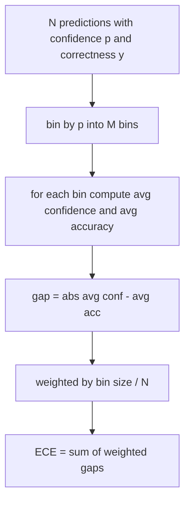
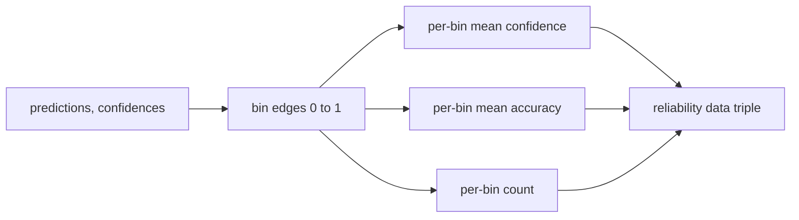

# 困惑与校准

> 如果你的模型说90%对千个答案有信心,但得到六百个答案是正确的,那么它并不是很好的校准.校准是值得信赖的评估的一半.另一半是困惑,这告诉你模型是否认为被保留的文本是可信的.

> **【中文解读】**本课补充了"可信评测"的另一半:模型在千道题上自称九成把握、但只对六百道回答,它就没准准准好.校准回答"信任是否与真实正确率匹配",困惑回答"模型是否认为留出文本合理"两者相互独立,一个模型可以准确但过度自信,也可以流但困惑糟糕.本课使用纯粹的语实现困惑、ECE、Brier 分数三个数字,并给接入评测线束的接口.

> **【拓展：评测系统路线→排行榜的信任底线】**本课是19期评测系统路线的第四站:70 定义任务规格,71/72 实现经典指标与代码执行指标,73/本课) 度量"模型可信度",74 做排行榜聚合,75 组装端到端运营器──公开排行榜几乎只报道准确率数字;将校准指标挂在报告中后",准确率赢得但更快输"的模型在生产部署中才暴露了真实风险.这也是近年学术榜开始随着准确率的一并报告的校准率的原因.

>  **【前置】**学本课前请先掌握: 1) 19·70(任务规格格格式) 评测线束的数据契约; 2) 19·71(经典指标) 标量指标的分发模式; 3) 概率论基础:似然、负对数似然、期望值。

**Type:** Build | **类型:** 动手实践
**Languages:** Python | **语言:** Python
**Prerequisites:** Phase 19 Track B foundations, lessons 70 and 71 | **前置知识:** Phase 19 Track B 基础，第 70、71 课
**Time:** ~90 min | **时间:** 约 90 分钟

## 学习目标 学习目标

- 根据模型适配器提供的代币负日志概率计算在持久的体积上代币水平的困难.
  中文翻译:用模型适配器提供的个别代币 负对数概率,在留出语料计算代币 级困惑度.
- 根据预测概率计算分类器或多选项评估的预期校准错误 (ECE).
  中文翻译:从分箱后的预测概率计算分类器或多选题评测的期望校准误差(ECE) 👇
- 计算Brier分数 (与正确度指标的平均平方错误) 并解释它何时执行 ECE不执行的.
  中文翻译:计算 Brier 分数(相对"是否正确"指示变量的均方差),并解释它在哪些地方做到了EC做不到的事──
- 构建需要图表数据的可靠性图表,以绘制信任与准确度曲线.
  中文翻译:构建绘制"置信度-准确率"曲线所需的可靠性图数据.
- 把三个电线都放进了测试带,让跑者可以连接.`perplexity`现在`ece`其他`brier`模型报告的数字.
  中文翻译:把三者接入评测线束,让运行器能把 `perplexity`,我知道.`ece`,我知道.`brier`模型报告上有三个数字.

```figure
cd-reliability-diagram
```

## 困惑告诉我们什么

> **【中文解读】**困惑度 = 每个代币 平均负对数似然取指数――越低越好:1 表示模型给每一个真实代币都分配概率 1;等于词表大小表示模型完全均、什么都没学到――2026年强基座模型在WikiText-103上约8-12的差模型50+──关键分工:线束自己不算对数概率 ((那是模型适配器的活),只做聚输入单个代币 负对数概率列表和条每序列的数,输出语料级代币困惑――

乱率是每代币的指数平均负记本概率. 低点更好. 模特将一个概率分配给每一个实际代币. 词汇规模的困难意味着模型是统一的,没有学到任何东西. 实际数字在此之间:维基文字-103的强大的2026基模型在8到12左右. 差的相同的短信是50加.

> 困惑度是每个代币的平均负面对数似的指数――越低越好――困惑度为1表示模型给每一个真实代币都分配概率 1.困惑度等于词表大小表示模型是均分布――什么也没学到――真实数字落在两者之间:2026年强基座模型在WikiText-103上大约在8到12之间;差的模型在同一段文本上会达到50以上――

带本身不计算日志概率.这些来自模型适配器.带总结:它采用每代币日志概率的列表,每序列的代币数量列表,并返回体积的困难.

> 线束自己不计算对数概率――那些来自模型适配器――线束做聚合:接收一个单个代币对数概率列表――一个单个序列的代币计数列表,返回语料级困惑――

```python
def perplexity(neg_log_probs, token_counts):
    total_nll = sum(neg_log_probs)
    total_tokens = sum(token_counts)
    return math.exp(total_nll / total_tokens)
```

实现处理零代币边缘情况并声称负记账概率是非负的.一个常见的错误是忘记否定:一个回归的适配器`log p`没有`-log p`函数将这作为违反合同.

> 实现处理零代币的边界情况,并断言负对数概率非负.`log p`而不是`-log p`函数将这种情况视为合约违规捕获.

## 欧洲经济委员会什么测量

> **【中文解读】**预测按信任分为固定数量的箱,按箱度"平均信任与平均准确率差异",再按箱内样本数量加权平均――标准做法是 [0, 1] 上 10个等宽箱,实现任意正整数箱数的支持`bins`参数区分发布约定10与对比约定15). 统计陷:ECE受箱数和样本量偏置10箱,10条预测时0.02的ECE与随机噪声无法区分,因此实现同时返回"有数据的箱数",样本太少时运行器应拒绝报单个数字.

预期校准错误按它们对固定数量的桶的信心进行预测,然后根据桶大小进行权重,测量了对桶的信心和准确度之间的平均差距.

> 预期校准差异将预测按信任分为固定数量的盒子,然后根据盒子大小加权,测量各盒子中信任率与准确率的平均差距.



标准的配方使用了10个相同宽度的桶`[0, 1]`实现支持任何正数的数量.`bins`参数,以便跑步者可以选择出版公约 (10) 和比较公约 (15).

> 标准公式使用 [0, 1] 上的 10 个等宽箱――实现支持任意正整数箱数――我们暴露一个 `bins`参数,让运行器在发布约定(10) 与对比约定(15) 之间选择.

通过10个桶和100个预测,你无法区分0.02个桶与随机噪音. 实现将与ECE一起填充的桶数返回,因此跑者可以拒绝报告一个单个数字.

> 预测时,你无法区分0.02个ECE与随机噪声. 实现ECE一并返回有数据的箱数,让运营商在样本过少时拒绝报单个数字.

## 布里尔的分数是什么,而欧洲委员会没有做什么.

> **【中文解读】**简单的分数逐条预测计算 (p_i − y_i) 2,直接惩罚偏差的散布,还能分解为可靠性,分辨率,不确定性 三项标志上报,分解日志给仪表.

欧洲经济指数 (ECE) 仅关心平均差距.一个对半个垃圾桶过度自信,对另一半过度自信的模型可以在局部度量度差的情况下具有低的欧洲经济指数.布里尔分数测量了正方误与每预测的真实结果,因此它直接处罚了传播.

> 单单关心平均差距. 一个半箱上过度自信的模型,另一半箱上过度不够自信的模型可以 ECE 很低,但局部校准很差.

对于二进制结果,Brier是`mean((p_i - y_i)^2)`运行员报告了规模表,但记录了仪表板的分解.

> 对于二元的结果,Brier是`mean((p_i - y_i)^2)`△可分解为可靠性,分辨率和不确定性. 我们同时计算分数和分解.

```python
def brier(p, y):
    return float(np.mean((p - y) ** 2))
```

## 图表数据可靠性数据

> **【中文解读】**可靠性图把预测的信心对经验准确率的每一个盒图,对角线即完美校准. 本课止步于数据形状:返回三个数组:

根据可靠性图表图,每个bin的图表预测了对实验准确性的信心.对角形是完美的校准.函数返回了三个阵列:每bin的平均信心,每bin的平均准确性和每bin的数量.图表代码生活下游;这个课程在数据形状上停止.

> 可靠性图 预测每盒的信心对经验准确率的图 图 图 图 图 对角线是完美的准确率 函数返回三个数组:每盒平均信心 单盒平均准确率 单盒计数 图 码在下游 本课止步于数据形状 图 图 图 码在下游



返回的图普是调用层需要绘制图表或计算自定义的ECE变量 (适应性ECE,扫描ECE等).我们返回了 numpy 阵列,因此下游代码不需要转换.

> 返回的元组正是调用层图图或计算自定义 ECE 变体(自适应 ECE、扫描 ECE等) 需要的东西――我们回归 numpy 数组,下游代码不必再转换――

## 信心来源.

带不假设信任来自 softmax. 它接受任何数值.`[0, 1]`对于多选择任务,自然的信心是`softmax over option log-likelihoods`对于自由文本来说,自然的信心是模型的自我报告概率或平均日志概率的指数值. 评估只是消耗了数字. 它来自于适配器的工作.

> 线束不假设信任来自软max――它接受每条预测 [0, 1] 内的任意数字――多题任务的自然信任是"选项对数似的软max";自由文本的自然信任是模型自报概率或平均对数似的指数――评测只消耗这个数字――它从哪里来是适配器的职责――

## 边缘案件 边界情况

> **【中文解读】**四种边界全部固化在测试里:全错、全对且高置信、完全不确定(p=0.5) 空输入──真实模型跑真实基准不会撞击它们,但有错误的适配器或极小样本会运行器必须不崩,由价值本身决定报道还是跳过──

- 所有预测都是错误的:ECE是平均信心,Brier是高的,困惑是模型对文本的想法.
  中文翻译:全部预测错误:ECE等于平均置信度,Brier 很高,困惑度则是对本文的看法模型.
- 所有预测都很准确:ECE接近零,Brier接近零.
  中文翻译:全部预测正确且高置信:ECE 接近零,Brier 接近零──
- 完全不确定的预测器在p=0.5:ECE是0.5减小精度,Brier是0.25减小修正术语.
  中文翻译:完全不确定的p=0.5 预测器:ECE 是 0.5 减准确率,Brier 是 0.25 减一个修正项。
- 空输入:ECE,Brier和可靠性返回 `0.0`复杂性返回`NaN`没有一个路径发出警告;运行者检查值,决定是否报告或跳过.
  中文翻译:空输入:ECE、Brier 和可靠性返回 `0.0`困惑度在零代币场景回归`NaN`◎这些路径都没有发出警告;运行器检查值并决定报道还是跳过.

实际的模型不会撞到它们,但一个车适配器或一个小样本会撞到它们,

> 这些情况都在测试中固定的.真实模型运行真实基准不会导致它们,但有错误的适配器或极小样本会,而运行器不会崩.

## 发送和连接

> **【中文解读】**校准不是F1那种任务指标,而是模型报告:运行器跨整个评测累积 (信心,正确) 对,最后一次性计算 ECE、Brier 和可靠性数据;困惑则在独立的留出文本语料计算上,与任务打分开.`CalibrationReport.from_predictions`与`PerplexityResult.from_token_nll`,我知道.

校准不是F1的每任务指标,而是每模型的报告.`(confidence, correct)`复杂性是通过一个保留的文本体积计算的,与任务分别的分分数分开.

> 校准不是F1那样的任务指标.`(confidence, correct)`对于一次性计算 ECE、Brier 和可靠性数据──困惑在留出文本语料计算,与任务分开.

接口是:

> 接口是:

```python
report = CalibrationReport.from_predictions(confidences, correct)
report.ece          # float
report.brier        # float
report.reliability  # tuple of three numpy arrays
report.populated_bins  # int
```

`PerplexityResult.from_token_nll(neg_log_probs, token_counts)`返回每代币的复杂性和平均负记录概率.

> `PerplexityResult.from_token_nll(neg_log_probs, token_counts)`返回困惑度和每个代币平均负对数似之

## 什么这个课程不做

它不调用模型.它不实现软max.它不估计输出代币的信心;这是适配器的工作.它不进行温度扩展或Platt扩展;这些是生活在不同的课程中的后期修正.本课程的目的是使三个数字 (,ECE,Brier) 值得信赖和可复制.

> 它不调用模型──它不实现软max──它不从输出代币 估计置信度;那是适配器的活──它不做温度缩放或平板缩放;那些是另一个课讲的事后修复──本课的重点是让三个数字困惑度、ECE、Brier) 可信、可复现──

## 如何读代码

`main.py`定义`perplexity`现在`expected_calibration_error`现在`brier_score`现在`reliability_diagram`其他`CalibrationReport`现在,`PerplexityResult`测试的基础是:一个精确的定位模型,一个过度自信的模型,一个不自信的模型.`code/tests/test_calibration.py`印每一个边缘外套加上合成预测器的参考值.

> `main.py`定义了`perplexity`,我知道.`expected_calibration_error`,我知道.`brier_score`,我知道.`reliability_diagram`及`CalibrationReport`现在,`PerplexityResult`两个数据类――演示在真值已知的合成预测上运行:一个校准良好的模型、一个过度自信的模型、一个不够自信的模型――`code/tests/test_calibration.py`中央测试钉住每个边界情况,外加合成预测器的参考值.

阅读`main.py`函数顺序是从上到下.函数顺序是从 skalar 到 vector 进行报告的.每个函数都有一个简短的 docstring,包括数学和合同.

> 从头到尾读`main.py`△函数排序从标量到向量再到报告──每个函数都有一个短文档,写明数学和契约──

## 我们要走得更远.

> **【中文解读】**校准是公开评测中最被忽视的轴:多数排行榜报纸一个准确率就收费工作.准确率赢得但Brier输的模型,作为生产部署相反的准确率较低,但如实报告不确定性的模型更差.

在公布的评估中,校准是最被忽视的轴心. 许多排名榜单都报告了一个准确数量, 通过测试,测试的结果是: 一旦设置了校准管道,将温度调度加到长期的验证片上,重新计算ECE, 这是一个单独的课程,但这里的 floor生活在这里.

> 校准是公开评测中最被忽视的轴──多数排行榜报纸一个准确率数字就算完成──准确率赢而Brier 输的模型,作为生产部署比准确率低几分但可靠报告不确定性的模型更差──校准管线就位后,在留出验证片上加温缩小、重计算ECE,看差距缩小──那就是单独的课程,但基在这里──
