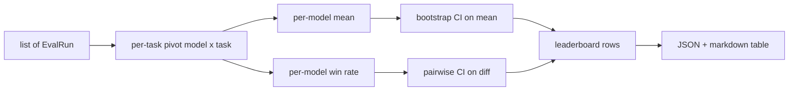
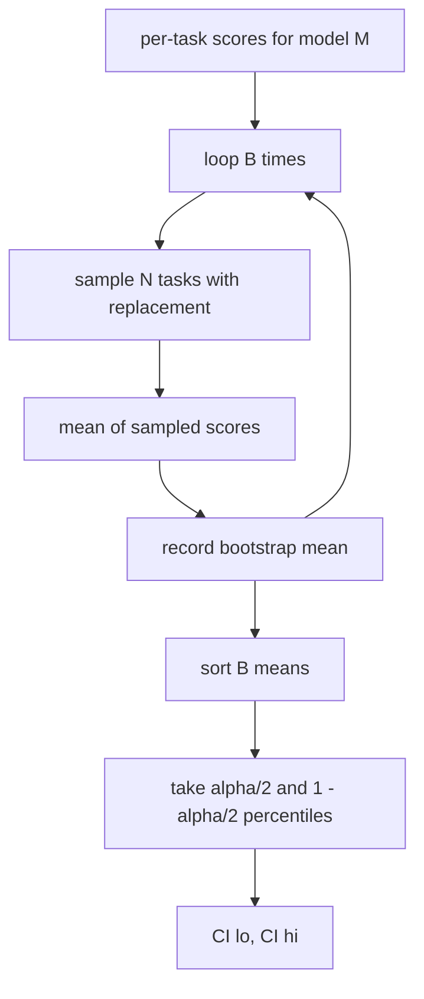

# 排名榜集成

> 根据一个模型,每项任务的分数很容易. 异质任务的模型排名更难. 在一千个预测排名表上的统计意义是每个人都跳过的部分. 这一课不会跳过.

> **【中文解读】**任务分类很容易,跨构建任务的每个模型排名很难,而"千条预测上的统计显著性"是所有人都跳过的部分.排名集结回答三个问题:如何将多个模型 ×多个任务分数归纳成每个模型一行?平均值和胜率两种排名各应在什么时候使用?排名差异是真的还是噪音?答案的核心显着是启动区间:区间不跨零才数,否则视频组列.

> **【拓展：评测系统路线→可辩护的排行榜】**本课是评测系统路线(70-75) 的第五站:70 任务规格、71/72 指标、73 校准、74(本课) 排行榜聚合、75 端到端运行器。真世界同类问题无处不在LMSYS聊天机场用 Elo 和 bootstrap 置信区间排名,Open LLM 领袖板用多任务平均值──本课把"报告一个你能辩护的数字"变成纯粹的可复现实现──

>  **【前置】**学本课前请先掌握:(1) 19·70(任务规格格格式) EvalRun 记录的上游来源;(2) 19·71-73(指标与校准) 分数如何产生、为何已归归一到 [0, 1];(3) 统计基础:均值、百分位数、有放回重采样。

**Type:** Build | **类型:** 动手实践
**Languages:** Python | **语言:** Python
**Prerequisites:** Phase 19 Track B foundations, lessons 70, 71, 73 | **前置知识:** Phase 19 Track B 基础，第 70、71、73 课
**Time:** ~90 min | **时间:** 约 90 分钟

## 学习目标 学习目标

- 综合多个模型和多个任务的每个任务分数,以一个整齐的每个模型排行.
  中文翻译:把多个模型,多个任务的任务分数聚合在一起,每个模型的整洁表格.
- 规范异质分数,以免通过率和蓝色EU值过度影响总数.
  中文翻译:归一化异构分数,避免通过率和蓝色值过度影响聚合结果.
- 根据平均和胜利率排名模型,并解释每一个模型是什么时候合适的总结.
  中文翻译:按平均值和按胜率给模型排名,并解释各自适合什么场景.
- 根据每款模型的平均分数和对差计算启动线的信心间隔.
  中文翻译:计算每个模型均分的bootstrap 置信区间,以及两两差的置信区间.
- 输出排名表作为JSON报告,作为一个标记表,课程75中的运行者可以粘贴到CI评论中.
  中文翻译:把排行榜输出为JSON 报告和标记表格,供第75课的运行器贴进CI 评论。

```figure
ci-leaderboard-ci
```

## 输入的形状

集成器使用了列表`EvalRun`记录:

> 聚合器消费一个`EvalRun`记录列表:

```python
@dataclass
class EvalRun:
    model_id: str
    task_id: str
    metric_name: str
    score: float          # in [0, 1]
    category: str
```

课75中的跑者每次发射1枚记录`(model, task)`总结者不关心得分是如何产生的.`[0, 1]`现在,我们要去.

> 第75课 运行器为每一个`(model, task)`对于产出的一条记录.聚合机不关心分数是如何来的.`[0, 1]`在里面

## 输出输出

> **【中文解读】**输入是EvalRun 记录流,输出是排行榜行:`model_id`,我知道.`mean_score`置信区间上下界`mean_ci_lo`现在,我们要去.`mean_ci_hi`,我知道.`win_rate`,我知道.`tasks_completed`按类别均分的外可选`categories`映射──中间经过三个变化:透视成模型 × 任务矩阵、计算每个模型的平均值和胜率、使用bootstrap 补置信区间最后染成JSON + 标记──

现在有三个桌子.

> 产出三张表:



排名表排行包含: `model_id`现在`mean_score`现在`mean_ci_lo`现在`mean_ci_hi`现在`win_rate`现在`tasks_completed`其他选择性`categories`按类别平均的地图.

> 排行榜行包含:`model_id`,我知道.`mean_score`,我知道.`mean_ci_lo`,我知道.`mean_ci_hi`,我知道.`win_rate`,我知道.`tasks_completed`及可选的类别均分`categories`映射──

## 实现正常化,归化.

> **【中文解读】**归结是最容易埋葬的一步:一个任务打分在 [0, 1]、另一个在 [0, 100],后者会静默支配平均值──聚合器的选择是"验证+拒绝"而不是重缩放任何分数落在 [0, 1] 之外就拒绝整次运行,修复放上游:指标层就应返回率──71-73 课已经在指标层强制了这个契约──

如果一个任务得到了分数`[0, 1]`另一个在`[0, 100]`总结器验证每个输入分数都在`[0, 1]`根据第71-13课程, 修改方法是: 修改方法, 修改方法, 修改方法, 修改方法, 修改方法, 修改方法, 修改方法, 修改方法, 修改方法, 修改方法, 修改方法, 修改方法, 修改方法, 修改方法, 修改方法, 修改方法, 修改方法, 修改方法, 修改方法, 修改方法, 修改方法, 修改方法, 修改方法, 修改方法, 修改方法, 修改方法, 修改方法, 修改方法, 修改方法, 修改方法, 修改方法, 修改方法, 修改方法, 修改方法, 修改方法, 修改方法, 修改方法, 修改方法, 修改方法, 修改方法, 修改方法, 修改方法, 修改方法, 修改方法, 修改方法, 修改方法, 修改方法, 修改方法, 修改方法, 修改方法, 修改方法, 修改方法, 修改方法, 修改方法, 修改方法, 修改方法, 修改方法, 修改方法, 修改方法, 修改方法, 修改方法, 修改方法, 修改方法, 修改方法, 修改方法, 修改方法, 修改方法, 修改方法, 修改方法, 修改方法, 修改方法, 修改方法, 修改方法, 修改方法, 修改方法, 修改方法, 修改方法, 修改方法, 修改方法, 修改方法, 修改方法, 修改方法, 修改方法, 修改方法, 修改方法, 修改方法, 修改方法, 修改方法, 修改方法, 修改方法, 修改方法, 修改方法, 修改方法, 修改方法, 修改方法, 修改方法, 修改方法, 修改方法, 修改方法,

> 如果一个任务打分在`[0, 1]`另一个在`[0, 100]`其他 集成器验证每个输入分数都落在`[0, 1]`修复在上游:指标本就该回报率.

## 平均和胜利率

> **【中文解读】**两种排名服务不同目标.平均值是排名的头条数字,但对离群值和任务不平衡敏感;胜率统计"在同一任务中击败所有模型"的频率.

两种排名方案都为不同的目标服务.

> 两种排名方案服务不同的目标.

平均分数是一个模型的每项任务分数平均值.这是标题数排行榜报告.它对异常值和任务不平衡敏感.

> 均分是模型的任务分数的平均值. 它是排行报告的头条数字. 它对离群值和任务不平衡感觉.

胜率计算一个模型在同一任务上击败其他模型的频率.对于每个任务,最高分数的模型赢得 (结分).胜率等于赢得分数的任务.它对异常值和尺度差异不敏感,但损失信息.

> 胜率统计一个模型在同一任务上击败所有其他模型的频率――每个任务中最高的模型获胜率――胜率等于获胜数除了该模型有分数的任务数――它对离群值和量差不多更不敏感,但会丢失信息――

```python
def win_rate(model_id, runs_by_task, all_models):
    wins, total = 0, 0
    for task_id, runs in runs_by_task.items():
        scores = {r.model_id: r.score for r in runs if r.model_id in all_models}
        if model_id not in scores:
            continue
        total += 1
        best = max(scores.values())
        if scores[model_id] >= best:
            wins += 1
    return wins / total if total else 0.0
```

杆报告了这两种情况. 第75课中的跑者按默认的平均排名;如果用户更喜欢,则胜率的倒标列就在这里.

> 线束两都报告 第75课运营商默认按平均值排名;胜率的下行列在旁边,以便用户更喜欢它.

## 启动信任间隔

> **【中文解读】**启动的做法:对任务 id 有放回重采样,计算重采样集合上的平均值,重复 B 次,取百分位区间──每模型均分配一个 CI;两比则对每个任务差值.`score_A - score_B`设置区间不含零即在水平阿尔法 下显著,含零就当作并列.默认参数:底层助手B=1000,公开聚合器B=500(演示和测试跑得快),alpha=0.05,纯无 无学──

按模型的意思,以启动样本重新样本化任务计算的保证间隔. 我们重新样本化任务ID,计算重新样本化的集合的平均值,重复`B`按数分的时间,`alpha`现在,我们要去.

> 每个模型的平均分配一个通过任务做启动重采样估计的置信区间.`B`接下来取水平`alpha`百分位区间.



对于对比,我们将每任务的差异启动`score_A - score_B`结果是,在"A"级别上,差异是显著的.如果没有,排名表将模型视为相对的.

> 对于两个比较,我们对每个任务的差值.`score_A - score_B`预测: 预测: 预测: 预测: 预测: 预测: 预测: 预测: 预测: 预测: 预测: 预测: 预测: 预测: 预测: 预测: 预测: 预测: 预测: 预测: 预测: 预测: 预测: 预测: 预测: 预测: 预测: 预测: 预测: 预测: 预测: 预测: 预测: 预测: 预测: 预测: 预测: 预测: 预测: 预测: 预测: 预测: 预测: 预测: 预测: 预测: 预测: 预测: 预测: 预测: 预测: 预测: 预测: 预测: 预测: 预测: 预测: 预测: 预测: 预测: 预测: 预测: 预测: 预测: 预测: 预测: 预测: 预测: 预测: 预测: 预测: 预测: 预测:

低级助手 (`bootstrap_mean_ci`现在`bootstrap_pairwise_diff`) 违约`B=1000`公共集成商 (`aggregate`现在`pairwise_diffs`) 违约`b=500`默认的阿尔法是0.05 课程让开启器保持纯粹的,没有.

> 底层助手`bootstrap_mean_ci`,我知道.`bootstrap_pairwise_diff`)默认`B=1000`公共聚合器`aggregate`,我知道.`pairwise_diffs`)默认`b=500`让演示和测试保持快速.默认的阿尔法是0.05──本课的启动带.保持纯粹的无聊,不需要的学习.

## 类别

> **【中文解读】**如果EvalRun带类别 ((数学,理性,代码,安全),聚合器额外根据类别的平均分数提供了.

如果`EvalRun.category`总结器也报告了每个类别的平均值.`math`现在`reasoning`现在`code`现在`safety`让运行者能够发现模型是否总体很好,但代码很弱,这就是标题中所隐藏的信息.

> 如果设置了`EvalRun.category`聚合器还会根据类别的平均分数报告.`math`,我知道.`reasoning`,我知道.`code`,我知道.`safety`运行器发现"总体好但代码弱"的模型.

## 标记下传染

> **【中文解读】**排行榜染成标记表表:按平均分排序,置信区间保留两位小数,超过二十字符的模型ID截断.

排名表表表表表表表表表表表表表表表表表表表表表表表表表表表表表表表表表表表表表表表表表表表表表表表表表表表表表表表表表表表表表表表表表表表表表表表表表表表表表表表表表表表表表表表表表表表表表表表表表表表表表表表表表表表表表表表表表表表表表表表表表表表表表表表表表表表表表表表表表表表表表表表表表表表表表表表表表表表表表表表表表表表表表表表表表表表表表表表表表表表表表表表表表表表表表表表表表表表表表表表表表表表表表表表表表表表表表表表表表表表表表表表表表表表表表表表表表表表表表表表表表表表表表表表表表表表表表表表表表表表表表表表表表表表表表表表表表表表表表表表表表表表表表表表表表表表表表表表表表表表表表表表表表表表表表表表表表表表表表表表表表表表表表表表表表表表表表表表表表表表表表表表表表表表表表表表表表表表表表表表表表表表表表表表表表表表表表表表表表表表表表表表表表表表表表表表表表表表表表表表表表表表表表表表表表表表表表表表表表表表表表表表表表表表表表表表表表表表表表表表表表表表表表表表表表表表表表表表表表表表表表表表表表表表表表表表表表表表表表表表表表表表表表表表表表表表表表表表表表表表表表表表表表表表

> 排行榜被染成一张下行表:

```text
| Rank | Model | Mean | 95% CI | Win rate | Tasks |
|------|-------|------|--------|----------|-------|
| 1    | gpt   | 0.78 | 0.74-0.82 | 0.62 | 50 |
| 2    | claude| 0.75 | 0.71-0.79 | 0.34 | 50 |
| 3    | random| 0.10 | 0.07-0.13 | 0.04 | 50 |
```

表是按平均分数进行排序. 计算量为两个十分位数. 长型标识符是缩短到20个字符.

> 表格按均分排序──置信区间染到两位小数──过长的模型 id 截截至二十个字符──

## 什么这个课程不做

它不运行模型.它不调用测量层.它不实现适应性ECS或其他校准变异;这些是课73.它不实现任务权重.每个任务都在这个过程中一样.生产排名表重量任务;我们通过该子打开.`weight`如果需要,在后续课中添加权重.

> 它不运行模型──它不调用指标层──它不实现自适应EC或其他校准变体;那些是第73课──它不实现任务加权──这里每个任务权重相同──生产排行列将给任务加权;我们通过`weight`字段留下了这个子,但聚合器忽略了它.

## 如何读代码

`main.py`定义`EvalRun`现在`LeaderboardRow`现在`aggregate`现在`bootstrap_mean_ci`现在`bootstrap_pairwise_diff`其他`render_markdown`演示程序构建了三种模型和十二项任务的合成套件,集成,并打印了排名表以及对差表.`code/tests/test_leaderboard.py`开链,降值染,赢率边缘情况,

> `main.py`定义了`EvalRun`,我知道.`LeaderboardRow`,我知道.`aggregate`,我知道.`bootstrap_mean_ci`,我知道.`bootstrap_pairwise_diff`和 `render_markdown`△演示构建三个模型,12个任务的合成套件,聚合后打印排列表和两两区别表.`code/tests/test_leaderboard.py`中的测试钉住启动带标 染染 胜率边界情况和空输入行为

阅读`main.py`数据形状 (EvalRun,LeaderboardRow) 首先出现,集成器接下来,启动器第三,染后者.每个函数都有一个集中合同.

> 从头到尾读`main.py`△数据形状 (EvalRun、LeaderboardRow) 在最前,聚合器其次,bootstrap第三,染最后──每个函数都有聚焦的契约──

## 我们要走得更远.

> **【中文解读】**自然的下一步是对应显著性检验(模型A、B 运行相同的任务,对任务差值做对应启动本课已实现) 再往后是尊重任务的分层启动:数学题之间不独立,一种算术错误模式会影响十个题──本课的关键是把底线做对,让评测报出一个你可以辩护的数字──

接下来的自然步骤是对任务的意义,而不是对不对的启动带. 如果模型A和B都执行相同的100个任务, 适当的测试是对任务分别的差异的起链, 除此之外,你需要一个尊重任务家庭的等级启动链 (数学问题不独立于彼此;一个算术错误模式影响了其中的十个). 这只是一个后续. 这课的目的是让你得到一个正确的水平,

> 自然的下一步是用配对任务显著取代非配对启动链. 如果模型A和B 运行了相同的百项任务,合适的检验是对任务差值做配对启动链我们已经实现了. 再往前,你会想尊重任务的分层启动链.
