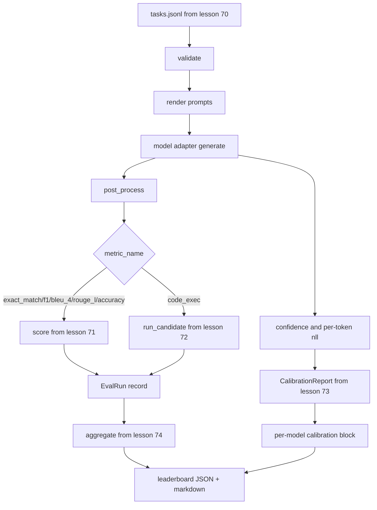

# 终端到终端的Eval Runner 端到端评测运行器

> 运行员从第70课阅读任务规格,通过适配器打电话给模型,通过第71课和第72课得分,附加第73课的校准报告,并从第74课发出排名板.演示自动结束.

> **【中文解读】**五节管线课,一节课把它们粘在一起.运营器阅读第70课任务规范.经适配器调用模型.使用71/72课打分.挂在73课校准报告.产出74课排行榜.它本身不重复任何一层逻辑,只做导入和组装.这是评测系统路线的收官课:适配器接口 (模型适配器) 单遍评测循环.并行执行.自动结束演示,全部在一个文件里跑通.

> **【拓展：评测系统路线→你自己的评测平台】**本课把70-74 五个模块组装成一个可运行的迷你评测平台,结构上就是lm-eval-harness、OpenAI evals、HELM 这类生产评测系统的骨架:任务规格层 → 模型适配层 → 指标层 → 校准层 → 聚合/报告层──完成本课程,进入一个真实模型供应商只需要写三十行适配器水换模型不换线束,这就是分层契约的价值──

>  **【前置】**学本课前请先掌握:(1) 19·70(任务规格格格式) 固定任务与校验;(2) 19·71/72(经典指标与代码执行指标) 评级层接口;(3) 19·73(困惑度与校准) 校准报告;(4) 19·74(排行榜聚合) 聚与对_沟;(5) Python`concurrent.futures`线程池基础:

**Type:** Build | **类型:** 动手实践
**Languages:** Python | **语言:** Python
**Prerequisites:** Phase 19 Track B foundations, lessons 70 through 74 | **前置知识:** Phase 19 Track B 基础，第 70 至 74 课
**Time:** ~90 min | **时间:** 约 90 分钟

## 学习目标 学习目标

- 定义一个`ModelAdapter`任何模型 (假装,本地,API) 可以通过小方法表面满足的接口.
  中文翻译:定义一个任何模型 ((mock、本地、API) 都能使用极小方法面满足的`ModelAdapter`接口.
- 运行评估在一个固定JSONL文件上,并行执行任务在一个工作组中.
  中文翻译:在工作线程池上并行执行任务,跑完一个固定 JSONL 文件的评测.
- 复制一个传输中与校准层的测量层 (exact_match,F1,BLEU-4,ROUGE-L,code_exec).
  中文翻译:把标标层在一遍循环中组合起来.
- 发射每个模型`EvalRun`记录并直接将它们输入到排名表集成器中.
  中文翻译:产出逐模型的`EvalRun`记录,直接给排行榜聚合器.
- 输出JSON报告和标记表;在清洁运行时输出零,在验证或运行时失败时输出零.
  中文翻译:同时输出 JSON 报告和标记表格;干净运行以退出码 0 自终止,校验或运行失败则非零。

```figure
eval-grid
```

## 管道流水线

> **【中文解读】**流水线把五个模块串成一条线:任务.jsonl 校验 → 染速 → 适配器生成 → 后处理 → 按 metric_name 分发到 71 课标或 72 课代码执行 → EvalRun 记录;同时从生成 抽取置信度和代币逐 负似对数对37 课校准;最后全部进 74 课集成,输出领导板 + 校准块的 JSON 与标点.



跑者是集成点.每一个70到74课程都有一个模块,跑者构成.跑者不会复制这些模块的任何逻辑:它进口它们.

> 运行器是集成点. 第70到74课. 每个类型都有一个模块,运行器把它们组装起来.运行器不复制这些模块的任何逻辑:它导入它们.

## 适配器接口

> **【中文解读】**适配器是运行器与任意模型之间的接,接口刻意最小:一个 `model_id`属性加一个`generate(prompt, task) -> Generation`方法──世代 携带自由文本输出、[0, 1] 置信度、可选的代币 负对数似然总和与代币 数──内置三个模拟 适配器各代表一个典型模型:规则依据适配器(确定性、近乎全对)、噪音适配器(过度自信、常错)、偏见适配器(一类强、另一类差)──

适配器是运行机和任何模型之间的接口.

> 适配器是运行器与任意模型之间的接──接口刻意保持很小──

```python
class ModelAdapter:
    model_id: str

    def generate(self, prompt: str, task: TaskSpec) -> Generation: ...
```

`Generation`是一个具有:

> `Generation`是一个数据类,包含:

- `text`:模型的自由形式输出
  翻译: 中文`text`模型的自由格式输出
- `confidence`水`[0, 1]`代表模型对答案的自我报告概率
  翻译: 中文`confidence`显示模型对答案的自报概率
- `token_nll`: 创建的代币的负记录概率的可选总和
  翻译: 中文`token_nll`选择,生成代币 上负对数似的总和
- `token_count`:生成的代币的可选数量
  翻译: 中文`token_count`选择,生成的代币 数

跑步机中的假适配器提供了三个味道:`RuleBasedAdapter`子,子,子,子,子,子,子,子,子,子,子,子,子,子,子,子,子,子,子,子,子,子,子,子,子,子,子,子,子,子,子,子,子,子,子,子,子,子,子,子,子,子,子,子,子,子,子,子,子,子,子,子,子,子,子,子,子,子,子,子,子,子,子,子,子,子,子,子,子,子,子,子,子,子,子,子,子,子,子,子,子,子,子,子,子,子,子,子,子,子,子,子,子,子,子,子,子,子,子,子,子,子,子,子,子,子,子`NoisyAdapter`(过度自信,经常错误),`BiasedAdapter`演示全都在70课时进行.

> 运行器里的模拟适配器提供三种风味:`RuleBasedAdapter`它们是完全的.`NoisyAdapter`没有什么可言.`BiasedAdapter`演讲在70课时上跑全部三个.

## 执行并行.

> **【中文解读】**没有使用`concurrent.futures.ThreadPoolExecutor`线程就足够了,因为真实模型调用瓶是网络 I/O;代码执行路径在任务内部另起的过程中,线程池只负责调节等待.为了确定性测试,`run_eval(adapters, tasks, parallel=False)`能活在执行顺序.

跑步者使用`concurrent.futures.ThreadPoolExecutor`按模型并行执行任务. 工作者数量默认为小于8个和任务数量. 线程是足够的,因为实际模型调用的瓶是网络 I/O. 代码执行路径在任务内部产生了自己的子进程,执行者只安排等待.

> 运行器用 `concurrent.futures.ThreadPoolExecutor`对于每个模型并行执行任务――工人数默认取8与任务数量较小的值――线程就足够了,因为真实模型调用的瓶是网络 I/O――代码执行路径在任务内部自行发送子进程,执行器只调度这个等待――

对于确定性测试,跑步者将暴露`run_eval(adapters, tasks, parallel=False)`为了测试,我们可以确定执行命令.

> 为了确定性测试,运行器暴露`run_eval(adapters, tasks, parallel=False)`让测试可以在执行顺序中进行.

## 单次评分循环

> **【中文解读】**每个任务六步:染提示(少数拍 前 + 正文)→ 调适配器并计时 → 按任务规则后处理 → 分发到指标层 → 构建EvalRun 记录 → 把 (自信,正确) 增加进校准缓冲──正确 判定规则:exact_match 类指标(exact_match、精确度、代码_exec) 用`score >= 1.0`分级标记使用`score >= 0.5`值在`_correct_from_score`里,不露露公开覆盖.

对于每项任务:

> 对于每一个任务:

1. 返回提示 (几个次前置加上提示体).
   中文翻译:染快速(几次前加快速 正文) 』
2. 打电话给适配器,定时打电话.
   中文翻译:调用适配器并为调用计时.
3. 根据任务规则进行后处理.
   中文翻译:按任务规则对生成结果做后处理.
4. 送到测量层.
   中文翻译:分发到标标层.
5. 建立一个`EvalRun`记录与分数和指标元数据.
   中文翻译:使用分数和指标元数据构建一条 `EvalRun`记录.
6. 添加`(confidence, correct)`配对到校准缓冲器.
   中文翻译:把 `(confidence, correct)`对于额外的校准缓冲.

其他`correct`信号是`score >= 1.0`对于 exact_match 类型的指标 (`exact_match`现在`accuracy`现在`code_exec`) 和`score >= 0.5`值在`_correct_from_score`跑步者不会暴露公开的过失.

> 对准确_匹配类指标`exact_match`,我知道.`accuracy`,我知道.`code_exec`),`correct`信号是`score >= 1.0`对于分级指标是`score >= 0.5`值放在`_correct_from_score`里,运行器不提供公开覆盖入口.

## 聚合,聚合.

> **【中文解读】**经过分分,运行器调用了74个课程.`aggregate`和 `pairwise_diffs`、73 课的`CalibrationReport.from_predictions`打包成一个JSON 信封:leaderboard、pairwise、逐模型校准块、总结(任务数、模型数、耗时) ⋅同时把表达标记到stdout,方便直接贴进PR评审──

每个任务都得到了结果后,跑步者打电话`aggregate`其他`pairwise_diffs`根据第74课和`CalibrationReport.from_predictions`输出是一个JSON包裹:

> 每个任务都会得到结果,运行器调用第74课.`aggregate`和 `pairwise_diffs`及第73课`CalibrationReport.from_predictions`△输出是一个单一的 JSON 信封:

```json
{
  "leaderboard": [...],
  "pairwise": [...],
  "calibration": {
    "model_id_a": {"ece": 0.04, "brier": 0.10, "populated_bins": 8, ...},
    ...
  },
  "summary": {
    "tasks": 10,
    "models": 3,
    "wall_seconds": 1.2
  }
}
```

运行者还将一个标记表写入 stdout,以便用户可以将结果粘贴到 PR 评论中.

> 运行器还将表达标记写到ddout,让用户能够将结果贴在PR评审.

## 自杀演示自杀演示

> **【中文解读】**演示用三模拟 适配器跑70课的十个固定任务,钟时间应在10秒内,干净运行退出码为0――干净运行的判断有四条:每个任务通过70课校验、每个任务通过71/72课打分、73课校准报告无错聚、排列列列表将适配器规则严格排列在随机适配器上――任何一条破坏,运行器以非零退出码结束,并在JSON信封中给出结构性错误――

演示程序在70课时10个固定任务中运行了3个模拟适配器.墙时间应该在10秒以下.清洁运行时退出代码是零.

> 演示用三模拟适配器跑第70课的十个固定任务――墙钟时间应在十秒内――干净运行的退出码为零――

清洁运营标准是:

> 干净运行的判定是:

- 每个任务都根据70课程得到验证.
  中文翻译:每一个任务都通过第70课的校验.
- 每个任务都在第71和第72课下得到了分数.
  中文翻译:每一个任务都是由第71、72 课打分.
- 校准报告在第73课下总结,没有错误.
  中文翻译:第73课的校准报告无错地完成聚聚──
- 排名表将基于规则的适配器排名在随机适配器的高度上.
  中文翻译:排行榜把规则适配器严格排排在随机适配器之上.

如果其中任何一个破解,运行器将在JSON封中出现结构错误.

> 运行器将非零码退出,并带来一个结构性错误.

## 什么这个课程不做

它不调用真实模型.它不实现API关键流程或速度限制处理.它不实现流媒体或部分生成;适配器每次调用返回一代.它不进行重试或缓存.这些问题在适配器层上存在;运行者是测量-无知和提供商-无知.

> 它不调用真实模型――它不实现API 密钥流程或限流处理――它不实现流式或部分生成;适配器每次调用返回一个生成结果――它不重试或缓存――这些问题都存在适配器层;运营商对标志和供应商都是中立的――

## 如何读代码

`main.py`通过一个小的课程,它从其他五个课程模块进口.`_load_sibling`通过相对路径来解决这些问题.`Generation`现在`EvalReport`其他`ModelAdapter`模拟适配器在文件的底部.

> `main.py`通过一个相对路径解析模块的小助手.`_load_sibling`从另外五课导入――数据类`Generation`,我知道.`EvalReport`和 `ModelAdapter`在本地定义中,

阅读`main.py`查进口,然后看看`run_eval`现在`_score_one`现在,我们要做什么?

> 从头到尾读`main.py`首先读进,再看看`run_eval`再看看`_score_one`现在,再看适配器.

测试在`code/tests/test_runner.py`点适配器界面,单通路环,平行对序等等,校准缓冲器和JSON封面形状.

> `code/tests/test_runner.py`中测试钉住适配器接口"",单遍循环"",并行与顺序执行等价性"",校准缓冲和JSON信封形状"",

## 我们要走得更远.

> **【中文解读】**这个运营商是底线,生产评测系统在它的外面包:以 (task_id, model_id, model_version) 为关键结果缓存、按美元和代币 账户的成本台账户、限流退避重试层、通过-at-k的采样策略、长套件的流式输出每个关注都只包容运营商、不动标标标和聚合层,这正是契约分层的意义――mock 跑通后,挑选一个免费供应商写一个三十行配套器水,让排列亮.

产品评估系统添加:一个按键键键的结果缓存`(task_id, model_id, model_version)`根据"一轮"的数据,一个成本账本可以追踪每次运行的美元和代币,一个反试层可以支持利率限制,一个通过-at-k任务的样本取决策,以及长期套件的流媒体输出格式.这些都是一个单一的问题,而不会改变测量或聚合层.

> 这种运行器是底线.`(task_id, model_id, model_version)`关键的结果缓存"",追踪每次运行的美元数和代币数的成本台账"",对限流进行重试层的避开"",通过-at-k"任务采集策略,以及面向长套件的流式输出格式――其中每一个只包围运营商的单一关注,不变标标标层或聚合层――这种分离正是合约的意义所在――

接下来,你需要一个适配器,然后再给一个真正的供应商.

> 之后,给一个真实供应商加适配器. 挑一个有免费额度的,写三十条水,看看排名亮起来.
