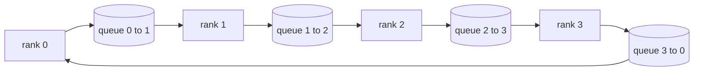

# 集体行动从零开始

> 其他原始的培训框架提供了一个包裹. 建立它们一次在一个`multiprocessing.Queue`线,对它们进行检验,然后其余的轨道变成管道.

> **【中文解读】**起分布式训练的四个集合通信原语是 allreduce、broadcast、allgather 和 reduce_scatter训练框架中的其他原语是四个包装.`multiprocessing.Queue`网上实现它们一次,并使用`torch.distributed`通过线,将这四个吃过,本路后面五课(DDP、ZeRO、流水线并行、分片检查点、端到端) 就只是管线组装――

> **【拓展：分布式训练路线→为什么从集合通信开始】**本课是第19阶段分布式训练路线的第一站. 实际世界对应物是NVIDIA NCCL:跑在PCIe/NVLink上、硬件卸载归约. 阅读读读读读读读读读读读读读读读 NCCL的关键不是API,而是它下环/树拓选择NCCL自带的拓检测器对大约1MB以上的消息选环、以下选树,这正是本课表格里"按消息大小选拓"的工程版本.

>  **【前置】**学本课前请先掌握:(1) 19·42-49 训练端到端路线特别是47(检查点) 与48(分布式训练概览),理解单进程训练循环;(2) 多进程编程基础:`multiprocessing.Queue`产商消费者语义;

**Type:** Build | **类型:** 动手实践
**Languages:** Python | **语言:** Python
**Prerequisites:** Phase 19 Track C lessons 42-49 | **前置知识:** Phase 19 Track C 第 42-49 课
**Time:** ~90 min | **时间:** 约 90 分钟

## 学习目标

- 实现环所有减少在两个通过 (减少分散然后全部集合) 并证明每级通信量为2(N-1) /N字节/元素.
  中文翻译:实现两遍式环所有减少(先减少-散乱再所有),并证明每级 通信量是每元素 2(N-1) /N 字节。
- 建立广播,收集,并减少_散播点到点发送的顶部`multiprocessing.Queue`现在,我们要去.
  中文翻译:在`multiprocessing.Queue`建立广播,聚焦和减少_散播.
- 检查每一个原始的对比`torch.distributed`对于相同输入的参考数据.
  中文翻译:把每个原语与相同输入下`torch.distributed`为了实现相互验证.
- 保护圆与树的选择,以集群形状,延迟地板和带宽天花板.
  中文翻译:能基于集群形态、延迟下限和带宽上限为"环还是树"的选择做辩护.

## 问题 问题引入

> **【中文解读】**本节算一笔带宽账――朴素全部缩小 让每个级别 把整个张量发给根 再广播回来:每级别 带宽 O(N) √ 根 成瓶、墙钟下限 = 最慢链路 × N。环全部缩小 把它压成2(N-1) 个小的T/N块,每级别 字节数量降至2T(N-1) /N、与集群规模无关;树全部缩小只有 log2(N) 跳,在小N、高延迟链路上赢──选择错拓,最慢的GPU决定每步时间.

一个天真的全减值在N数列上将N乘以子发送到根,并将N乘以回传输. 带宽尺寸为O(N) 每级,根成为瓶,墙钟地板是最慢的链接乘以N. 环全缩小到2 ((N-1) 块的尺寸T/N,因此每级字节降至2T ((N-1) /N,不论集群尺寸如何. 树全减小N和高延迟链接中获胜,因为深度是log2(N) 跳转而不是2(N-1). 选择错误的拓形态,最慢的GPU决定了步骤时间.

> 个级上的朴素所有减少 会把张量发 N 份给根、再广播 N 份回来。每级 带宽按 O N) 增长,根 成为瓶,墙钟下限是最慢链路乘 N 环所有减少 把它摊平成 2 个级 N-1) 个大小为 T/N 的块,于是每级 字节降至 2T 个 N-1) / N,与集群规模无关.树所有减少在小 N 和高延迟链路上胜出,因为深 N 节是2 个 N) 跳而不是 2 个 N-1 ⋅为集群形态选择错误,最慢的拓拓每步时间.

每个分布式训练框架,你会读到这个轨道,都取决于这些四个原始. 鱼DDP同步梯度,每个参数桶都能减少一个. 通过减少_散射,ZERO通过allgather进行更新参数的节目来缩小优化状态. FSDP将全向转换为allgather加减散. 管道并行需要在各阶段组之间进行激活的广播. 如果不能实现四个集体,你不能解释为什么训练停顿,为什么梯度不匹配在3级,或者为什么管道泡翻倍当你交换拓.

> 你在本路线上读到的每个分布式训练框架都依赖于四个原语.PyTorch DDP 用每个参数桶一次降低同步梯度.ZeRO 用降低_散射给优化器状态分片.用全集 广播更新后的参数.FSDP 把整个前向变成全集 加减_散射.流水线并行需要播放.

## 概念的核心概念

> **【中文解读】**本节是全课核心:把张量均分成N块,环上跑两遍第一遍减少散布N-1步,每步每阶段 把一块部分和发给右邻居,收到左邻居部分和并加加,结束后排列r 持第一个块的完整和),第二次全部集合N-1步,把完成的块绕环转,直到每个阶段 持所有块的完整和) 表格出五个原始的每阶段字节数和节数,是后续的DP/ZeRO课反复引用的"账本".



### 环全减2次

按数值为 0..N-1的 N 个等数分. 每个级别都有一个等级的分数指数. 通过1,减少散射,运行N-1步骤. 在步骤s,r级 r将分数 (r - s) 调用 N 调用 (r + 1) 调用 N,并从分数 (r - s - 1) 调用 N 调用 N 调用 (r - 1) 调用 N,并将接收的分数积累到本地副本中. 在N-1步骤之后,r级拥有r部分的全部总数. 通过2,全部集合,再走N-1步骤,然后旋转完成的块环绕,直到每个排列都包含了每个块的全部总和.

> 把张量均分成索引为0..N-1的N块. 每个级别 拥有等于自己级别的号块. 第一遍减少散布. 跑N-1步. 在第一个步骤中,排列r 把第一个 (r - s) 块发给排列 (r + 1) 块N,并从排列 (r - 1) 块N收第 (r - s - 1) 块N,把收到的块加进本地副本.

| Primitive | Per-rank bytes | Steps | When to use |
|-----------|---------------|-------|-------------|
| Ring allreduce | 2T(N-1)/N | 2(N-1) | Large T, fat-pipe homogeneous cluster |
| Tree allreduce | T log2(N) | 2 log2(N) | Small T or high-latency links |
| Broadcast | T | log2(N) tree | Parameter init, scalar config |
| Allgather | T(N-1)/N | N-1 | Sharded forward, ZeRO unshard |
| Reduce_scatter | T(N-1)/N | N-1 | ZeRO gradient sharding |

### 排队网作为NCCL的替代

> **【中文解读】**电脑系统运行在PCIe/NVLink上 带硬件卸载回归;CPU上没有这些.`multiprocessing.Queue`由于这些数据的数据,用户的数据和数据的数据,用户的数据和数据的数据,用户的数据,数据的数据,数据的数据,数据的数据,数据的数据,数据的数据,数据的数据,数据的数据,数据的数据,数据的数据,数据的数据,数据的数据,数据的数据,数据的数据,数据的数据,数据的数据,数据的数据,数据的数据,数据的数据,数据的数据,数据的数据,数据的数据,数据的数据,数据的数据,数据的数据,数据的数据,数据的数据,数据的数据,数据的数据,数据的数据,数据的数据,数据的数据,数据的数据,数据的数据,数据的数据,数据的数据,数据的数据,数据的数据,数据的数据,数据的数据,数据的数据,数据的数据,数据的数据,数据的数据,数据的数据,数据的数据,数据的数据,数据的数据,数据的数据,数据的数据,数据的数据,数据的数据,数据的数据,数据的数据,数据的数据,数据的数据,数据的数据,数据的数据,数据,数据的数据,数据的数据,数据,数据的数据,数据的数据,数据,数据的数据,数据,数据的数据,数据,数据的数据,数据,数据的数据,数据,数据,数据,数据的数据,数据,数据的数据,数据,数据,数据,数据的数据,数据,数据,数据,数据的数据,数据,数据,数据,数据的数据,数据,数据,数据,数据的数据,数据,数据,数据,数据的数据,数据,数据,数据,数据,数据,数据的数据,数据,数据,数据,数据,数据,数据,数据,数据,数据,数据,数据,数据的数据,数据,数据,数据,数据,数据,数据的数据,数据,数据,数据,数据,数据的数据,数据,数据,数据,数据,数据,数据,数据,数据,数据,数据,数据,数据的数据,数据,数据,数据,数据,数据,数据,数据,数据,数据,数据,数据,数据,数据,数据,数据,数据,数据,数据,数据的数据,数据,数据,数据,数据,数据,数据,数据

对于 CPU 来说,你没有这种情况.`multiprocessing.Queue`通过每个环边线,您可以在单个生产商和单个消费者之间进行点到点交付. 减少发生在用户空间中,因此您支付Python的费用,但线程图案与NCCL环全减相同. 原因在排队版本上的正确性和集群行为下面.

> 电脑系统运行在PCIe和NVLink上,归约由硬件卸载.`multiprocessing.Queue`给你单个生产商,单个消费者,对点交付的序点. 归功于用户态,所以你必须支付Python的开销,但线形与NCCL环完全相同.

### 检查对黑色

> **【中文解读】**每个原语都配一个单元测试:相同的量,相同的世界尺寸,与光阴后端的`torch.distributed`输出比对,偏差超过浮动32epsilon 即失败――对参考实现做验证不可谈谈没有它,原语"看起来正确"直到真实训练跑到第10,000步才暴露――

每个原始人都会通过一个单位测试来比较其产量`torch.distributed`如果您的环全减差于光超过 float32 epsilon,测试失败.对参考实现进行验证是不可谈判的;如果没有它,原始的看起来是正确的,直到真正的训练运行的10000步.

> 每个原语都配有一个单元测试:把它的输出与使用全球后端初始化.`torch.distributed`如果你的环子与光差距大于 float32epsilon,测试失败.

```figure
ci-ring-allreduce
```

## 建立它,实现它.

> **【中文解读】**代码结构五件套:`Mesh`把N 个`multiprocessing.Queue`接成环并暴露`send/recv`其他`ring_allreduce`跑两遍算法;`broadcast`用对数树;`allgather`用N-1次轮转;`reduce_scatter`取 allreduce 的前半;`_gloo_reference`把相同输入过一次全天做字节级比对――运行后输出原语验证表和逐级 字节计数后者亲手证明 2T(N-1)/N的缩写律――

`code/main.py`执行:

> `code/main.py`实现了:

- `Mesh`连接N的类`multiprocessing.Queue`入一个环,并暴露`send(dst, tensor)`其他`recv(src)`根据一个级别.
  翻译: 中文`Mesh`类,把N 个`multiprocessing.Queue`接成环,并为每一个级别 暴露`send(dst, tensor)`和 `recv(src)`,我知道.
- `ring_allreduce(mesh, rank, world_size, tensor)`运行两个通行算法.
  翻译: 中文`ring_allreduce(mesh, rank, world_size, tensor)`运行两次式算法.
- `broadcast(mesh, rank, world_size, tensor, src)`在一个高数树上.
  翻译: 中文`broadcast(mesh, rank, world_size, tensor, src)`走向树木.
- `allgather(mesh, rank, world_size, tensor)`使用N-1旋转.
  翻译: 中文`allgather(mesh, rank, world_size, tensor)`通过N-1次轮转.
- `reduce_scatter(mesh, rank, world_size, tensor)`作为"全减"的第一半.
  翻译: 中文`reduce_scatter(mesh, rank, world_size, tensor)`取一切减掉的前半.
- `_gloo_reference(op, world_size, tensor)`通过相同的输入`torch.distributed`对于比较的字节等值,
  翻译: 中文`_gloo_reference(op, world_size, tensor)`让同一条输入过一次 后端`torch.distributed`写字节相等比对对

运行它:

> 运行:

```bash
python3 code/main.py
```

输出:每次初始验证表对排列网和光线输出进行比较,随后是每次位数字节计数,证明2T(N-1) /N扩展.

> 输出:逐原语的验证表 (比对队列网格与 gloo的输出),随后是逐级字节计数器,证明2T (N-1) /N的延伸律.

## 产品的模式在自然中

> **【中文解读】**三条把原语炼到能上生产模式: 1) 减排前先把梯度装桶十亿参数模型有几万个梯度张量,逐张量减排要付N 倍延迟下限,DDP 按 ~25 MB装桶、大张量带小张量; 2) 通信与计算重叠最后层梯度一就绪就开始的全部减排,同时下层继续反向,DDP 用就绪子实现,网络有余量可见通信时间减少; 3) 按消息大小而非选择环或树NCCL 拓检测器大约1 MB以上选择带宽项目主导) 以下树log2N) 跳跃环 (((((((((((((((((((((((((((((((((((((((((((((((((((((((((((((((((((((((((((((((((((((((((((((((((((((((((((((((((((((((((((((((((((((((((((((((((((((((((((((((((((((((((((((((((((((((((((((((((((((((((((((((((((((((((((((((((((((((((((((((((((((((((((((((((((((((((((((((((((((((((((((((((((((((((((((((((((((((((((((((((((((((((((((((((((((((((

三个模式使原始人硬得足以运输.

> 三条模式足以使原语固化到可上线.

**Bucket gradients before allreduce.**一个1B参数模型有数万个梯度子.每子的一个减缓器支付延迟地板N倍.DDP桶梯度成25MB块,并发出一个减缓器;小子在大的后面上.没有减缓延迟的上层主导步骤.

> **allreduce 之前先把梯度装桶。**十亿参数模型有几万个梯度张量量――每张量一次全部减小 要把延迟下限付 N 次――DDP 把梯度装入约25 MB的桶里,每桶只发起一次全部减小;小张量搭载大张量便车――不装桶,延迟开销就主宰每一步――

**Overlap communication with computation.**后方计算梯度层次按层次按反行顺序.当最后层梯度准备好时,启动其全减,而下层继续计算. PyTorch DDP 用桶式子线程进行计算.网络惰时,重叠将可见的通信时间减少一半.

> **通信与计算重叠。**逆向传播按逆序逐层计算梯度――最后层的梯度一就绪,就立即发起它全部减少,同时下层继续计算――PyTorch DDP 用桶就绪子连接――网络有余量时,这个重叠可以把可见通信时间砍下半――

**Pick ring or tree by message size, not religion.**NCCL发送一个拓学探测器,它选择了超过1MB的消息的环,下面的树.交叉式是带宽与延迟:在1MB以上,带宽术语2T(N-1) /N占主导地位,并且带赢得;在1MB以下,log2(N) 跳跃数量赢得.硬编码一个拓学成本错误的消息大小的吞吐量.

> **按消息大小选环或树，而不是按信仰。**交叉点是带宽对延迟:1 MB以上,带宽项 2T(N-1) /N 主导、环赢;1 MB 以下,log2(N) 跳数赢──硬编码单一拓会在错误的消息尺寸上损失吞吐──

## 用它实现框架

生产模式:

> 生产用法:

- **PyTorch DDP.**电话`dist.all_reduce`后向的桶梯度.桶尺寸可以调整;默认25MB对于100Gbit以太网是合理的.
  翻译: 中文**PyTorch DDP。**反向传播后对装桶的梯度调调`dist.all_reduce`△桶大小可调;默认25 MB对100G以太网合理──
- **DeepSpeed ZeRO.**课程的原始性是 ZeRO 的呼叫.
  翻译: 中文**DeepSpeed ZeRO。**发减少_散射 给梯度分片、发全部聚集 在前向前重建完整参数──本课的原语正是 ZeRO 发射调用──
- **FSDP.**进步开始于allgather去解散层次,计算,然后减少到 reduce_scatter,然后丢弃了解散.
  翻译: 中文**FSDP。**前向以全集 解分片该层开始,计算,再使用减少_散布 归约并丢弃解分片副本──同一组原语,不同的调度──

## 运送它.

在77-81课时使用排列网原始式.77课时,所有线程都减少到DDP.78课时,所有线程都减少到ZeRO.79课时,所有线程都将播放到管道激活中.81课时,所有线程都将被组建成端到端演示.

> 在第77-81课时重复使用队列网格原语. 第77课把所有减少 进入DPP. 第78课把减少_散布 进入ZRO. 第79课把广播 进入水线激活. 第81课把四个全部组合进端到端演示.

## 练习题

1. 根据消息大小,将树变量减小,然后按环和树变换.
   中文翻译:加一个树所有减变体,按消息大小在环和树之间切换――测量交叉点――
2. 添加一个`recv_timeout_ms`置的排名会出现截止日期错误,而不是永远挂在.
   中文翻译:加一个 `recv_timeout_ms`让卡住的排名报道截止时间错误,而不是永远挂.
3. 取代`multiprocessing.Queue`测试的结果是相同的,真实线.
   中文翻译:把 `multiprocessing.Queue`换成TCP插座 实现这四个原语──同样测试,真实网络──
4. 添加一个带宽仪器,以使每位字节计数记录到JSONL.
   中文翻译:加一个带宽插子,让逐级 字节计数器写JSONL 日志。
5. 对于1KB,1MB,16MB的子,比较环与树的墙钟时间4行.
   中文翻译: 在4个阶段上升对1KB、1MB、16MB的张量比较环与树的墙钟时间──用实验为交叉点做辩护──

## 关键词 快速查找表

| Term | What people say | What it actually means |
|------|----------------|------------------------|
| Allreduce | "Sum across ranks" | After the call every rank holds the same reduced tensor |
| Ring | "The fast topology" | N-1 chunks of size T/N flow around the cycle twice |
| Tree | "The log topology" | Reduction follows a binary tree; depth is log2(N) hops |
| Allgather | "Concatenate shards" | Every rank ends with every other rank's shard |
| Reduce_scatter | "Split the sum" | Each rank ends with the sum of one chunk only |
| Bucket | "Fuse small tensors" | Coalesce N small allreduces into one large one |

> 术语对照:Allreduce=归约分发(调用后每个级 持有相同的归约结果张量)                                                                                                                                                                                                                                                

## 继续阅读 继续阅读

- [PyTorch Distributed: NCCL collectives](https://pytorch.org/docs/stable/distributed.html#collective-functions)
  中文翻译:PyTorch 分布的NCCL 集合通信文档官方原语API入口
- [Horovod ring allreduce paper](https://arxiv.org/abs/1802.05799)
  中文翻译:Horovod 环所有减少 论文让环所有减少 成为大规模训练常识的工程论文
- [NCCL topology and algorithm selection](https://docs.nvidia.com/deeplearning/nccl/user-guide/docs/index.html)
  中文翻译:NCCL 拓与算法选择文档环/树自动切换的官方说明
- [Patarasuk and Yuan, Bandwidth optimal allreduce algorithms](https://www.cs.fsu.edu/~xyuan/paper/09jpdc.pdf)
  中文翻译:帕塔苏克 与元的带宽最优所有减算法论文2(N-1) /N结论的原始出处
- 第十阶段05课 - 分布培训概述
  中文翻译:第十阶段 第五课分布式训练总览
- 第19阶段 第77课 - - DDP线上这些原始
  中文翻译:第19阶段 第77课 在这些原语上线接连的DPD
