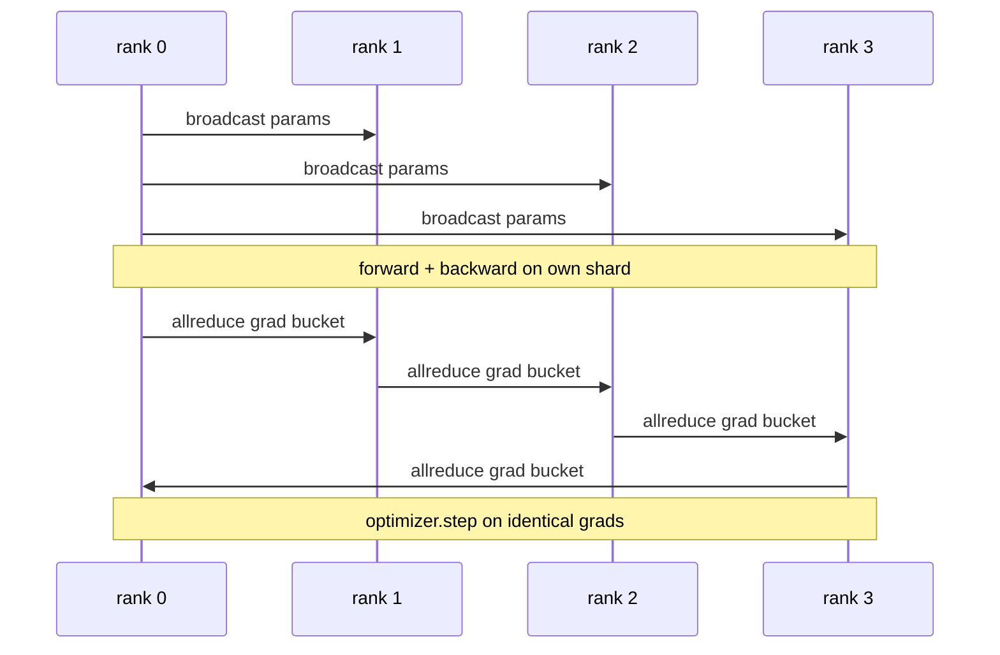

# 数据并行从零实现

> 分布数据并行是所有降低的顶部的子. 包装一个模型,从排列0播放最初参数,使每个排列开始相同,安装一个向后的子在每个参数上,产生降低梯度的全部降低,其余是梯度下降.整个模式是200行.

> **【中文解读】**分布数据并行 (DDP) 本质上是所有减小的上一组子:构建时把初始参数从排列0 广播出去,保证每个排列 起点一致;再给每个参数装一个反向子,对梯度发起所有减小;剩下的就是普通的梯度下降;;整个模式只需200 行. 本课在CPU +o 上从零复刻它,并使用"单进程逐排列 顺序训练  DDP 四排列 训练"的逐步参数等价格测试证明梯度同步正确.

> **【拓展：分布式训练路线→把 76 课的原语变成训练系统】**本课是分布式训练路线(76-81) 第二站:76 课实现集合通信原语,本课把所有减少+广播 接收可训练的数据并行循环,78 课 ZeRO 用减少_散射 替换对参数所有减少、79 课流水线并行、81 课端到端组装.真世界对应物是PyTorch 官方DP工业界大模型预训练的默认起点(Megatron-LM、HuggingFace加速 下都是它) ⋅本课的"桶化+通信重叠"正是官方DP 性密的核心所在.

>  **【前置】**学本课前请先掌握:(1) 19·76(集合通信原语从零实现) 全部减少与广播的语义和带宽账;(2) 19·42-46 训练端到端路线单进程训练循环、梯度累积、混合精度;(3) PyTorch 基础:`nn.Module`,我知道.`loss.backward()`优化器步骤

**Type:** Build | **类型:** 动手实践
**Languages:** Python | **语言:** Python
**Prerequisites:** Phase 19 Track C lessons 42-49 | **前置知识:** Phase 19 Track C 第 42-49 课
**Time:** ~90 min | **时间:** 约 90 分钟

## 学习目标

- 电线`DistributedDataParallel`形包装,可传输初始参数,并将向后降低梯度.
  中文翻译:接线一个 `DistributedDataParallel`形状的包装器:广播初始参数、反向传播后所有降低梯度──
-  Spawn N CPU 排名为`torch.multiprocessing.spawn`通过文件的约会.
  中文翻译:用`torch.multiprocessing.spawn`在黑暗后端,以文件为基础的会议方式发出N CPU级别.
- 通过对相同数据进行测量,并显示每个步骤参数等效率来证明梯度同步正确性.
  中文翻译:使用相同模型在相同数据上进行序列训练,逐步展示参数等价,从而证明梯度同步的正确性.
- 保护使用桶 (渐变融合) 和重叠 (后退时电流) 作为将工作的DDP转化为生产DDP的两个变化.
  中文翻译:为"桶化 (梯度融合) 与重叠 (重叠) 反向期间通信) 是把能运行的DP变成生产级DP的两处改动"做辩护.

## 问题 问题引入

> **【中文解读】**本节讲数据并行动机与两条失败模式――动机:120亿参数+12GB 激活放进一个消费级GPU,即便放下也需要训练数周数据并行切割批量到N个级别,各个片的前向/反向,每步将梯度求和,N份副本保持一致.失败模式一:不同步梯度,N份副本第二 已发散,那不是"模型更多数据",而是一个N个恰好共享初权独立模型――失败模式二:同步完成了逐步差距,无重量,无桶化),网络成瓶、GPU等网线――DDP让步步率几乎对待计算.

一亿参数模型,具有12GB的激活,不适合于一个消费者GPU.即使它适合,训练也需要几周.数据平行将批量分为N排行,每个排行计算其碎片的前后,并且在每个步骤上每个排行的梯度被总和,因此所有N副本都保持相同.总的梯度是优化器步骤.

> 一个有120亿参数,12GB的激活模型放入单张消费级GPU――就算放下,训练也需要数周――数据并行把批量分成N个级别,每个级别在自己的分片上计算向前和向反,并每一步把所有级别的梯度求和,让所有N份副本保持一致――求和后的梯度就是优化器依赖的步骤东西――

没有梯度同步,N复制器通过步骤2分离. 模型不再是"一个模型训练在更多数据"的,它是N个独立的模型, 由于梯度同步不佳 (每参数每次减少一个,没有重叠,没有桶) 网络是瓶, 由于DDP的技术, gradient同步几乎与计算相比自由. 标准的 PyTorch DDP 通过将梯度加上,重叠下层的倒退,并使用NCCL在NVLink上实现这一目标. 我们可以用GLOO在CPU上做这三件事,并学习相同的课程.

> 不做梯度同步,N 份副本到第二步就发散了――模型不再是"使用更多数据训练的模型",而是N 恰好共享初级权重的独立模型――梯度同步做得不好――每参数一次都减少了、无重叠、无桶化) 当网络成为瓶,GPU 着等网线――DDP的手艺是让梯度同步相对计算几乎免费――权威的PyTorch DDP 靠梯度桶化、所有减少与下层反向重叠以及在NVLink上使用NCCL达到这一点――我们可以在CPU上使用 gloo做三件事,学习同样的全部教训――

## 概念的核心概念

> **【中文解读】**只有三个集群通信动作:初始化时从0级播放 参数 证据起点一致) 逆向后对每个梯度所有减少) 优化器步骤 在平均值梯度上) 有时播放缓冲区 (缓冲区) 



### 需要DDP的三个操作

| Stage | Collective | Why |
|-------|-----------|-----|
| Init | broadcast from rank 0 | Every rank starts with the same parameters |
| After backward | allreduce of each grad | The mean gradient is what the optimiser steps on |
| Sometimes | broadcast of buffers | Batchnorm running stats stay synchronised |

> 表格翻译:初始化阶段从0级播放每个级别以相同参数起步;反向传播后对每个梯度所有减优化器步骤的均值梯度;有时播放 缓冲区BatchNorm 运行统计量保持同步

### 为什么是恶意而不是总数

> **【中文解读】**单级调好学习率在四级上照用,因为每步梯度量级不变――不除的SUM 逼你每次改变集群规模都重调学习率――DDP 包装SUM 并做除法;本课照做――

平均值与世界大小不变:一个排列调节的学习率在四个排列上运行,因为每步梯度大小不会改变.没有分数的Allreduce-SUM迫使你每次改变集群大小时重新调整学习率.DDP将SUM卷起来并分开;在课中做同样的事情.

> 单级上调好的学习率放到四个级别上仍然有效,因为每步上调量级没有变化.

### 为什么桶梯度

> **【中文解读】**一个变压器有几千个参数张量――逐张量全部减少 要把 gloo 延迟下限付几千次――DDP 把梯度组成约25 MB的桶、每桶一次全部减少:线上总字节不变,但延迟被桶摊薄――本课的小模型把所有梯度装入一个桶;重要的是结构能迁移到真实模型――

一个变压器有数千个参数子.每子的一个 allreduce 支付了黑暗延迟地板数千次.DDP 将梯度分为25 MB 桶,并发出一个 allreduce 桶.相同的总字节在线线上移动,但延迟在桶上被折扣.对于课程的小模型,我们将所有东西分为一个桶;结构是传递的.

> 一个变压器有几千个参数张量――每张量一次全部减小 要把全度放入一个桶,每桶只发出一次的梯度约25MB桶,每桶只发出一次全部减小――线上移动总字节相同,但延迟被薄到桶上――对本课的微型模型,我们把全部梯度放入一个桶;能迁移到真实模型是这个结构――

### 为什么要着种子

> **【中文解读】**种子纪律是隐秘的坑:每个级别必须`torch.manual_seed(seed + rank)`为了洗牌,`torch.manual_seed(seed)`用于参数初始化――共享种子 = 每个级别 查看相同批量 顺序(数据并行失效);参数用级别 专属种子 = 初始参数相差浮动epsilon,梯度同步再也保证不了副本一致――种子模式写错,参数等价格测试第 1 步就挂着――

每个级别都必须呼叫`torch.manual_seed(seed + rank)`为了乱,但`torch.manual_seed(seed)`参数 init.单个共享种子意味着每个级别都看到相同的批量顺序 (失败数据平行);参数的级别特定种子意味着初始参数不一致通过浮动epsilon和梯度同步不再使复制品相同.

> 每个级别都必须为洗牌调用`torch.manual_seed(seed + rank)`、为参数初始调用`torch.manual_seed(seed)`△单一共享种子意味着每个级别 看到相同的批次 顺序 DATA并行失效;参数用级别 专属种子意味着初始参数相差浮动 epsilon,梯度同步无法再让副本保持一致──种子模式写不对,参数等价格测试第 1 步就失败了──

```figure
ci-ddp-grad-sync
```

## 建立它,实现它.

> **【中文解读】**代码四件套:`MiniMLP`(三层MLP,第二级收又足以暴露连接);`DistributedDataParallel(model, world_size)`(构造时广播参数,`sync_grads`把所有减少求和后的梯度除以世界_大小);`worker`(完整训练循环:gloo初始化、前向、反向、同步、步步);`_reference_single_process_loop`(单进程顺序走同样批量,供测试做逐步字节级参数等价比对) 运行输出逐步对比表:单进程与4级DDP的损失曲线和参数校验和一致到浮动epsilon这是梯度同步正确的证明

`code/main.py`执行:

> `code/main.py`实现了:

- `MiniMLP`具有3层的MLP,足以在几秒钟内融合,足以暴露电线.
  翻译: 中文`MiniMLP`接线问题,小到几秒收,大到能暴露接线问题.
- `DistributedDataParallel(model, world_size)`果:在构建时发射节目,返回一个包装`sync_grads`总数和总数的毕业生按世界大小分.
  翻译: 中文`DistributedDataParallel(model, world_size)`构建时广播参数,返回一个包装器,其`sync_grads`把所有 累加求和后的梯度除为世界_尺寸.
- `worker(rank, world_size, ...)`                                       `torch.distributed`开始在暗,向前,向后,同步,步骤.
  翻译: 中文`worker(rank, world_size, ...)`完整训练循环`torch.distributed`开始化,前向,反向,同步,步骤.
- `_reference_single_process_loop(...)`测试的结果:在每一步后,测试对字节等参数等效的测试中,
  翻译: 中文`_reference_single_process_loop(...)`单级上使用相同数据序列训练相同模型,供测试做每一步后字节级相等参数等价比对――

运行它:

> 运行:

```bash
python3 code/main.py
```

输出:一个步骤训练表,将单个过程损失和参数检查数与4行的DDP运行相比较.两个路径产生相同的损失曲线,以浮动epsilon,证明梯度同步是正确的.

> 输出:一张逐步 训练表,对单进程的损失 和参数校验和与4级DDP运行的结果――两条路径产生到浮动的圆为止一致的损失曲线,证明梯度同步是正确的――

## 产品的模式在自然中

> **【中文解读】**三条把DPP炼到能上生产的模式: 1) 找出未使用参数条件跳过的前向路径 (提前退出、MOE路由) 让部分参数没有梯度,但DP的桶就绪子仍然会等它们,一切减少死锁;`find_unused_parameters=True`让DP 归约前先看哪些参数有梯度,代价是每步一次图遍历;`static_graph=True`预计算桶调度,每步省几毫秒,10000步下来可观;`no_sync()`上下文管理器暂停反向后所有减少,忘记它就把所有减少 白做 K 次 次.

三个模式使DDP硬得足以运输.

> 为了使DDP加固到可上线.

**Find unused parameters.**某些前进路径会条件下跳过参数 (早期出口,专家混合路由器).跳过参数没有梯度,但DDP的桶式仍然等待它们,并减少了局. `find_unused_parameters=True`价格是每步走图,所以不要把它放下,除非你的前行分支.

> **找出未使用参数。**一些前向路径会有条件跳过参数 (前退出,混合专家路由器) .被跳过参数没有梯度,但DP的桶就绪子仍然等着它们,所有减少就死锁了.`find_unused_parameters=True`告诉DP在回归前看哪些参数得到了梯度. 价格是每一步一次图遍历,所以除非你的前向有分支,否则别开.

**Static graph optimisation.**,当前的步骤稳定,`static_graph=True`预算节省每一步几毫米,而这些节约在1万步.

> **静态图优化。**当前向跨步稳定时,`static_graph=True`让DDP预计算桶调度――这个优化在规模上很重要:预计算每步省下几毫秒,在一万步上复利累积――

**Gradient accumulation needs care.**积累在K微分钟内的梯度,而不同步每个微分钟,是10倍的吞吐量获胜.`no_sync()`忘记管理员,你就无用地减少K次,吞吐量下降到地板.

> **梯度累积需要小心。**跨 K 个微量积累梯度 不逐渐微量同步,是10倍的吞吐提升.`no_sync()`暴露为暂停反向后降低的上下文管理器――忘记这个管理器,你就白白降低了 K 次;吞吐跌倒回谷底――

## 用它实现框架

生产模式:

> 生产用法:

- **PyTorch DDP.**法规的实施.`torch.nn.parallel.DistributedDataParallel(model)`电线的互联,重叠,以及无_sync 环境.
  翻译: 中文**PyTorch DDP。**权威实现.`torch.nn.parallel.DistributedDataParallel(model)`接好了桶化,重叠和无_sync 上下文.
- **HuggingFace Accelerate.**增加一个处理的发射器`torchrun`包装的模型和包装,同样是盖子下面的DDP.
  翻译: 中文**HuggingFace Accelerate。**加一个处理`torchrun`环境变量和模型包装的启动器.
- **Megatron-LM data parallel.**结合大型号的DDP和子平行;数据平行部分是相同的全部减后后回落模式.
  翻译: 中文**Megatron-LM 数据并行。**为大模型把DDP和张量并行组合;数据并行那一则就是同一个"反向后全部减少"模式.

## 运送它.

课程78 (ZeRO分化) 将每参数allreduce取代为 reduce_scatter,因此每个级别只存储其优化状态的分化.课程81将DDP与ZeRO组合到端到端演示中.

> 第78课 罗 分片) 用减少_分散 替换对参数所有减少,让每个级别只存储优化器状态分片. 第81课 将DP和罗组合进端演示.

## 练习题

1. 添加可配置尺寸的梯度桶,并在更深层次的模型上测量加快与每参数减少一项的速度.
   中文翻译:加可配置大小的梯度桶,在更深的模型上测量相对"每参数一次减少"的加速.
2. 实施`no_sync()`作为一个环境管理器,并验证梯度积累与K微型相匹配的单个过程基线.
   中文翻译:把 `no_sync()`实现为上下文管理器,验证 K 个微批次上的梯度累积与单进程基线一致.
3. 添加一个`find_unused_parameters`时时前进者跳过一个MLP层;如果没有旗,跑步将会陷入局.
   中文翻译:加一个 `find_unused_parameters`模式,让前向偶尔跳过某个MLP层;不开这个标志运行应死锁.
4. 取代 gloo `torch.distributed.barrier()`只有同步,以感觉到所有降低和屏障同步之间的区别.
   中文翻译:把光变成只用`torch.distributed.barrier()`基于所有减少与基于障碍的同步的差异.
5. 测量梯度同步上层费用为批量1,16,256的步骤时间的小部分,并解释扩展.
   中文翻译:测量批量为1、16、256 时梯度同步占每步时间的比例,并解释其延伸规律.

## 关键词 快速查找表

| Term | What people say | What it actually means |
|------|----------------|------------------------|
| DDP | "Data parallel" | Wrapper that broadcasts params and allreduces grads each step |
| Bucket | "Fuse grads" | Group N small allreduces into one large one |
| Overlap | "Hide comm" | Issue allreduce while later layers still computing backward |
| no_sync | "Accumulate" | Skip the post-backward allreduce for gradient accumulation |
| find_unused | "Branchy forward" | Detect parameters with no grad before reducing |

> 术语对照:DDP=数据并行包装器(每步广播参数、allreduce 梯度)、Bucket=桶(把N 次小的全部减少 组成一次大)、Overlap=重叠(后面层还在计算反向时发起全部减少)、no_sync=梯度累积时跳过反向后的全部减少、find_unused=归约前检测没有梯度参数(分支前向)。

## 继续阅读 继续阅读

- [PyTorch DistributedDataParallel docs](https://pytorch.org/docs/stable/generated/torch.nn.parallel.DistributedDataParallel.html)
  中文翻译:PyTorch 分布数据并行 官方文档
- [PyTorch DDP internals tutorial](https://pytorch.org/tutorials/intermediate/ddp_tutorial.html)
  中文翻译:PyTorch DDP 内部机制教程桶化与重叠子的官方讲解
- [Li et al, PyTorch Distributed: Experiences on Accelerating Data Parallel Training](https://arxiv.org/abs/2006.15704)
  中文翻译:李等人的 PyTorch 分布 论文官方DP设计经验
- 第十九阶段 第七十六课 - 集体DDP建立在
  中文翻译:第19阶段 第76课DDP 基于构建的集合通信原语
- 第19阶段 第78课 - ZeRO碎片取代每参数所有减小的减小_分散
  中文翻译:阶段19 第78课ZeRO 分片用减少_分散 替换逐参数全部减少
