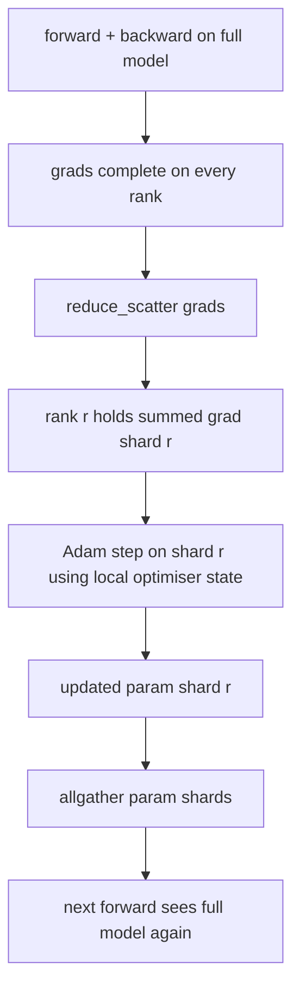

# 泽罗优化器状态分片

> 亚当每参数存储两个时刻估计, 具有56GB的优化状态. 泽罗第1阶段将N级别的数量分成零件;每个级别拥有优化器的1/N. 在当地的步骤之后,更新的参数片段回放,每个级别重建完整的模型,下一步开始. 胜利是训练堆中最大的单个分配的线性记忆下降.

> **【中文解读】**本课实现ZERO阶段1:把优化器状态下 (Adam 一阶矩、二阶矩、fp32 主副本) 按级 分片到N 份,每张卡只持有1/N──反传完成后不再全减整条梯度,而是减少_散布每级只收到自己那段梯度的求和结果;本级使用自己的优化器状态分片执行Adam 步,再把更新后的参数分片全部聚集回去,所有级重建完整模型进入下一步.

> **【拓展：显存墙→ZeRO 三级分片→FSDP】**训练大模型的第一瓶往往不是算力而是显存:混合精度 + Adam 下每个参数约16 字节(fp16 参数与梯度共4 字节,fp32 主副本与两个矩共12 字节),7B 模型单卡需要 112 GB──ZeRO(DeepSpeed,2019) 把"每卡全量复制"分成三级:阶段1 分优化器、状态阶段2 再分梯度、阶段3 连参数也分PyTorch FSDP的`FULL_SHARD`实际上,它是"几乎免费"的阶段:带宽不、显存线性降低.

>  **【前置】**学本课前请先掌握:(1) 阶段19 · 76减少_散布/聚集等集合通信原语,本课的 `step()`直接建立在它上;(2) 阶段19 · 77瓦尼拉DP的全减梯度同步,本课是它的显存优化版;(3) 亚当优化器一阶矩/二阶矩概念──后续接:课80 用本课分片状态做检查点,课81 把DDP+ZeRO组装成端到端训练──

**Type:** Build | **类型:** 动手构建
**Languages:** Python | **语言:** Python
**Prerequisites:** Phase 19 Track C lessons 42-49 | **前置知识:** Phase 19 Track C 课程 42-49
**Time:** ~90 min | **时间:** 约 90 分钟

## 学习目标

- 切片优化状态 (第一时刻,第二时刻,fp32主副本) 在N排列中,因此每个排列拥有1/N.
  中文翻译:把优化器状态 ((一阶矩、二阶矩、fp32 主副本) 分片到N 个级别,使每个级别只持有1/N。
- 使用 reduce_scatter 传递每个级别的分数,然后将所有分数汇集到更新的参数分数中.
  中文翻译: 用减少_分散 让每个级别只得到自己分片的梯度求和,再用所有把更新后的参数分片广播回去.
- 计算第1阶段,第2阶段,第3阶段的存储存储表,与尼拉DP进行计算.
  中文翻译:对照香DDP 计算阶段 1、阶段 2、阶段 3 的显存节省表――
- 根据模型大小和带宽预算,捍卫1级与2级与3级的选择.
  中文翻译:基于模型规模和带宽预算论证应选阶段1、阶段2 还是阶段3──

## 问题 问题引入

> **【中文解读】**本节算清"钱花在哪里"――尼拉DDP在每个级别上全量复制参数,梯度和优化器状态;7B 混合精度模型每级别需要14+14+28=56GB,其中优化器状态是最大的项目,也是最容易分片的项目它只在优化器步骤中被触碰,前向和反传都不到.ZeRO-1的巧思是使用减少_散射 替换所有减:带宽代价不变:带宽成本不变(所有减本来就等于减少_散射 + 聚),优化器存储显而出除为N.

尼拉DDP复制了一切:参数,梯度和优化状态在每个级别上都存在.对于fp16中的7B参数模型,这意味着每级别14GB参数,14GB梯度和28GB优化状态.优化状态是最大的术语,而且最容易碎碎片化,因为它只在步骤中触摸,而不是前进或后退.

> 范尼拉DP 把一切全部量复制:参数,梯度,优化器状态在每个级别上都完整存在――对fp16的7B参数模型,这意味着每个级别14GB参数,14.GB梯度,28.GB优化器状态――优化器状态是最大的,也是最容易分片的,因为它只在步骤中被触碰,前向和反传都不到.

RO第一阶段将优化状态缩小. 每个级别都包含亚当时刻的1/N. 后退, ZeRO 没有把全梯度降低,而是把它地步降低,所以每个阶层只能得到其碎片的总梯度. 排名将优化步骤应用到其主要参数的碎片. 更新的参数分片然后全部聚在一起,所以每个级别都有下一个前进的完整模型. 优化器内存下降了N. 每步线路流量与DDP相同:一个减少_散射加一个全部等于一个所有减少带宽. 记忆力胜利,输出力保持.

> 泽罗阶段1 分片优化器状态――每个级别 持有1/N的亚当矩――反传之后,泽罗不再减少完整梯度再本地步进,而是减少_散布,让每个级别只收到自己分片的求和梯度――这个级别对自己主参数分片执行优化器步.

## 概念的核心概念



### 泽罗的阶段

> **【中文解读】**这张表是本课的账本:DDP 什么都不分,每级 显存 = 参数 + 梯度 + 优化器全量;ZeRO-1 仅分优化器状态;ZeRO-2 再分梯度(需要梯度分片积分逻辑,但带宽不变);ZeRO-3 连参数也分(即FSDP),代价是每层前向和反传都要聚集──选型经验:优化器状态占存大头,阶段1是最便宜的胜利;参数显存也不住时阶段2/3,使用通信变存显现. 本课程完整实现阶段1──

| Stage | What is sharded | Memory per rank | Comm per step |
|-------|----------------|------------------|---------------|
| DDP | nothing | params + grads + optim | 1x allreduce |
| ZeRO-1 | optimiser state | params + grads + optim/N | 1x reduce_scatter + 1x allgather |
| ZeRO-2 | optim + grads | params + grads/N + optim/N | 1x reduce_scatter + 1x allgather |
| ZeRO-3 | optim + grads + params | params/N + grads/N + optim/N | 1x allgather per layer + 1x reduce_scatter per layer |

阶段1是最便宜的胜利,因为优化状态占据预算.阶段2需要梯度分片积累逻辑,但带宽是相同的.阶段3 (FSDP) 为每一个前后层支付通信,获得参数分片内存下降.课程全面实现阶段1.

> 阶段1是最便宜的胜利,因为优化器状态主导显存预算――阶段2需要梯度分片累积逻辑,但带宽相同――阶段3(FSDP) 为每次前向和反传支付逐层通信,换取参数分片带来的显存下降――本课程完整实现阶段1――

### 记忆的数学,实数

> **【中文解读】**混合精度 + Adam 下每个参数的显存构成:fp16 参数 2 字节、fp16 梯度 2 字节(前向/反传需要全量),fp32 主副本、一阶矩、二阶矩各 4 字节(只有优化器用,可以分片) ・瓦尼拉 合计 16P 字节;ZeRO-1 变成 4P + 12P/N──N=8 时 16P→5.5P──降低 65%),N=64 时降至4.19P──降低 74%) 收益随着N 增长但逐渐和,下是 4P──

对于采用 Adam 混合精度训练的P参数模型:

| Term | Vanilla | ZeRO-1 | Why |
|------|---------|--------|-----|
| fp16 params | 2P bytes | 2P bytes | needed for forward |
| fp16 grads | 2P bytes | 2P bytes | needed for backward |
| fp32 master copy | 4P bytes | 4P/N bytes | only the optim uses it |
| fp32 first moment | 4P bytes | 4P/N bytes | only the optim uses it |
| fp32 second moment | 4P bytes | 4P/N bytes | only the optim uses it |
| Total | 16P bytes | 4P + 12P/N bytes |   |

在N=8时,尼 16P,ZRO-15.5P,下降65%.在N=64时,尼 16P,ZRO-14.19P,下降74%.

> 时:尼 16P,ZeRO-1 5.5P,降低65%──N=64时:尼 16P,ZeRO-1 4.19P,降低74%.──

### 为什么减_散射击所有减-然后-分

> **【中文解读】**为什么要减少_散射而不是"先减少 再切片":所有减少 让每个级别都得到完整的求和梯度,但对级别r 来说其中 (N-1) /N 的规则结果是白算的.减少_散射 精确递交每个级别自己拥有的片段;每个级别 字节数与所有减少相等.减少 本来就是减少_散射 + 收藏),只是后半被稍后的参数分片全部收藏 顶部.净线流量与DP 完全一致,存储却被切除.

总减给每个级别的全部总和梯度. 如果只需要分片r,那么降低的梯度的 (N-1) /N在r级别上会浪费. 降低_散射器提供了每个级别的分片;每级别的字节与allreduce相同 (因为allreduce是 reduce_scatter + allgather),但后面的第二半个部分被参数-shardallgather所取代. 网线与DDP相同,内存是分开的.

> 减小给每个级别的 完整的求和梯度.如果你只需要分片r,那么其中 (N-1) /N的规则结果在r上是被浪费的.减小_散射精确递交每个级别的分片;每个级别的字节数与减小相同.因为减小就是减小_散射 + 聚合),只是后半变为稍后的参数分片全部聚在一起.净线流量与DP完全相同,显存却被除除了.

```figure
cd-zero-shard
```

## 动手构建

> **【中文解读】**代码四件套:`flatten_params`现在,我们要去.`unflatten_into`把整个模型的参数包装成连续 fp32 向量平布局让"按排序分片"退化成一次简单的切片;`ZeroOptimizer`持有本级 的主副本与亚当矩分片;`step()`对平梯度做减少_散射"",对本级分片执行亚当"",再聚合 更新后参数;用4个光环 进程对3层MLP 训练20步,打印逐步损失 和与尼拉DP对照的显存表――重点看两个不变量:各级 最终参数范数一致(同步正确),优化器分片字节数 = 总量的1/N(分片正确) ――

`code/main.py`执行:

- `flatten_params(module)`其他`unflatten_into(module, flat)`单层的布局使得分类分类是一个简单的片段.
- `ZeroOptimizer(model, world_size, rank, lr)`拥有了"大版"和"亚当时刻"的阶级碎片.
- `step()`通过将"Reducer_Scatter"运行在平坦梯度上,将"亚当"应用到排列的碎片上,并将更新的参数收集到.
- 演示,训练一个3层的MLP20步骤,并印出每步的内存预算,

运行它:

```bash
python3 code/main.py
```

输出:每步损失,显示ZeRO-1的内存表在每个排列中保持1/N的优化状态,而DDP的完整副本.

> 输出:每步损失,以及一张显存表它显示 ZeRO-1 让每个级别只拥有1/N的优化器状态,而DDP 拥有全量副本.

## 产品的实际战斗模式

> **【中文解读】**三条实战经验:(1) 分片检查点是刚需ZeRO的优化器状态散落在各级别,检查点必须记录归属关系,80课专为解决这一问题;(2) ZeRO 天生是混合精度技术,被分片的就是fp32 主副本,不用混合精度等于白交显存税但没有fp16前向收益;(3) 阶段1近免费带宽显与DP相似的 N线性,降低,唯一成本是优化器分片的账记,生产默认阶段1,参数显存也只是阶段2/3的问题.

三个模式使Zero足够硬.

> 三条模式让ZERO 足以投入生产.

**Sharded checkpointing matters.**泽罗-1的优化状态分为各级;检查点必须记录哪个级别拥有什么.80课程构建了分碎的检查点宣言,重启了同样的世界规模的泽罗运行.没有它,保存的状态是无法读取的重启时.

> **分片检查点很重要。**泽罗-1的优化器状态分散在各级别;检查点必须记录哪个级别 拥有什么. 课 80 构建的分片检查点清单能在相同的世界规模下恢复泽罗运行.

**Mixed precision is the point.**采RO是一种混合精度技术; fp32 主版是碎片的.运行 ZeRO 没有混合精度支付了 fp32 主机上的内存税,而没有相应的 fp16 前进胜利.生产运行总是与自动或 bf16 重量对齐 ZeRO.

> **混合精度才是意义所在。**泽罗是混合精度技术;被分片的就是fp32 主副本──不用混合精度跑 ZeRO,等于为fp32 主副本交出显存税但不到fp16前向收益──生产运行总是把 ZeRO与autocast或bf16 权重配对使用──

**Stage 1 is a near-free win.**通信带宽与DDP相同.存储存储在N中是线性的.唯一的成本是优化器分片的会计管理. 产量堆默认将进入第1阶段,除非参数分片存储也是问题;然后第二或第三阶段交易通信存储.

> **Stage 1 是近乎免费的胜利。**带宽上通信与DDP完全相同. 显存储省长随线性增长. 唯一的成本是优化器分片的账记.

## 用它实现框架

> **【中文解读】**工业实现与生产框架的应对关系:DeepSpeed ZeRO是参考实现;PyTorch FSDP是原生等价格`SHARD_GRAD_OP`对应ZERO-2`FULL_SHARD`应对 ZeRO-3);HuggingFace加速使用统一配置封装前二者──学完本课再阅读它们的配置项,每个段都能对自己写的代码──

生产模式:

- **DeepSpeed ZeRO.**参考实施`deepspeed_config.json`选择阶段1/3和分区尺寸.
  翻译: 中文**DeepSpeed ZeRO**为了实现,`deepspeed_config.json`选择阶段1/3 和分区大小──
- **PyTorch FSDP.**鱼原生同等.`ShardingStrategy.SHARD_GRAD_OP`是ZERO-2;`FULL_SHARD`现在,我们要做什么?
  翻译: 中文**PyTorch FSDP**PyTorch 原生等价物,`ShardingStrategy.SHARD_GRAD_OP`这就是ZERO-2,`FULL_SHARD`这就是ZERO-3.
- **HuggingFace Accelerate.**罩着深度速度和FSDP在一个统一的配置.
  翻译: 中文**HuggingFace Accelerate**用统一配置同时封装DeepSpeed和FSDP──

## 运送它.

第79课 (管道平行) 是直角分断轴:而不是在同一模型中分断优化状态,管道分断层跨行. 第81课组建了DDP + ZeRO在端到端演示中.

> 课程 79 ((流水线并行) 是正交的分片轴:它不是把同一个模型的优化器状态分片,而是把层分片分成各级.

## 练习题

1. 通过碎片梯度扩展到ZERO-2:每个级别只存储其碎片梯度,通过向后零化非碎片部分来实现.
   中文翻译:扩展到ZERO-2分片梯度:每个级别只存留自己分片的梯度,做法是反传后把非本分片部分清零──
2. 添加一个存储器配置文件,将实际的fp32字节使用量在0级与公式预测中打印.
   中文翻译:加一个显存剖析器,打印排名 0 上实际fp32 字节数与公式预测的对照──
3. 测量尼拉DDP与ZERO-1的每步墙钟时间,并分解成前进,后退,通信.
   中文翻译:测量尼拉DP与ZRO-1的每步钟时间,并分解为前向、反传、通信三部分──
4. 根据 ZeRO-1 实现梯度切割:L2标准必须通过所有碎片计算在地方标准的二方体中.
   中文翻译:在 ZeRO-1 下实现梯度剪切:L2 范数必须通过本地范数平方做全部减小、跨全部分片计算――
5. 通过 allreduce而不是 reduce_scatter 实现"天真 ZeRO",测量电线时间差异.
   中文翻译:实现一个用 reduc_scatter 的"朴素 ZeRO" 实现一个用 allreduce 代替 reduce_scatter 的测量线上时间差异,用数字论证 reduce_scatter 的选择──

## 关键词 快速查找表

| Term | What people say | What it actually means |
|------|----------------|------------------------|
| ZeRO-1 | "Shard the optimiser" | Each rank holds 1/N of fp32 master + Adam moments |
| ZeRO-2 | "Shard grads too" | Each rank also drops the non-shard gradients after reduce_scatter |
| ZeRO-3 | "Shard params" | Each rank holds 1/N of fp16 params; allgather per layer in forward |
| Master copy | "fp32 weights" | The high-precision parameter copy the optimiser updates |
| Reduce_scatter | "Split the sum" | Deliver each rank only its shard's summed gradient |

## 继续阅读 继续阅读

- [Rajbhandari et al, ZeRO: Memory Optimizations Toward Training Trillion Parameter Models](https://arxiv.org/abs/1910.02054)
  中文翻译:ZeRO论文原典三级分片的分类方法与通信量分析
- [DeepSpeed ZeRO documentation](https://www.deepspeed.ai/tutorials/zero/)
  中文翻译:DeepSpeed ZeRO 官方文档 舞台 配置与生产用法
- [PyTorch FSDP documentation](https://pytorch.org/docs/stable/fsdp.html)
  中文翻译:PyTorch FSDP 官方文档ZeRO-3 的原生等价实现
- 第十九阶段 第七十六课 - 减少_分散和聚合
  中文翻译:第19阶段 第76课 减少与所有人聚集的分离
- 阶段19课80 - 切片检查点, ZeRO国家必须使用
  中文翻译:阶段19课 80ZeRO 状态必须使用的分片检查点
