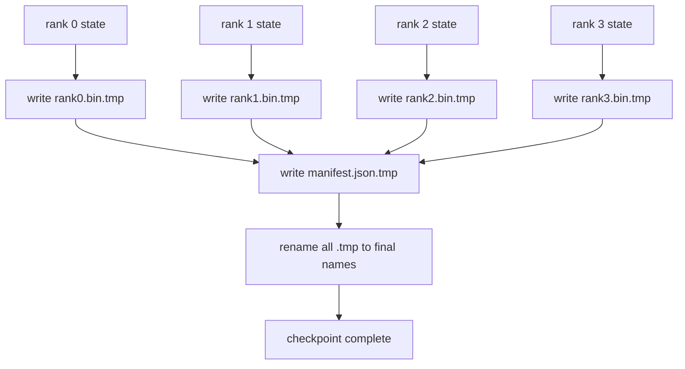

# 核检查点和核恢复点 分片检查点和核恢复点

> 节点失败每隔几小时就会停止70B参数训练工作. 检查点的格式决定你是否会失去30分钟或30小时. 一个分碎的检查站,并列写每个级别的分碎,并记录所有权在公开表中. 恢复将每个级别的分片从其自己的文件中加载, 重建状态在相同的世界尺寸, 原子写法可以防止一个半完成的检查点毒害下一个简历.

> **【中文解读】**本课解决分布式训练的"生命线"问题检查点──70B级训练任务每隔几小时就会被一个节点故障打断,检查点格式决定你损失30分钟还是30小时──分片检查点让每个级别并写出自己的分片文件,使用一个清单的记录归属;恢复时各级从自己的文件装载、在相同的世界规模下重建状态,优化器若无事继续进来──原子写作.

> **【拓展：单文件时代的痛→分片+清单成为业界标准】**单进程时代的检查点就是一个大文件;到多卡训练,把所有的状态聚焦到0级再写一个文件,把TB级数据压入一个网卡,写一次可能比训练一小时还久――DeepSpeed、PyTorch`torch.distributed.checkpoint`、NeMo 全部转向"每一个档案+JSON 清单+sha256 校验"的形态,PyTorch 官方甚至为跨世界规模 恢复引入了规划者机制――本课从零实现这一整套契约,并把三种失败模式 ((改变世界规模、分片数不符、写一半崩) 变成可测试的断言――

>  **【前置】**学本课前请先掌握:(1) 第78课ZeRO 优化器状态分片,本课保存的正是这种"每个级别 持有 1/N"的状态;(2) POSIX 文件系统语义(重名的原子性、fsync作用);(3) 第256章摘要的基本用法──后续接:第81课的端到端演示 在第10步保存分片检查点并验证字节级等的恢复──

**Type:** Build | **类型:** 动手构建
**Languages:** Python | **语言:** Python
**Prerequisites:** Phase 19 Track C lessons 42-49 | **前置知识:** Phase 19 Track C 课程 42-49
**Time:** ~90 min | **时间:** 约 90 分钟

## 学习目标

- 保存一个多级检查点作为一个每级分片文件加上一个记录哪个级别拥有什么的表格.
  中文翻译:把多个级别 检查点保存为每一个级别 一个分片文件,外加一个记录哪个级别 拥有什么的清单。
- 使用原子写模式 (写到临时路径,然后更名),这样一个崩盘中写永远不会产生半完成的检查点.
  中文翻译:使用原子写模式 (先写临时路径重新命名),使写到一半的崩绝对不会产生一半检查点.
- 从表格中恢复,验证对 fp16参数和Zero优化器状态的字节等级状态.
  中文翻译:从清单恢复,逐级验证 fp16 参数和 ZeRO 优化器状态都字节级相等.
- 保护表达式方案免受三种失败模式:世界规模变化,碎片数量不匹配和部分写.
  中文翻译:让清单方案 能防住三种失败模式:世界规模 变化、分片数不匹配、部分写入。

## 问题 问题引入

> **【中文解读】**本节算"汇聚写"账号:瓦尼拉 检查点将所有参数和优化器状态集成到0级,写入单个文件70B 模型就是1.1TB数据挤一张网卡,其余的级别全在空等,IO 宽度等于卡的网络链接中最慢.真实集群上这个步骤可能比之前一小时的训练还长,等于一天不存在下一个检查点. 分片检查点方向反转:每个级别并写自己的文件,集成带宽随群扩展;1TB 检查点从单级4小时到64分钟.

尼拉检查站将所有参数和优化状态读取到0级,收集,并编写一个文件. 对于70B模型来说,一个级别的网络端口是1.1TB的状态. 写作者阻碍了其他等级,因为他们忙等待聚会.  IO 带宽是单个GPU的网络链接最慢,而不是总数. 在实体集群中,收集然后写的步骤可能比上一次培训时间更长,这意味着工作人员每天都会出差不多一个检查点.

> 检查点把所有参数和优化器状态读入0级,收集 之后写单个文件. 对70B模型,这是1.1TB的状态挤满了一个级别的网络端口. 其他的每个级别都被此次写入阻碍,因为它们空等聚集完成.IO带宽是 GPU 的网络链接,而不是聚合带宽. 在真实集群中,收集-再写这个步骤可能比以前一个小时的训练还长,这意味着这个任务训练日不会在下一个检查点中生存.

碎片化检查站翻转了模式:每个级别都在平行地写出自己的碎片. 任何一块的记录可以让每块回归原来的位置. 总体写带宽尺度与集群. 一个1TB检查点需要4个小时通过一个排名,需要4分钟通过64个排名. 另外,手表给你一份不兼容的简历合同: 随着世界规模的变化, 部分写字可以检测到,

> 分片检查点把这个模式反过来:每个级别并行把自己的分片写入自己的文件. 清单记录哪个级别 拥有哪个分片,恢复时可以把每个分片放回原处.

## 概念的核心概念



### 显现式方案

> **【中文解读】**清单是检查点的"目录页面"──三个字段是承重墙:`world_size`让不同规模的重启响起失败而不是损坏;每个分片的`sha256`抓住部分写入或损坏;每分片的`param_shard_offset`和 `param_shard_numel`让装载器能把平参数张量按正确位置拼回去──加上`step`,我知道.`wall_clock_seconds`,我知道.`schema_version`恢复协议的全部真相来源.

```json
{
  "world_size": 4,
  "step": 1234,
  "wall_clock_seconds": 4521,
  "shards": [
    {"rank": 0, "path": "rank0.bin", "sha256": "...", "param_shard_offset": 0, "param_shard_numel": 65536},
    {"rank": 1, "path": "rank1.bin", "sha256": "...", "param_shard_offset": 65536, "param_shard_numel": 65536}
  ],
  "schema_version": 1
}
```

现在有三个场面承载.`world_size`让一个不同尺寸的简历大声失败而不是默默腐败.`sha256`部分或腐败的写作.`param_shard_offset`其他`param_shard_numel`按分片,让载体在正确位置重建平面参数子.

> 现在,我在做什么?`world_size`让不同规模的恢复响亮失败而不是损坏.`sha256`抓住部分写入或损坏的写入.`param_shard_offset`和 `param_shard_numel`让装载器在正确位置重建平参数张量――

### 原子写

> **【中文解读】**原子写的标准动作:每个分片写到`<name>.tmp`清单写到`manifest.json.tmp`后续改名,然后重新命名. 后续改名. 后续改名是原子的要么新文件完整在场,要么旧文件还是旧的. 最终改名是之前崩,上一个检查点仍然是"现役"版本;没有原子写,崩可能留下半个分片加一个指向它的完整清单,恢复时优化器已经污染了.

标准模式:写每一个碎片到`<name>.tmp`写下明文给`manifest.json.tmp`由于在一个文件系统中,一个文件的重命名是原子的.新文件完全存在或旧文件是.在最后的重命名之前的崩离开了前一个检查点,作为现实.没有原子写,一个崩可以留下一个部分碎片,一个现有表格指向它,负载破坏了恢复的优化状态.

> 标准模式:把每个分片写到`<name>.tmp`写清单`manifest.json.tmp`后续改名,然后重新命名. 后续改名是原子的. 新文件完整在场,旧文件还是旧文件. 最终改名是之前崩,上一个检查点仍然是现役版本.

### 系统必须防范三个故障模式

> **【中文解读】**把失败模式写成表格是为了变成测试用例:世界大小变了(N=8 的恢复去读N=4 的清单)→ 清单中的世界大小不匹配、响亮失败;分片数不符(排名*.bin 文件比清单少)→ 枚举分片、个个验证存在;部分写入(分片文件写到半截)→ 装载时 sha256 校验.

| Failure | Symptom | Defence |
|---------|---------|---------|
| World-size change | resume on N=8 with manifest from N=4 | world_size mismatch in manifest, fail loudly |
| Shard count mismatch | resume sees fewer rank*.bin files than shards in manifest | enumerate shards, verify every one exists |
| Partial write | shard file truncated mid-flush | sha256 verification on load |

每个辩护都早些时候拒绝了坏负担; 替代方案是沉默的腐败,

> 每种防御都在早期拒绝坏的装载;替代方案是静默损坏,在100步后损失才浮出水面.

### 为什么每位档案,而不是一个大档案

通过一个文件同时写`O_APPEND`在POSIX上使用字节一致的写字,但实际上,一个片段内的偏移跨度是MB大小区域,锁定占主导地位.当底层文件系统平行时,每级文件没有争议,并且从条纹中获益 (Lustre,GPFS).生产堆 (DeepSpeed,FSDP,NeMo) 都使用每级文件.

> 通过`O_APPEND`并发送单个文件在 POSIX 上写字节对齐的写法是可行的,但实践中单个分片内偏移跨越MB级区域,锁开销占主导地位.

```figure
ci-sharded-checkpoint
```

## 动手构建

> **【中文解读】**代码是一个完整的"保存-恢复-防错"链:`ShardManifest`数据类 持有方案并支持JSON 序列化;`save_sharded`用临时路径 + 改名的原子模式逐级 写二进制状态、最后写清单;`load_sharded`读清单、逐分片验 sha256、返回每一个级别的状态字典──demo 走三幕:字节级相等的往返验证、错误的世界规模 被拒绝、改分片被 sha256 抓住三种失败模式全部变成可运行断言,外加一个保留最近5份轮转演示──

`code/main.py`执行:

- `ShardManifest`上面的方案加上数据类`to_json`现在,我们要去.`from_json`现在,我们要去.
- `save_sharded(state_dict_per_rank, dir, step)`通过原子的时间,然后重命名模式,然后写出表格.
- `load_sharded(dir, expected_world_size)`检查每个碎片的 sha256 ,并返回每级状态指令.
- 复程测试:构建每级状态,保存,加载,断定字节等等.

运行它:

```bash
python3 code/main.py
```

输出: 4 个分片文件加上写出表格,然后用字节等等验证重新加载.

> 输出:写入4个分片文件加清单,然后重新装载并做字节级相等的验证.

## 产品的实际战斗模式

> **【中文解读】**三条生产经验:(1) 异步写检查点写线程化让训练继续,屏障挪到"下一个检查点开始前必须上一个已经完成",DeepSpeed 的 `async_io`就是这样做;(2) 两级存储先写本地NVMe(快),再异步上传S3/GCS(持久),清单带本地路径、上传清单带远端路径;(3) 轮转保留最近的K份(通常3-5),不轮转盘会在运行中写满、下一次保存直接失败──本课保持同步写,为了让每个步都看看.

只有三个模式使检查站变得硬得可以运输.

> 三条模式让检查点足以投入生产.

**Async write.**生产堆发出检查点写在单独的线程或过程,因此训练继续. 屏障在下一个检查点:不要开始下一个保存直到之前的完成.`async_io`课程保持写作同步,让步骤是可见的.

> **异步写。**生产把检查点写到单独的线程或过程上,训练可以继续.`async_io`标志做正是这样. 让每一步都看看.

**Local fast disk first, then async upload.**写到本地NVMe (快速) 然后与S3或GCS进行同步上传. 两层格式模式使集群中检查点保持恢复速度,同时将持久的副本出于集群用于档案.表格载有本地路径;上传表格载有远程路径.

> **先写本地快速盘，再异步上传。**先写到本地NVMe(快) 再异步上传到S3或GCS──两级模式让集群内检查点对恢复保持快速,同时往集群外发出一份持久副本做归档──清单携带本地路径;上传清单携带远端路径──

**Rotation matters.**生产运行保持最后的K检查点 (通常是3-5),并旋转最旧的.没有旋转,磁盘填满了运行中期,下一个检查点失败了.随着旋转,下一个保存首先删除了最旧的,从而释放了预算.

> **轮转很重要。**生产运行保留最近的 K 份检查点(通常是3-5),并轮转掉最旧的――不轮转,磁盘会在运行中写满,下一次检查点直接失败――有轮转,下一次保存先删除最旧的,出预算――

## 用它实现框架

> **【中文解读】**果: 果: 果: 果: 果: 果: 果: 果: 果: 果: 果: 果: 果: 果: 果: 果: 果: 果: 果: 果: 果: 果: 果: 果: 果: 果: 果: 果: 果: 果: 果: 果: 果: 果: 果: 果: 果: 果: 果: 果: 果: 果: 果: 果: 果: 果: 果: 果: 果: 果:`save_checkpoint(tag=step)`写每一个排名 文件加一个指向活跃标签的`latest`文件;PyTorch 的 文件`torch.distributed.checkpoint`用`Planner`决定每一个阶层的布局保存分片状态;`save_to_checkpoint`简单的数据

生产模式:

- **DeepSpeed checkpointing.** `deepspeed.save_checkpoint(tag=step)`编写每级文件和一个`latest`文件指向活跃标签.
  翻译: 中文**DeepSpeed 检查点** `deepspeed.save_checkpoint(tag=step)`写每一个档案,加一个指向活跃标签的`latest`文件.
- **PyTorch FSDP checkpointing.** `torch.distributed.checkpoint`保存碎片状态`Planner`根据每位排名的排名.
  翻译: 中文**PyTorch FSDP 检查点** `torch.distributed.checkpoint`用决定每一个级别的布局`Planner`保存分片状态――
- **NeMo.**绕着深速和FSDP的制服`save_to_checkpoint`增加元数据的API.
  翻译: 中文**NeMo**用统一的`save_to_checkpoint`封装深度速度和FSDP,并附加元数据.

## 运送它.

课81节节省了DDP+ZeRO的端到端运行的一个分断检查点,并将其重新加载到相同的世界规模,以证明简历合同有效.

> 课81 为端到端 DDP+ZeRO 运行保存分片检查点,并在相同的世界尺寸上重新装载,证明恢复契约成立.

## 练习题

1. 添加异步写:启动一个线程中的保存,让训练继续. 阻止下一个保存直到之前的保存完成.
   中文翻译:加异步写:把保存丢进线程让训练继续下去,下一次保存前阻塞直到上一次完成.
2. 添加一个`last_5_steps`转换:保持最新的5个检查点,在保存新的之前删除最旧的检查点.
   中文翻译:加一个 `last_5_steps`轮转:保留最近5个检查点,保存新的之前删除最旧的──
3. 加入仅使用CRC的快速验证路径,用于内部循环重装 (旋转将检查点转换为新的活跃点,没有完整 sha256).
   中文翻译:为内循环重载加一条仅CRC的快速校验路径(轮转让一个检查点成为新现役时无需完整 sha256) ⋅
4. 通过阅读表格,连接和重新分割,从N=4到N=8的碎片重平衡.
   中文翻译:加跨世界尺寸 装载:读清单、拼接、重新分片,实现N=4到N=8的分片再平衡──
5. 添加一个上传到一个假的S3 (第二个目录) 和写上传说明书. 捍卫两层存储政策.
   中文翻译:加上传到假S3(第二目录)并写上传清单,论证两级储存策略──

## 关键词 快速查找表

| Term | What people say | What it actually means |
|------|----------------|------------------------|
| Sharded checkpoint | "Per-rank save" | Each rank writes its own shard file in parallel |
| Manifest | "Index" | JSON file recording shard paths, offsets, and sha256 |
| Atomic write | "tmp then rename" | Write to .tmp then POSIX rename so a crash leaves the previous file live |
| Partial write | "Truncated shard" | A crash during write produces a corrupt shard; sha256 catches it |
| Rotation | "Keep last K" | Delete oldest checkpoint before writing new one to bound disk usage |

## 继续阅读 继续阅读

- [DeepSpeed checkpointing](https://deepspeed.readthedocs.io/en/latest/model-checkpointing.html)
  中文翻译:DeepSpeed 检查点官方文档分片保存/恢复与async_io
- [PyTorch torch.distributed.checkpoint](https://pytorch.org/docs/stable/distributed.checkpoint.html)
  中文翻译:PyTorch 分布式检查点文档规划机制与跨世界规模恢复
- [POSIX rename atomicity](https://pubs.opengroup.org/onlinepubs/9699919799/functions/rename.html)
  中文翻译:POSIX 规范重命名 条目原子写依据的权威来源
- 阶段19课程78 - 泽罗状态这个检查站是以保存
  中文翻译:阶段19课 78本检查点为之塑形的ZERO状态
- 第19阶段 第81课 - - 终端到终端的演示,回复保存的状态
  中文翻译:阶段19 第81课 端到端演示对保存状态做往返验证
