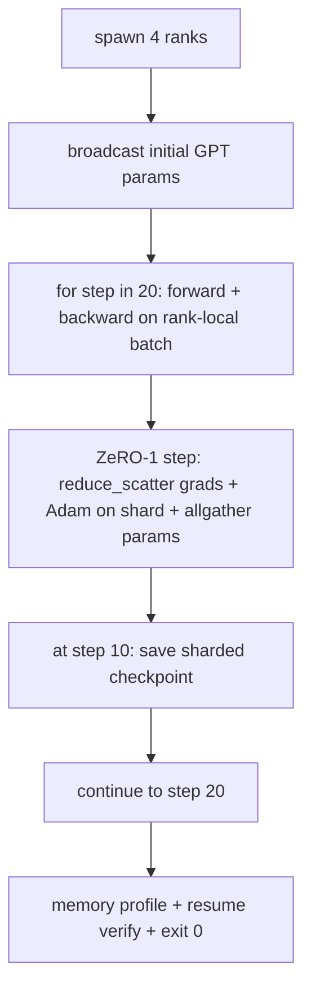

# 终端到终端分布式训练

> 课程76到80每个构建一个件.这是组装:一个小型的GPT训练在4个模拟列表中使用DDP进行梯度同步,ZRO-1用于优化状态分化,并在半路标志上进行分化检查点.演示程序运行20步骤,自动结束,打印损失曲线加上存储配置文件,并写出可重复的检查点.

> **【中文解读】**本课是分布式训练路线的总装:第76课集通信、77课DDP、78课DRO-1、80课DRO-1、80课分检查点,在这里拼成一个完整的训练循环4个模拟级 上训练一个微型GPT,DDP负责梯度同步,ZeRO-1 分片优化器状态,第10步写分片检查点,第20步跑后自显止,打印损失曲线+每级存像,并验证检查点可恢复.四个不变量是验收标准:丢失单次调调度,各级 参数一致一致,优化数量存储等于12P/N,检查点字节级等重量.

> **【拓展：总装是工程能力的分水岭】**每个组件单测通过不代表系统能运行这是软件工程的通病,在分布式训练中尤其致命:组合错误,症状是损失发散、检查点拒绝恢复、或显存应降反升.

>  **【前置】**学本课前请先掌握:(1) 课 76gloo 后端与文件 rendezvous;(2) 课 77初始参数播放的DDP 同步;(3) 课 78减少_散射 +亚当 分片 + 聚焦的ZERO-1 步步;(4) 课 80分片检查点与原子写――本课不引入新机制,只证明四者可组合――

**Type:** Build | **类型:** 动手构建
**Languages:** Python | **语言:** Python
**Prerequisites:** Phase 19 Track C lessons 42-49 | **前置知识:** Phase 19 Track C 课程 42-49
**Time:** ~90 min | **时间:** 约 90 分钟

## 学习目标

- 组建DDP (课77) 加上ZRO-1 (课78) 加上分断检查站 (课80) 成为一个训练循环.
  中文翻译:把DDP(第77课) + ZeRO-1(第78课) + 分片检查点(第80课) 组合进一个训练循环.
- 在一个小型合成体内训练一个2层变压器语言模型,
  中文翻译:在小型合成语料上跨 4 个模拟级别 把一个 2 层变压器 语言模型训练 20 步.
- 打印每步输失表,每级内存配置文件,以及一个检查点表,
  中文翻译:打印逐步损失表、每级 显存图,以及能在相同的世界尺寸上字节级相等恢复的检查点清单。
- 捍卫作文:每一首作品在早期课程中都可以独立测试,
  中文翻译:论证这个组合:每个部分在前面的课程里可独立测试,本课证明它们可以组合.

## 问题 问题引入

> **【中文解读】**毕业项目目的是"证明零件可以装在一起"――76到80 每课程各自带测试,各自成立;但真实训练同时使用所有原语组合错误,失散散,检查点拒绝恢复或每级 显存该缩反. 本课程的端到端演示使用四个不变量验证组合的正确性:

石头是证明这些碎片合适的证据. 第76课 实施集体 课77将他们包裹在DPD. 课程 78 缩小_散射的优化状态. 分析了管道. 第80课拯救了一个破碎的检查站. 每个课程都有自己的考验. 如果组合错误,损失会偏离,检查点拒绝恢复,或者每级记忆量会增加,当它应该缩小时.

> 毕业项目就是"零件能拼在一起"的证明―― 第76课实现集合通信―― 第77课把它们包装成DDP―― 第78课使用减少_分散 分片优化器状态―― 第79课分析流水线―― 第80课保存分片检查点―― 每课独立成立、各有测试―― 真实训练运行同时使用每个原语;如果组合错误,损失 散散、检查点拒绝恢复或每级 显存该时反――

本课程进行了端到端演示,验证了四种不变: (a) 漂浮噪音的20个步骤中损失单调减少, (b) 每个级别在每一步都保持相同的参数标准, (c) 每级优化器内存等于 ZeRO-1公式12P/N字节, (d) 步骤10的检查点重装字节等于重启. 演示自动结束:20步,单次命令,出口0.

> 本课运行端到端演示并验证四个不变量: (a) 20 步内损失 在浮点噪音下单调下降; (b) 每步每级 持有相同参数范数; (c) 每级 优化器显存等于 ZeRO-1 公式 12P/N 字节; (d) 第十步的检查点重启后字节级相等重载.

## 概念的核心概念



### 迷你GPT

> **【中文解读】**模型刻意做小:2 个变压器块、嵌入维32、4个注意力头、词表64、序列长16、批量4,几千个参数──大到可以踩遍每条连接决策(多头注意力走标准掩码路径、LayerNorm 有权重同步、LM 头是独立回词表的线性投影),小到20步 × 4个CPU级 几秒运行完毕──

模型是小的: 2个变压器块,嵌入式 32, 4个注意力头,词汇 64,序列长度 16,批量 4. 几千个参数. 足够大,可以执行每个线程决定 (多头注意力运行标准的掩盖路径;LayerNorm有重量进行同步;LM头是单独的线性投影回语音). 足够小,使4个CPU的20步数在几秒钟内完成.

> 模型刻意做小:2个变压器块、嵌入维 32、4个注意力头、词表 64、序列长 16、批 4,共几千个参数──大到能够踩遍每条连接决策(多头注意力走标准掩码路径;LayerNorm 有权重同步;LM 头是单独投影回词表的线性层),小到20步在4个CPU级上几秒运行完毕──

### 组成规则

> **【中文解读】**组合分工表是本课的核心设计:DDP播放只在构建时同步一次初始参数;ZeRO-1步 每步调用一次、取代优化器.步骤;分片检查点在第10步由排名0 经过所有收齐后写入;训练循环只管前向、反传、记忆损失──循环本身不知道减少_散射或 rendezvous 文件存在ZeRO 和检查点模块暴露的狭窄连接,循环只做组装.

| Lesson piece | What it owns | What it leaves to the loop |
|--------------|--------------|----------------------------|
| DDP broadcast | Initial parameter sync | One call at construct time |
| ZeRO-1 step | Gradient sync, master copy update, parameter broadcast | One call per step replacing optimiser.step |
| Sharded checkpoint | Persist per-rank state, manifest with sha256 | Called on rank 0 with state collected via allgather |
| Training loop | Forward, backward, loss logging | Calls the three above in order |

循环不知道 reduce_scatter 或 rendezvous 文件. ZeRO 和检查点模块暴露了循环构成的狭窄界面.

> 循环不知道减少_散射或 rendezvous 文件的存在――ZeRO 和检查点模块暴露于狭窄接口,由循环来组装――

### 为什么一个小的GPT而不是一个MLP

> **【中文解读】**简单的GPT多验证三件事:独立的LM头,本课为清晰起见不做权重共享,完整的GPT通常把LM头与词嵌绑定)、软max+交叉损失 (比MSE多得多多的价值边界情况) 以及"嵌入→注意力→MLP"的非对称前向――毕业设计还停在MLP上对检查不出组合是否正确处理层规和嵌入层的梯形――

课程77的MLP足以验证梯度同步. 一个小 GPT 增加了三个东西:一个单独的 LM 头在词汇上 (在这个课程中,解开为了清晰度; 完整的 GPT 通常将头绑定到代币嵌入), 软max+跨作为损失 (比MSE更多的数值边缘案例), 和一个不对称的前进 (嵌入,然后注意,然后每层MLP). 粘贴一个MLP的顶石将隐藏是否组合处理LayerNorm或嵌入层的格拉格形状正确.

> 第77课MLP 足够验证梯度同步――微型GPT 增加三件事:词表上的独立LM头;本课为清晰起见不做权重绑定;完整GPT通常把头部与代币嵌入绑定)、软max+交叉损失 ((比MSE有更多数值边界情况)、以及非对称前向嵌、再注意力、每层再MLP) ─毕业设计继续使用MLP会掩盖组合是否正确处理LayerNorm或嵌层梯度问题状.

### 自动终止的意思是出口0

循环运行一个固定的20步,然后出门.`while True`没有人干预,没有外部状态的恢复.一个终点石,你可以让它运行不受监督,并在完成时找到一个完整的日志,这是一个证明系统是正确的线程.如果任何块局,演示器永远不会回来,测试平台抓住它.

> 循环跑固定 20 步然后退出.没有.`while True`没有人工干预,没有从外部状态恢复.一个能无人值得运行,完整日志的毕业项目,才是证明系统连接正确的毕业项目.

```figure
ci-distributed-assembly
```

## 动手构建

> **【中文解读】**代码把四课的部分拼成一课:`MiniGPT`转变器+独立 LM头)`make_corpus`预测数据`_train_worker`(每一个排名 一份:广播初始化、跑循环、调 ZeRO步骤、第十步写分片检查点)`verify_resume`(主运行后在进程中重载第10步检查点,断言保存的主分片与内存快照逐字节相等) .

`code/main.py`执行:

- `MiniGPT`面具自警器和单独的LM头.
- `make_corpus(seed, total_tokens)`预测数据:
- `_train_worker`:每级发出;播出 init参数,运行循环,调用 ZeRO步骤,在步骤10上写下分断的检查点.
- `verify_resume`: 在主运行后,在过程中重新加载步骤-10检查点,并表示保存的主分片与内存快照相匹配.
- `main`编辑整个演示,打印损失表,内存配置文件和验证结果.

运行它:

```bash
python3 code/main.py
```

输出:一个20行损失表,一个每排的4行内存配置文件,一个检查点明示,以及成功的"回复验证"行.

> 输出:一张20行的损失表 、一个4行的每一个排名 显存图片、一个检查点清单,以及成功时的"回顾验证"一行.

## 产品的实际战斗模式

> **【中文解读】**三条把组合推向生产经验:(1) 按分钟而不是按步数做检查点步随序列长度和微批次数波动,10 分钟一存的节奏对不同规模模型等价;(2) 及早发现散反传后加纳纳 守卫和损失尖峰检查器,步 2 倍以上就回滚到一个检查点,让优化器走进显退化态;3) 跨级 聚合存像真实运行各级 显现不同级 最大流水线阶段的级 激活更多),生产日志 max + ⋅

对于真正的跑步,三种模式完成了构成.

> 三条模式为真实运行收尾这个组合――

**Checkpoint every K minutes, not every K steps.**步骤时间与次数长度和微分数量不同.一个10分钟的检查点序列不论模型大小如何都能捕获相同的计算.课程使用步骤为简单;生产使用墙钟为基础.

> **每 K 分钟存一次检查点，而不是每 K 步。**步时随序列长度和微批次数变化――10分钟一次检查点节奏无论模型多大都覆盖相同的计算量――本课程简单的起见按步数;生产用钟时间――

**Detect divergence early.**生产运行后添加一个后退的NAN保护器和损失峰值探测器;如果损失在一步中跳出超过2倍,然后滚回前检查点,而不是让优化者进入退化状态.课程的损失曲线是平滑的,因此保护器没有使用,但子仍然存在.

> **及早检测发散。**生产运行在反传后加 NaN 守卫和损失尖峰检测器;如果损失一步跳超过2倍,回滚到上一个检查点,而不是让优化器大步走进退化状态――本课的损失曲线平滑所以守卫不用,但子留下来――

**Aggregate the memory profile across ranks.**每级记忆在实运行中因级别而异 (最大管道阶段的级别具有更多激活).生产记录了数组中最大的数量加上平均值;课程打印了每级别,以显示公式匹配.

> **跨 rank 聚合显存画像。**实际运行中每一个级别 显存各不相同(持最大流水线阶段的级别 激活更多) ⋅生产日志记录跨级别的最大值加平均值;本课印每一个级别的值以显示公式吻合──

## 用它实现框架

> **【中文解读】**本课组合就是DeepSpeed 形态缩写:DeepSpeed 在一个配置下组合DDP + ZeRO + 流水线 + 激活检查点;PyTorch FSDP是原生等价格(`SHARD_GRAD_OP`即 ZeRO-2);NeMo 和 Megatron-LM 为最大的模型再加张量并行,组合形状不变.

生产模式:

- **DeepSpeed.**组合DDP+ZeRO+管道+激活检查点在一个配置下.课程的组成是微型的DeepSpeed形状.
  翻译: 中文**DeepSpeed** 在一个配置下组合DDP + ZeRO + 流水线 + 激活检查点──本课的组合是DeepSpeed 形态的缩影──
- **PyTorch FSDP.**它们是原生的.`FullyShardedDataParallel`随着`ShardingStrategy.SHARD_GRAD_OP`现在,我们要做什么?
  翻译: 中文**PyTorch FSDP**原生等价格,`FullyShardedDataParallel`配`ShardingStrategy.SHARD_GRAD_OP`这就是ZERO-2.
- **NeMo and Megatron-LM.**加入非常大的模型的子平行;否则,组合是相同的形状.
  翻译: 中文**NeMo 和 Megatron-LM**为最大模型再加张量并行;除此之外组合形状相同.

## 运送它.

整个轨道在这里结束.这六个课程是真正的团队在采用DeepSpeed之前建立的分布式训练子系统;抽象已经被证明与 gloo相反,失败模式已经被运行.第17阶段 (基础设施和生产) 是将这些运行到一个真正的集群的地点.

> 完整路线到这个束──这六课合起来就是真正的团队在采用深速度之前会自建的分布式训练子系统;抽象已经在全球上验证、失败模式也已经演练了──第17阶段 (基础设施和生产) 是把它搬到真实集群下一站──

## 练习题

1. 加入注意力头的子平行分区,验证损失匹配单级基线.两个排列:每排列的头半,全部减少注意力输出.
   中文翻译:加注意力头的张量并行切分,验证损失与单级基线一致――两个级别:每级一半头,注意力输出做全部减小――
2. 增加4微分钟的梯度积累,证明梯度等于一个大批量的梯度.
   中文翻译:跨4个微批次加梯度累积,证明梯度等于一个大批次的梯度.
3. 加入从步骤10开始的简历,实际上继续训练到步骤20,
   中文翻译:加一条"从第十步恢复"的路径,真正继续训练到第20步,并产出与原运行相同的最终损失──
4. 添加出口指标 (损失,分级标准,步骤时间) 到JSONL,以便在事实之后可视化运行.
   中文翻译:把指标 ((损失、梯度范数、步时) 导出为JSONL,让运行事后可视化.
5. 加入一个在损失点上回滚到前一个检查点的NAN保护器,并用一步LR乘法强制一个点来执行回滚.
   中文翻译:加一个在损失峰时回滚到上一个检查点的NaN守卫,并使用单步学习率放大器强制制制造峰来练习回滚.

## 关键词 快速查找表

| Term | What people say | What it actually means |
|------|----------------|------------------------|
| End-to-end | "Wire it all up" | One run composes every piece, not a unit test per piece |
| Memory profile | "GB per rank" | Bytes held on each rank for params, grads, optimiser state |
| Resume contract | "Save and load" | Per-rank state byte-equal after a checkpoint round-trip |
| Self-terminating | "Bounded run" | Fixed step count, exit 0 on completion, no human in the loop |

## 继续阅读 继续阅读

- [DeepSpeed end-to-end training tutorial](https://www.deepspeed.ai/getting-started/)
  中文翻译:深度速度 端到端训练进入本课组合的产品化形态
- [PyTorch FSDP advanced tutorial](https://pytorch.org/tutorials/intermediate/FSDP_advanced_tutorial.html)
  中文翻译:PyTorch FSDP 进阶教程原生分片数据并行的生产用法
- [Megatron-LM training script reference](https://github.com/NVIDIA/Megatron-LM)
  中文翻译:Megatron-LM 训练脚本参考3D并行的完整工程实现
- 第十九阶段 第七六至八十课 - - 每一段课程都包含
  中文翻译:第十九阶段 第七十六至八十课本课组合的每部份
- 第17阶段 - 将组合转移到一个真正的集群
  中文翻译:阶段17把这个组合搬上真实集群
