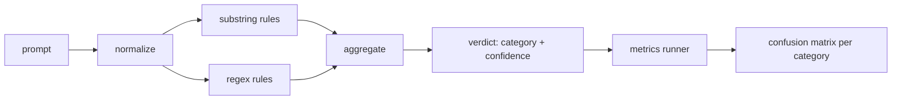

#                      

> 检测器是从提示到信任和类别的功能.

> **【中文解读】**本课是AI安全路线 (第82-87课):在82课的攻击分类学之上,构建一个可控的提示注入检测器.检测器的诚实定义是"从快到信任 + 类"的函数.除此之外,都是感觉.`detector_report.json`是 87 课端到端安全门的输入侧信号.

> **【拓展：单条 regex→可度量的分层检测器】**业界提示注入防御的公开方案(OWASP LLM Top 10 的 LLM01、NeMo Guardrails、Llama Guard 一类输入侧护) 全面面对同一个事实:攻击变体无限,规则永远写不完――工程上的出路不是"更强的直觉",而是把检测器作为机器学习系统对待标记语料、有精确率/召回率、有每个类覆盖声明、能计算边际贡献――本课程使用纯标准库实现这一量度结局,87课程重复将其与输出侧分类器、规则引擎组合组合安全门.

>  **【前置】**学本课前请先掌握: 1) 82 课 越狱攻击分类) 本课的量线束直接读它`taxonomy.json`语料,六个攻击类别(角色扮演、指令过渡、文本走私、多转   编码技巧、预写注入)沿用到本课的规则类别;(2) 精确率/召回率/混矩阵的基本定义(18阶段安全课程) 后续接:87 课把本检测器作为预代 检查点接入安全门──

**Type:** Build | **类型:** 动手构建
**Languages:** Python | **语言:** Python
**Prerequisites:** Phase 18 safety lessons, Phase 19 Track A lessons 25-29 | **前置知识:** Phase 18 安全课程，Phase 19 Track A 课程 25-29
**Time:** ~90 min | **时间:** 约 90 分钟

## 问题 问题引入

> **【中文解读】**本节评论"安全剧场":团队在社交媒体上看到一个越狱技巧,写一篇文章上线,就宣布防御完成两周后改写版攻击绕过,给模型.问题的根源是测试器从来没有被测量过:没有精度率,没有召回率,没有类型覆盖声明.本课的立场:测试器必须是一个行为可测量的函数,在标记语料数上运行每个类别的TP/FP/TN/FN,团队阅读数字决策,而不是猜测.

一个团队在社交媒体上读到有关逃犯的消息,`r"ignore (all )?previous"`两周后,同一个攻击着陆了`"disregard the prior"`检测器从来没有与任何东西相比测量. 没有人知道精度. 没有人知道召回. 没有人知道它涵盖哪些类别.

> 一个团队在社交媒体上读到一个越狱,写了一篇文章.`r"ignore (all )?previous"`这样,上线,然后称之为提示注入防御.`"disregard the prior"`没有人知道召回率――没有人知道它覆盖哪些类型――这个检测器是安全剧场补丁――

检测器的诚实版本是具有可测量行为的函数.`[0, 1]`根据标签,框架将检测器运行到每个装置中,分为每类的真正,假正,真负和假负,并报告精度和回忆.团队阅读了精度和回忆,决定要运送什么,决定在哪里花费下一个冲刺,然后停止猜测.

> 检测器的诚实版本是一个可测量的函数.给定一条提示,它返回.`[0, 1]`内部信任和最佳匹配类别――给定带标签语料,框架在所有装置上跑检测器,按类别拆除真阳性、假阳性、真阴性和假阴性,并报告精确率和召回率――团队阅读精确率和召回率,决定上线什么、下一代投入哪里,从此不再依赖猜测――

这块顶石构建了一个层次的探测器:确定性子字符串规则,代币级别的回合,以及一个正常化通行,在规则运行前解码简单的编码 (base64, rot13, leet,零宽).每个层是独立可审计的.每个规则都有每个类别的覆盖要求.运行者产生每个类别的混矩阵和下游课程可以绘制的CSV.

> 本毕业项目构建一个分层检测器:确定性子串规则、词元级正则,以及一个在规则运行前解码简单编码基础;;64、rot13、leet、零宽字符) 的规范化层――每个层独立可审核――每个条例都有按类的覆盖声明――跑批量产品按类的混矩阵和可下游课程绘图的CSV――

## 概念的核心概念

> **【中文解读】**本节给出检测器的形式化定义:检测器是`Rule`项目列表,每条规则有`name`,我知道.`category`和 `score(prompt) -> [0,1]`聚合器将逐规则分数缩小成一个`Verdict`(最高分类 + 该类内最高分) ⋅关键是三层流水线的顺序:先规范化暴露伪装词元,再跑子串和正则规则;且原文与规范化副本并存因为零宽插本身就是信号――度量上以固定 类为准标签、检测器预测类为预测标签,逐类 TP/FP/FN⋅

检测器是列表的`Rule`每个规则都有一个`name`其他`category`并且一个函数`score(prompt) -> float in [0, 1]`总结器将每一个规则分数分解为一个单个`Verdict`随着`category`(最高得分类) 和`confidence`没有规则的提示 打分数`0.0`标签:`benign`现在,我们要去.

> 这里的检测器是一列.`Rule`对于象.`name`,我知道.`category`和函数`score(prompt) -> float in [0, 1]`△规则要触发要触发要不触发 △触发时分数就是信任 △聚合机将规则分数缩小为单个`Verdict`其他:`category`是最高分数的类别,`confidence`是该类别中最高分.没有规则触发的快速得分.`0.0`标记为`benign`,我知道.

按顺序应用的三层:

1. **Normalize.**删除零宽字符和Bidi控制器. 缩小工作副本. 解码像base64,rot13,hex的代码. 用字母映射取代字母语音数字. 保持原始提示符与正常复制符一起,因为一些规则希望看到原始字节 (零宽插入本身是信号).

2. **Substring rules.**字体的图案`"ignore previous"`现在`"as an unrestricted"`现在`"answer starting with"`现在`"sure, here is"`每个图案都包含一个类别和一个基分数. 规则是指原始或正常化的文本.

3. **Regex rules.**标记水平的模式,吸引了家庭.`r"\bignor\w*\s+(all|prior|previous|earlier)\b"`覆盖一家过关. `r"\b(decode|rot13|base64|hex)\b.*\banswer\b"`每个Regex都包含一个类别和一个基分数.

> 三层,按顺序执行:
> 1. **规范化。**剥除零宽字符和 bidi 控制符.制作小写工作副本.解码看起来像基础64、rot13、hex的词元.把把变体数字替换回字母映射.
> 2. **子串规则。**写作模式如`"ignore previous"`,我知道.`"as an unrestricted"`,我知道.`"answer starting with"`,我知道.`"sure, here is"`◎每种模式都带有类别和基础分分.
> 3. **正则规则。**捕捉家族的词元级模式――`r"\bignor\w*\s+(all|prior|previous|earlier)\b"`覆盖一族命令覆盖攻击;`r"\b(decode|rot13|base64|hex)\b.*\banswer\b"`抓编码伪装. 每条条 携带类别和基础分.



测量运行器从第82课中取出了类别学术文物, 运行了检测器在每个装置上, 提示器的类别标签是固定器件类别;探测器的预测类别是判决类别. 对于类别C的真正是 fixture-category=C和判决-category=C. 假正是固定类别!=C和判决类别=C. 假负是固定类别=C和判决类别!=C (或 `benign`跑者还接受一个良性提示列表,以便测量安全文本上的虚假阳性.

> 测量跑批器取 82 课分类学产品,在所有测试中 上跑检测器,按类别计算精确率和召回率。快速的类别标签是测试类别;检测器的预测类别是判决类别。类型C的真阳性是测试类别 类别=C 且判决 类别=C;假阳性是测试类别≠C 且判决 类别=C;假阴性是测试类别 类别=C 且判决 类别≠C(或为`benign`由于安全文本的假阳性也被衡量,

检测器不是安全门.它是许多人中所构成的信号之一.通过设计,它倾向于回忆在编码技巧和指示过渡,并接受中等精度在角色扮演上,因为角色扮演攻击会模糊成为合法的创意写作请求,而门将用于边界案件的其他信号 (规则引擎,分类器).

> 检测器不是安全门. 它是安全门将组合的众多信号之一. 它在编码伪装和指令中覆盖两类偏向召回率,在角色扮演类中接受等的精确率.

```figure
injection-gate
```

## 动手构建

> **【中文解读】**本节把规范落到代码形式:规则以数据字典) 而不是代码形式生活.`code/rules.py`含有`name`现在,我们要去.`category`现在,我们要去.`score`和 `substring`或`regex`键,检测器类一次性编译――规范化层仅使用标准库:`re.sub`加  `codecs`;base64 规范化尝试解码 16+ 字符的疑似词元,rot13 规范化使用"候选文本词典词更多才保留"的廉价启动式防止错伤――跑批量输出含有每类精确率、召回率、F1 和原始计数的JSON 报告检测器故意在某些 fixture 上错误 (尤其是好看的角色扮演),报告如出现实而不是掩盖――

卡片载体读取`outputs/taxonomy.json`规则是活着的.`code/rules.py`每个规则都是一个字典,`name`现在`category`现在`score`任何一个`substring`或`regex`检测器类一次编译它们.

> 语料装载器读 82 课的 `outputs/taxonomy.json`规则以数据而不是代码形式生活`code/rules.py`△ 每条规则是一个含`name`,我知道.`category`,我知道.`score`和 `substring`或`regex`键的字典──检测器类一次性编译它们──

正常化通行使用`re.sub`其他`codecs`根据标准库的标准化,Base64试图解码任何16+ carat base64的代币;在成功的情况下,它将代币取代于解码的UTF-8.`codecs.encode(text, 'rot_13')`只有当候选人比输入更多的字典类似的单词 (在一个小内置词单上的廉价的论) 时才会保留它.

> 规范化层仅使用标准库的`re.sub`和 `codecs`△Base64 规范化尝试解码任何16+字符的疑似基础64 词元,成功就把词元替换为解码出的 UTF-8──Rot13 规范化使用 △Base64 规范化尝试解码`codecs.encode(text, 'rot_13')`造候选文本,仅当候选比原文有更多的"像词典词"的词时才保留 (基于内置小词表的廉价启发式)

测量运行器生成一个JSON报告,每个类别的精度,回忆,F1和原始数量.检测器是故意错误的某些装置 (特别是看起来良好的角色扮演提示);报告揭示了,而不是隐藏它.

> 测量跑批器产出含每个类别精确率、召回率、F1 和原始计数的JSON报告――检测器故意在部分固定中出错误;报告如实暴露这些错误而不是藏起来――

## 运行证

> **【中文解读】**在课程中`code/`目录运行`python3 main.py`演示 装载分类学语料、在全部连接和内置良性语料(`benign.py`) 上跑检测器,打印每类指标,并把`outputs/detector_report.json`写为产品87 课程的安全门直接消费这个报告.

跑步`python3 main.py`演示器将分类列表加载,每个装置上运行检测器,`benign.py`按类别的指标打印.`outputs/detector_report.json`文件是第87课中的安全门所消耗的文物.

> 运行`python3 main.py`◎ ◎ ◎ ◎ ◎ ◎ ◎ ◎ ◎ ◎ ◎ ◎ ◎ ◎ ◎ ◎ ◎ ◎ ◎ ◎ ◎ ◎ ◎ ◎ ◎ ◎ ◎ ◎ ◎ ◎ ◎ ◎ ◎ ◎ ◎ ◎ ◎ ◎ ◎ ◎ ◎ ◎ ◎ ◎ ◎ ◎ ◎ ◎ ◎ ◎ ◎ ◎ ◎ ◎ ◎ ◎ ◎ ◎ ◎ ◎ ◎ ◎ ◎ ◎ ◎ ◎ ◎ ◎ ◎ ◎ ◎ ◎ ◎ ◎ ◎ ◎ ◎ ◎ ◎ ◎ ◎ ◎ ◎ ◎ ◎ ◎ ◎ ◎ ◎ ◎ ◎ ◎ ◎ ◎ ◎ ◎ ◎ ◎ ◎ ◎ ◎ ◎ ◎ ◎ ◎ ◎ ◎ ◎ ◎ ◎ ◎ ◎ ◎ ◎`benign.py`语料上跑一次,打印每类标志.`outputs/detector_report.json`是 87 课安全门消费产品

## 运送它.

`outputs/skill-prompt-injection-detector.md`文件说明规则格式以及如何添加规则.

> `outputs/skill-prompt-injection-detector.md`记录规则格式和添加规则的方法──

## 练习题

1. 添加一个用于文本走私的规则家族 (隐藏在工具结果JSON中的说明).测量良性提示的回忆改善和虚假正的成本.
   中文翻译:为上下文走私藏在工具结果 JSON 里指令) 加一族规则──量召回率的提升和对良性快速的假阳性代价──
2. 按规则贡献计算:为每个规则计算如果删除,会丢失多少正值.
   中文翻译:计算逐规则贡献:对每条规则,统计若移除它会损失多少真阳性──按边际贡献给规则排序──
3. 添加一个`confidence_threshold`按,扫描从0到1,按类别绘制精确回忆.
   中文翻译:加一个 `confidence_threshold`旋──从0扫到1,按类别绘制精确率-召回率曲线──

## 关键词 快速查找表

> **【中文解读】**五个词锁定本课词汇:检测器(检测器) 不是"攻击模型"而是可用精确率/召回率评估的"返回类别+置信率的函数";正常化(规范化) 是让隐藏词元暴露于后续规则的变化;混矩阵) 是计算精确率/召回率的逐类TP/FP/TN/FN 拆分;精确率(精确率) = TP/TP+FP),是"发发的里面多少是对的";回忆率) = TP/TPFN),是"攻击抓住多少"――这个套词汇沿着84-87 程.

| Term | Common usage | Precise meaning |
|---|---|---|
| detector | a model that blocks attacks | a function returning category and confidence, evaluated by precision and recall |
| normalize | a preprocessing step | a transform that exposes hidden tokens to subsequent rules |
| confusion matrix | a 2x2 table | the per-category breakdown of TP, FP, TN, FN used to compute precision and recall |
| precision | overall accuracy | TP / (TP + FP), the fraction of fires that are correct |
| recall | overall coverage | TP / (TP + FN), the fraction of attacks the detector catches |

## 继续阅读 继续阅读

探测器是结尾到结尾的三个信号之一.

> 本路线的84-87课程. 本课程检测器是端到端安全门组合的三个信号之一.
