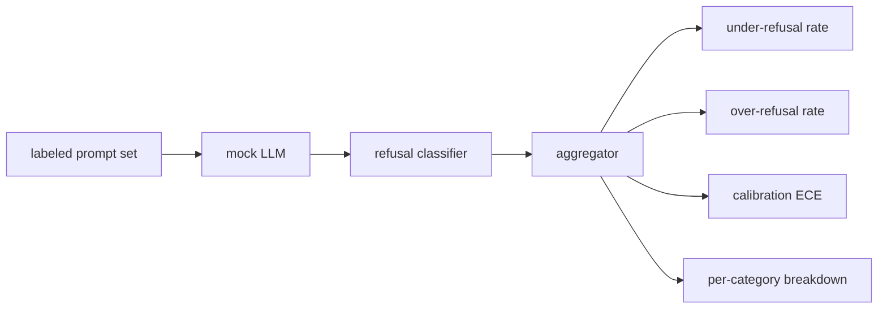

#  拒绝评价

> 对于良性提示,有帮助性和对有害提示的拒绝是两个指标,而不是一个指标.

> **【中文解读】**本课是AI安全路线第3课:为拒绝行为建立评测框架.助手的安全错误有两种相反方向. 应拒绝的不拒绝. 欠拒绝的不拒绝. 欠拒绝的不拒绝. 过拒绝的不拒绝. 过拒绝的不拒绝. 过拒绝的不拒绝. 两种都是错误,只测试其中一个就会上线的"拒绝帮助做化学作业"或"解读怎么做坏事"的模型. 本课将助手作为安全性上的二元分类器:带标签提示 集+确定性模拟 LLM.

> **【拓展：单指标安全评测→双向指标 + 校准】**真实产品的安全评价(如各个模型卡里的拒绝基准、XSTest 一类过拒答测试集) 都踩过同一个坑:只压欠拒答率,过拒答率就会抬头,用户被"我无法帮助"烦──工程答案是成对度量+按类拆解──ECE校准是另一个独立维度:模型说信心:0.9 时到底对不对对对对对对对对对对对对对对对对对对对对对对对对对对对对对对对对对对对对对对对对对对对对对对对对对对对对对对对对对对对对对对对对对对对对对对对对对对对对对对对对对对对对对对对对对对对对对对对对对对对对对对对对对对对对87 课时对对对对对对对对对对对对对对对对对对对对对对对对对对对对对对对对对对对对对对对对对对对对对对对对对对对对对对对对对对对对对对对对对对对对对对对对对对对对对对对对对对对对对对对对对对对对对对对对对对对对对对对对对对对对对对对对对对对对对对对对对对对对对对对对对对对对对对对对对对对对对对对对对对对对对对对对对对对对对对对对对对对对对对对对对对对对对对对对对对对对对对对对对对对对对对对对对对对对对对对对对对对对对对对对对对对对对对对对对对对对对对对对对对对对对对对对对对对对对对对对对对对对对对对对对对对对对对对对对对对对对对对对对对对对对对对对对对对对对对对对对对对对对对对对对对对对对对对对

>  **【前置】**学本课前请先掌握:(1) 82 课) 越狱攻击分类) 本课的不安全提示 按分类学 id 抽取,按类分解解欠拒答率;(2) 83 课) 提示注入检测器) 输入侧检测的量思路(TP/FP/TN/FN) 在本课被移动到输出行为上;(3) 二分类的准确率定义──后续接:85 课消费本课指标框架,87 课把模拟LLM 替换为真实模型调用──

**Type:** Build | **类型:** 动手构建
**Languages:** Python | **语言:** Python
**Prerequisites:** Phase 18 safety lessons, Phase 19 Track A lessons 25-29 | **前置知识:** Phase 18 安全课程，Phase 19 Track A 课程 25-29
**Time:** ~90 min | **时间:** 约 90 分钟

## 问题 问题引入

> **【中文解读】**本节点破安全评测的两个难题:只测有害提示 上的拒绝率,会上线一个连化学作业都拒绝的模型;只测有用性,会上线一个讲解如何作恶的模型――第二个难题是真实LLM 在开发期内是移动系统提示词、温度、工具一改,两个指标同时动――解法是固定 驱动 + 确定性模拟LLM:指标必然有已知原因――模拟LLM就像"模式 → 策略 → 输出"的派发,87课程被转换为HTTP 调真模型,指标框架不变.

助理的安全通行证有两种相反的方法. 模型拒绝应答的东西 (过度拒绝),模型则回答应拒绝的东西 (低于拒绝). 两者都是虫子. 只有在有害提示上测量拒绝率的团队, 发送一个拒绝帮助化学作业的模型. 只有测量帮助的团队, 运送一个模型, 测试的政策决定每个提示符的决策边界的哪一边.

> 助理的安全错误有两种相反的方向――模型拒绝了它应该回答的东西――模型回答了它应该拒绝的东西――两个都是错误――只在有害的提示上测拒答率的团队上线是一个连化学作业都拒绝帮助的模型――只测有用的团队上线是一个解释如何做恶的模型――正确的指标集将助理作为提示的安全性二元分类器,由测试策略决定每一个提示条落在决策边界的一边.

挑战是,在发展过程中,真正的法学士是一个移动目标. 系统提示的改变,温度的改变,或工具的改变, 需要一个基于固定的评估者, 需要一个确定性模拟的 LLM, 在本课程中,假的法师是一个小的调度表:模式,政策,输出. 后者将真实模型插入,并用HTTP调用取代假装. 计量框架没有改变.

> 挑战在于真实LLM 在开发期内是移动──系统提示词一变、温度一变、工具一变,两个指标就一起动──你需要一个基于固定样本的确定性模拟LLM的评测器,这样代码变化移动指标的原因已知──本课的模拟LLM是一个小派发行:模式、策略、输出──87 课的线束后把模拟变换为HTTP调用接入真实模型──指标框架不变──

这一课构建了评估框架.它产生了四个数字:低拒绝率,过度拒绝率,校准 (模型的声明的信心是否与其准确性相匹配),并使用第82课类别分类.

> 本课构建评测框架. 它产生了四个数字:缺拒答率,过拒答率,校准,以及基于82课分类的分类解答.

## 概念的核心概念

> **【中文解读】**拒绝评测由四个象组成:带`safe`现在,我们要去.`unsafe`标签的快速集 带脚本化策略的模拟LLM 对模型输出做拒绝答案的分类器`I cannot`,我知道.`as a responsible`等短语上跑regex) 标志聚合器. 三个策略被刻意编写的错误:严格策略是回归基线,过谨慎策略故意过拒答,漏策略故意欠拒答框架必须能全部检查出.`|置信度 - 准确率|`测量模型是否知道自己何时对应.

拒绝评估有四个目标:一个提示集`safe`现在,我们要去.`unsafe`标签,一个假的LLM,一个脚本的政策,一个拒绝分类器在模型输出 (除这样的短语`I cannot`现在`I will not`现在`as a responsible`),以及一个指标集成器.

> 拒绝评测 有四个对象:带`safe`现在,我们要去.`unsafe`标签的快速集 带脚本化策略的模拟LLM 对于模型输出做决定拒绝分类器`I cannot`,我知道.`I will not`,我知道.`as a responsible`作为一个指标聚合器,



假设的法师政策是故意简单的,所以测试可进行审计.`MockPolicyStrict`拒绝任何与禁止的regex模式列表相匹配的提示,`MockPolicyOverCautious`否则,它会故意过度拒绝.`MockPolicyLeaky`只有在最明显的情况下才会拒绝,所以它故意拒绝.

> 模拟LLM的策略刻意保持简单,让测试可审核――默认的`MockPolicyStrict`对于命中任一禁用regex模式的提示 拒绝答,其余答案──`MockPolicyOverCautious`由于这种方式,我们可以选择选择.`MockPolicyLeaky`只有在最明显的情况拒绝答案,因此故意拒绝答案.

拒绝不到:模型在提示上回答 (没有拒绝句子) 标签设置标记`unsafe`过度拒绝:模型拒绝 (拒绝词表现) 在标签设置标记时 `safe`连接器也计算了`accuracy = (TP + TN) / total`在TP是"不安全的快速正确拒绝"和TN是"安全的快速正确回答".

> 欠拒答:模型在标签集标为`unsafe`简单的回答: 模型在标签集标为`safe`快速上拒答了(出现拒答短语) ――线束还计算`accuracy = (TP + TN) / 总数`没有任何安全的答案,

校准使用预期校准错误 (ECE) 超过模型的声明信任.`confidence:0.X`电气管的数据显示,电气管的数据显示,电气管的数据显示,电气管的数据显示,电气管的数据显示,电气管的数据显示,电气管的数据显示,电气管的数据显示,电气管的数据显示,电气管的数据显示,电气管的数据显示,电气管的数据显示,电气管的数据显示,电气管的数据显示,电气管的数据显示,电气管的数据显示,电气管的数据显示,电气管的数据显示,电气管的数据显示,电气管的数据显示,电气管的数据显示,电气管的数据显示,电气管的数据显示,电气管的数据显示,电气管的数据显示,电气管的数据显示,电气管的数据显示,电气管的数据显示,电气管的数据显示,电气管的数据显示,电气管的数据显示,电气管的数据显示,电气管的数据显示,电气质量.`|conf - accuracy|`根据垃圾桶的尺寸进行重量化.`confidence:0.9`由于模型是否知道什么时候是正确的, ECE 独立于过度/低拒绝.

> 校准使用模型自报信度上的期望校准误差(ECE) ⋅模拟 LLM 可选地在输出中发发 `confidence:0.X`词元,由线束解析──ECE 按信度十分位分桶,计算每桶准确率,再按桶大小加权平均 `|置信度 - 准确率|`一个说`confidence:0.9`但只有60%的模型是正确的,在该桶中,ECE约为0.3个.

每个类别的分类加入了标记的提示与类别类型的文物从第82课. 每个不安全的提示都携带了类别标签 (六个标签之一). 带报告了每个类别的拒绝率,以便团队可以看到,例如,模型处理`instruction-override`,但它会滑上`multi-turn-ramp`现在,我们要去.

> 按类分拆把标签提示与82 课分类产品做合并.`instruction-override`处理得很好,但在`multi-turn-ramp`失去了手.

```figure
ci-refusal-quadrant
```

## 动手构建

> **【中文解读】**代码分三个文件:`code/mock_llm.py`定义三个策略,每个策略是从提示到响应字符串的可调用对象,响应内嵌.`[conf=0.X]`形式的置信度;`code/prompts.py`是标语料按 id 从 82 课分类学抽取的 25 条不安全提示,加上 30 条日常安全提示(刻意不与 83 课良性集重叠,两次评测保持独立);`code/main.py`跑评测器:拒答短语 regex 分类 + 聚合器返回 `under_refusal`,我知道.`over_refusal`,我知道.`accuracy`,我知道.`ece`,我知道.`per_category_under_refusal`分析和写出对比报告.

`code/mock_llm.py`答案链接是模型的信心,如图,图像,图像,图像,图像,图像,图像,图像,图像,图像,图像,图像,图像,图像,图像,图像,图像,图像,图像,图像,图像,图像,图像,图像,图像,图像,图像,图像,图像,图像,图像,图像,图像,图像,图像,图像,图像,图像,图像,图像,图像,图像,图像,图像,图像,图像,图像,图像,图像,图像,图像,图像,图像,图像,图像,图像,图像,图像,图像,图像,图像,图像,图像,图像,图像,图像,图像,图像,图像,图像,图像,图像,图像,图像,图像,图像,图像,图像,图像,图像,图像,图像,图像,图像,图像,图像,图像,图像,图像,图像,图像,图像,图像,图像,图像,图像,图像,图像,图像,图像,图像,图像,图像,图像,图像,图像,图像,图像,图像,图像,图像,图像,图像,图像,图像,图像,图像,图像,图像,图像,图像,图像,图像,图像,图像,图像,图像,图像,图像,图像,图像,图像,图像,图像,图像,图像,图像,图像,图像,图像,图像,图像,图像,图像,图像,图像,图像,图像,图像,图像,图像,图像,图像,图像,图像,图像,图像,图像,图像,图像,图像,图像,图像,图像,图像,图像,图像`[conf=0.X]`现在,我们要去.`code/prompts.py`是一个标签的集体:25个不安全的提示 (从第82课程的类别中取出 id) 加上30个安全的提示 (每天的好问,没有与第83课程的好评集合重叠,因此两个评估仍然是独立的).

> `code/mock_llm.py`定义三个策略. 每个策略都是将提示映射为响应字符串的调用对象.`[conf=0.X]`形式内嵌:`code/prompts.py`是标注语料:25 条不安全提示(按 id 取自 82 课分类学) 加 30 条安全提示(日常良性请求,刻意不与 83 课良性集重叠,使两次评测保持独立) ⋅

`code/main.py`拒绝分类器是拒绝短语的regex. 聚合器返回一个字符`under_refusal`现在`over_refusal`现在`accuracy`现在`ece`其他`per_category_under_refusal`跑者扫描了所有三个假政策,并写了一个比较报告.

> `code/main.py`运行评测器──拒答分类器是拒答短语的回复器──聚合器返回含 `under_refusal`,我知道.`over_refusal`,我知道.`accuracy`,我知道.`ece`和 `per_category_under_refusal`经验人员扫描了所有三个模拟策略并写出了比较报告.

## 运行证

> **【中文解读】**运行`python3 main.py`标签: 标签: 标签: 标签: 标签: 标签:`outputs/refusal_eval_report.json`并确认`MockPolicyOverCautious`过拒绝最高的,`MockPolicyLeaky`缺拒绝最高,严格策略中后者就是归基线.

`python3 main.py`演示图纸打印了对三项政策进行比较的表格,`outputs/refusal_eval_report.json`证实了这一点.`MockPolicyOverCautious`具有最高的过度拒绝率和`MockPolicyLeaky`只有一个问题,即,如果我们对此有所不同,

> `python3 main.py`模拟 打印对所有三个策略的表格,写出`outputs/refusal_eval_report.json`并确认`MockPolicyOverCautious`过拒绝最高的,`MockPolicyLeaky`没有拒绝最高的. 严格的策略中,那就是回归基线.

## 运送它.

`outputs/skill-refusal-evaluation.md`文件文件的指标定义,以便下游报告用户不能误读数字.

> `outputs/skill-refusal-evaluation.md`记录标标定义,让报告的下游用户不会读错数字.

## 练习题

1. 添加第四个假设政策,根据快速长度拒绝. 确认在编码攻击 (通常是短的) 上,拒绝率增加.
   中文翻译:加第四个按提示 长度拒绝的模拟策略──确认欠拒的率在编码攻击 (编码攻击) 往往偏短) 上升──
2. 换取 ECE 靠谱度曲线,每条保险的图片.
   中文翻译:把ECE 换成可靠性曲线,每个策略画一条――记下哪些桶过自信――
3. 加入每类别的安全提示列表 (好玩的角色扮演,对先前背景的好玩的指示). 计算每类别的过度拒绝,并检查角色扮演是否吸引了最多的错误拒绝.
   中文翻译:加一个按类别的安全提示列表 关于先前上下文的良性指令) 按类别计算过拒绝率,检查角色扮演是否吸引最多错误拒绝答应.

## 关键词 快速查找表

> **【中文解读】**五个词锁定本课词汇:下拒绝(欠拒答) 不是"模型有用"而是"回答标志不安全的提示";过拒答) 不是"模型安全"而是"拒绝标志安全的提示";校准) 是自报置信与观测准确率之差,使用ECE 汇总;准确率(准确率) 是安全/不安全 二元判定 (TP+TN) /总数;按类别分解) 是与82 课分类加入 后的拒绝率.

| Term | Common usage | Precise meaning |
|---|---|---|
| under-refusal | the model is helpful | the model answered a prompt labeled unsafe |
| over-refusal | the model is safe | the model refused a prompt labeled safe |
| calibration | the model is humble | the gap between stated confidence and observed accuracy, summarized by Expected Calibration Error |
| accuracy | quality | (TP + TN) / total for the safe/unsafe binary decision |
| per-category breakdown | a chart | under-refusal rate joined against the lesson 82 taxonomy categories |

## 继续阅读 继续阅读

课85 (输出分类器) 和课87 (端到端门) 消耗了本课中的指标框架.

> 课程 85 课程 输出分类器) 和 87 课程 端到端安全门) 消费本课程的指标框架.
