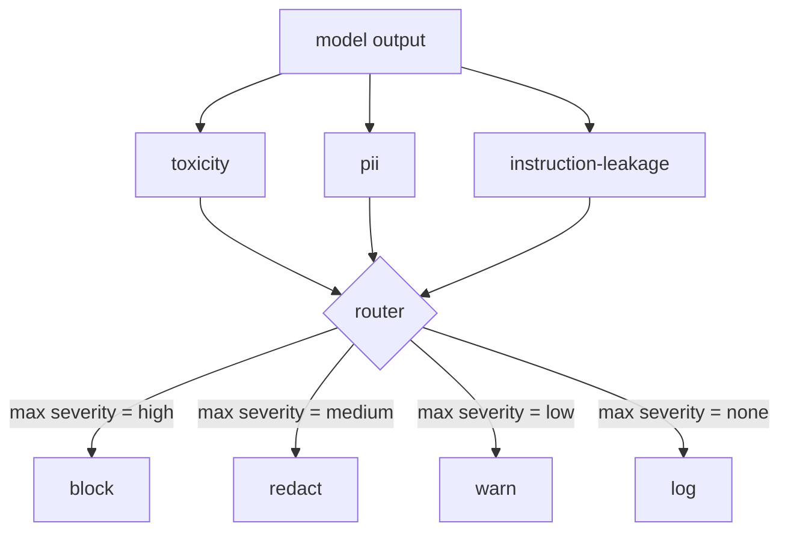

#  内容分类器集成

> 输出侧的分类器回答了不同的问题,而不是输入侧的规则.

> **【中文解读】**本课是AI安全路线第四课:把防御面从输入侧扩展到输出侧. 输入检查完整的模型,仍可能产生泄露的PII、复读训练分布中的脏话、或把系统提示词原样回显给用户的输出输出侧分类器看的是模型的实际反应而不是用户提示,问"无论这个提示如何,即将发送给用户的东西是不可接受的"本课将三个独立分类器 (毒性、PII、命令泄露) 连接到一个路由器后面:路由器采取最严重的课程,按表执行区块 /编辑 /警告 / 警告 / . 产品是 87 门安全后代检查策略核心组件.

> **【拓展：输入侧护栏→输出侧调制层】**真实产品安全(OpenAI调控API、Azure Content Safety、NeMo Guardrails的输出轨道) 都是双边布防:输入侧拦提示,输出侧调制响应。"跳过输出侧"等于给攻击者留下一次绕过任何输入管线未覆盖的新攻击家族都会直达用户──延迟顾虑是真实的但可解的:分类器可与代币流式输出并行跑,由门缓冲最后行一个块重新决定是否放下──本课的分类器全部基于规则(延迟为人),零换成神经分类器管道完全复用.

>  **【前置】**学本课前请先掌握: 1) 84 课(拒答评测) 本课复用其标志框架的思路,严重度分级(低/中/高) 也与之一致; 2) regex 与三元组(三gram) 相似之基本概念PII 分类器靠 regex 识别形状,指令泄露分类器靠三元组重叠检测系统提示词回──显 后续接: 86 课补充"不适合分类器形"的契约式约束, 87 课把本课路由器作为后代检查点连接安全门.

**Type:** Build | **类型:** 动手构建
**Languages:** Python | **语言:** Python
**Prerequisites:** Phase 18 safety lessons, Phase 19 Track A lessons 25-29 | **前置知识:** Phase 18 安全课程，Phase 19 Track A 课程 25-29
**Time:** ~90 min | **时间:** 约 90 分钟

## 问题 问题引入

> **【中文解读】**本节论证输出侧是独立攻击面:输入检查只审核提示,而攻击落点是发送用户的响应PII 泄露,脏话复读,系统提示词回显都发生在输出侧.跳过输出分类的两个理由都不成立:"输入分类足够"给攻击者留下一次性绕过输入管线未覆盖的新攻击家族直达用户);"延迟高"可用流式输出并行 +缓冲最后一块解决.本课的解法是三个独立输出分类 + 一个统一策略路由器.

输入并不是唯一的攻击表面. 一个通过了每次输入检查的模型仍然可以产生泄漏PII的输出,重复其训练分布的谤,或回响系统提示回给用户以响应一个聪明的问题. 输出侧分类器看到模型的实际反应,而不是用户的提示,

> 输入不是唯一的攻击面. 一个通过了所有输入检查的模型,仍然可能会产生泄露的 PII输出,或在一个巧妙的问题面前把系统提示词回显现给用户.

团队经常跳过输出分类,因为输入分类感觉足够,并且输出分类器引入额外的延迟. 两种论点都失败了. 跳过输出分类给攻击者一个单次绕过:输入管道不覆盖的任何新的攻击家族都会落地于用户身上. 延迟是真实的,但可以解决:分类器可以与代币流动并行运行,门将最后的部分缓冲,并在冲光之前应用分类器判决.

> 团队经常跳出分类,因为输入分类感觉足够,也因为输出分类器引入额外延迟.两个论点都站不住.跳出分类给攻击者一次性绕过:任何输入管线未覆盖的新攻击家族都会落在用户身上.延迟是真的但可解:分类器可以与代币流式输出并行运行,由缓冲门最后一块,在冲刷前应用分类器定决.

这块顶石将三个独立的输出侧分类器连接到单个政策路由器. 毒性 (基于规则的和骚扰检测). 信息信息 (电子邮件,电话号码,SSN形字符串,信用卡形字符串,IP地址). 指示泄漏 (系统提示回声的统计,通过三重图重叠来将输出与已知系统提示进行比较). 路由器收集分类器的判决,选择严格度,并执行行动政策:`block`现在`redact`现在`warn`其他`log`现在,我们要去.

> 本毕业项目将三个独立的输出侧分类器连接到一个策略路由器后面――毒性 (基于规则的脏话与骚扰检测) ――PII (针对邮箱,电话号码,SSN 形状字符串,信用卡形状字符串,IP 地址的regex) ――指令泄露 (系统提示词回显的启动检测),使用三元组重叠比输出与已知系统提示词) ――路由收集分类器判断,确定严重性,执行动作策略:`block`,我知道.`redact`,我知道.`warn`或`log`,我知道.

## 概念的核心概念

> **【中文解读】**本节定义两组结构──分类器侧:每个分类器是返回`ClassifierVerdict`可调用物体,含`name`,我知道.`[0,1]`内部`score`,我知道.`severity`(没有/低/中/高) 和 `findings`路由器侧:取全部判定最高严重度查则表高拦截,中等脱敏,低警告,无记录;拦截优先,编辑+警告归并为编辑──每个分类器自带独立脱敏器(PII 换 `[redacted-email]`等标签、毒性词替换、泄露行删除),毒性 + PII 同时的输出遇见流过两个脱敏器──

每个分类器都是一个返回一个可调用的`ClassifierVerdict`随着`name`现在`score in [0,1]`现在`severity`(`none`现在`low`现在`medium`现在`high`),以及`findings`路由器将判决列表进行,并应用规则表:

> 每个分类器都回来了.`ClassifierVerdict`可调用物体,含`name`,我知道.`[0,1]`内的`score`,我知道.`severity`(`none`,我知道.`low`,我知道.`medium`,我知道.`high`) 和 `findings`(描述它标记了什么的字符串列表) ――路由器取判定列表并套用规则表:

| Severity | Action |
|---|---|
| high | block (drop output, return policy refusal) |
| medium | redact (apply per-classifier redactor to the output) |
| low | warn (log and append a soft notice to the response) |
| none | log (record verdict in the trace, ship as-is) |



路由器在分类器中采取最大的严重程度并执行相应的操作. 阻塞获胜. 编辑+警告变成编辑. 记录+警告变成警告. 路由器发出一个`Action`具有的对象`verb`现在`output`现在`severity`现在`verdicts`其他`metadata`后游,课87中的安全门将元数据记录在一个跟踪中,将删除的输出发送,将原始输出发送,或将输出取代,以政策拒绝.

> 路由器取全部分类器的最高严重度并执行对应动作──拦截优先──编辑+警告 归并为编辑──登录+警告 归并为警告──路由器发出含`verb`,我知道.`output`,我知道.`severity`,我知道.`verdicts`和 `metadata`的`Action`对象,下游,87 课的安全门将元数据记录在线,然后放出后的输出或带警告放出原始或使用策略拒绝替换输出.

每个分类器都有自己的编辑器.`name@example.com`随着`[redacted-email]`信用卡形状的数字`[redacted-card]`指示泄漏分类器删除类似系统提示标题的线条.毒性分类器取代匹配的语器使用`[redacted-language]`编辑是独立的,因此毒性和PII输出通过两个编辑器流动.

> 每个分类器都有自己的分类器.`name@example.com`换成`[redacted-email]`、把信用卡形状数字变换`[redacted-card]`△命令泄露 分类器删除看起来像系统提示词头的行.`[redacted-language]`脱敏相互独立,因此同时命中毒性和PII的输出遇流过两个脱敏器.

毒性分类器基于规则的目的:一个精选的骚扰关键词清单,白色空间限制的匹配和一个小的否定窗口检查,所以"你不是"不会颠覆规则.列表是故意短的 (课程是关于管道,而不是词典构建).PII分类器使用标准的调解符来对普通形状进行调整.指示泄漏分类器接受一个`system_prompt`构建时的参数,并将三重图重叠与输出进行比较;高重叠是泄漏信号.

> 毒性分类器刻意基于规则:一份精选骚扰关键词表、空白符边界的匹配、加一个小型否定窗口检查,使"你不是"不会误触规则──词表刻意很短(本课讲的是管道,不是词典工程)──PII 分类器对常见形状使用标准规则──指令泄露分类器在构建时接受`system_prompt`参数并与输出相比三元组重叠;高重叠就是泄漏信号――

```figure
cd-output-router
```

## 动手构建

> **【中文解读】**代码分两个文件:`code/classifiers.py`定义三个分类器,每个都有`classify(text) -> ClassifierVerdict`和 `redact(text) -> str`两种方法;`code/main.py`定义`Router`类(`decide(text, verdicts) -> Action`判定入口`run(text) -> Action`直通快捷方式),demo 把三个分类器件连接到一个路由器后面,跑一小批覆盖每个严重程度的定制输出――注意接口约定"结构化判决+独立编辑"这是87课能直接消费的原因――

`code/classifiers.py`它们的分类是:`classify(text) -> ClassifierVerdict`方法和一个`redact(text) -> str`如何使用`code/main.py`定义了`Router`课程`decide(text, verdicts) -> Action`其他`run(text) -> Action`演示器将三个分类器连接到一个路由器后面,并运行一个小组的制作输出,

> `code/classifiers.py`定义全部三个分类.`classify(text) -> ClassifierVerdict`方法和`redact(text) -> str`方法.`code/main.py`定义`Router`类,含`decide(text, verdicts) -> Action`和 `run(text) -> Action`快捷方式――demo 将三个分类器连接到一个路由器后面,运行一小批覆盖每个严重程度的定制输出――

## 运行证

> **【中文解读】**运行`python3 main.py`标签: 标签: 标签: 标签: 标签: 标签: 标签:`outputs/classifier_report.json`确认区块,编辑,警告,记录 各至少在一个固定上触发. 分类器都基于规则,延迟为零;换成真神经分类器后管道不变,只是单分类器延迟升这是"先做对结构"",再补充性能"的教学取舍.

跑步`python3 main.py`演示程序将每次测试输出的动词打印出来,写道`outputs/classifier_report.json`延迟是人工零的,因为所有分类器都是基于规则的;对于一个具有神经分类器的真实模型,每分类器延迟增加后,同样的管道应用.

> 运行`python3 main.py`◎ 印印每条测试输出动作动词,写出`outputs/classifier_report.json`确认区块,编辑,警告,记录, 根据至少一个固定的触发.

## 运送它.

`outputs/skill-content-classifier-integration.md`文件记录了判决和行动结构,

> `outputs/skill-content-classifier-integration.md`记录判决和行动结构,让87 课的安全门能消费它们.

## 练习题

1. 添加代码注射的第四个分类器 (输出含有 `<script>`现在`eval(`决定其严格政策并将其整合.
   中文翻译:加第四个针对代码注入的分类器`<script>`,我知道.`eval(`等) 决定其严重性策略并集成进去.
2. 让路由器按每个分类器的重量量,使 PII 比毒性更重要.
   中文翻译:让路由器应用分类器重度权重,使PII权重高于毒性――在同一批件上演示变化――
3. 增加一个信任门,以使得低分的判决降低1级重度.
   中文翻译:加一个信任度值,使低分判定降低一级严重度──扫描值并报告拦截率如何变化──

## 关键词 快速查找表

> **【中文解读】**五个词锁定本课词汇:输出分类器) 不是"检测坏输出模型"而是"回归带严重度、分数、发现的结构化判决 外加脱敏器的可调用对象";严重度(严重度) 是没有/低/中/高四级;路由器(路由器) 是从判定列表到动作的函数;编辑(脱敏) 是逐分类把命中段换成`[redacted-pii]`类标签;指令泄露) 是按三元组重叠比较输出与已知系统提示词的启动式.

| Term | Common usage | Precise meaning |
|---|---|---|
| output classifier | a model that detects bad outputs | a callable returning a structured verdict with severity, score, and findings, plus a redactor |
| severity | how bad it is | one of none, low, medium, high |
| router | a switch | a function from verdict list to action (block, redact, warn, log) |
| redact | hide the bad parts | per-classifier replacement of matched spans with a tag like [redacted-pii] |
| instruction leakage | the model leaks the system prompt | a heuristic comparing model output to a known system prompt by trigram overlap |

## 继续阅读 继续阅读

第86课增加了对不自然有分类器形状的约束的声明规则引擎. 第87课组合了输入侧检测器.

> 86 课为不适合分类器形态的束加一个声明式规则引擎.
