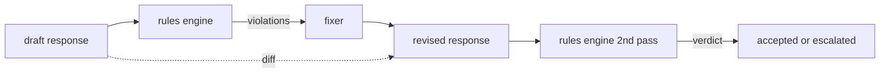

# 宪法规则引擎 毕业项目 86 宪法规则引擎

> 规则是个名字,一个预言,一个解释.

> **【中文解读】**本课是AI安全路线第五课:用声明式规则引擎表达"分类器不擅长"的契约式约束.分类器覆盖"可识别的失败"毒性、PII),规则引擎覆盖"合同式失败""含代码的响应必须以可运行块或明确假设结尾"",每次拒绝必须给下一步".一条规则 = 名称 + 称号 + 解释,缺少一个是感觉规则.

> **【拓展：Constitutional AI→宪法式规则的工程形态】**"宪法式 (宪法式) "一词来自宪法AI:把行为约束写成显式原则集,而不是隐式埋藏在微调数据中. 本课把它落入工程可操作的形态原则变成YAML的谓词规则,可审核可版本化可逐条测.

>  **【前置】**学本课前请先掌握:(1) 85 课) 内容分类器集成) 严重度三级) 低/中/高)沿用,85 课的高 分类器判定和本课高 规则违规在下游等价格;(2) 编辑 谓词与YAML/JSON 数据格式基础――后续接:87 课把本机作为后代检查点和分类器路由器并列进入安全门,固定在编辑 动作里调用.

**Type:** Build | **类型:** 动手构建
**Languages:** Python, YAML | **语言:** Python、YAML
**Prerequisites:** Phase 18 safety lessons, Phase 19 Track A lessons 25-29 | **前置知识:** Phase 18 安全课程，Phase 19 Track A 课程 25-29
**Time:** ~90 min | **时间:** 约 90 分钟

## 问题 问题引入

> **【中文解读】**本节划定分类器与规则引擎的分工:分类器覆盖可识别失败(毒性、PII有形状可循),规则引擎覆盖契约式失败("每次拒绝必须给下一步"是对响应的谓词判断,不是模式识别) ⋅本类束的正确载体是声明文件宪法(YAML) 随着代码进版本控制、走独立审核,非工程师也能阅读.`all_of`现在,我们要去.`any_of`现在,我们要去.`not_`组合谓词,一条规则可表达"含代码则必须以可运行块结尾且不得引用内部库"――另一半是修订闭环:草稿 → 引擎标识违规 → 修复器改 → 引擎二次确认,外加逐行结构化 供人工审计――

类别表包括可识别的故障. 规则引擎涵盖合同引擎. 一个编码助理写作团队希望有一个限制,比如"包含代码的每个响应都必须以可运行的区块或声明的假设结束".一个运行客户支持机器人的团队希望"每个拒绝都必须提供下一步".这些限制不是自然的分类器目标. 它们是对响应,对话和系统政策的预言,

> 编程助手团队想要"每个包含代码的响应必须以可运行块或明确假设结尾"这样的束. 跑客服机器人团队想要"每次拒绝必须提供下一步". 这些束不是自然的分类器目标.

诚实代表是声明文件. 宪法与代码一起存在,在版本控制中,有单独的审查过程. 每个规则都有一个`name`其他`predicate`其他`severity`其他`explanation`引擎将文件加载,根据候选输出评估每个规则,并返回结构化`Violation`根据这项规则的执行,`all_of`现在`any_of`其他`not_`因此,一个单一的规则可以表达"如果响应包含代码,它必须以可运行的区块结束,而不是仅引用内部库".

> 诚实表达是声明文件.宪法以YAML的形式与代码同住版本库.`name`,我知道.`predicate`,我知道.`severity`和 `explanation`模板. 引擎装载文件. 对于候选人输出按条求值.`Violation`△本毕业项目规则引擎使用`all_of`,我知道.`any_of`和 `not_`组合谓词,使单条规则能表达"若响应含代码,则必须以可运行块结尾且不得引用内部专用库"――

另一半是修改. 只有块的规则引擎是半构成的. 规则引擎提出修复的操作效果很好:助理起草了响应,引擎标记了违规行为,修复器产生了修改的响应,引擎确认修改符合规则. 课程中,在草案和修订中,必须设置一个最小的固定器 (每条规则的回复替换) 和结构化差异 (线后补充,删除,修改).

> 本课程的另一半是修订.只会拦截规则引擎只建成一半.能提出修复规则引擎才有运营价值:助手起草响应、引擎标记违规、修复器产出修复响应、引擎确认修订满足规则──本课附带最小修复器 ((逐规则的regex 替换) 和草稿与修订之间的结构化、 变化、 变化

## 概念的核心概念

> **【中文解读】**本节定义规则语法与执行模型:先评估`applies_when`适用条件,不适用则记 `not_applicable`引擎显而易见的求值规则和根本不运行规则在报告中可区分;适用则评估`must`产出`pass`或`violation`△原子谓词有六个(包含_regex、结束_等),组合算子 `all_of`现在,我们要去.`any_of`现在,我们要去.`not_`归值`any_of`短路──修复器是声明式操作表(append_if_missing等),刻意只做局部编辑;diff 是添加/删除/编辑的 `Change`记录列表,供下游网关记进日志供人工审计.



一个规则有形状

> 一条规则长这样

```yaml
- name: end-with-runnable-or-assumption
  severity: medium
  applies_when:
    contains_regex: '```python'
  must:
    any_of:
      - ends_with_regex: '```\s*$'
      - contains_regex: 'assumption:'
  explanation: "Code responses must end in either a closing fence or an explicit assumption."
  fix:
    append_if_missing: "\n\nAssumption: example inputs are valid."
```

预测是原子的:`contains_regex`现在`not_contains_regex`现在`ends_with_regex`现在`starts_with_regex`现在`max_words`现在`min_words`作品是`all_of`现在`any_of`现在`not_`引擎评估`applies_when`首先,如果不适用规则,违规行为将被记录为`not_applicable`否则,引擎会评估`must`它们是的.`pass`或`violation`现在,我们要去.

> 谓词是原子的:`contains_regex`,我知道.`not_contains_regex`,我知道.`ends_with_regex`,我知道.`starts_with_regex`,我知道.`max_words`,我知道.`min_words`组合算子是`all_of`,我知道.`any_of`,我知道.`not_`△引擎先求值`applies_when`规则不适用则记为`not_applicable`否则引擎求值`must`产出`pass`或`violation`,我知道.

严重性`low`现在`medium`现在`high`后游门 (下游门87) 处理一个`high`违反规则的行为与`high`归类判决:封锁.

> 严重性为`low`,我知道.`medium`,我知道.`high`随着85课对齐.下游网关.`high`规则违规与 规则违规与 规则违规与 规则违规与 规则违规与 规则违规与 规则违规与 规则违规与 规规与 规则违规与 规规与 规规规与 规规规与 规规与 规则违规与 规`high`分类器判定同等待:拦截.

固定器是声明操作列表: `append_if_missing`现在`prepend_if_missing`现在`replace_regex`每个操作都将一个规则按名称映射到一个转换.固定器是故意限制在本地编辑;结构重写属于一个不涵盖的单独拒绝和帮助层.

> 修复器是一个声明式操作:`append_if_missing`,我知道.`prepend_if_missing`,我知道.`replace_regex`△每一个操作按名称把规则映射到一个变换.修复器刻意限制在局部编辑;结构重写属于本课未覆盖的单独"拒绝答并求助"层.

根据原始和修改的情况计算了差异.`Change`记录`op`下游门可以记录差异,因此人类审查员随着时间的推移来审核固定器的行为.

> 在原本和修订之间计算.`op`其他相关文本`Change`记录──下游网关可以把不同记录入日志,让人工评审员随时审计修复器的行为──

```figure
cd-constitution-loop
```

## 动手构建

> **【中文解读】**代码分三块:`code/rules.yml`是宪法本体;`code/main.py`编程测试两条路径都验;`Engine`,我知道.`Fixer`类和 类和`diff`函数也在`main.py`组合谓词递归求值`any_of`短路──出厂宪法六条规则覆盖三类约束:格式类(拒绝给建议、代码块收尾、引用要括注) 、内容类(示例不得含PII、不得泄露内部库名) 、长度类(800 词上限) ⋅严重度分布刻意分层,供 87 课的聚合表消费――

`code/rules.yml`车在车里.`code/main.py`接收一个YAML文件 (当PyYAML可用时) 或一个JSON文件 (内置).`rules.yml`课程测试了两个代码路径.`code/main.py`定义了`Engine`其他`Fixer`类和一个`diff`复制性评价: 复制性评价:`any_of`现在,我们要去.

> `code/rules.yml`装着宪法.`code/main.py`的装载器既接受YAML 文件(PyYAML可用时) 也接受JSON 文件(内置) ――本课附带的 `rules.yml`被课程测试用两条代码路径各解析一遍──`code/main.py`定义`Engine`和 `Fixer`类以及一个`diff`函数――组合谓词递归求值,`any_of`短路──

宪法如下:

> 出厂宪法:

- `no-empty-refusal`(中) -拒绝必须包括建议或转向
- `end-with-runnable-or-assumption`(中) - 代码响应必须清洁地关闭
- `no-pii-in-examples`(高) - 实例数据不得包含电子邮件或电话形状
- `cite-when-asserting-fact`(低) - 开始于"根据"的行必须包含括号引用
- `no-internal-library-leak`语`internal-only`其他`policybot-internal`必须在输出中不显示
- `bounded-length`(低) - 答案不得超过800字

> - `no-empty-refusal`拒绝答案必须包含建议或转向
> - `end-with-runnable-or-assumption`代码响应必须干净收尾
> - `no-pii-in-examples`(高) 示例数据不得包含邮箱或电话形状
> - `cite-when-asserting-fact`根据"开头的行必须带括注引用
> - `no-internal-library-leak`输出中必须出现`internal-only`和 `policybot-internal`
> - `bounded-length`(低) 响应不得超过800 词

## 运行证

> **【中文解读】**运行`python3 main.py`现在,我们要做一个简单的测试,`outputs/rules_report.json`△一个固定的草稿没有代码块,对应规则在报告中显然记为`not_applicable`团队从此看到引擎确实评估了它,而不是跳过.

`python3 main.py`演示程序通过引擎运行三个草案响应, 打印违规, 运行调整器, 打印差异,`outputs/rules_report.json`一个固定件有不适用的规则 (草案中没有代码块),报告显示`not_applicable`根据这个规则,团队看到引擎明确评估它.

> `python3 main.py`模拟把三个草稿响应过机器,打印违规,跑修复器,打印差异,并写出`outputs/rules_report.json`△一个固定有条不适用的规则, 报告该规则显示`not_applicable`让团队看到引擎显然评估了它.

## 运送它.

`outputs/skill-constitutional-rules-engine.md`文件说明规则语法和固定器操作.

> `outputs/skill-constitutional-rules-engine.md`记录规则文法和修复器操作――

## 练习题

1. 添加一个规则,要求每一个回答都包括"如果这是紧急的"这个短语,当提示提到安全.
   中文翻译:加一条规则当即时提到安全时,要求每个响应包含短语"如果这是紧急的"――用组合算子实现――
2. 替换Regex固定器用取名插槽的模板固定器. 展示一个规则在新的设计中重写.
   中文翻译:把regex 修复器换成接受命名槽位的模板修复器──演示一条规则在新设计下改写──
3. 添加一个指标终点, 给出一个草案, 返回每条规则违规率,
   中文翻译:加一个标标端点给定草稿语料,返回逐规规违规率,让团队看哪条规则过度触发──

## 关键词 快速查找表

> **【中文解读】**五个词锁定本课词汇:宪法(宪法) 不模糊的政策文档而是带谓词、严重度、解释的YAML 规则文件;预言的(谓词) 是从文本到布尔的原子或组合(所有_的/任何_的/不_) 可调用对象;违规(违规) 是带规则名、严重度、解释、命中片段的结构化记录;固定修复器) 不是微调模型而是逐规确定性的草稿→修改变化;diff 是添加/删除/编辑 操作的结构化列表.

| Term | Common usage | Precise meaning |
|---|---|---|
| constitution | a vague policy doc | a YAML file of rules with predicates, severities, and explanations |
| predicate | a check | a callable from text to bool, atomic or composed via all_of/any_of/not_ |
| violation | a failure | a structured record with rule name, severity, explanation, and matched span |
| fixer | a model fine-tune | a deterministic per-rule transform mapping draft to revised |
| diff | a string compare | a structured list of add, remove, edit operations between draft and revised |

## 继续阅读 继续阅读

课程87将此发动机与输入侧检测器和输出侧分类器组成一个安全门.

> 87 课把本机和输入侧检测器,输出侧分类器组合合成单个安全门.
