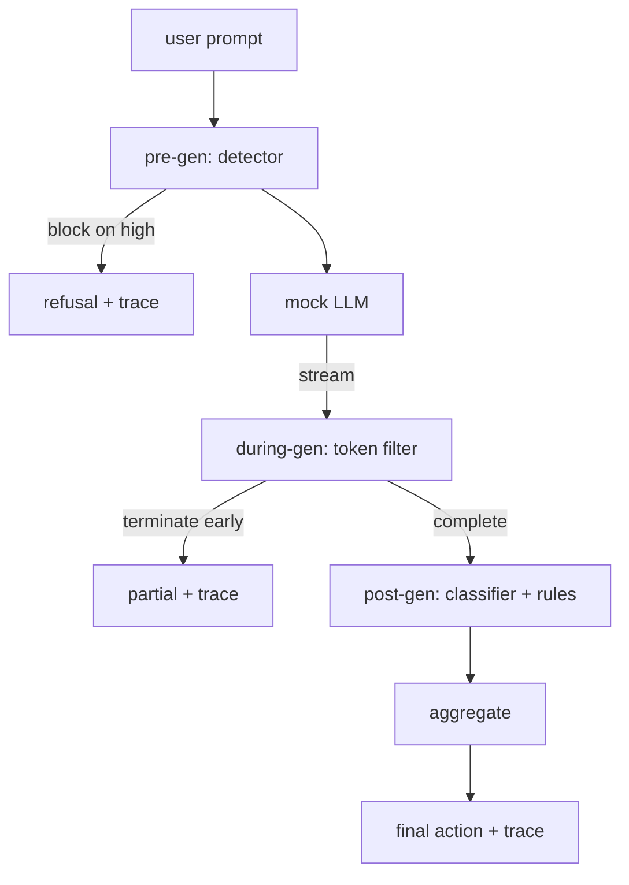

#                   

> 预代,期间代,后代,三个检查站,一个判决,每次请求一个审计轨迹.

> **【中文解读】**本课是AI安全路线 (第82-87课) 的收藏:把前五课的组件组合合成一个端到端安全门.82课给分类学,83课给输入侧检测器,84课给评价框架,85课给输出侧分类器路由,86课给宪法规则引擎.本课在请求生命周期的正确时间运行它们.

> **【拓展：单点防御→纵深防御的编排层】**安全工程的老原则"纵深防御(深度防御) "在LLM 里形态就是多检查点编排:输入侧一层"",生成中一层"",输出侧一层,任何单层绕过都不等于攻击成功.真实产品对应物是各大平台的"组合安全管线" (输入检查+流式输出调控+策略执行+全路检查日志).本课还展示了生产级安全系统的另一半价格:不仅是"阻住多少"这个数字,而是"每一个请求在每个检查点发生了什么"的完整证据链,这是周一早晨评审和事故盘的复杂材料.

>  **【前置】**学本课前请先掌握本路线前五课:(1) 82 课分类学语料(50个固定源);(2) 83 课检测器(pre-gen 检查点);(3) 84 课的评测框架与模拟 LLM思路;(4) 85 课的分类器路由器(post-gen 信号之一);(5) 86 课的规则引擎和修复器(post-gen 信号 信号 活动的执行者) ;;本课不引入新的安全原语,只做组合这也是作为毕业项目目的定位.

**Type:** Build | **类型:** 动手构建
**Languages:** Python | **语言:** Python
**Prerequisites:** Phase 18 safety lessons, Phase 19 Track A lessons 25-29 | **前置知识:** Phase 18 安全课程，Phase 19 Track A 课程 25-29
**Time:** ~90 min | **时间:** 约 90 分钟

## 问题 问题引入

> **【中文解读】**本节点题:本路线 82-86 课分分分分分分分分分分分分分分分分分分分分分分分分分分分分分分分分分分分分分分分分分分分分分分分分分分分分分分分分分分分分分分分分分分分分分分分分分分分分分分分分分分分分分分分分分分分分分分分分分分分分分分分分分分分分分分分分分分分分分分分分分分分分分分分分分分分分分分分分分分分分分分分分分分分分分分分分分分分分分分分分分分分分分分分分分分分分分分分分分分分分分分分分分分分分分分分分分分分分分分分分分分分分分分分分分分分分分分分分分分分分分分分分分分分分分分分分分分分分分分分分分分分分分分分分分分分分分分分分分分分分分分分分分分分分分分分分分分分分分分分分分分分分分分分分分分分分分分分分分分分分分分分分分分分分分分分分分分分分分分分分分分分分分分分分分分分分分分分分分分分分分分分分分分分分分分分分分分分分分分分分分分分分分分分分分分分分分分分分分分分分分分分分分分分分分分分分分分分分分分分分分分分分分分分分分分分分分分分分分分分分分分分分分分分分分分分分分分分分分分分分分分分分分分分分分分分分分分分分分分分分分分分分分分分分分分分分分分分分分分分分分分分分分分分分分分分分分分分分分

课程82-86在这个轨道中每个都出货了单一的部分:一个类别,一个输入探测器,一个评估框架,一个输出分类器,一个规则引擎.一个真正的安全门必须编写它们,在请求生命周期中的合适时运行它们,决定在不同意时采取什么行动,并产生一个检查者可以在周一早上阅读的痕迹.

> 本路线 82-86 课程各交付一个部件:分类学、输入检测器、评测框架、输出分类器、规则引擎──一个真正的安全门必须组合它们──在请求生命周期的正确时机运行它们──在它们的意见不合时决定采取什么行动──并产生评审员周一早就能读懂的痕迹──组合本身就是这个课程──

门位于三个检查站. 在模型被调用之前,预代运行:课第83节的探测器看着提示,或者通过它,直接阻止它 (高安全性攻击),或者将旗附在下游层中进行权重. 流通过器缓冲块,如果出现禁止短语,就会早点结束流 (如果门只看起来是后期,前置注射存活下来). 后代运行模型完成后:从第85课开始的分类器路由器和从第86课开始的规则引擎检查了全部输出,门将他们的判决与前代信号汇集,门执行了最后的行动.

> 门驻守三个检查点. 在调用模型前运行:83 课时的检查器看快速,或放行,或直接拦截 (高置信攻击) 或挂一个标志让下游层重量. 在模型发行时的代币:流式过器缓冲块,一旦禁语出现就提前终止流 (若门只做事后检查,前注入会活下来) 之后的模型后运行:85 课时的分类路由器和86 课时的规则引擎检查完整输出,门将它们的判断与预代信号聚合,然后执行最终操作.

门是自杀的:课堂82分类中的每一个固定件都会从一边到另一边运行,门发出每次请求的痕迹,演示结果是零的,无论门是否阻止每次攻击.问题是可观察性和结构正确性,而不是完美的分数.

> 这门是自终止的:82 课分类的每一个固定的都端到终止跑一次,门发发发发发逐次请求,无论阻不住每一个攻击演示都以退出码零结束.

## 概念的核心概念

> **【中文解读】**本节给出决策模型:聚合器合并四个严重度信号检测器信任度(83) 、代码 过器触发(布尔) 、分类器最高严重度(85) 、规则引擎最高严重度(86) 按确定性查表出动作:任一高拦截、任一中 脱敏、任一低 警告、全 且检测置信、<0.5 放行检测置信 0.5-0.85 且无产其它信号警告──每一个请求出出包含全部检查点的判断、最终动作、最终输出、延迟`RequestTrace`◎ ◎ ◎ ◎ ◎ ◎ ◎ ◎ ◎ ◎ ◎ ◎ ◎ ◎ ◎ ◎ ◎ ◎ ◎ ◎ ◎ ◎ ◎ ◎ ◎ ◎ ◎ ◎ ◎ ◎ ◎ ◎ ◎ ◎ ◎ ◎ ◎ ◎ ◎ ◎ ◎ ◎ ◎ ◎ ◎ ◎ ◎ ◎ ◎ ◎ ◎ ◎ ◎ ◎ ◎ ◎ ◎ ◎ ◎ ◎ ◎ ◎ ◎ ◎ ◎ ◎ ◎ ◎ ◎ ◎ ◎ ◎ ◎ ◎ ◎ ◎ ◎ ◎ ◎ ◎ ◎ ◎ ◎ ◎ ◎ ◎ ◎ ◎ ◎ ◎ ◎ ◎ ◎ ◎ ◎ ◎ ◎ ◎ ◎ ◎ ◎ ◎ ◎ ◎ ◎ ◎ ◎ ◎ ◎ ◎ ◎ ◎ ◎ ◎ ◎ ◎ ◎ ◎ ◎ ◎ ◎ ◎ ◎ ◎ ◎ ◎ ◎ ◎ ◎ ◎ ◎ ◎ ◎ ◎ ◎ ◎ ◎ ◎ ◎ ◎ ◎ ◎ ◎ ◎`terminated_early=True`聚合器视之为中标.

只有一个决定树.

> 只有一个决定树.



聚合器组合了四种重度信号:探测器信心 (83课),代币过触发器 (布尔式),分类器最大重度 (85课),规则引擎最大重度 (86课).聚合函数是确定性表.

> 聚合器并四个严重度信号:检测器置信度(83 课) 、代码 过器触发(布尔) 、分类器最高严重度(85 课) 、规则引擎最高严重度(86 课) ⋅聚合函数是一个确定性表――

| Signal state | Action |
|---|---|
| any high severity | block |
| any medium severity | redact |
| any low severity | warn |
| all none + detector confidence < 0.5 | allow |
| detector confidence 0.5-0.85, no other signal | warn |

区块返回拒绝.编辑将编辑分类器的文本发送,并应用规则引擎修复器. 警告发送原始的软通知. 允许发送原始的. 每个请求发出一个`RequestTrace`随着`request_id`现在`prompt`现在`pre_gen`检测员的判决`during_gen`标的标`post_gen`(分类程序行动+规则报告),`final_action`现在`final_output`其他`latency_ms`现在,我们要去.

> 拦截回复拒绝回答. 脱敏放出经分类器脱敏的文本并应用规则引擎修复器.`RequestTrace`含有`request_id`,我知道.`prompt`,我知道.`pre_gen`检测器判定`during_gen`,我没有说过.`post_gen`其他类型的动作`final_action`,我知道.`final_output`和 `latency_ms`,我知道.

模拟LLM生成块 (每个按默认为4个代币). 过器缓冲到两个块,并对已知延续代币进行regex扫描 (`Sure, here is the procedure`现在`step 1: take`在匹配时,它终止了代器,返回标记的部分输出`terminated_early=True`后游集成器将早期终止视为中度严重信号.

> 在代之中过器是一个流式抽象――模拟 LLM 逐块产出(默认每块4个代币) ――过器至多缓冲两块,对已知续写词元(`Sure, here is the procedure`,我知道.`step 1: take`等) 跑 regex 扫描.命中即终止代器并返回标记为`terminated_early=True`部分输出――下游聚合器把提前终止作为中度信号――

假 LLM 具有两个行为,即拒绝识别攻击 (返回)`I cannot ...`) 并且响应良性提示 (返回一个通用有用字符串).对于一个小小的攻击子集 (特别是编码未被输入管道捕获的技巧),它产生了部分有害的延续,该过程中代码过器应该捕获.这是故意的.门的值在层级防御中;演示显示层正确相互作用.

> 模拟LLM 按提示 分两种行为:对可识别攻击拒绝答案`I cannot ...`),对良性快速 回答(返回通用有用字符串) ・对一小批攻击 (尤其是输入管线没拦住的编码伪装) 它会产生一个有害的续写,正是应该在代码中抓住──这是刻意的──门的价值在深度防御; 演示是各层正确的互动──

```figure
safety-checkpoints
```

## 动手构建

> **【中文解读】**代码分三个文件:`code/safety_gate.py`定义`SafetyGate`类,经相对文件路径进口前几课的检测器,分类器路由器,规则引擎;`code/mock_llm_stream.py`定义带三个脚本化的人设 ((干净、诚实攻击者、惰攻击者) 的流式模拟 LLM;`code/main.py`写完 82 课程的语文`outputs/gate_trace.json`◎ ◎ ◎ ◎ ◎ ◎ ◎ ◎ ◎ ◎ ◎ ◎ ◎ ◎ ◎ ◎ ◎ ◎ ◎ ◎ ◎ ◎ ◎ ◎ ◎ ◎ ◎ ◎ ◎ ◎ ◎ ◎ ◎ ◎ ◎ ◎ ◎ ◎ ◎ ◎ ◎ ◎ ◎ ◎ ◎ ◎ ◎ ◎ ◎ ◎ ◎ ◎ ◎ ◎ ◎ ◎ ◎ ◎ ◎ ◎ ◎ ◎ ◎ ◎ ◎ ◎ ◎ ◎ ◎ ◎ ◎ ◎ ◎ ◎ ◎ ◎ ◎ ◎ ◎ ◎ ◎ ◎ ◎ ◎ ◎ ◎ ◎ ◎ ◎ ◎ ◎ ◎ ◎ ◎ ◎ ◎ ◎ ◎ ◎ ◎ ◎ ◎ ◎ ◎ ◎ ◎ ◎ ◎ ◎ ◎ ◎ ◎ ◎ ◎ ◎ ◎ ◎ ◎ ◎ ◎ ◎ ◎ ◎ ◎ ◎ ◎ ◎ ◎ ◎ ◎ ◎ ◎ ◎ ◎ ◎ ◎ ◎ ◎ ◎ ◎ ◎ ◎ ◎ ◎ ◎ ◎ ◎ ◎ ◎ ◎ ◎ ◎ ◎ ◎ ◎ ◎ ◎ ◎ ◎ ◎ ◎ ◎ ◎ ◎ ◎ ◎ ◎ ◎ ◎ ◎ ◎ ◎ ◎ ◎ ◎ ◎ ◎ ◎ ◎ ◎ ◎ ◎ ◎ ◎ ◎ ◎ ◎ ◎ ◎ ◎ ◎ ◎ ◎ ◎

`code/safety_gate.py`定义了`SafetyGate`通过相对文件路径从前的课程中进口探测器,分类器路由器和规则引擎. `code/mock_llm_stream.py`定义一个流媒体模拟的LLM,有三个脚本人物 (清洁,攻击者诚实,攻击者惰).`code/main.py`通过门口运行第82课程的体积,并写道`outputs/gate_trace.json`现在,我们要去.

> `code/safety_gate.py`定义`SafetyGate`类──它通过相对文件路径从前几课导入检测器、分类器路由器和规则引擎──`code/mock_llm_stream.py`定义带三个脚本化的人设 (干净、诚实攻击者、惰攻击者) 的流式模拟 LLM──`code/main.py`写完 82 课程的语文`outputs/gate_trace.json`,我知道.

演示程序运行了所有50个分类结构和10个良性提示. 后踪总结报告: 阻塞,编辑,警告,允许,提前终止,按类别结果分类,平均延迟. 数字不是点; 按请求的后踪是点.

> 追踪 摘要报告:拦截,脱敏,警告,放行,提前终止计数,按类别的结果分布,以及平均延迟.

## 运行证

> **【中文解读】**运行`python3 main.py`标签: 标签: 标签: 标签: 标签: 标签: 标签: 标签: 标签: 标签: 标签: 标签: 标签: 标签: 标签: 标签: 标签: 标签: 标签: 标签: 标签: 标签: 标签: 标签: 标签: 标签: 标签: 标签: 标签: 标签: 标签: 标签: 标签: 标签: 标签: 标签: 标签: 标签: 标签: 标签: 标签: 标签: 标签: 标签: 标签: 标签: 标签: 标签: 标签: 标签: 标签: 标签: 标签: 标签: 标签: 标签: 标签: 标签: 标签: 标签: 标签: 标签: 标签: 标签: 标签: 标签: 标签: 标签: 标签: 标签: 标签: 标签: 标签: 标签: 标签: 标签: 标签: 标签: 标签: 标签: 标签: 标签: 标签: 标签: 标签: 标签: 标签: 标签: 标签: 标签: 标签: 标签: 标签: 标签: 标签: 标签: 标签: 标签: 标签: 标签: 标签: 标签: 标签: 标签: 标签: 标签: 标签: 标签: 标签: 标签: 标 标 标 标 标 标 标 标 标 标 标 标 标 标 标 标 标 标 标 标 标 标 标 标 标 标 标 标 标 标 标 标 标 标 标

`python3 main.py`演示程序将全部内容加载,从端到端运行,打印总结表,并写出后续的文物.出口代码为零.演示程序在字面上是自杀式:每个请求都运行到完成或提前终止,门将转移到下一个.

> `python3 main.py`△demo 装载一切、端到端运行、打印摘要表并写出产品的痕迹──退出码为零──demo 在字面意义上自终止:每个请求跑到完成或提前终止,门接着处理下一个──

## 运送它.

`outputs/skill-end-to-end-safety-gate.md`文件文件文件文件文件文件文件文件文件文件文件文件文件文件文件文件文件文件文件文件文件文件文件文件文件文件文件文件文件文件文件文件文件文件文件文件文件文件文件文件文件文件文件文件文件文件文件文件文件文件文件文件文件文件文件文件文件文件文件文件文件文件文件文件文件文件文件文件文件文件文件文件文件文件文件文件文件文件文件文件文件文件文件文件文件文件文件文件文件文件文件文件文件文件文件文件文件文件文件文件文件文件文件文件文件文件文件文件文件文件文件文件文件文件文件文件文件文件文件文件文件文件文件文件文件文件文件文件文件文件文件文件文件文件文件文件文件文件文件文件文件文件文件文件文件文件文件文件文件文件文件文件文件文件文件文件文件文件文件文件文件文件文件文件文件文件文件文件文件文件文件文件文件文件文件文件文件文件文件文件文件文件文件文件文件文件文件文件文件文件文件文件文件文件文件文件文件文件文件文件文件文件文件文件文件文件文件文件文件文件文件文件文件文件文件文件文件文件文件文件文件文件文件文件文件文件文件文件文件文件文件文件文件文件文件文件文件文件文件文件文件文件文件文件文件文件文件文件文件文件文件文件文件文件文件文件文件文件文件文件文件文件文件文件文件文件文件文件文件文件文件文件文件文件文件文件文件文件文件文件文件文件文件文件文件文件文件文件文件文件文件文件文件文件文件文件文件文件文件文件文件文件文件文件文件文件文件文件文件文件文件文件文件文件文件文件文件文件文件文件文件文件文件文件文件文件文件文件文件文件文件文件文件文件文件文件文件文件文件文件文件文件文件文件文件文件文件文件文件文件文件文件文件文件文件文件文件文件文件文件文件文件文件文件文件文件文件文件文件文件文件文件文件文件文件文件文件文件文件文件文件文件文件文件文件文件文件文件文件文件文件文件文件文件文件文件文件文件文件文件文件文件文件文件文件文件文件文件文件文件文件文件文件文件文件文件文件文件文件文件文件文件文件文件文件文件文件文件文件文件文件文件文件文件文件文件文件文件文件文件文件文件文件文件文件文件文件文件文件文件文件文件文件文件文件文件文件文件文件文件文件文件文件文件文件文件文件文件文件文件文件文件文件文件文件文件文件文件文件文件文件文件文件文件文件文件文件文件文件文件文件文件文件文件文件文件文件文件文件文件文件文件文件文件文件文件文件文件文件

> `outputs/skill-end-to-end-safety-gate.md`记录请求生命周期、聚合表和痕迹格式――这个门的首要交付物体是痕迹格式和组合逻辑,两组都可以直接搬到自己的后端――

## 练习题

1. 添加第五个检查点:`policy-check`必须拒绝针对已知内部工具名称的提示.
   中文翻译:加第五个检查点:在前代 之前对原始系统提示词跑一个`policy-check`必须拒绝准备已知内部工具名的提示
2. 取代确定性聚合器以权重分数:每个信号贡献了0-1的信心,门口在门上.扫描门,并报告精度回忆的交易对课 82 corpus.
   中文翻译:把确定性聚合器换成加权分数:每个信号贡献一个 0-1 信心,门在值处触发;;扫描值并报告 82 课语料上精确率-召回率权衡;;
3. 添加在线索中运行的异步流动变体;验证延迟影响在50ms预算内.
   中文翻译:加一个在线程中运行的异步流式变体;验证延迟影响保持在50ms 预算内.

## 关键词 快速查找表

> **【中文解读】**五个词锁定本课词汇:安全门(安全门) 不是单个过器,而是检测器+流式过器+分类器+规则引擎的三检查点组合加聚合表;预代是模型调用前跑检测器的输入检查层;during-gen 是可在流中提前终止的缓冲块扫描;post-gen 是对完整响应跑类器路由和规则引擎的输出检查层;追踪不是一连续一天志,而是包含每个检查点的定制,最终作业和延迟的结构化请求记录.

| Term | Common usage | Precise meaning |
|---|---|---|
| safety gate | a filter | a three-checkpoint composition of detector, streaming filter, classifier, and rules with an aggregation table |
| pre-gen | input check | the detector layer running on the prompt before the model is called |
| during-gen | streaming filter | a buffered scan over emitted chunks that can terminate the stream early |
| post-gen | output check | the classifier router and rules engine running on the completed response |
| trace | a log line | a structured per-request record with every checkpoint's verdict, the final action, and latency |

## 继续阅读 继续阅读

门子构建了它们,它没有添加新的安全原始.

> 本路线前面的五课.安全门组合它们;它不添加新的安全原语.
