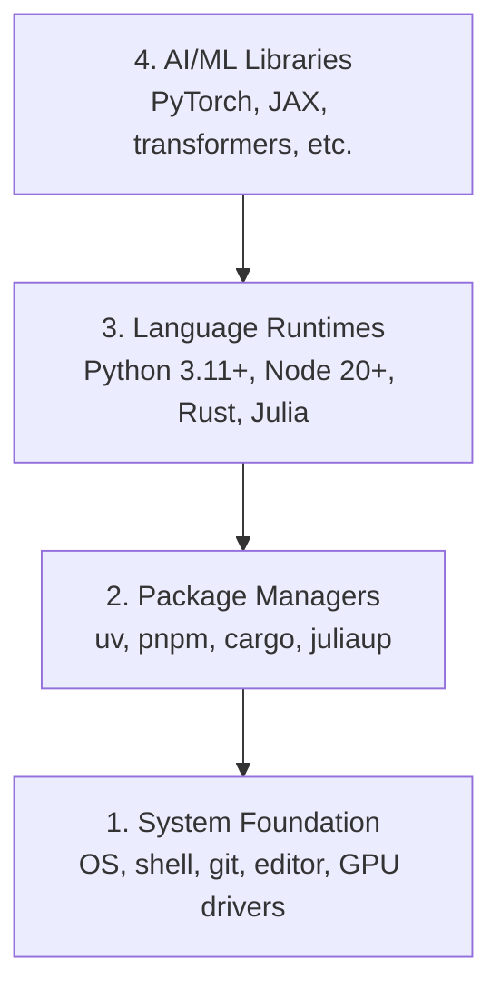

# Dev Environment | 开发环境搭建

> Your tools shape your thinking. Set them up once, set them up right.

**Type:** Build
**Languages:** Python, Node.js, Rust
**Prerequisites:** None
**Time:** ~45 minutes

## Learning Objectives | 学习目标

- Set up Python 3.11+, Node.js 20+, and Rust toolchains from scratch
- Configure virtual environments and package managers for reproducible builds
- Verify GPU access with CUDA/MPS and run a test tensor operation
- Understand the four-layer stack: system, packages, runtimes, AI libraries

> **【中文解读】**
> 本章是整个课程的起点。你将搭建一套完整的 AI 工程开发环境，包括 Python、Node.js、Rust 三种语言工具链，并验证 GPU 加速是否可用。环境搭建是 AI 学习中最容易被忽略但最重要的步骤——环境不对，后面每一步都会踩坑。

## The Problem | 问题描述

You're about to learn AI engineering across 200+ lessons using Python, TypeScript, Rust, and Julia. If your environment is broken, every single lesson becomes a fight against tooling instead of learning.

Most people skip environment setup. Then they spend hours debugging import errors, version conflicts, and missing CUDA drivers. We're going to do this once, properly.

> **【中文解读】**
> 环境问题是你遇到 "import error"、"版本冲突"、"找不到 CUDA" 等报错的根本原因。与其每次上课都修环境，不如一次性搭好。

## The Concept | 核心概念

An AI engineering environment has four layers:



We install bottom-up. Each layer depends on the one below it.

> **【中文解读】**
> AI 工程环境是四层金字塔：最底层是操作系统和驱动，往上是包管理器，再往上是语言运行时，最顶层才是 PyTorch、transformers 等 AI 库。安装时从底层往上装，每一层依赖下层。

> **【拓展：为什么需要 uv 而不是 pip？】**
> uv 是 Rust 写的 Python 包管理器，速度比 pip 快 10-100 倍，还能自动管理虚拟环境。在实际 AI 项目中，你可能会同时维护多个项目的依赖（比如一个用 PyTorch 2.1，另一个用 2.4），uv 能让环境隔离变得非常简单。

## Build It | 动手搭建

> **【中文解读】** 以下步骤按"从底到顶"的顺序安装四层工具栈。每一步都可以直接复制粘贴到终端执行。如果你用 Windows，建议使用 WSL2（Windows Subsystem for Linux）来获得 Linux 环境。

### Step 1: System Foundation | 第1步：系统基础层

Check your system and install the basics.

```bash
# macOS
xcode-select --install
brew install git curl wget

# Ubuntu/Debian
sudo apt update && sudo apt install -y build-essential git curl wget

# Windows (use WSL2)
wsl --install -d Ubuntu-24.04
```

### Step 2: Python with uv | 第2步：使用 uv 安装 Python

We use `uv` — it's 10-100x faster than pip and handles virtual environments automatically.

> **【拓展：Python 版本选择】** 推荐 Python 3.12（稳定且性能优化）。3.11+ 都可以，但要避免 3.13（部分 AI 库可能尚未适配）。uv 的 `python install` 会自动下载和管理 Python 版本，不再需要 pyenv。

```bash
curl -LsSf https://astral.sh/uv/install.sh | sh

uv python install 3.12

uv venv
source .venv/bin/activate  # or .venv\Scripts\activate on Windows # Windows 下激活虚拟环境

uv pip install numpy matplotlib jupyter  # 安装 AI 学习三大基础库
```

Verify:

```python
import sys
print(f"Python {sys.version}")

import numpy as np
print(f"NumPy {np.__version__}")
a = np.array([1, 2, 3])  # 创建一个一维数组（向量）
print(f"Vector: {a}, dot product with itself: {np.dot(a, a)}")  # 点积运算，线性代数基础
```

### Step 3: Node.js with pnpm | 第3步：安装 Node.js 和 pnpm

> **【中文解读】** Node.js 是 TypeScript 的运行环境。本课程 Phase 13-17（工具协议、Agent 工程等）使用 TypeScript 编写。fnm 是 Node 版本管理器，pnpm 是比 npm 更快的包管理器。

For TypeScript lessons (agents, MCP servers, web apps).

```bash
curl -fsSL https://fnm.vercel.app/install | bash
fnm install 22
fnm use 22

npm install -g pnpm

node -e "console.log('Node', process.version)"
```

### Step 4: Rust | 第4步：安装 Rust

For performance-critical lessons (inference, systems).

> **【中文解读】** Rust 用于本课程中性能敏感的部分，如推理优化（Phase 12）和自主系统（Phase 15-17）。rustup 是 Rust 官方安装器，cargo 是 Rust 的包管理器+构建工具（相当于 Rust 版的 pip+make）。

```bash
curl --proto '=https' --tlsv1.2 -sSf https://sh.rustup.rs | sh

rustc --version
cargo --version
```

### Step 5: Julia (Optional) | Julia（可选）

For math-heavy lessons where Julia shines.

```bash
curl -fsSL https://install.julialang.org | sh

julia -e 'println("Julia ", VERSION)'
```

### Step 6: GPU Setup (If You Have One) | GPU 设置（如果有显卡）

```bash
# NVIDIA
nvidia-smi  # 检查 GPU 驱动是否正常

# Install PyTorch with CUDA # 安装支持 GPU 加速的 PyTorch
uv pip install torch torchvision torchaudio --index-url https://download.pytorch.org/whl/cu124
```

```python
import torch
print(f"CUDA available: {torch.cuda.is_available()}")  # 检测 GPU 是否可用
if torch.cuda.is_available():
    print(f"GPU: {torch.cuda.get_device_name(0)}")  # 打印 GPU 名称
```

No GPU? No problem. Most lessons work on CPU. For training-heavy lessons, use Google Colab or cloud GPUs.

> **【拓展：GPU vs CPU 性能对比】** 训练 GPT-2 small（117M 参数）：CPU 约 7 天，单块 RTX 3090 约 3 小时，A100 约 40 分钟。推理阶段差距略小但依然显著。本课程大部分 Lesson 可以用 CPU 跑，只有 Phase 10（从零训练 LLM）等少数课程建议用 GPU。

> **【拓展：GPU 在 AI 中的作用】**
> GPU（图形处理器）之所以在 AI 中不可或缺，是因为它能同时执行成千上万个简单计算（并行计算）。训练一个 Transformer 模型在 CPU 上可能需要几周，在 GPU 上只需几小时。如果你没有 GPU，Google Colab 提供免费的 GPU 使用。

### Step 7: Verify Everything | 第7步：验证一切

Run the verification script:

```bash
python phases/00-setup-and-tooling/01-dev-environment/code/verify.py
```

## Use It | 使用指南

> **【中文解读】** 下表告诉你每种语言在哪些阶段使用。Python 是绝对主力（Phase 1-12），TypeScript 用于 Agent 和工具链（Phase 13-17），Rust 用于高性能场景，Julia 用于数学计算。

Your environment is now ready for every lesson in this course. Here's what you'll use where:

| Language | Used In | Package Manager |
|----------|---------|-----------------|
| Python | Phases 1-12 (ML, DL, NLP, Vision, Audio, LLMs) | uv |
| TypeScript | Phases 13-17 (Tools, Agents, Swarms, Infra) | pnpm |
| Rust | Phases 12, 15-17 (Performance-critical systems) | cargo |
| Julia | Phase 1 (Math foundations) | Pkg |

| 语言 | 用在哪些阶段 | 包管理器 |
|------|------------|---------|
| Python | 阶段 1-12（ML、DL、NLP、视觉、音频、LLM） | uv |
| TypeScript | 阶段 13-17（工具、Agent、集群、基础设施） | pnpm |
| Rust | 阶段 12, 15-17（高性能系统） | cargo |
| Julia | 阶段 1（数学基础） | Pkg |

## Ship It | 产出物

> **【拓展：环境检查 Prompt】** `outputs/prompt-env-check.md` 是一个可以直接给 AI 助手用的 prompt，让它帮你诊断环境问题。在实际工作中，这类"环境自检 prompt"非常有用——你只需要把报错贴给它，它就能定位问题。

This lesson produces a verification script that anyone can run to check their setup.

See `outputs/prompt-env-check.md` for a prompt that helps AI assistants diagnose environment issues.

## Exercises | 练习题

1. Run the verification script and fix any failures
   运行验证脚本并修复所有失败的检查项
2. Create a Python virtual environment for this course and install PyTorch
   为本课程创建 Python 虚拟环境并安装 PyTorch
3. Write a "hello world" in all four languages and run each one
   用四种语言各写一个 "hello world" 并运行
