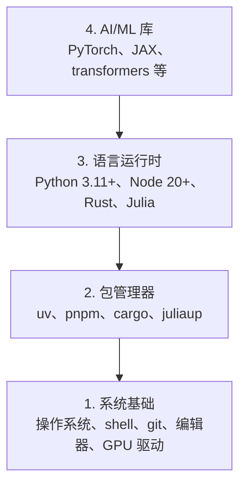

# 开发环境搭建

> 你的工具塑造你的思维。一次搭好，终身受益。

**类型：** 动手实践
**语言：** Python, Node.js, Rust
**前置条件：** 无
**预计用时：** 约 45 分钟

## 学习目标

- 从零搭建 Python 3.11+、Node.js 20+ 和 Rust 工具链
- 配置虚拟环境和包管理器，实现可复现的构建
- 通过 CUDA/MPS 验证 GPU 访问，运行测试张量运算
- 理解四层工具栈：系统层、包管理层、运行时层、AI 库层

> **【中文解读】**
> 本章是整个课程的起点。你将搭建一套完整的 AI 工程开发环境，包括 Python、Node.js、Rust 三种语言工具链，并验证 GPU 加速是否可用。环境搭建是 AI 学习中最容易被忽略但最重要的步骤——环境不对，后面每一步都会踩坑。

## 问题引入

你即将通过 200 多节课学习 AI 工程，使用 Python、TypeScript、Rust 和 Julia。如果你的环境有问题，每一节课都会变成和工具的搏斗，而不是在学习。

大多数人跳过环境搭建，然后花几个小时调试 import 错误、版本冲突和缺失的 CUDA 驱动。我们这次要一次性把它做好。

> **【中文解读】**
> 环境问题是你遇到 "import error"、"版本冲突"、"找不到 CUDA" 等报错的根本原因。与其每次上课都修环境，不如一次性搭好。

## 核心概念

AI 工程环境有四层：



我们从底层往上安装。每一层依赖下面一层。

> **【中文解读】**
> AI 工程环境是四层金字塔：最底层是操作系统和驱动，往上是包管理器，再往上是语言运行时，最顶层才是 PyTorch、transformers 等 AI 库。安装时从底层往上装，每一层依赖下层。

> **【拓展：为什么需要 uv 而不是 pip？】**
> uv 是 Rust 写的 Python 包管理器，速度比 pip 快 10-100 倍，还能自动管理虚拟环境。在实际 AI 项目中，你可能会同时维护多个项目的依赖（比如一个用 PyTorch 2.1，另一个用 2.4），uv 能让环境隔离变得非常简单。

## 动手实现

> **【中文解读】** 以下步骤按"从底到顶"的顺序安装四层工具栈。每一步都可以直接复制粘贴到终端执行。如果你用 Windows，建议使用 WSL2（Windows Subsystem for Linux）来获得 Linux 环境。

### 第 1 步：系统基础层

检查你的系统并安装基础工具。

```bash
# macOS
xcode-select --install
brew install git curl wget

# Ubuntu/Debian
sudo apt update && sudo apt install -y build-essential git curl wget

# Windows（使用 WSL2）
wsl --install -d Ubuntu-24.04
```

### 第 2 步：使用 uv 安装 Python

我们使用 `uv` —— 它比 pip 快 10-100 倍，并且自动管理虚拟环境。

> **【拓展：Python 版本选择】** 推荐 Python 3.12（稳定且性能优化）。3.11+ 都可以，但要避免 3.13（部分 AI 库可能尚未适配）。uv 的 `python install` 会自动下载和管理 Python 版本，不再需要 pyenv。

```bash
curl -LsSf https://astral.sh/uv/install.sh | sh

uv python install 3.12

uv venv
source .venv/bin/activate  # Windows 下使用 .venv\Scripts\activate

uv pip install numpy matplotlib jupyter  # 安装 AI 学习三大基础库
```

验证安装：

```python
import sys
print(f"Python {sys.version}")

import numpy as np
print(f"NumPy {np.__version__}")
a = np.array([1, 2, 3])  # 创建一个一维数组（向量）
print(f"向量: {a}, 与自身的点积: {np.dot(a, a)}")  # 点积运算，线性代数基础
```

### 第 3 步：安装 Node.js 和 pnpm

> **【中文解读】** Node.js 是 TypeScript 的运行环境。本课程 Phase 13-17（工具协议、Agent 工程等）使用 TypeScript 编写。fnm 是 Node 版本管理器，pnpm 是比 npm 更快的包管理器。

用于 TypeScript 课程（Agent、MCP 服务器、Web 应用）。

```bash
curl -fsSL https://fnm.vercel.app/install | bash
fnm install 22
fnm use 22

npm install -g pnpm

node -e "console.log('Node', process.version)"
```

### 第 4 步：安装 Rust

用于性能敏感的课程（推理优化、系统编程）。

> **【中文解读】** Rust 用于本课程中性能敏感的部分，如推理优化（Phase 12）和自主系统（Phase 15-17）。rustup 是 Rust 官方安装器，cargo 是 Rust 的包管理器+构建工具（相当于 Rust 版的 pip+make）。

```bash
curl --proto '=https' --tlsv1.2 -sSf https://sh.rustup.rs | sh

rustc --version
cargo --version
```

### Julia（可选）

用于 Julia 表现出色的数学密集型课程。

```bash
curl -fsSL https://install.julialang.org | sh

julia -e 'println("Julia ", VERSION)'
```

### GPU 设置（如果有显卡）

```bash
# NVIDIA
nvidia-smi  # 检查 GPU 驱动是否正常

# 安装支持 GPU 加速的 PyTorch
uv pip install torch torchvision torchaudio --index-url https://download.pytorch.org/whl/cu124
```

```python
import torch
print(f"CUDA 可用: {torch.cuda.is_available()}")  # 检测 GPU 是否可用
if torch.cuda.is_available():
    print(f"GPU: {torch.cuda.get_device_name(0)}")  # 打印 GPU 名称
```

没有 GPU？没关系。大部分课程可以在 CPU 上运行。对于训练密集型课程，可以使用 Google Colab 或云 GPU。

> **【拓展：GPU vs CPU 性能对比】** 训练 GPT-2 small（117M 参数）：CPU 约 7 天，单块 RTX 3090 约 3 小时，A100 约 40 分钟。推理阶段差距略小但依然显著。本课程大部分 Lesson 可以用 CPU 跑，只有 Phase 10（从零训练 LLM）等少数课程建议用 GPU。

> **【拓展：GPU 在 AI 中的作用】**
> GPU（图形处理器）之所以在 AI 中不可或缺，是因为它能同时执行成千上万个简单计算（并行计算）。训练一个 Transformer 模型在 CPU 上可能需要几周，在 GPU 上只需几小时。如果你没有 GPU，Google Colab 提供免费的 GPU 使用。

### 第 7 步：验证一切

运行验证脚本：

```bash
python phases/00-setup-and-tooling/01-dev-environment/code/verify.py
```

## 用框架实现

> **【中文解读】** 下表告诉你每种语言在哪些阶段使用。Python 是绝对主力（Phase 1-12），TypeScript 用于 Agent 和工具链（Phase 13-17），Rust 用于高性能场景，Julia 用于数学计算。

你的环境现在已经为本课程做好了准备。以下是各语言的使用场景：

| 语言 | 用在哪些阶段 | 包管理器 |
|------|------------|---------|
| Python | 阶段 1-12（ML、DL、NLP、视觉、音频、LLM） | uv |
| TypeScript | 阶段 13-17（工具、Agent、集群、基础设施） | pnpm |
| Rust | 阶段 12, 15-17（高性能系统） | cargo |
| Julia | 阶段 1（数学基础） | Pkg |

## 产出物

> **【拓展：环境检查 Prompt】** `outputs/prompt-env-check.md` 是一个可以直接给 AI 助手用的 prompt，让它帮你诊断环境问题。在实际工作中，这类"环境自检 prompt"非常有用——你只需要把报错贴给它，它就能定位问题。

本课程产出一个验证脚本，任何人都可以运行它来检查自己的环境配置。

参见 `outputs/prompt-env-check.md`，这是一个帮助 AI 助手诊断环境问题的 prompt。

## 练习题

1. 运行验证脚本并修复所有失败的检查项
2. 为本课程创建 Python 虚拟环境并安装 PyTorch
3. 用四种语言各写一个 "hello world" 并运行
