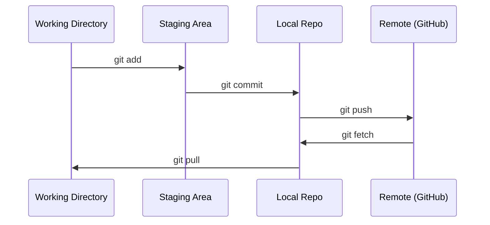

# Git & Collaboration | Git 与协作

> Version control is not optional. Every experiment, every model, every lesson you build here gets tracked.
> 版本控制不是可选的。你的每一次实验、每一个模型、每一节课的成果都会被追踪。

**Type:** Learn | **类型:** 学习
**Languages:** -- | **语言:** 无
**Prerequisites:** Phase 0, Lesson 01 | **前置知识:** Phase 0, 第 01 课
**Time:** ~30 minutes | **时间:** ~30 分钟

## Learning Objectives | 学习目标

- Configure git identity and use the daily workflow of add, commit, and push
  中文翻译：配置 Git 身份信息，掌握 add、commit、push 的日常工作流
- Create and merge branches for isolated experiments without breaking main
  中文翻译：创建和合并分支，实现实验隔离而不破坏主分支
- Write a `.gitignore` that excludes model checkpoints and large binary files
  中文翻译：编写 `.gitignore` 文件，排除模型检查点和大文件
- Navigate the commit history with `git log` to understand project evolution
  中文翻译：用 `git log` 浏览提交历史，了解项目演进过程

> **【中文解读】**
> Git 是版本控制工具，用于追踪代码的每一次修改。在 AI 项目中，你会在实验中频繁修改模型参数和代码，Git 让你能随时回退到之前的任何一个状态。

> **【拓展：Git 在 AI 工程中的角色】** AI 工程和传统软件开发不同——每次实验（超参数调整、数据集变更）都是一个"版本"。用 Git 追踪实验意味着：训练结果变差了，你可以 `git diff` 找出改了什么；模型部署出问题，可以 `git revert` 回滚。大模型团队（如 Hugging Face）的协作流程完全建立在 Git 之上。

## The Problem | 问题描述

You're about to write hundreds of code files across 20 phases. Without version control you will lose work, break things you can't undo, and have no way to collaborate with others.

> 你即将在 20 个阶段中编写数百个代码文件。没有版本控制，你会丢失工作成果、破坏无法恢复的东西，也无法与他人协作。

Git is the tool. GitHub is where the code lives. This lesson covers what you need for this course and nothing more.

> Git 是工具，GitHub 是代码托管的地方。本课只讲本课程需要的内容，不多不少。

> **【中文解读】**
> 你将写几百个代码文件，没有版本控制 = 随时可能丢失工作成果、无法回退、无法协作。Git 解决的就是这个问题。

## The Concept | 核心概念



Three things to remember:
1. Save often (`git commit`)
2. Push to remote (`git push`)
3. Branch for experiments (`git checkout -b experiment`)

> 要记住三件事：
> 1. 经常保存（`git commit`）
> 2. 推送到远程（`git push`）
> 3. 用分支做实验（`git checkout -b experiment`）

> **【中文解读】**
> Git 的核心流程：工作目录 → 暂存区（git add）→ 本地仓库（git commit）→ 远程仓库（git push）。记住三件事：经常提交、推送到远程、用分支做实验。

> **【拓展：分支策略与 AI 实验】** AI 项目推荐"每实验一个分支"策略：`experiment/lr-0.001`、`experiment/add-dropout` 等。这样每次实验的代码变更都被隔离，实验失败直接删分支，成功则合并。大型 AI 项目还会用 Git tag 标记模型版本（如 `v1.0-baseline`），方便部署时精确指定代码版本。

## Build It | 动手实现

### Step 1: Configure git

> 第1步：配置 Git

```bash
git config --global user.name "Your Name"
git config --global user.email "you@example.com"
```

### Step 2: The daily workflow | 日常工作流

```bash
git status                              # 查看哪些文件有改动
git add file.py                         # 把改动加入暂存区
git commit -m "Add perceptron implementation"  # 提交到本地仓库
git push origin main                    # 推送到 GitHub 远程仓库
```

### Step 3: Branching for experiments | 用分支做实验

```bash
git checkout -b experiment/new-optimizer  # 创建并切换到新分支

# ... make changes, commit ...  # 在新分支上修改和提交，不影响主分支

git checkout main                         # 切回主分支
git merge experiment/new-optimizer        # 把实验分支的改动合并到主分支
```

### Step 4: Working with this course repo | 第4步：使用本课程仓库

> **【拓展：Fork vs Clone】** 如果你想保存自己的学习进度而不影响原仓库，用 `fork`（在 GitHub 上操作）而不是直接 clone。Fork 后你有自己的一份完整副本，可以自由提交。之后还可以通过 Pull Request 把改进提交回原仓库。

```bash
git clone https://github.com/rohitg00/ai-engineering-from-scratch.git
cd ai-engineering-from-scratch

git checkout -b my-progress
# work through lessons, commit your code
git push origin my-progress
```

## Use It | 使用指南

> **【拓展：.gitignore 在 AI 项目中至关重要】** AI 项目会产生大量不该提交的大文件：模型权重（`.pt`、`.safetensors` 可达数十 GB）、训练日志、数据集缓存（`__pycache__`、`.venv`）。一个良好的 `.gitignore` 能防止你意外把 10GB 的模型文件推到 GitHub。推荐使用 `gitignore.io` 生成 Python/ML 项目的模板。

For this course, you need exactly these commands:

> 本课程中你只需要这些命令：

| Command | When |
|---------|------|
| `git clone` | Get the course repo |
| `git add` + `git commit` | Save your work |
| `git push` | Back it up to GitHub |
| `git checkout -b` | Try something without breaking main |
| `git log --oneline` | See what you've done |

| 命令 | 什么时候用 |
|------|-----------|
| `git clone` | 下载课程仓库 |
| `git add` + `git commit` | 保存你的工作 |
| `git push` | 备份到 GitHub |
| `git checkout -b` | 安全地尝试新想法 |
| `git log --oneline` | 查看你做了什么 |

That's it. You don't need rebase, cherry-pick, or submodules for this course.

> 就这些。本课程不需要 rebase、cherry-pick 或 submodules。

## Exercises | 练习题

1. Clone this repo, create a branch called `my-progress`, make a file, commit it, push it
   克隆仓库，创建 `my-progress` 分支，新建文件，提交并推送
2. Create a `.gitignore` that excludes model checkpoint files (`.pt`, `.pth`, `.safetensors`)
   创建 `.gitignore` 文件，排除模型检查点文件
3. Look at the commit history of this repo with `git log --oneline` and read how lessons were added
   用 `git log --oneline` 查看提交历史，了解课程是如何逐步构建的

## Key Terms | 关键术语

> **【中文解读】** Commit（提交）= 项目快照，Branch（分支）= 独立开发线，Merge（合并）= 把分支改动合回来，Remote（远程）= GitHub 上的仓库副本。掌握这四个概念就能应对 90% 的 AI 项目协作场景。

| Term | What people say | What it actually means |
|------|----------------|----------------------|
| Commit | "Saving" | A snapshot of your entire project at a point in time |
| Branch | "A copy" | A pointer to a commit that moves forward as you work |
| Merge | "Combining code" | Taking changes from one branch and applying them to another |
| Remote | "The cloud" | A copy of your repo hosted somewhere else (GitHub, GitLab) |

| 术语 | 俗称 | 实际含义 |
|------|------|---------|
| Commit | "保存" | 项目在某一时刻的完整快照 |
| Branch | "副本" | 指向某个提交的可移动指针，随工作向前推进 |
| Merge | "合并代码" | 将一个分支的改动应用到另一个分支 |
| Remote | "云端" | 托管在其他地方的仓库副本（如 GitHub、GitLab） |
