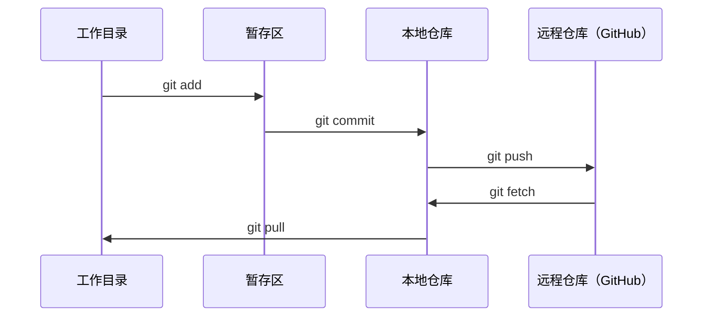

# Git 与协作

> 版本控制不是可选项。你的每一个实验、每一个模型、每一个课程项目都需要被追踪。

**类型：** 知识学习
**语言：** --
**前置条件：** Phase 0, Lesson 01
**预计用时：** 约 30 分钟

## 学习目标

- 配置 git 身份信息，掌握 add、commit、push 的日常工作流
- 创建和合并分支，进行隔离实验而不破坏主分支
- 编写 `.gitignore` 排除模型检查点和大文件
- 使用 `git log` 浏览提交历史，理解项目演进

> **【中文解读】**
> Git 是版本控制工具，用于追踪代码的每一次修改。在 AI 项目中，你会在实验中频繁修改模型参数和代码，Git 让你能随时回退到之前的任何一个状态。

> **【拓展：Git 在 AI 工程中的角色】** AI 工程和传统软件开发不同——每次实验（超参数调整、数据集变更）都是一个"版本"。用 Git 追踪实验意味着：训练结果变差了，你可以 `git diff` 找出改了什么；模型部署出问题，可以 `git revert` 回滚。大模型团队（如 Hugging Face）的协作流程完全建立在 Git 之上。

## 问题引入

你即将在 20 个阶段中编写数百个代码文件。没有版本控制，你会丢失工作成果、破坏无法撤销的东西，并且无法与他人协作。

Git 是工具，GitHub 是代码的家。本课只教你完成本课程所需的知识。

> **【中文解读】**
> 你将写几百个代码文件，没有版本控制 = 随时可能丢失工作成果、无法回退、无法协作。Git 解决的就是这个问题。

## 核心概念



记住三件事：
1. 经常保存（`git commit`）
2. 推送到远程（`git push`）
3. 用分支做实验（`git checkout -b experiment`）

> **【中文解读】**
> Git 的核心流程：工作目录 → 暂存区（git add）→ 本地仓库（git commit）→ 远程仓库（git push）。记住三件事：经常提交、推送到远程、用分支做实验。

> **【拓展：分支策略与 AI 实验】** AI 项目推荐"每实验一个分支"策略：`experiment/lr-0.001`、`experiment/add-dropout` 等。这样每次实验的代码变更都被隔离，实验失败直接删分支，成功则合并。大型 AI 项目还会用 Git tag 标记模型版本（如 `v1.0-baseline`），方便部署时精确指定代码版本。

## 动手实现

### 第 1 步：配置 git

```bash
git config --global user.name "你的名字"
git config --global user.email "you@example.com"
```

### 第 2 步：日常工作流

```bash
git status                              # 查看哪些文件有改动
git add file.py                         # 把改动加入暂存区
git commit -m "Add perceptron implementation"  # 提交到本地仓库
git push origin main                    # 推送到 GitHub 远程仓库
```

### 第 3 步：用分支做实验

```bash
git checkout -b experiment/new-optimizer  # 创建并切换到新分支

# ... 在新分支上修改和提交，不影响主分支 ...

git checkout main                         # 切回主分支
git merge experiment/new-optimizer        # 把实验分支的改动合并到主分支
```

### 第 4 步：使用本课程仓库

> **【拓展：Fork vs Clone】** 如果你想保存自己的学习进度而不影响原仓库，用 `fork`（在 GitHub 上操作）而不是直接 clone。Fork 后你有自己的一份完整副本，可以自由提交。之后还可以通过 Pull Request 把改进提交回原仓库。

```bash
git clone https://github.com/rohitg00/ai-engineering-from-scratch.git
cd ai-engineering-from-scratch

git checkout -b my-progress
# 按课程学习，提交你的代码
git push origin my-progress
```

## 用框架实现

> **【拓展：.gitignore 在 AI 项目中至关重要】** AI 项目会产生大量不该提交的大文件：模型权重（`.pt`、`.safetensors` 可达数十 GB）、训练日志、数据集缓存（`__pycache__`、`.venv`）。一个良好的 `.gitignore` 能防止你意外把 10GB 的模型文件推到 GitHub。推荐使用 `gitignore.io` 生成 Python/ML 项目的模板。

本课程中，你只需要这些命令：

| 命令 | 什么时候用 |
|------|-----------|
| `git clone` | 下载课程仓库 |
| `git add` + `git commit` | 保存你的工作 |
| `git push` | 备份到 GitHub |
| `git checkout -b` | 安全地尝试新想法 |
| `git log --oneline` | 查看你做了什么 |

本课程不需要 rebase、cherry-pick 或 submodules。

## 练习题

1. 克隆仓库，创建 `my-progress` 分支，新建文件，提交并推送
2. 创建 `.gitignore` 文件，排除模型检查点文件（`.pt`、`.pth`、`.safetensors`）
3. 用 `git log --oneline` 查看提交历史，了解课程是如何逐步构建的

## 术语速查表

> **【中文解读】** Commit（提交）= 项目快照，Branch（分支）= 独立开发线，Merge（合并）= 把分支改动合回来，Remote（远程）= GitHub 上的仓库副本。掌握这四个概念就能应对 90% 的 AI 项目协作场景。

| 术语 | 俗称 | 实际含义 |
|------|------|---------|
| Commit | "保存" | 项目在某一时刻的完整快照 |
| Branch | "副本" | 指向某个提交的可移动指针，随工作向前推进 |
| Merge | "合并代码" | 将一个分支的改动应用到另一个分支 |
| Remote | "云端" | 托管在其他地方的仓库副本（如 GitHub、GitLab） |
