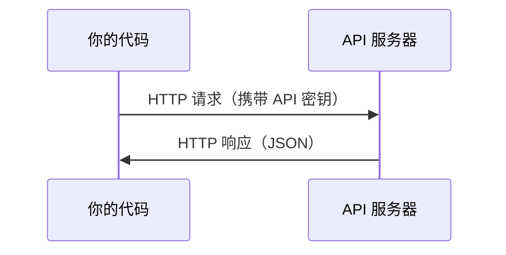

# API 与密钥管理

> 每个 AI API 的工作方式都一样：发送请求，获取响应。细节会变，模式不变。

**类型：** 动手实践
**语言：** Python, TypeScript
**前置条件：** Phase 0, Lesson 01
**预计用时：** 约 30 分钟

## 学习目标

- 使用环境变量和 `.env` 文件安全存储 API 密钥
- 使用 Anthropic Python SDK 和原始 HTTP 调用 LLM API
- 对比基于 SDK 和原始 HTTP 的请求/响应格式，用于调试
- 识别和处理常见 API 错误，包括认证和速率限制

> **【中文解读】**
> 所有 AI API 的工作方式都一样：发送请求、获取响应。本章教你如何安全管理 API 密钥、调用 LLM API，以及理解 SDK 调用和原始 HTTP 请求的区别。这是后面构建 AI Agent 的基础。

## 问题引入

从阶段 11 开始，你将调用 LLM API（Anthropic、OpenAI、Google）。在阶段 13-16，你将构建在循环中使用这些 API 的 Agent。你需要知道 API 密钥如何工作、如何安全存储，以及如何发起你的第一次 API 调用。

> **【中文解读】**
> 从阶段 11 开始，你将调用 LLM API；阶段 13-16 会构建循环调用 API 的 Agent。你需要先掌握 API 密钥管理和基本调用方式。

## 核心概念



每次 API 调用包含：
1. 端点（URL）
2. API 密钥（身份认证）
3. 请求体（你想要什么）
4. 响应体（返回什么）

> **【中文解读】**
> 每次 API 调用包含四要素：端点 URL、API 密钥（身份认证）、请求体（你想要什么）、响应体（返回什么）。理解这个模式后，所有 AI API 都是一样的。

> **【拓展：API 在 AI Agent 中的角色】**
> AI Agent 的核心循环就是：构造提示词 → 调用 LLM API → 解析响应 → 执行动作 → 再次调用 API。掌握 API 调用是构建 Agent 的第一步。

## 动手实现

> **【拓展：API 密钥安全的铁律】** 绝不把 API key 硬编码在代码里。一旦推到 GitHub，爬虫会在几秒内发现并滥用你的密钥（真实案例：有人在代码里写了 OpenAI key，几小时内被刷了上千美元）。使用 `.env` 文件 + `python-dotenv` 或操作系统环境变量。

### 第 1 步：安全存储 API 密钥

永远不要把 API 密钥写在代码里。使用环境变量。

```bash
export ANTHROPIC_API_KEY="sk-ant-..."  # 设置环境变量（密钥永远不要写在代码里！）
export OPENAI_API_KEY="sk-..."
```

或者使用 `.env` 文件（记得把它加入 `.gitignore`）：

```
ANTHROPIC_API_KEY=sk-ant-...  # .env 文件（确保加入 .gitignore）
OPENAI_API_KEY=sk-...
```

### 第 2 步：第一次 API 调用（Python）

```python
import anthropic

client = anthropic.Anthropic()  # 自动从环境变量读取密钥

response = client.messages.create(
    model="claude-sonnet-4-20250514",  # 指定模型
    max_tokens=256,  # 最大输出长度
    messages=[{"role": "user", "content": "What is a neural network in one sentence?"}]  # 用户消息
)

print(response.content[0].text)  # 打印模型回复
```

### 第 3 步：TypeScript 调用

> **【拓展：Token 计费机制】** LLM API 按token计费：Claude Sonnet 约 $3/百万输入 token、$15/百万输出 token。一个英文单词约 1.3 个 token，一个中文字约 2-3 个 token。`max_tokens=256` 意味着模型最多输出 256 个 token（约 200 个英文单词）。控制 `max_tokens` 是节省成本的关键手段。

```typescript
import Anthropic from "@anthropic-ai/sdk";

const client = new Anthropic();

const response = await client.messages.create({
  model: "claude-sonnet-4-20250514",
  max_tokens: 256,
  messages: [{ role: "user", content: "What is a neural network in one sentence?" }],
});

console.log(response.content[0].text);
```

### 第 4 步：原始 HTTP 请求（不用 SDK）

```python
import os
import urllib.request
import json

url = "https://api.anthropic.com/v1/messages"  # API 端点
headers = {
    "Content-Type": "application/json",  # 请求格式为 JSON
    "x-api-key": os.environ["ANTHROPIC_API_KEY"],  # 从环境变量读取密钥
    "anthropic-version": "2023-06-01",  # API 版本号
}
body = json.dumps({
    "model": "claude-sonnet-4-20250514",  # 模型名称
    "max_tokens": 256,  # 最大输出 token 数
    "messages": [{"role": "user", "content": "What is a neural network in one sentence?"}],
}).encode()

req = urllib.request.Request(url, data=body, headers=headers, method="POST")  # 构造 POST 请求
with urllib.request.urlopen(req) as resp:
    result = json.loads(resp.read())  # 解析 JSON 响应
    print(result["content"][0]["text"])  # 提取并打印回复文本
```

这就是 SDK 底层做的事情。理解原始 HTTP 调用有助于调试。

> **【中文解读】**
> SDK 只是对 HTTP 请求的封装。理解原始 HTTP 调用可以帮助你调试 API 问题、处理错误、甚至在 SDK 不支持的语言中调用 API。

## 用框架实现

> **【中文解读】** 现在不需要注册所有 API。Phase 4-10 用 Hugging Face（免费），Phase 11-16 需要 Anthropic 或 OpenAI。等课程用到时再注册即可。

本课程中各 API 的使用时机：

| API | 何时需要 | 免费额度 |
|-----|---------|---------|
| Anthropic (Claude) | 阶段 11-16（Agent、工具） | 注册送 $5 额度 |
| OpenAI | 阶段 11（对比实验） | 注册送 $5 额度 |
| Hugging Face | 阶段 4-10（模型、数据集） | 免费 |

你不需要现在就注册所有 API。等课程需要时再设置。

## 产出物

> **【拓展：429 限流处理】** 调用 LLM API 时最常见的错误是 429 Rate Limit。处理方式：指数退避重试（等 1s → 2s → 4s → 8s）。Anthropic SDK 内置了自动重试，但理解原理很重要——在实际的 Agent 系统中，你可能需要自己实现限流逻辑来控制成本和避免被封。

本课程产出：
- `outputs/prompt-api-troubleshooter.md` - 诊断常见 API 错误

## 练习题

1. 获取 Anthropic API 密钥，完成你的第一次 API 调用
2. 尝试原始 HTTP 方式调用，对比 SDK 方式的响应格式
3. 故意使用错误的 API 密钥，阅读错误信息

## 术语速查表

| 术语 | 俗称 | 实际含义 |
|------|------|---------|
| API key | "API 密码" | 标识你账户并授权请求的唯一字符串 |
| Rate limit | "被限流了" | 每分钟/小时的请求上限，防止滥用 |
| Token | "词"（API 语境） | 计费单位：输入和输出 token 分别计费 |
| Streaming | "实时响应" | 逐词返回响应，而非等待完整响应 |
